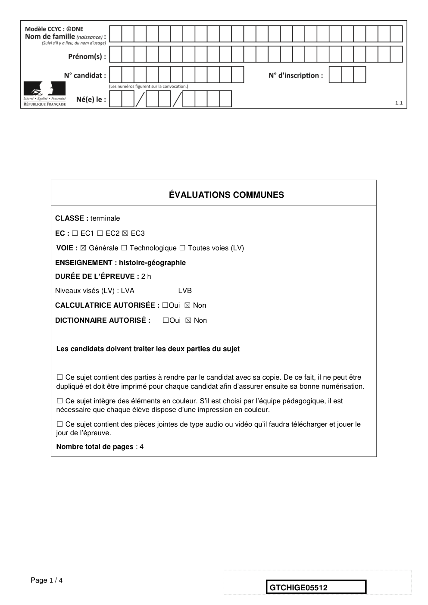
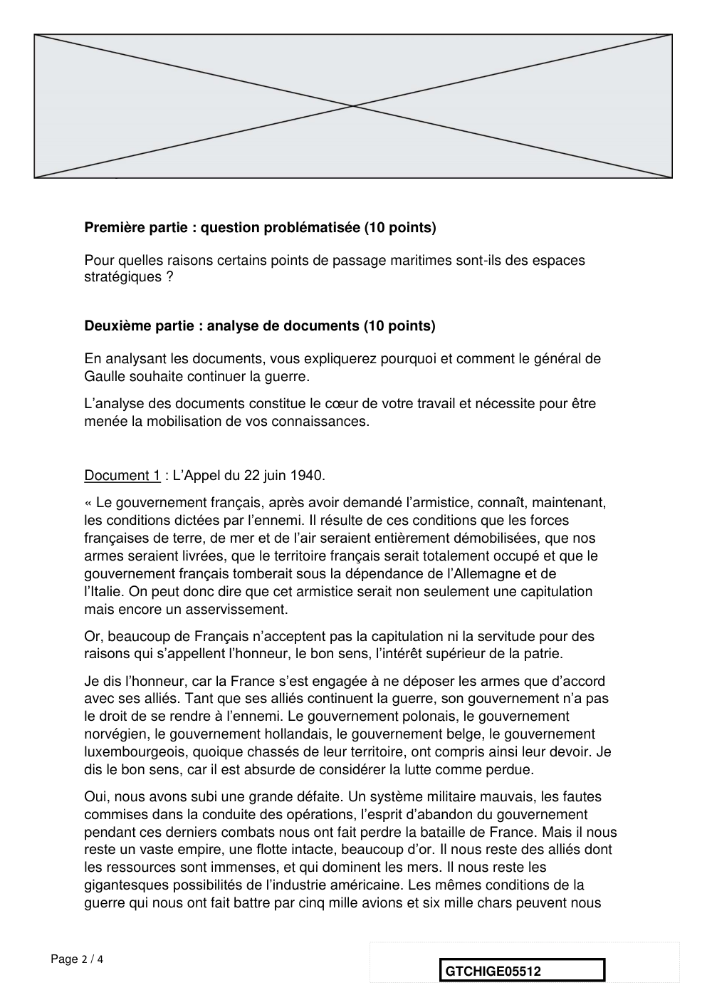
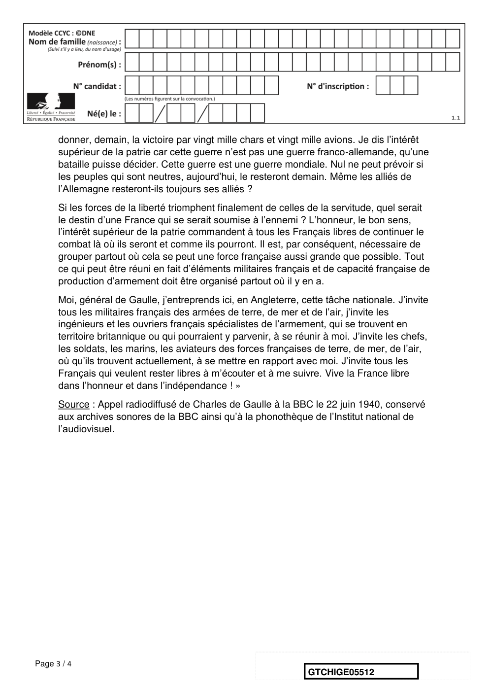
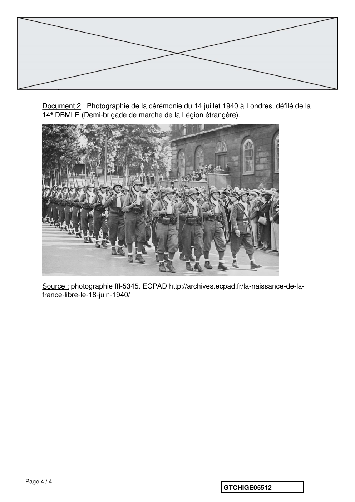
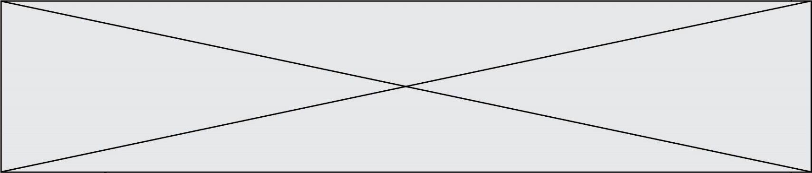

# e3c-histoire-geographie-general-terminale-05512-sujet-officiel

> Source : `../../../../pdf_version/01_hg_ponctuelle/e3c/2021/e3c-histoire-geographie-general-terminale-05512-sujet-officiel.pdf` — conversion Markdown (texte + visuels).
> Stratégie : [STRATEGIE_MARKDOWN.md](../../../../STRATEGIE_MARKDOWN.md)

---

## Page 1

ÉVALUATIONS COMMUNES

       CLASSE : terminale

       EC : ☐ EC1 ☐ EC2 ☒ EC3

        VOIE : ☒ Générale ☐ Technologique ☐ Toutes voies (LV)

       ENSEIGNEMENT : histoire-géographie
       DURÉE DE L’ÉPREUVE : 2 h
       Niveaux visés (LV) : LVA                LVB

       CALCULATRICE AUTORISÉE : ☐Oui ☒ Non

       DICTIONNAIRE AUTORISÉ :            ☐Oui ☒ Non

        Les candidats doivent traiter les deux parties du sujet

        ☐ Ce sujet contient des parties à rendre par le candidat avec sa copie. De ce fait, il ne peut être
        dupliqué et doit être imprimé pour chaque candidat afin d’assurer ensuite sa bonne numérisation.

        ☐ Ce sujet intègre des éléments en couleur. S’il est choisi par l’équipe pédagogique, il est
        nécessaire que chaque élève dispose d’une impression en couleur.

        ☐ Ce sujet contient des pièces jointes de type audio ou vidéo qu’il faudra télécharger et jouer le
        jour de l’épreuve.
        Nombre total de pages : 4

Page 1 / 4
                                                                            GTCHIGE05512

---

## Page 2

Première partie : question problématisée (10 points)

      Pour quelles raisons certains points de passage maritimes sont-ils des espaces
      stratégiques ?

      Deuxième partie : analyse de documents (10 points)

      En analysant les documents, vous expliquerez pourquoi et comment le général de
      Gaulle souhaite continuer la guerre.
      L’analyse des documents constitue le cœur de votre travail et nécessite pour être
      menée la mobilisation de vos connaissances.

      Document 1 : L’Appel du 22 juin 1940.
      « Le gouvernement français, après avoir demandé l’armistice, connaît, maintenant,
      les conditions dictées par l’ennemi. Il résulte de ces conditions que les forces
      françaises de terre, de mer et de l’air seraient entièrement démobilisées, que nos
      armes seraient livrées, que le territoire français serait totalement occupé et que le
      gouvernement français tomberait sous la dépendance de l’Allemagne et de
      l’Italie. On peut donc dire que cet armistice serait non seulement une capitulation
      mais encore un asservissement.
      Or, beaucoup de Français n’acceptent pas la capitulation ni la servitude pour des
      raisons qui s’appellent l’honneur, le bon sens, l’intérêt supérieur de la patrie.
      Je dis l’honneur, car la France s’est engagée à ne déposer les armes que d’accord
      avec ses alliés. Tant que ses alliés continuent la guerre, son gouvernement n’a pas
      le droit de se rendre à l’ennemi. Le gouvernement polonais, le gouvernement
      norvégien, le gouvernement hollandais, le gouvernement belge, le gouvernement
      luxembourgeois, quoique chassés de leur territoire, ont compris ainsi leur devoir. Je
      dis le bon sens, car il est absurde de considérer la lutte comme perdue.
      Oui, nous avons subi une grande défaite. Un système militaire mauvais, les fautes
      commises dans la conduite des opérations, l’esprit d’abandon du gouvernement
      pendant ces derniers combats nous ont fait perdre la bataille de France. Mais il nous
      reste un vaste empire, une flotte intacte, beaucoup d’or. Il nous reste des alliés dont
      les ressources sont immenses, et qui dominent les mers. Il nous reste les
      gigantesques possibilités de l’industrie américaine. Les mêmes conditions de la
      guerre qui nous ont fait battre par cinq mille avions et six mille chars peuvent nous

Page 2 / 4
                                                                GTCHIGE05512

---

## Page 3

donner, demain, la victoire par vingt mille chars et vingt mille avions. Je dis l’intérêt
      supérieur de la patrie car cette guerre n’est pas une guerre franco-allemande, qu’une
      bataille puisse décider. Cette guerre est une guerre mondiale. Nul ne peut prévoir si
      les peuples qui sont neutres, aujourd’hui, le resteront demain. Même les alliés de
      l’Allemagne resteront-ils toujours ses alliés ?
      Si les forces de la liberté triomphent finalement de celles de la servitude, quel serait
      le destin d’une France qui se serait soumise à l’ennemi ? L’honneur, le bon sens,
      l’intérêt supérieur de la patrie commandent à tous les Français libres de continuer le
      combat là où ils seront et comme ils pourront. Il est, par conséquent, nécessaire de
      grouper partout où cela se peut une force française aussi grande que possible. Tout
      ce qui peut être réuni en fait d’éléments militaires français et de capacité française de
      production d’armement doit être organisé partout où il y en a.
      Moi, général de Gaulle, j’entreprends ici, en Angleterre, cette tâche nationale. J’invite
      tous les militaires français des armées de terre, de mer et de l’air, j’invite les
      ingénieurs et les ouvriers français spécialistes de l’armement, qui se trouvent en
      territoire britannique ou qui pourraient y parvenir, à se réunir à moi. J’invite les chefs,
      les soldats, les marins, les aviateurs des forces françaises de terre, de mer, de l’air,
      où qu’ils trouvent actuellement, à se mettre en rapport avec moi. J’invite tous les
      Français qui veulent rester libres à m’écouter et à me suivre. Vive la France libre
      dans l’honneur et dans l’indépendance ! »
      Source : Appel radiodiffusé de Charles de Gaulle à la BBC le 22 juin 1940, conservé
      aux archives sonores de la BBC ainsi qu’à la phonothèque de l’Institut national de
      l’audiovisuel.

Page 3 / 4
                                                                   GTCHIGE05512

---

## Page 4

Document 2 : Photographie de la cérémonie du 14 juillet 1940 à Londres, défilé de la
      14e DBMLE (Demi-brigade de marche de la Légion étrangère).

      Source : photographie ffl-5345. ECPAD http://archives.ecpad.fr/la-naissance-de-la-
      france-libre-le-18-juin-1940/

Page 4 / 4
                                                              GTCHIGE05512

