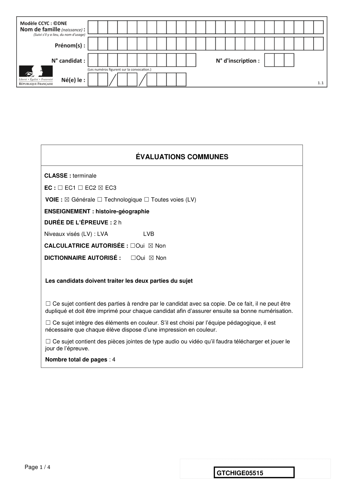
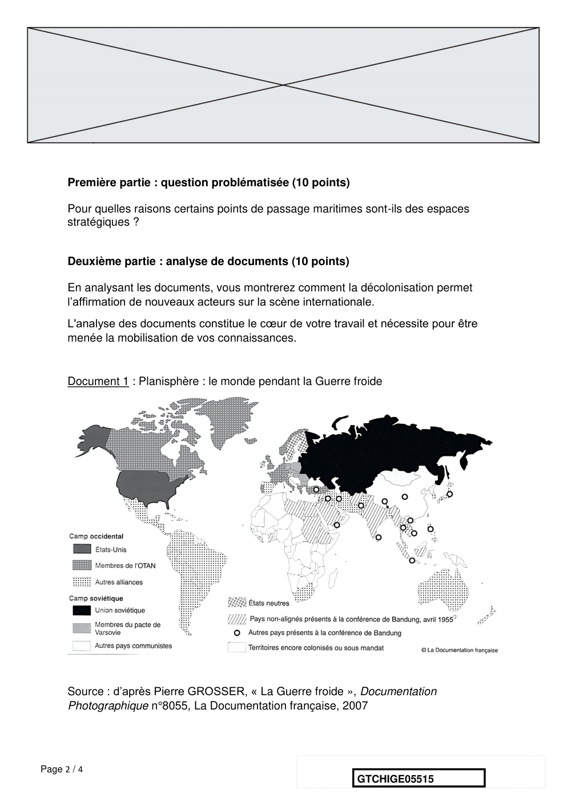
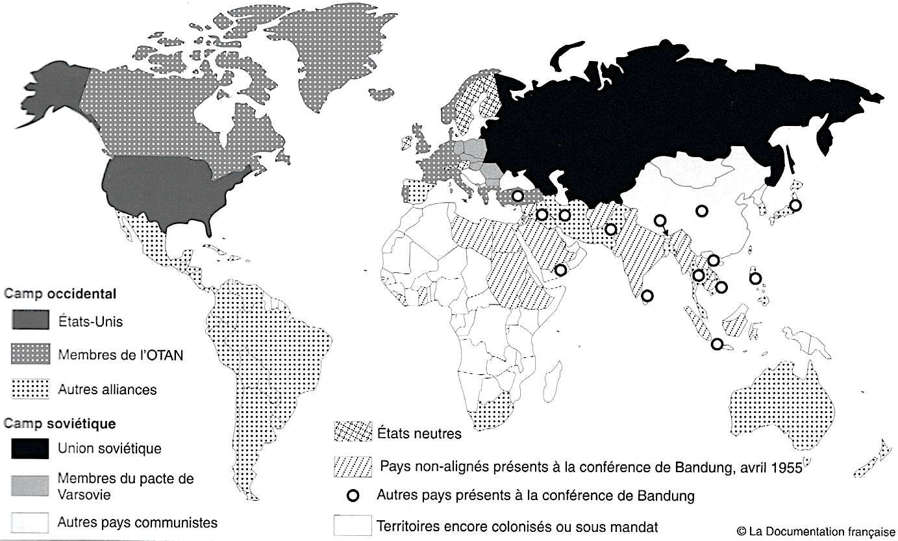
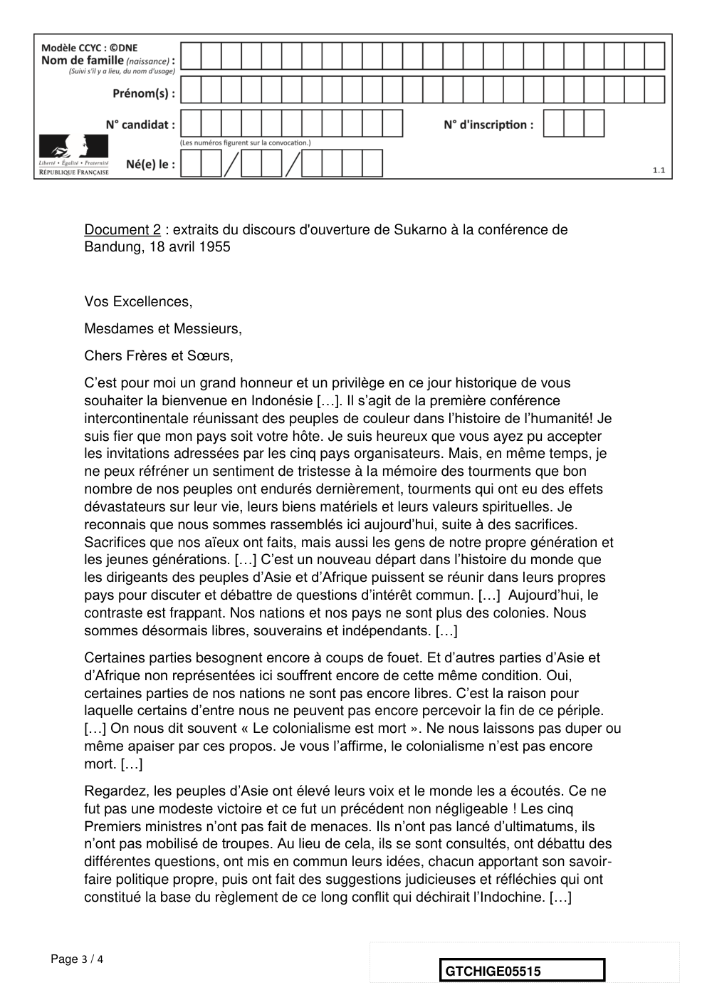
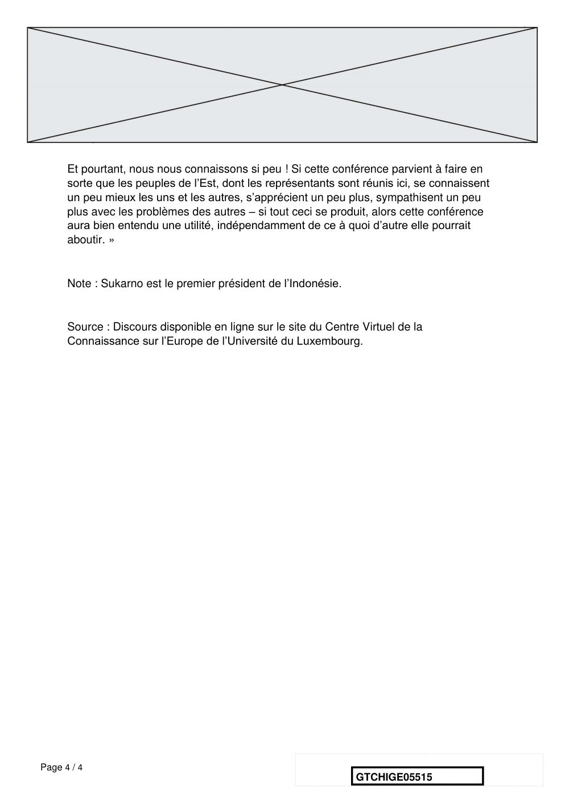

# e3c-histoire-geographie-general-terminale-05515-sujet-officiel

> Source : `../../../../pdf_version/01_hg_ponctuelle/e3c/2021/e3c-histoire-geographie-general-terminale-05515-sujet-officiel.pdf` — conversion Markdown (texte + visuels).
> Stratégie : [STRATEGIE_MARKDOWN.md](../../../../STRATEGIE_MARKDOWN.md)

---

## Page 1

ÉVALUATIONS COMMUNES

       CLASSE : terminale

       EC : ☐ EC1 ☐ EC2 ☒ EC3

        VOIE : ☒ Générale ☐ Technologique ☐ Toutes voies (LV)

       ENSEIGNEMENT : histoire-géographie
       DURÉE DE L’ÉPREUVE : 2 h
       Niveaux visés (LV) : LVA                LVB

       CALCULATRICE AUTORISÉE : ☐Oui ☒ Non

       DICTIONNAIRE AUTORISÉ :            ☐Oui ☒ Non

        Les candidats doivent traiter les deux parties du sujet

        ☐ Ce sujet contient des parties à rendre par le candidat avec sa copie. De ce fait, il ne peut être
        dupliqué et doit être imprimé pour chaque candidat afin d’assurer ensuite sa bonne numérisation.

        ☐ Ce sujet intègre des éléments en couleur. S’il est choisi par l’équipe pédagogique, il est
        nécessaire que chaque élève dispose d’une impression en couleur.

        ☐ Ce sujet contient des pièces jointes de type audio ou vidéo qu’il faudra télécharger et jouer le
        jour de l’épreuve.
        Nombre total de pages : 4

Page 1 / 4
                                                                            GTCHIGE05515

---

## Page 2

Première partie : question problématisée (10 points)

      Pour quelles raisons certains points de passage maritimes sont-ils des espaces
      stratégiques ?

      Deuxième partie : analyse de documents (10 points)

      En analysant les documents, vous montrerez comment la décolonisation permet
      l’affirmation de nouveaux acteurs sur la scène internationale.
      L'analyse des documents constitue le cœur de votre travail et nécessite pour être
      menée la mobilisation de vos connaissances.

      Document 1 : Planisphère : le monde pendant la Guerre froide

      Source : d’après Pierre GROSSER, « La Guerre froide », Documentation
      Photographique n°8055, La Documentation française, 2007

Page 2 / 4
                                                               GTCHIGE05515

---

## Page 3

Document 2 : extraits du discours d'ouverture de Sukarno à la conférence de
      Bandung, 18 avril 1955

      Vos Excellences,
      Mesdames et Messieurs,
      Chers Frères et Sœurs,
      C’est pour moi un grand honneur et un privilège en ce jour historique de vous
      souhaiter la bienvenue en Indonésie […]. Il s’agit de la première conférence
      intercontinentale réunissant des peuples de couleur dans l’histoire de l’humanité! Je
      suis fier que mon pays soit votre hôte. Je suis heureux que vous ayez pu accepter
      les invitations adressées par les cinq pays organisateurs. Mais, en même temps, je
      ne peux réfréner un sentiment de tristesse à la mémoire des tourments que bon
      nombre de nos peuples ont endurés dernièrement, tourments qui ont eu des effets
      dévastateurs sur leur vie, leurs biens matériels et leurs valeurs spirituelles. Je
      reconnais que nous sommes rassemblés ici aujourd’hui, suite à des sacrifices.
      Sacrifices que nos aïeux ont faits, mais aussi les gens de notre propre génération et
      les jeunes générations. […] C’est un nouveau départ dans l’histoire du monde que
      les dirigeants des peuples d’Asie et d’Afrique puissent se réunir dans leurs propres
      pays pour discuter et débattre de questions d’intérêt commun. […] Aujourd’hui, le
      contraste est frappant. Nos nations et nos pays ne sont plus des colonies. Nous
      sommes désormais libres, souverains et indépendants. […]
      Certaines parties besognent encore à coups de fouet. Et d’autres parties d’Asie et
      d’Afrique non représentées ici souffrent encore de cette même condition. Oui,
      certaines parties de nos nations ne sont pas encore libres. C’est la raison pour
      laquelle certains d’entre nous ne peuvent pas encore percevoir la fin de ce périple.
      […] On nous dit souvent « Le colonialisme est mort ». Ne nous laissons pas duper ou
      même apaiser par ces propos. Je vous l’affirme, le colonialisme n’est pas encore
      mort. […]
      Regardez, les peuples d’Asie ont élevé leurs voix et le monde les a écoutés. Ce ne
      fut pas une modeste victoire et ce fut un précédent non négligeable ! Les cinq
      Premiers ministres n’ont pas fait de menaces. Ils n’ont pas lancé d’ultimatums, ils
      n’ont pas mobilisé de troupes. Au lieu de cela, ils se sont consultés, ont débattu des
      différentes questions, ont mis en commun leurs idées, chacun apportant son savoir-
      faire politique propre, puis ont fait des suggestions judicieuses et réfléchies qui ont
      constitué la base du règlement de ce long conflit qui déchirait l’Indochine. […]

Page 3 / 4
                                                                 GTCHIGE05515

---

## Page 4

Et pourtant, nous nous connaissons si peu ! Si cette conférence parvient à faire en
      sorte que les peuples de l’Est, dont les représentants sont réunis ici, se connaissent
      un peu mieux les uns et les autres, s’apprécient un peu plus, sympathisent un peu
      plus avec les problèmes des autres – si tout ceci se produit, alors cette conférence
      aura bien entendu une utilité, indépendamment de ce à quoi d’autre elle pourrait
      aboutir. »

      Note : Sukarno est le premier président de l’Indonésie.

      Source : Discours disponible en ligne sur le site du Centre Virtuel de la
      Connaissance sur l’Europe de l’Université du Luxembourg.

Page 4 / 4
                                                                 GTCHIGE05515

