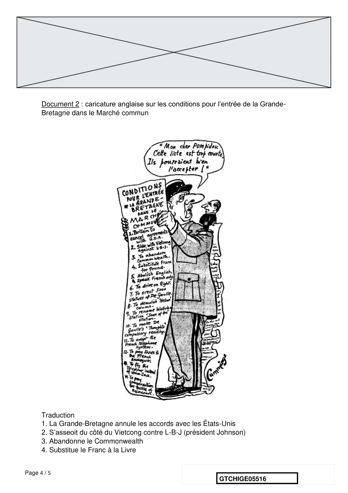

# e3c-histoire-geographie-general-terminale-05516-sujet-officiel

> Source : `../../../../pdf_version/01_hg_ponctuelle/e3c/2021/e3c-histoire-geographie-general-terminale-05516-sujet-officiel.pdf` — conversion Markdown (texte + visuels utiles).
> Stratégie : [STRATEGIE_MARKDOWN.md](../../../../STRATEGIE_MARKDOWN.md)

---

## Page 1

ÉVALUATIONS COMMUNES

       CLASSE : terminale

       EC : ☐ EC1 ☐ EC2 ☒ EC3

        VOIE : ☒ Générale ☐ Technologique ☐ Toutes voies (LV)

       ENSEIGNEMENT : histoire-géographie
       DURÉE DE L’ÉPREUVE : 2 h
       Niveaux visés (LV) : LVA                LVB

       CALCULATRICE AUTORISÉE : ☐Oui ☒ Non

       DICTIONNAIRE AUTORISÉ :            ☐Oui ☒ Non

        Les candidats doivent traiter les deux parties du sujet

        ☐ Ce sujet contient des parties à rendre par le candidat avec sa copie. De ce fait, il ne peut être
        dupliqué et doit être imprimé pour chaque candidat afin d’assurer ensuite sa bonne numérisation.

        ☐ Ce sujet intègre des éléments en couleur. S’il est choisi par l’équipe pédagogique, il est
        nécessaire que chaque élève dispose d’une impression en couleur.

        ☐ Ce sujet contient des pièces jointes de type audio ou vidéo qu’il faudra télécharger et jouer le
        jour de l’épreuve.
        Nombre total de pages : 5

Page 1 / 5
                                                                            GTCHIGE05516

---

## Page 2

Première partie : question problématisée (10 points)

      Pour quelles raisons certains points de passage maritimes sont-ils des espaces
      stratégiques ?

      Deuxième partie : analyse de documents (10 points)

      En analysant les documents, vous montrerez que la vision de la construction
      européenne du Général de Gaulle s’inscrit dans un projet d’indépendance et de
      restauration de la puissance de la France dans le monde.
      L’analyse des documents constitue le cœur de votre travail et nécessite pour être
      menée la mobilisation de vos connaissances.

      Document 1 : extrait de la conférence de presse du Général de Gaulle, Président de
      la République, le 5 septembre 1960
      Question :
      Monsieur le Président, pourriez-vous nous éclairer sur les projets de coopération
      européenne que vous avez récemment exposés aux dirigeants allemands,
      néerlandais et italiens […] ?
      Réponse :
      […] Construire l'Europe, c'est-à-dire l'unir, c'est évidemment quelque chose
      d'essentiel. Il est banal de le dire, pourquoi faudrait-il que ce grand foyer de la
      civilisation, de la force, de la raison, de la prospérité, étouffe sous sa propre cendre ?
      Seulement, dans un pareil domaine, il faut procéder, non pas suivant des rêves, mais
      d'après des réalités. Or, quelles sont les réalités de l'Europe ? Quels sont les piliers
      sur lesquels on peut la bâtir ? En vérité, ce sont des États qui sont, certes, très
      différents les uns des autres, qui ont chacun son âme à soi, son Histoire à soi, sa
      langue à soi, ses malheurs, ses gloires, ses ambitions à soi, mais des États qui sont
      les seules entités qui aient le droit d'ordonner et l'autorité pour agir. Se figurer qu'on
      peut bâtir quelque chose qui soit efficace pour l'action et qui soit approuvé par les
      peuples en dehors et au-dessus des États, c'est une chimère. Assurément, en
      attendant qu'on ait pris corps à corps et dans son ensemble le problème de l'Europe,
      il est vrai qu'on a pu instituer certains organismes plus ou moins extranationaux. Ces
      organismes ont leur valeur technique, mais ils n'ont pas, ils ne peuvent pas avoir,
      d'autorité et, par conséquent, d'efficacité politique. Tant qu'il ne se passe rien de

Page 2 / 5
                                                                  GTCHIGE05516

---

## Page 3

*(Suite de la page précédente — le document continue ici.)*

grave, ils fonctionnent sans beaucoup d'histoires, mais dès qu'il apparaît une
      circonstance dramatique, un grand problème à résoudre, on s'aperçoit, à ce moment-
      là, que telle «Haute autorité» n'en a pas sur les diverses catégories nationales et que
      seuls les États en ont. C'est ce qu'on a vérifié il n'y a pas très longtemps à propos de
      la crise du charbon et c'est ce que l'on constate à propos du Marché commun quand
      se posent les problèmes des produits agricoles, des concours économiques à fournir
      aux États africains ou des rapports entre le Marché commun et la zone de libre-
      échange.
      Encore une fois, il est tout naturel que les États de l'Europe aient à leur disposition
      des organismes spécialisés pour les problèmes qui leur sont communs, pour
      préparer et au besoin pour suivre leurs décisions, mais ces décisions leur
      appartiennent. Elles ne peuvent appartenir qu'à eux et ils ne peuvent les prendre que
      par coopération.
      Source : Discours disponible en ligne sur le site du Centre Virtuel de la
      Connaissance sur l’Europe de l’Université du Luxembourg

Page 3 / 5
                                                                 GTCHIGE05516

---

## Page 4

Document 2 : caricature anglaise sur les conditions pour l’entrée de la Grande-
      Bretagne dans le Marché commun

      Traduction
      1. La Grande-Bretagne annule les accords avec les États-Unis
      2. S’asseoit du côté du Vietcong contre L-B-J (président Johnson)
      3. Abandonne le Commonwealth
      4. Substitue le Franc à la Livre

Page 4 / 5
                                                               GTCHIGE05516

---

## Page 5

5. Abolit l’anglais pour ne parler que le français
      6. Conduit à droite
      7. Érige 5 000 statues de De Gaulle
      8. Démolit la colonne Nelson
      9. Débaptise la gare de Waterloo en gare « Jeanne d’Arc »
      10. Rend obligatoire la lecture des pensées de De Gaulle
      11. Adopte le système téléphonique français
      12. Paye des impôts au Trésor Public français
      13 Arbore le drapeau tricolore à la place de l’Union Jack
      14. Paye une compensation pour la bataille d’Azincourt

      Source : Caricature de Cummings, dessinateur britannique
      In MICHEL M-L (sous la direction de ), 300 caricatures de 50 dessinateurs/De
      Gaulle, CERES, 1967, disponible sur le site Centre Virtuel de la Connaissance sur
      l’Europe de l’Université du Luxembourg

Page 5 / 5
                                                              GTCHIGE05516
