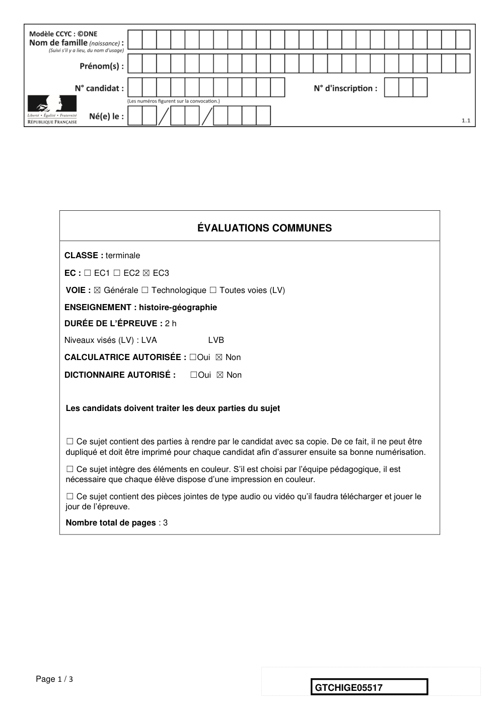
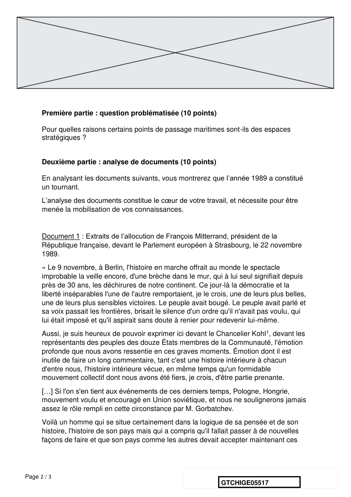
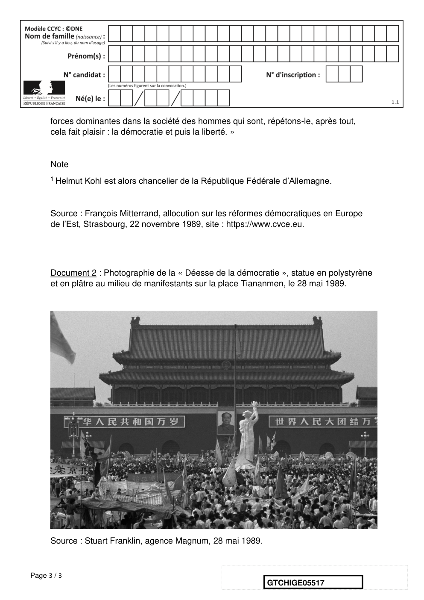
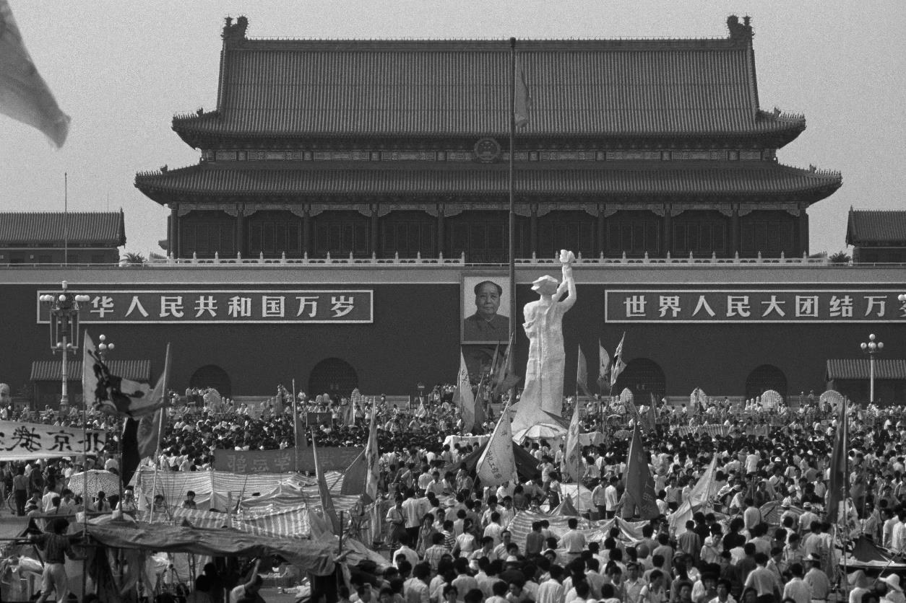

# e3c-histoire-geographie-general-terminale-05517-sujet-officiel

> Source : `../../../../pdf_version/01_hg_ponctuelle/e3c/2021/e3c-histoire-geographie-general-terminale-05517-sujet-officiel.pdf` — conversion Markdown (texte + visuels).
> Stratégie : [STRATEGIE_MARKDOWN.md](../../../../STRATEGIE_MARKDOWN.md)

---

## Page 1

ÉVALUATIONS COMMUNES

       CLASSE : terminale

       EC : ☐ EC1 ☐ EC2 ☒ EC3

        VOIE : ☒ Générale ☐ Technologique ☐ Toutes voies (LV)

       ENSEIGNEMENT : histoire-géographie
       DURÉE DE L’ÉPREUVE : 2 h
       Niveaux visés (LV) : LVA                LVB

       CALCULATRICE AUTORISÉE : ☐Oui ☒ Non

       DICTIONNAIRE AUTORISÉ :            ☐Oui ☒ Non

        Les candidats doivent traiter les deux parties du sujet

        ☐ Ce sujet contient des parties à rendre par le candidat avec sa copie. De ce fait, il ne peut être
        dupliqué et doit être imprimé pour chaque candidat afin d’assurer ensuite sa bonne numérisation.

        ☐ Ce sujet intègre des éléments en couleur. S’il est choisi par l’équipe pédagogique, il est
        nécessaire que chaque élève dispose d’une impression en couleur.

        ☐ Ce sujet contient des pièces jointes de type audio ou vidéo qu’il faudra télécharger et jouer le
        jour de l’épreuve.
        Nombre total de pages : 3

Page 1 / 3
                                                                            GTCHIGE05517

---

## Page 2

Première partie : question problématisée (10 points)

      Pour quelles raisons certains points de passage maritimes sont-ils des espaces
      stratégiques ?

      Deuxième partie : analyse de documents (10 points)

      En analysant les documents suivants, vous montrerez que l’année 1989 a constitué
      un tournant.
      L’analyse des documents constitue le cœur de votre travail, et nécessite pour être
      menée la mobilisation de vos connaissances.

      Document 1 : Extraits de l’allocution de François Mitterrand, président de la
      République française, devant le Parlement européen à Strasbourg, le 22 novembre
      1989.
      « Le 9 novembre, à Berlin, l'histoire en marche offrait au monde le spectacle
      improbable la veille encore, d'une brèche dans le mur, qui à lui seul signifiait depuis
      près de 30 ans, les déchirures de notre continent. Ce jour-là la démocratie et la
      liberté inséparables l'une de l'autre remportaient, je le crois, une de leurs plus belles,
      une de leurs plus sensibles victoires. Le peuple avait bougé. Le peuple avait parlé et
      sa voix passait les frontières, brisait le silence d'un ordre qu'il n'avait pas voulu, qui
      lui était imposé et qu'il aspirait sans doute à renier pour redevenir lui-même.
      Aussi, je suis heureux de pouvoir exprimer ici devant le Chancelier Kohl 1, devant les
      représentants des peuples des douze États membres de la Communauté, l'émotion
      profonde que nous avons ressentie en ces graves moments. Émotion dont il est
      inutile de faire un long commentaire, tant c'est une histoire intérieure à chacun
      d'entre nous, l'histoire intérieure vécue, en même temps qu'un formidable
      mouvement collectif dont nous avons été fiers, je crois, d'être partie prenante.
      […] Si l'on s'en tient aux événements de ces derniers temps, Pologne, Hongrie,
      mouvement voulu et encouragé en Union soviétique, et nous ne soulignerons jamais
      assez le rôle rempli en cette circonstance par M. Gorbatchev.
      Voilà un homme qui se situe certainement dans la logique de sa pensée et de son
      histoire, l'histoire de son pays mais qui a compris qu'il fallait passer à de nouvelles
      façons de faire et que son pays comme les autres devait accepter maintenant ces

Page 2 / 3
                                                                   GTCHIGE05517

---

## Page 3

forces dominantes dans la société des hommes qui sont, répétons-le, après tout,
      cela fait plaisir : la démocratie et puis la liberté. »

      Note
      1 Helmut Kohl est alors chancelier de la République Fédérale d’Allemagne.

      Source : François Mitterrand, allocution sur les réformes démocratiques en Europe
      de l’Est, Strasbourg, 22 novembre 1989, site : https://www.cvce.eu.

      Document 2 : Photographie de la « Déesse de la démocratie », statue en polystyrène
      et en plâtre au milieu de manifestants sur la place Tiananmen, le 28 mai 1989.

      Source : Stuart Franklin, agence Magnum, 28 mai 1989.

Page 3 / 3
                                                              GTCHIGE05517

