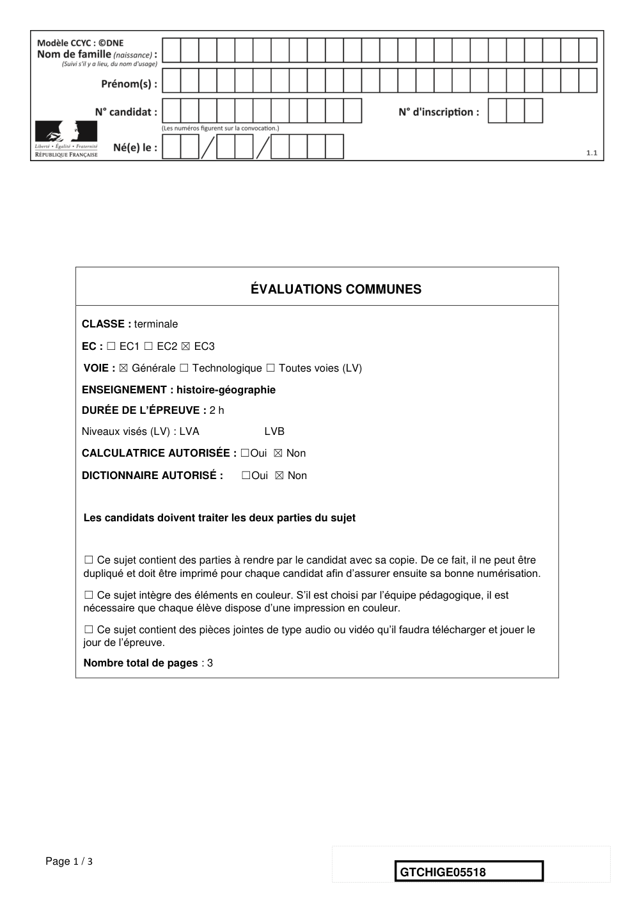
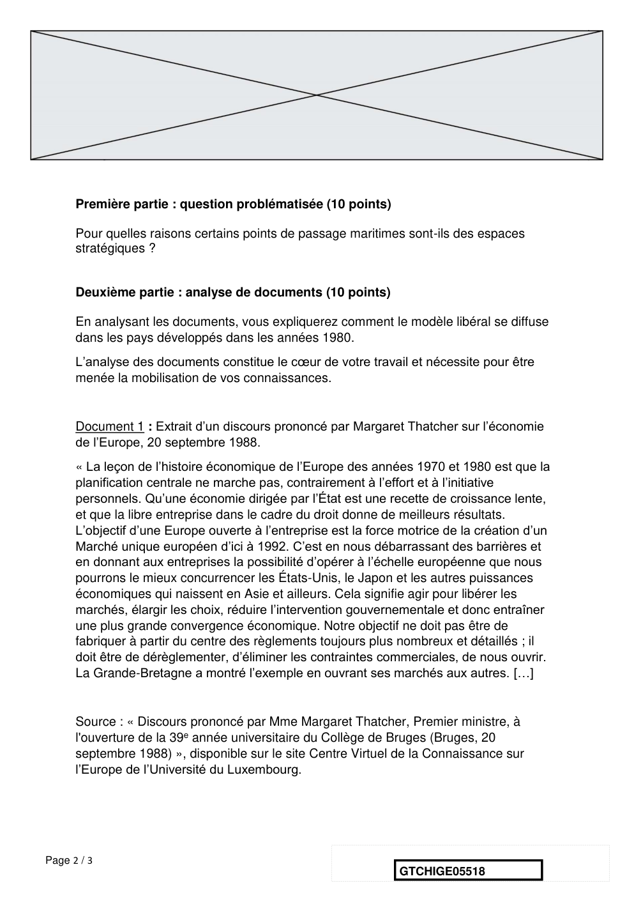
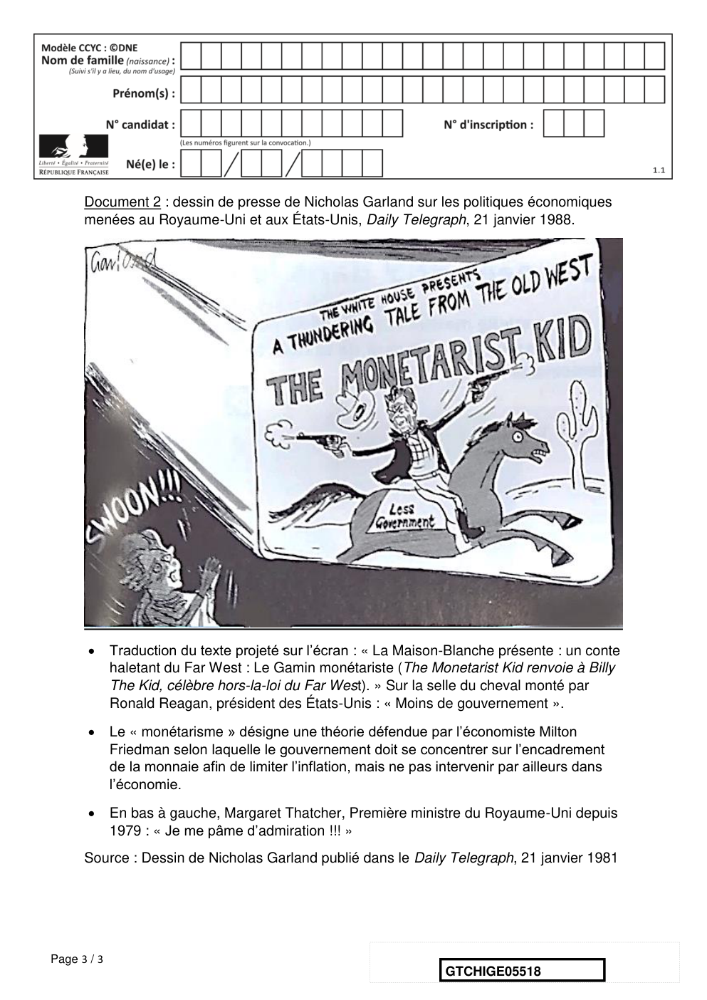
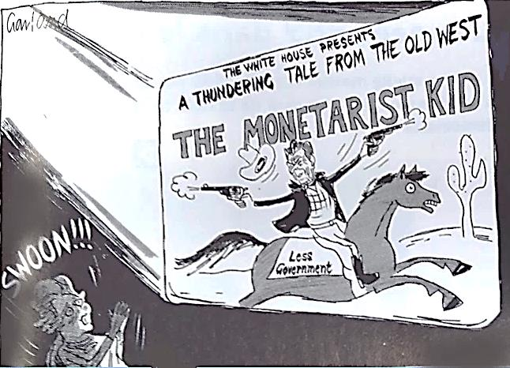

# e3c-histoire-geographie-general-terminale-05518-sujet-officiel

> Source : `../../../../pdf_version/01_hg_ponctuelle/e3c/2021/e3c-histoire-geographie-general-terminale-05518-sujet-officiel.pdf` — conversion Markdown (texte + visuels).
> Stratégie : [STRATEGIE_MARKDOWN.md](../../../../STRATEGIE_MARKDOWN.md)

---

## Page 1

ÉVALUATIONS COMMUNES

       CLASSE : terminale

       EC : ☐ EC1 ☐ EC2 ☒ EC3

        VOIE : ☒ Générale ☐ Technologique ☐ Toutes voies (LV)

       ENSEIGNEMENT : histoire-géographie
       DURÉE DE L’ÉPREUVE : 2 h
       Niveaux visés (LV) : LVA                LVB

       CALCULATRICE AUTORISÉE : ☐Oui ☒ Non

       DICTIONNAIRE AUTORISÉ :            ☐Oui ☒ Non

        Les candidats doivent traiter les deux parties du sujet

        ☐ Ce sujet contient des parties à rendre par le candidat avec sa copie. De ce fait, il ne peut être
        dupliqué et doit être imprimé pour chaque candidat afin d’assurer ensuite sa bonne numérisation.

        ☐ Ce sujet intègre des éléments en couleur. S’il est choisi par l’équipe pédagogique, il est
        nécessaire que chaque élève dispose d’une impression en couleur.

        ☐ Ce sujet contient des pièces jointes de type audio ou vidéo qu’il faudra télécharger et jouer le
        jour de l’épreuve.
        Nombre total de pages : 3

Page 1 / 3
                                                                            GTCHIGE05518

---

## Page 2

Première partie : question problématisée (10 points)

      Pour quelles raisons certains points de passage maritimes sont-ils des espaces
      stratégiques ?

      Deuxième partie : analyse de documents (10 points)

      En analysant les documents, vous expliquerez comment le modèle libéral se diffuse
      dans les pays développés dans les années 1980.
      L’analyse des documents constitue le cœur de votre travail et nécessite pour être
      menée la mobilisation de vos connaissances.

      Document 1 : Extrait d’un discours prononcé par Margaret Thatcher sur l’économie
      de l’Europe, 20 septembre 1988.
      « La leçon de l’histoire économique de l’Europe des années 1970 et 1980 est que la
      planification centrale ne marche pas, contrairement à l’effort et à l’initiative
      personnels. Qu’une économie dirigée par l’État est une recette de croissance lente,
      et que la libre entreprise dans le cadre du droit donne de meilleurs résultats.
      L’objectif d’une Europe ouverte à l’entreprise est la force motrice de la création d’un
      Marché unique européen d’ici à 1992. C’est en nous débarrassant des barrières et
      en donnant aux entreprises la possibilité d’opérer à l’échelle européenne que nous
      pourrons le mieux concurrencer les États-Unis, le Japon et les autres puissances
      économiques qui naissent en Asie et ailleurs. Cela signifie agir pour libérer les
      marchés, élargir les choix, réduire l’intervention gouvernementale et donc entraîner
      une plus grande convergence économique. Notre objectif ne doit pas être de
      fabriquer à partir du centre des règlements toujours plus nombreux et détaillés ; il
      doit être de dérèglementer, d’éliminer les contraintes commerciales, de nous ouvrir.
      La Grande-Bretagne a montré l’exemple en ouvrant ses marchés aux autres. […]

      Source : « Discours prononcé par Mme Margaret Thatcher, Premier ministre, à
      l'ouverture de la 39e année universitaire du Collège de Bruges (Bruges, 20
      septembre 1988) », disponible sur le site Centre Virtuel de la Connaissance sur
      l’Europe de l’Université du Luxembourg.

Page 2 / 3
                                                                 GTCHIGE05518

---

## Page 3

Document 2 : dessin de presse de Nicholas Garland sur les politiques économiques
      menées au Royaume-Uni et aux États-Unis, Daily Telegraph, 21 janvier 1988.

            Traduction du texte projeté sur l’écran : « La Maison-Blanche présente : un conte
             haletant du Far West : Le Gamin monétariste (The Monetarist Kid renvoie à Billy
             The Kid, célèbre hors-la-loi du Far West). » Sur la selle du cheval monté par
             Ronald Reagan, président des États-Unis : « Moins de gouvernement ».
            Le « monétarisme » désigne une théorie défendue par l’économiste Milton
             Friedman selon laquelle le gouvernement doit se concentrer sur l’encadrement
             de la monnaie afin de limiter l’inflation, mais ne pas intervenir par ailleurs dans
             l’économie.
            En bas à gauche, Margaret Thatcher, Première ministre du Royaume-Uni depuis
             1979 : « Je me pâme d’admiration !!! »
      Source : Dessin de Nicholas Garland publié dans le Daily Telegraph, 21 janvier 1981

Page 3 / 3
                                                                     GTCHIGE05518

