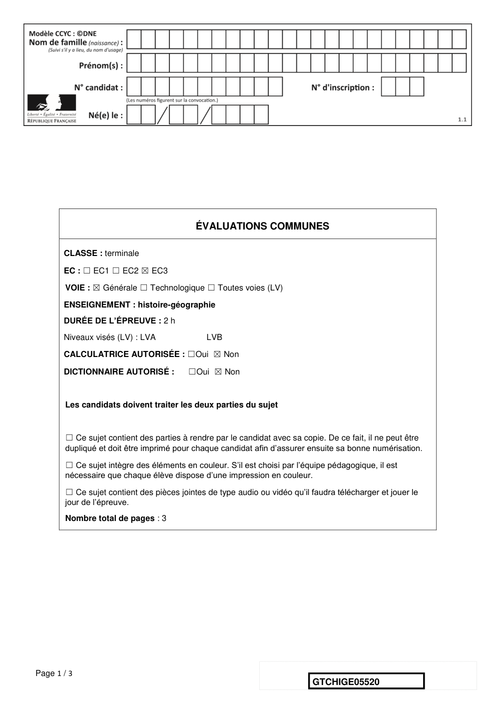
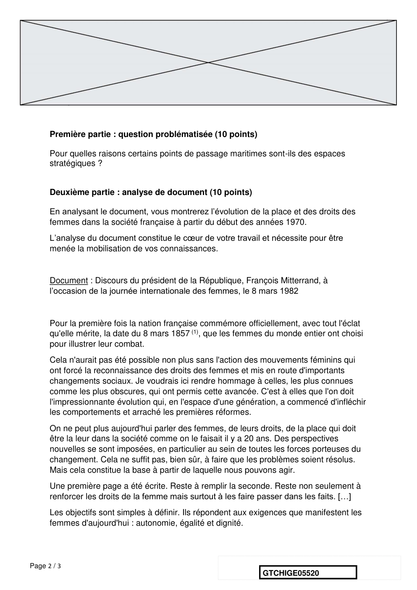
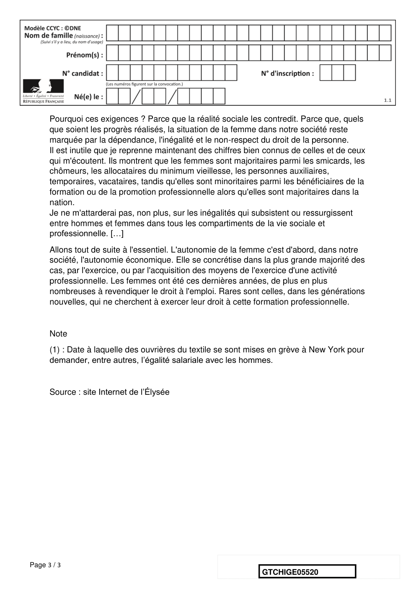

# e3c-histoire-geographie-general-terminale-05520-sujet-officiel

> Source : `../../../../pdf_version/01_hg_ponctuelle/e3c/2021/e3c-histoire-geographie-general-terminale-05520-sujet-officiel.pdf` — conversion Markdown (texte + visuels).
> Stratégie : [STRATEGIE_MARKDOWN.md](../../../../STRATEGIE_MARKDOWN.md)

---

## Page 1

ÉVALUATIONS COMMUNES

       CLASSE : terminale

       EC : ☐ EC1 ☐ EC2 ☒ EC3

        VOIE : ☒ Générale ☐ Technologique ☐ Toutes voies (LV)

       ENSEIGNEMENT : histoire-géographie
       DURÉE DE L’ÉPREUVE : 2 h
       Niveaux visés (LV) : LVA                LVB

       CALCULATRICE AUTORISÉE : ☐Oui ☒ Non

       DICTIONNAIRE AUTORISÉ :            ☐Oui ☒ Non

        Les candidats doivent traiter les deux parties du sujet

        ☐ Ce sujet contient des parties à rendre par le candidat avec sa copie. De ce fait, il ne peut être
        dupliqué et doit être imprimé pour chaque candidat afin d’assurer ensuite sa bonne numérisation.

        ☐ Ce sujet intègre des éléments en couleur. S’il est choisi par l’équipe pédagogique, il est
        nécessaire que chaque élève dispose d’une impression en couleur.

        ☐ Ce sujet contient des pièces jointes de type audio ou vidéo qu’il faudra télécharger et jouer le
        jour de l’épreuve.
        Nombre total de pages : 3

Page 1 / 3
                                                                            GTCHIGE05520

---

## Page 2

Première partie : question problématisée (10 points)

      Pour quelles raisons certains points de passage maritimes sont-ils des espaces
      stratégiques ?

      Deuxième partie : analyse de document (10 points)

      En analysant le document, vous montrerez l’évolution de la place et des droits des
      femmes dans la société française à partir du début des années 1970.
      L’analyse du document constitue le cœur de votre travail et nécessite pour être
      menée la mobilisation de vos connaissances.

      Document : Discours du président de la République, François Mitterrand, à
      l’occasion de la journée internationale des femmes, le 8 mars 1982

      Pour la première fois la nation française commémore officiellement, avec tout l'éclat
      qu'elle mérite, la date du 8 mars 1857 (1), que les femmes du monde entier ont choisi
      pour illustrer leur combat.
      Cela n'aurait pas été possible non plus sans l'action des mouvements féminins qui
      ont forcé la reconnaissance des droits des femmes et mis en route d'importants
      changements sociaux. Je voudrais ici rendre hommage à celles, les plus connues
      comme les plus obscures, qui ont permis cette avancée. C'est à elles que l'on doit
      l'impressionnante évolution qui, en l'espace d'une génération, a commencé d'infléchir
      les comportements et arraché les premières réformes.
      On ne peut plus aujourd'hui parler des femmes, de leurs droits, de la place qui doit
      être la leur dans la société comme on le faisait il y a 20 ans. Des perspectives
      nouvelles se sont imposées, en particulier au sein de toutes les forces porteuses du
      changement. Cela ne suffit pas, bien sûr, à faire que les problèmes soient résolus.
      Mais cela constitue la base à partir de laquelle nous pouvons agir.
      Une première page a été écrite. Reste à remplir la seconde. Reste non seulement à
      renforcer les droits de la femme mais surtout à les faire passer dans les faits. […]
      Les objectifs sont simples à définir. Ils répondent aux exigences que manifestent les
      femmes d'aujourd'hui : autonomie, égalité et dignité.

Page 2 / 3
                                                               GTCHIGE05520

---

## Page 3

Pourquoi ces exigences ? Parce que la réalité sociale les contredit. Parce que, quels
      que soient les progrès réalisés, la situation de la femme dans notre société reste
      marquée par la dépendance, l'inégalité et le non-respect du droit de la personne.
      Il est inutile que je reprenne maintenant des chiffres bien connus de celles et de ceux
      qui m'écoutent. Ils montrent que les femmes sont majoritaires parmi les smicards, les
      chômeurs, les allocataires du minimum vieillesse, les personnes auxiliaires,
      temporaires, vacataires, tandis qu'elles sont minoritaires parmi les bénéficiaires de la
      formation ou de la promotion professionnelle alors qu'elles sont majoritaires dans la
      nation.
      Je ne m'attarderai pas, non plus, sur les inégalités qui subsistent ou ressurgissent
      entre hommes et femmes dans tous les compartiments de la vie sociale et
      professionnelle. […]
      Allons tout de suite à l'essentiel. L'autonomie de la femme c'est d'abord, dans notre
      société, l'autonomie économique. Elle se concrétise dans la plus grande majorité des
      cas, par l'exercice, ou par l'acquisition des moyens de l'exercice d'une activité
      professionnelle. Les femmes ont été ces dernières années, de plus en plus
      nombreuses à revendiquer le droit à l'emploi. Rares sont celles, dans les générations
      nouvelles, qui ne cherchent à exercer leur droit à cette formation professionnelle.

      Note
      (1) : Date à laquelle des ouvrières du textile se sont mises en grève à New York pour
      demander, entre autres, l’égalité salariale avec les hommes.

      Source : site Internet de l’Élysée

Page 3 / 3
                                                                 GTCHIGE05520

