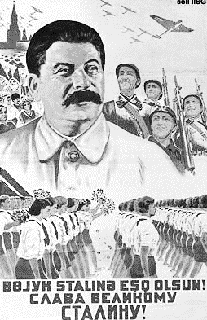

# e3c-histoire-geographie-general-terminale-05546-sujet-officiel

> Source : `../../../../pdf_version/01_hg_ponctuelle/e3c/2021/e3c-histoire-geographie-general-terminale-05546-sujet-officiel.pdf` — conversion Markdown (texte + visuels utiles).
> Stratégie : [STRATEGIE_MARKDOWN.md](../../../../STRATEGIE_MARKDOWN.md)

---

## Page 1

ÉVALUATIONS COMMUNES

       CLASSE : terminale

       EC : ☐ EC1 ☐ EC2 ☒ EC3

        VOIE : ☒ Générale ☐ Technologique ☐ Toutes voies (LV)

       ENSEIGNEMENT : histoire-géographie
       DURÉE DE L’ÉPREUVE : 2 h
       Niveaux visés (LV) : LVA                LVB

       CALCULATRICE AUTORISÉE : ☐Oui ☒ Non

       DICTIONNAIRE AUTORISÉ :            ☐Oui ☒ Non

        Les candidats doivent traiter les deux parties du sujet

        ☐ Ce sujet contient des parties à rendre par le candidat avec sa copie. De ce fait, il ne peut être
        dupliqué et doit être imprimé pour chaque candidat afin d’assurer ensuite sa bonne numérisation.

        ☐ Ce sujet intègre des éléments en couleur. S’il est choisi par l’équipe pédagogique, il est
        nécessaire que chaque élève dispose d’une impression en couleur.

        ☐ Ce sujet contient des pièces jointes de type audio ou vidéo qu’il faudra télécharger et jouer le
        jour de l’épreuve.
        Nombre total de pages : 4

Page 1 / 4
                                                                            GTCHIGE05546

---

## Page 2

Première partie : question problématisée (10 points)

      Pourquoi les territoires ultramarins sont-ils essentiels à la puissance maritime
      française ?

      Deuxième partie : analyse de documents (10 points)

      En analysant les documents, caractérisez le régime soviétique dans les années
      1930.
      L’analyse des documents constitue le cœur de votre travail et nécessite pour être
      menée la mobilisation de vos connaissances.

      Document 1 : Lettre de Korneev Ivan Mikhaïlovitch, « soldat de l’Armée Rouge, » aux
      autorités fédérales (mars 1930).
      « Je demande, j’exige que ma lettre ne connaisse pas le sort des milliers de lettres
      qui vous sont envoyées. [...] Recommandation : publier cette lettre avec mes
      questions et les réponses appropriées dans les journaux centraux. Si vous ne le
      faites pas, vous serez de misérables trompeurs du peuple travailleur.
      Questions :
      1/ De quelle dictature peut-on parler aujourd’hui ? De la dictature du prolétariat ou de
      celle du parti ? Si c’est la dictature du prolétariat, alors pourquoi le parti opprime à ce
      point la paysannerie, sans tenir compte de la volonté des masses ?
      2/ De qui est formé aujourd’hui le parti1 ? De gens à la conscience propre, bons
      travailleurs et politiquement conscients ou de fainéants et de hooligans 2 sans aucune
      conscience politique ? [...]
      3/ Si le parti croit vraiment à la viabilité de kolkhozes3 créés sous le joug4 du parti,
      pourquoi se moque-t-on des paysans en leur imposant 25 000 ouvriers chargés de
      diriger ces kolkhozes ? Alors pourquoi ne pas envoyer autant de paysans diriger les
      usines ?
      4/ Qu’est ce qui est le plus important pour le parti – mettre sur pied des collectifs
      viables ou en tirer tout ce qu’il peut pour nourrir ses parasites ? Quelle différence y-a-
      t-il entre le kolkhozien d’aujourd’hui et le serf d’hier ? Je n’en vois qu’une seule :
      avant on travaillait deux jours pour [le propriétaire terrien] et le troisième pour soi,

Page 2 / 4
                                                                   GTCHIGE05546

---

## Page 3

*(Suite de la page précédente — le document continue ici.)*

maintenant ce sera toute l’année pour le parti. Avant au moins, on avait moins faim
      qu’aujourd’hui, lorsqu’on s’apprête à nous mettre tous sur carte de ravitaillement...
      Ne pensez pas que je vous écris cette lettre parce que j’ai personnellement été
      opprimé. Non je n’ai reçu aucun coup [...] mais je ne veux plus voir souffrir mes
      frères paysans. Je partage entièrement leur sort, je suis paysan moi-même et je vis
      dans la même misère qu’eux. Ne croyez surtout pas que parmi les soldats je suis le
      seul à penser ainsi. Non, des gens comme moi, il y en a plus de 90%, les restants
      sont de votre bord. Alors je vous donne un conseil, ne comptez pas sur l’armée car
      elle ne défendra pas les intérêts du parti.
      Je vous le redis, ce que j’écris, ce ne sont pas seulement mes mots, ce sont ceux de
      millions de gens du pays.
      Korneev, soldat de l’Armée Rouge »

      Notes :
      1 PCUS ou Parti communiste de l’Union Soviétique, le parti unique.
      2 Voyous
      3 Coopérative agricole dans laquelle la terre et les moyens de production sont mis en

      commun et dont l’essentiel de la production est prélevé par les autorités pour
      approvisionner les villes et financer l’industrialisation.
      4 Domination

      Source : GARF (Archives d’Etat de la Fédération de Russie) :393/2/1875/203-204,
      cité par Nicolas Werth. La terreur et le désarroi. Staline et son système. Coll
      Tempus, Perrin, Paris, 2007, pages 93-95

Page 3 / 4
                                                                GTCHIGE05546

---

## Page 4

Document 2 : « Gloire au Grand Staline ». Affiche réalisée par Siricenqo en 1938 à
      l’occasion de l’anniversaire (59 ans) de Joseph Staline.

      Source : Sircenqo, Lithographie, 93,5 X 60 cm, 1938, IISH (International Institute of
      Social History) , Nederlands, réf: BG E11/933

Page 4 / 4
                                                                GTCHIGE05546

