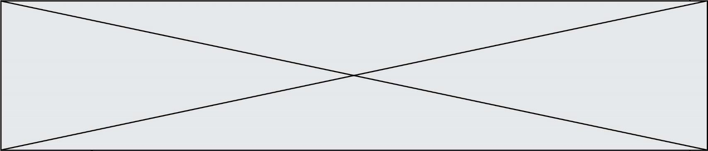
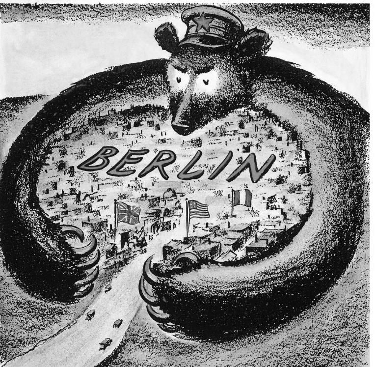

# e3c-histoire-geographie-general-terminale-05551-sujet-officiel

> Source : `../../../../pdf_version/01_hg_ponctuelle/e3c/2021/e3c-histoire-geographie-general-terminale-05551-sujet-officiel.pdf` — conversion Markdown (texte + visuels utiles).
> Stratégie : [STRATEGIE_MARKDOWN.md](../../../../STRATEGIE_MARKDOWN.md)

---

## Page 1

ÉVALUATIONS COMMUNES

       CLASSE : terminale

       EC : ☐ EC1 ☐ EC2 ☒ EC3

        VOIE : ☒ Générale ☐ Technologique ☐ Toutes voies (LV)

       ENSEIGNEMENT : histoire-géographie
       DURÉE DE L’ÉPREUVE : 2 h
       Niveaux visés (LV) : LVA                LVB

       CALCULATRICE AUTORISÉE : ☐Oui ☒ Non

       DICTIONNAIRE AUTORISÉ :            ☐Oui ☒ Non

        Les candidats doivent traiter les deux parties du sujet

        ☐ Ce sujet contient des parties à rendre par le candidat avec sa copie. De ce fait, il ne peut être
        dupliqué et doit être imprimé pour chaque candidat afin d’assurer ensuite sa bonne numérisation.

        ☐ Ce sujet intègre des éléments en couleur. S’il est choisi par l’équipe pédagogique, il est
        nécessaire que chaque élève dispose d’une impression en couleur.

        ☐ Ce sujet contient des pièces jointes de type audio ou vidéo qu’il faudra télécharger et jouer le
        jour de l’épreuve.
        Nombre total de pages : 4

Page 1 / 4
                                                                            GTCHIGE05551

---

## Page 2

Première partie : question problématisée (10 points)

      L’Union européenne dynamise-t-elle les flux et les aménagements des territoires
      transfrontaliers français et quelles sont les limites de son action ?

      Deuxième partie : analyse de documents (10 points)

      En analysant les documents, montrez que l’Europe est le théâtre du nouvel ordre
      mondial qui se met en place au sortir de la guerre.
      L’analyse des documents constitue le cœur de votre travail et nécessite pour être
      menée la mobilisation de vos connaissances.

      Document 1 : extrait du discours de Fulton (5 mars 1946), extraits

      Le 5 mars 1946, Winston Churchill prononce ce discours au Westminster College de
      Fulton (Missouri), en présence du président des États-Unis, Harry Truman.

      Notre tâche et notre devoir suprêmes exigent que nous préservions les foyers des
      gens humbles des horreurs et des misères d'une nouvelle guerre. Nous sommes
      tous d'accord là-dessus. Une organisation mondiale a déjà été instaurée, dont la
      mission première est d'empêcher la guerre. L'ONU, qui succède à la Société des
      Nations, avec l'adhésion déterminante des États-Unis et tout ce que cela implique, a
      déjà commencé à travailler. […]
      J'en arrive maintenant au second danger qui menace les maisons, les foyers et les
      gens humbles, à savoir la tyrannie. Nous ne pouvons fermer les yeux devant le fait
      que les libertés dont jouit chaque citoyen partout aux États-Unis et partout dans
      l'Empire britannique n'existent pas dans un nombre considérable de pays, dont
      certains sont très puissants. Dans ces États un contrôle est imposé à tout le monde
      par différentes sortes d'administrations policières toutes puissantes. Le pouvoir de
      l'État est exercé sans restriction, soit par des dictateurs, soit par des oligarchies
      compactes qui agissent par l'entremise d'un parti privilégié et d'une police politique.
      […]
      Une ombre est tombée sur les scènes qui avaient été si clairement illuminées
      récemment par la victoire des Alliés. Personne ne sait ce que la Russie soviétique et

Page 2 / 4
                                                                 GTCHIGE05551

---

## Page 3

*(Suite de la page précédente — le document continue ici.)*

son organisation communiste internationale ont l'intention de faire dans l'avenir
      immédiat, ni où sont les limites, s'il en existe, de leurs tendances expansionnistes et
      de leur prosélytisme. J'éprouve une profonde admiration et un grand respect pour le
      vaillant peuple russe et pour mon camarade de combat, le maréchal Staline. […]
      Nous accueillons la Russie à sa place légitime au milieu des nations dirigeantes du
      monde. […] Il est toutefois de mon devoir, car je suis sûr que vous souhaitez que je
      vous expose les faits tels que je les vois, de rappeler devant vous certains faits
      concernant la situation présente en Europe.
      De Stettin dans la Baltique jusqu'à Trieste dans l'Adriatique, un rideau de fer est
      descendu à travers le continent. Derrière cette ligne se trouvent toutes les capitales
      des anciens États de l'Europe centrale et orientale. Varsovie, Berlin, Prague, Vienne,
      Budapest, Belgrade, Bucarest et Sofia, toutes ces villes célèbres et les populations
      qui les entourent se trouvent dans ce que je dois appeler la sphère soviétique, et
      toutes sont soumises, sous une forme ou sous une autre, non seulement à l'influence
      soviétique, mais aussi à un degré très élevé et, dans beaucoup de cas, à un degré
      croissant, au contrôle de Moscou. […] Des gouvernements policiers dominent dans
      presque tous les cas et, jusqu'à présent, à l'exception de la Tchécoslovaquie, il n'y a
      pas de vraie démocratie.
      Sources : Digithèque MJP (matériaux juridiques et politiques) sur le site de
      l’université de Perpignan

Page 3 / 4
                                                                 GTCHIGE05551

---

## Page 4

Document 2 : Caricature américaine du blocus de Berlin, juin 1948.

      Note : les trois drapeaux sont les drapeaux britannique, américain et français.

      Source : Caricature américaine de Dick Fitzpatrick, Saint Louis Post Dispatch, juin
      1948.

Page 4 / 4
                                                                GTCHIGE05551

