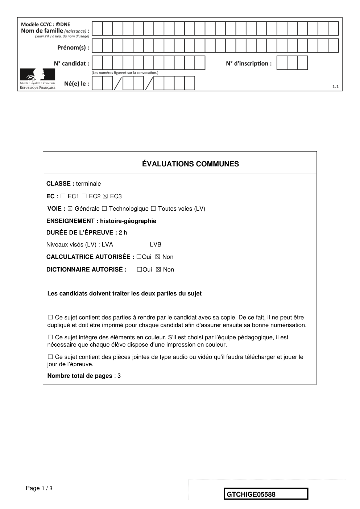
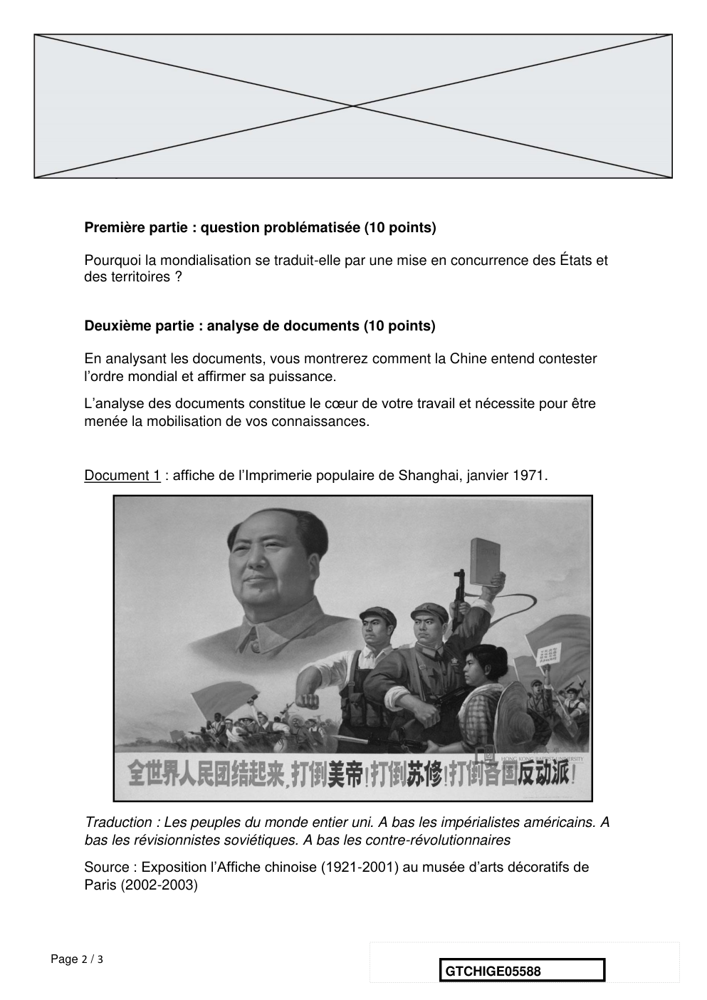
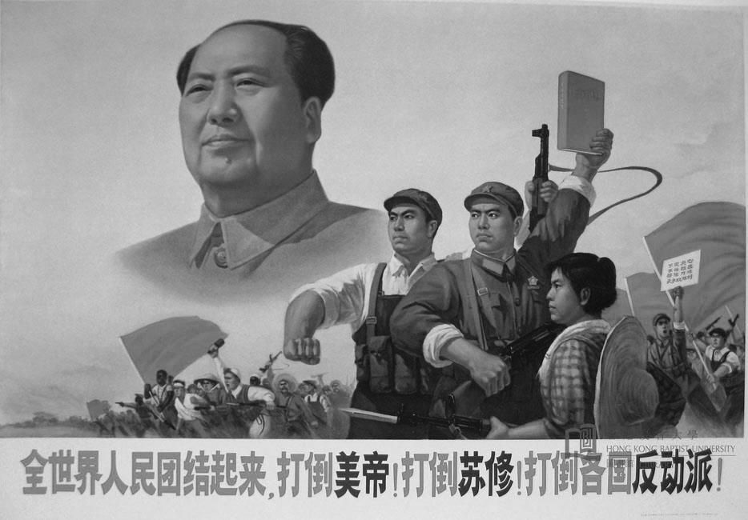
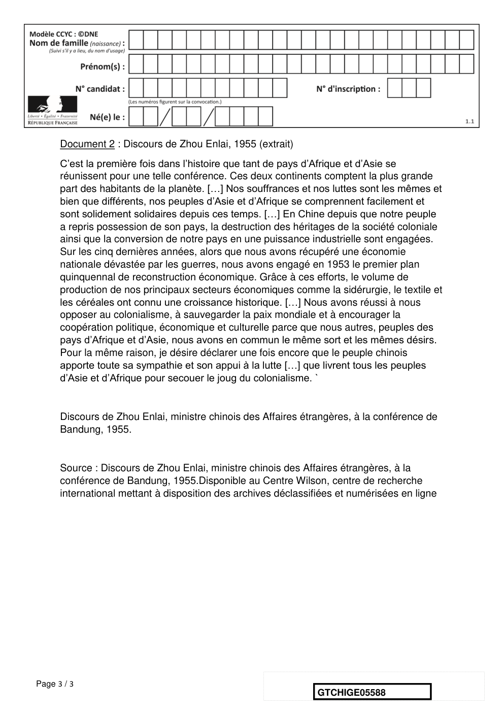

# e3c-histoire-geographie-general-terminale-05588-sujet-officiel

> Source : `../../../../pdf_version/01_hg_ponctuelle/e3c/2021/e3c-histoire-geographie-general-terminale-05588-sujet-officiel.pdf` — conversion Markdown (texte + visuels).
> Stratégie : [STRATEGIE_MARKDOWN.md](../../../../STRATEGIE_MARKDOWN.md)

---

## Page 1

ÉVALUATIONS COMMUNES

       CLASSE : terminale

       EC : ☐ EC1 ☐ EC2 ☒ EC3

        VOIE : ☒ Générale ☐ Technologique ☐ Toutes voies (LV)

       ENSEIGNEMENT : histoire-géographie
       DURÉE DE L’ÉPREUVE : 2 h
       Niveaux visés (LV) : LVA                LVB

       CALCULATRICE AUTORISÉE : ☐Oui ☒ Non

       DICTIONNAIRE AUTORISÉ :            ☐Oui ☒ Non

        Les candidats doivent traiter les deux parties du sujet

        ☐ Ce sujet contient des parties à rendre par le candidat avec sa copie. De ce fait, il ne peut être
        dupliqué et doit être imprimé pour chaque candidat afin d’assurer ensuite sa bonne numérisation.

        ☐ Ce sujet intègre des éléments en couleur. S’il est choisi par l’équipe pédagogique, il est
        nécessaire que chaque élève dispose d’une impression en couleur.

        ☐ Ce sujet contient des pièces jointes de type audio ou vidéo qu’il faudra télécharger et jouer le
        jour de l’épreuve.
        Nombre total de pages : 3

Page 1 / 3
                                                                            GTCHIGE05588

---

## Page 2

Première partie : question problématisée (10 points)

      Pourquoi la mondialisation se traduit-elle par une mise en concurrence des États et
      des territoires ?

      Deuxième partie : analyse de documents (10 points)

      En analysant les documents, vous montrerez comment la Chine entend contester
      l’ordre mondial et affirmer sa puissance.
      L’analyse des documents constitue le cœur de votre travail et nécessite pour être
      menée la mobilisation de vos connaissances.

      Document 1 : affiche de l’Imprimerie populaire de Shanghai, janvier 1971.

      Traduction : Les peuples du monde entier uni. A bas les impérialistes américains. A
      bas les révisionnistes soviétiques. A bas les contre-révolutionnaires
      Source : Exposition l’Affiche chinoise (1921-2001) au musée d’arts décoratifs de
      Paris (2002-2003)

Page 2 / 3
                                                               GTCHIGE05588

---

## Page 3

Document 2 : Discours de Zhou Enlai, 1955 (extrait)
      C’est la première fois dans l’histoire que tant de pays d’Afrique et d’Asie se
      réunissent pour une telle conférence. Ces deux continents comptent la plus grande
      part des habitants de la planète. […] Nos souffrances et nos luttes sont les mêmes et
      bien que différents, nos peuples d’Asie et d’Afrique se comprennent facilement et
      sont solidement solidaires depuis ces temps. […] En Chine depuis que notre peuple
      a repris possession de son pays, la destruction des héritages de la société coloniale
      ainsi que la conversion de notre pays en une puissance industrielle sont engagées.
      Sur les cinq dernières années, alors que nous avons récupéré une économie
      nationale dévastée par les guerres, nous avons engagé en 1953 le premier plan
      quinquennal de reconstruction économique. Grâce à ces efforts, le volume de
      production de nos principaux secteurs économiques comme la sidérurgie, le textile et
      les céréales ont connu une croissance historique. […] Nous avons réussi à nous
      opposer au colonialisme, à sauvegarder la paix mondiale et à encourager la
      coopération politique, économique et culturelle parce que nous autres, peuples des
      pays d’Afrique et d’Asie, nous avons en commun le même sort et les mêmes désirs.
      Pour la même raison, je désire déclarer une fois encore que le peuple chinois
      apporte toute sa sympathie et son appui à la lutte […] que livrent tous les peuples
      d’Asie et d’Afrique pour secouer le joug du colonialisme. `

      Discours de Zhou Enlai, ministre chinois des Affaires étrangères, à la conférence de
      Bandung, 1955.

      Source : Discours de Zhou Enlai, ministre chinois des Affaires étrangères, à la
      conférence de Bandung, 1955.Disponible au Centre Wilson, centre de recherche
      international mettant à disposition des archives déclassifiées et numérisées en ligne

Page 3 / 3
                                                                GTCHIGE05588

