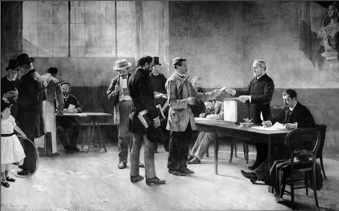

# e3c-histoire-geographie-general-premiere-02432-sujet-officiel

> Source : `../../../../pdf_version/01_hg_ponctuelle/e3c/2021_premiere/e3c-histoire-geographie-general-premiere-02432-sujet-officiel.pdf` — conversion Markdown (texte + visuels utiles).
> Stratégie : [STRATEGIE_MARKDOWN.md](../../../../STRATEGIE_MARKDOWN.md)

---

## Page 1

ÉPREUVES COMMUNES DE CONTRÔLE CONTINU

      CLASSE : Première

      E3C : ☒ E3C1 ☒ E3C2 ☐ E3C3

      VOIE : ☒ Générale ☐ Technologique ☐ Toutes voies (LV)

      ENSEIGNEMENT : histoire-géographie
      DURÉE DE L’ÉPREUVE : 2h
      Niveaux visés (LV) : LVA               LVB
      Axes de programme : espaces ruraux ; Troisième République

      CALCULATRICE AUTORISÉE : ☐Oui ☒ Non

      DICTIONNAIRE AUTORISÉ :           ☐Oui ☒ Non

      ☐ Ce sujet contient des parties à rendre par le candidat avec sa copie. De ce fait, il ne peut être
      dupliqué et doit être imprimé pour chaque candidat afin d’assurer ensuite sa bonne numérisation.

      ☐ Ce sujet intègre des éléments en couleur. S’il est choisi par l’équipe pédagogique, il est
      nécessaire que chaque élève dispose d’une impression en couleur.

      ☐ Ce sujet contient des pièces jointes de type audio ou vidéo qu’il faudra télécharger et jouer le jour
      de l’épreuve.
      Nombre total de pages : 3

Page 1 / 3
                                                                            G1CHIGE02432

---

## Page 2

Première partie : question problématisée (sur 10 points)

      Pourquoi peut-on dire que les espaces ruraux sont des espaces multifonctionnels ?
      A partir d’exemples précis, votre réponse pourra présenter les usages traditionnels,
      les nouveaux usages et les conflits qui en découlent.

      Deuxième partie : analyse de documents (sur 10 points)

      En analysant les documents, vous montrerez comment le régime républicain se met
      en place et s’enracine en France sous la IIIe République à travers des pratiques
      politiques et des symboles.

      L’analyse des documents constitue le cœur de votre travail mais nécessite, pour être
      menée, la mobilisation de vos connaissances.

      Document 1 : discours de Léon Gambetta prononcé à Paris le 9 octobre 1877
      « Aujourd’hui, citoyens, si le suffrage universel se déjugeait, c’en serait fait, croyez-le
      bien, de l’ordre en France, car l’ordre vrai – cet ordre profond et durable que j’ai
      appelé l’ordre républicain – ne peut en effet exister, être protégé, défendu, assuré,
      qu’au nom de la majorité qui s’exprime par le suffrage universel […].
      Messieurs, il n’est pas nécessaire, heureusement, de défendre le suffrage universel,
      devant le parti républicain qui en a fait son principe, devant cette grande démocratie
      dont tous les jours l’Europe admire et constate la sagesse et la prévoyance […].
      Aussi bien je ne présente pas la défense du suffrage universel pour les républicains,
      pour les démocrates purs ; je parle pour ceux qui, parmi les conservateurs, ont
      quelque souci de la modération pratiquée avec persévérance dans la vie publique.
      Je leur dis, à ceux-là : Comment ne voyez-vous pas qu’avec le suffrage universel, si
      on le laisse librement fonctionner, si on respecte, quand il s’est prononcé, son
      indépendance et l’autorité de ses décisions, - comment ne voyez-vous pas, dis-je,
      que vous avez là un moyen de terminer pacifiquement tous les conflits, de dénouer
      toutes les crises, et que si le suffrage universel fonctionne dans la plénitude de sa
      souveraineté, il n’y a plus de révolution possible, parce qu’il n’y a plus de révolution à
      tenter, plus de coup d’État à redouter quand la France a parlé ? […]
      C’est que, pour notre société, arrachée pour toujours – entendez-le bien – au sol de
      l’ancien régime, pour notre société passionnément égalitaire et démocratique, pour
      notre société qu’on ne fera pas renoncer aux conquêtes de 1789, sanctionnées par
      la Révolution française, il n’y a pas véritablement, il ne peut plus y avoir de stabilité,
      d’ordre, de prospérité, de légalité, de pouvoir fort et respecté, de lois
      majestueusement établies, en dehors de ce suffrage universel dont quelques esprits
      timides ont l’horreur et la terreur, et, sans pouvoir y réussir, cherchent à restreindre
      l’efficacité souveraine et la force toute-puissante. Ceux qui raisonnent et agissent
      ainsi sont des conservateurs aveugles ; mais je les adjure1 de réfléchir ; […] je leur

Page 2 / 3
                                                                   G1CHIGE02432

---

## Page 3

*(Suite de la page précédente — le document continue ici.)*

demande si le spectacle de ce peuple, calme, tranquille, qui n’attend avec cette
      patience admirable que parce qu’il sait qu’il y a une échéance fixe pour l’exercice de
      sa souveraineté, n’est pas la preuve la plus éclatante, la démonstration la plus
      irréfragable2 que les crises, même les plus violentes, peuvent se dénouer
      honorablement, pacifiquement, tranquillement, à la condition de maintenir la
      souveraineté et l’autorité du suffrage universel.[…]
      C’est grâce au fonctionnement du suffrage universel, qui permet aux plus humbles,
      aux plus modestes dans la famille française, de se pénétrer des questions, de s’en
      enquérir, de les discuter, de devenir véritablement une partie prenante, une partie
      solidaire dans la société moderne ; […] C’est le suffrage universel qui réunit et qui
      groupe les forces du peuple tout entier, sans distinction de classes ni de nuances
      dans les opinions.

      Source : cité dans Vincent Duclert, La République imaginée 1870-1914, Histoire de
      France, Paris, Belin, p. 150-151, 2010.

      1 : implore, supplie
      2 : irréfutable, indiscutable

      Document 2 : un bureau de vote en 1891

      Source : Alfred Bramtot, Le suffrage universel, huile sur toile, L. 5,75m ; h. 4,30m,
      mairie des Lilas, Seine-Saint-Denis, 1891.

Page 3 / 3
                                                                 G1CHIGE02432

