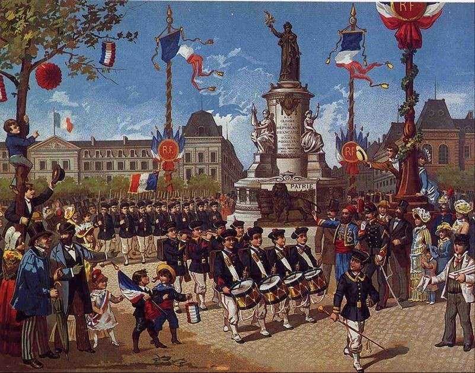

# e3c-histoire-geographie-general-premiere-02434-sujet-officiel

> Source : `../../../../pdf_version/01_hg_ponctuelle/e3c/2021_premiere/e3c-histoire-geographie-general-premiere-02434-sujet-officiel.pdf` — conversion Markdown (texte + visuels utiles).
> Stratégie : [STRATEGIE_MARKDOWN.md](../../../../STRATEGIE_MARKDOWN.md)

---

## Page 1

ÉPREUVES COMMUNES DE CONTRÔLE CONTINU

      CLASSE : Première

      E3C : ☒ E3C1 ☒ E3C2 ☐ E3C3

      VOIE : ☒ Générale ☐ Technologique ☐ Toutes voies (LV)

      ENSEIGNEMENT : histoire-géographie
      DURÉE DE L’ÉPREUVE : 2h
      Niveaux visés (LV) : LVA               LVB
      Axes de programme : espaces ruraux ; Troisième République

      CALCULATRICE AUTORISÉE : ☐Oui ☒ Non

      DICTIONNAIRE AUTORISÉ :           ☐Oui ☒ Non

      ☐ Ce sujet contient des parties à rendre par le candidat avec sa copie. De ce fait, il ne peut être
      dupliqué et doit être imprimé pour chaque candidat afin d’assurer ensuite sa bonne numérisation.

      ☒ Ce sujet intègre des éléments en couleur. S’il est choisi par l’équipe pédagogique, il est
      nécessaire que chaque élève dispose d’une impression en couleur.

      ☐ Ce sujet contient des pièces jointes de type audio ou vidéo qu’il faudra télécharger et jouer le jour
      de l’épreuve.
      Nombre total de pages : 3

Page 1 / 3
                                                                            G1CHIGE02434

---

## Page 2

Première partie : question problématisée (sur 10 points)

      Pourquoi peut-on dire que les espaces ruraux sont des espaces multifonctionnels ?
      A partir d’exemples précis, votre réponse pourra présenter les usages traditionnels,
      les nouveaux usages et les conflits qui en découlent.

      Deuxième partie : analyse de document (sur 10 points)

      En analysant le document, vous montrerez comment celui-ci évoque l’adhésion des
      Français au projet républicain à la fin du XIXe siècle. Vous aborderez la question des
      symboles et des valeurs, et porterez un regard critique sur le document.

      L'analyse du document constitue le cœur de votre travail, mais nécessite pour être
      menée la mobilisation de vos connaissances.

Page 2 / 3
                                                                G1CHIGE02434

---

## Page 3

Document : le défilé de bataillons scolaires place de la République à Paris, 14 juillet
      1883

      Source : lithographie anonyme, fin du XIXe siècle, Paris, musée Carnavalet.

Page 3 / 3
                                                                 G1CHIGE02434

