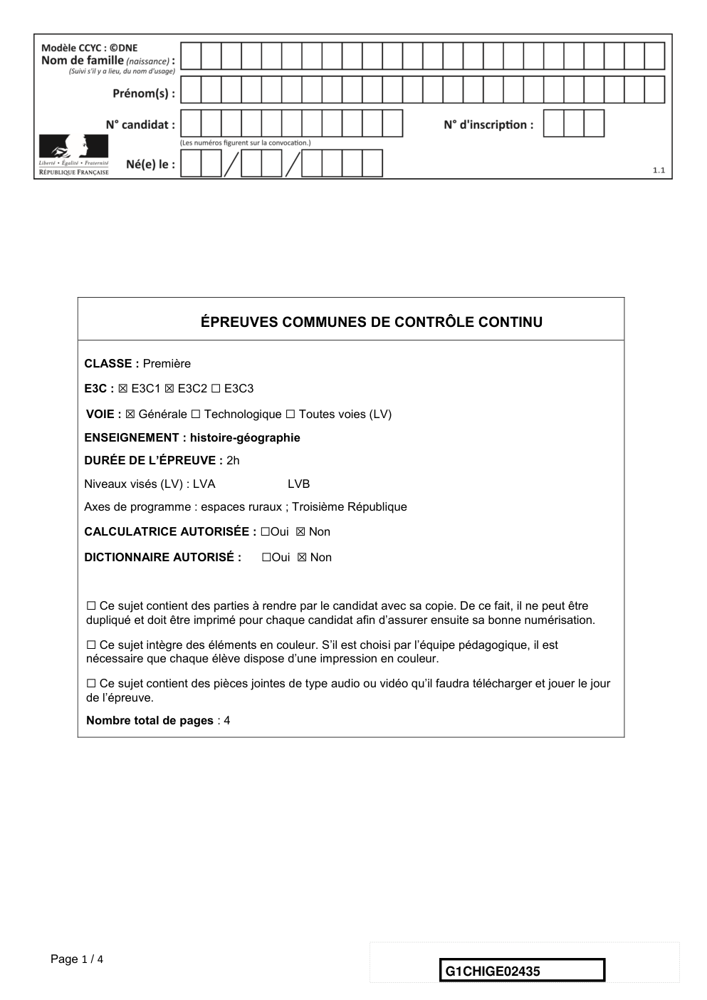
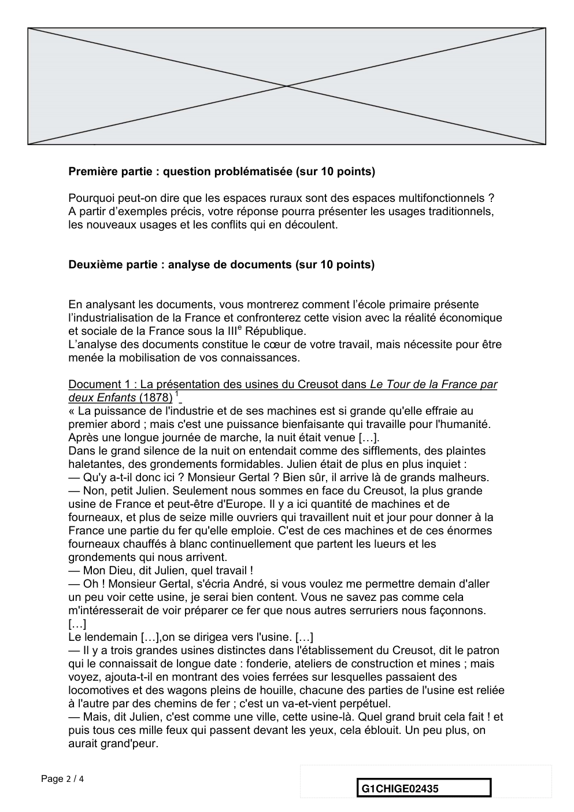
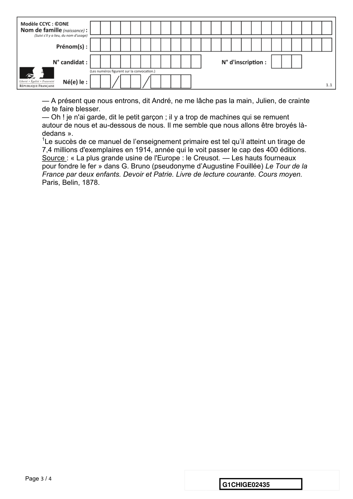
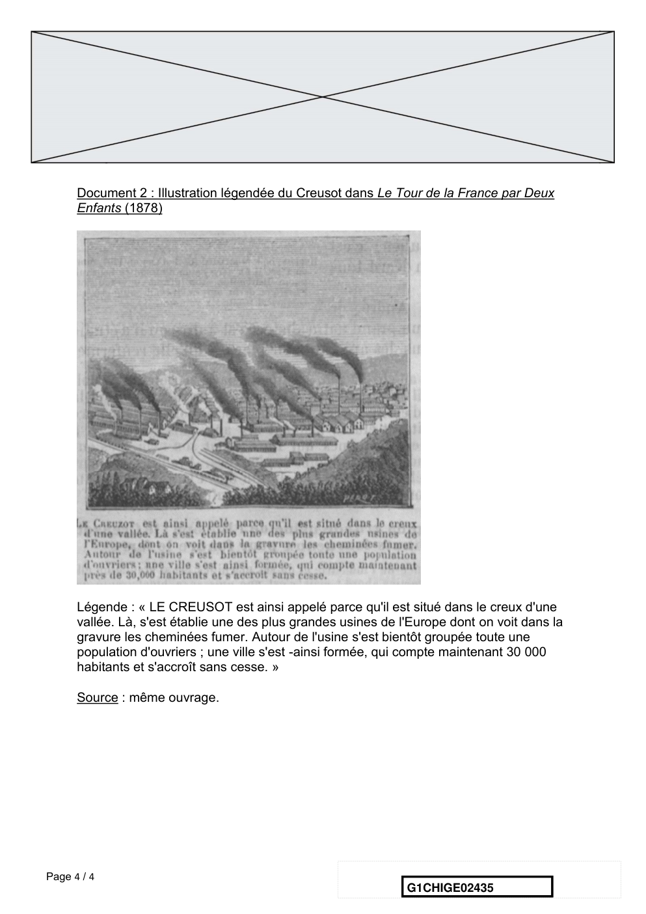
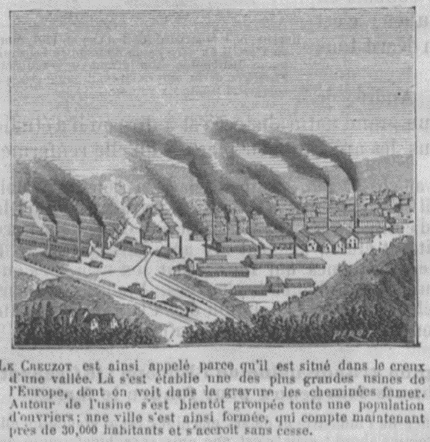

# e3c-histoire-geographie-general-premiere-02435-sujet-officiel

> Source : `../../../../pdf_version/01_hg_ponctuelle/e3c/2021_premiere/e3c-histoire-geographie-general-premiere-02435-sujet-officiel.pdf` — conversion Markdown (texte + visuels).
> Stratégie : [STRATEGIE_MARKDOWN.md](../../../../STRATEGIE_MARKDOWN.md)

---

## Page 1

ÉPREUVES COMMUNES DE CONTRÔLE CONTINU

      CLASSE : Première

      E3C : ☒ E3C1 ☒ E3C2 ☐ E3C3

      VOIE : ☒ Générale ☐ Technologique ☐ Toutes voies (LV)
      ENSEIGNEMENT : histoire-géographie
      DURÉE DE L’ÉPREUVE : 2h
      Niveaux visés (LV) : LVA               LVB
      Axes de programme : espaces ruraux ; Troisième République

      CALCULATRICE AUTORISÉE : ☐Oui ☒ Non

      DICTIONNAIRE AUTORISÉ :           ☐Oui ☒ Non

      ☐ Ce sujet contient des parties à rendre par le candidat avec sa copie. De ce fait, il ne peut être
      dupliqué et doit être imprimé pour chaque candidat afin d’assurer ensuite sa bonne numérisation.

      ☐ Ce sujet intègre des éléments en couleur. S’il est choisi par l’équipe pédagogique, il est
      nécessaire que chaque élève dispose d’une impression en couleur.

      ☐ Ce sujet contient des pièces jointes de type audio ou vidéo qu’il faudra télécharger et jouer le jour
      de l’épreuve.
      Nombre total de pages : 4

Page 1 / 4
                                                                            G1CHIGE02435

---

## Page 2

Première partie : question problématisée (sur 10 points)

      Pourquoi peut-on dire que les espaces ruraux sont des espaces multifonctionnels ?
      A partir d’exemples précis, votre réponse pourra présenter les usages traditionnels,
      les nouveaux usages et les conflits qui en découlent.

      Deuxième partie : analyse de documents (sur 10 points)

      En analysant les documents, vous montrerez comment l’école primaire présente
      l’industrialisation de la France et confronterez cette vision avec la réalité économique
      et sociale de la France sous la IIIe République.
      L’analyse des documents constitue le cœur de votre travail, mais nécessite pour être
      menée la mobilisation de vos connaissances.

      Document 1 : La présentation des usines du Creusot dans Le Tour de la France par
      deux Enfants (1878) 1
      « La puissance de l'industrie et de ses machines est si grande qu'elle effraie au
      premier abord ; mais c'est une puissance bienfaisante qui travaille pour l'humanité.
      Après une longue journée de marche, la nuit était venue […].
      Dans le grand silence de la nuit on entendait comme des sifflements, des plaintes
      haletantes, des grondements formidables. Julien était de plus en plus inquiet :
      — Qu'y a-t-il donc ici ? Monsieur Gertal ? Bien sûr, il arrive là de grands malheurs.
      — Non, petit Julien. Seulement nous sommes en face du Creusot, la plus grande
      usine de France et peut-être d'Europe. Il y a ici quantité de machines et de
      fourneaux, et plus de seize mille ouvriers qui travaillent nuit et jour pour donner à la
      France une partie du fer qu'elle emploie. C'est de ces machines et de ces énormes
      fourneaux chauffés à blanc continuellement que partent les lueurs et les
      grondements qui nous arrivent.
      — Mon Dieu, dit Julien, quel travail !
      — Oh ! Monsieur Gertal, s'écria André, si vous voulez me permettre demain d'aller
      un peu voir cette usine, je serai bien content. Vous ne savez pas comme cela
      m'intéresserait de voir préparer ce fer que nous autres serruriers nous façonnons.
      […]
      Le lendemain […],on se dirigea vers l'usine. […]
      — Il y a trois grandes usines distinctes dans l'établissement du Creusot, dit le patron
      qui le connaissait de longue date : fonderie, ateliers de construction et mines ; mais
      voyez, ajouta-t-il en montrant des voies ferrées sur lesquelles passaient des
      locomotives et des wagons pleins de houille, chacune des parties de l'usine est reliée
      à l'autre par des chemins de fer ; c'est un va-et-vient perpétuel.
      — Mais, dit Julien, c'est comme une ville, cette usine-là. Quel grand bruit cela fait ! et
      puis tous ces mille feux qui passent devant les yeux, cela éblouit. Un peu plus, on
      aurait grand'peur.

Page 2 / 4
                                                                  G1CHIGE02435

---

## Page 3

— A présent que nous entrons, dit André, ne me lâche pas la main, Julien, de crainte
      de te faire blesser.
      — Oh ! je n'ai garde, dit le petit garçon ; il y a trop de machines qui se remuent
      autour de nous et au-dessous de nous. Il me semble que nous allons être broyés là-
      dedans ».
      1
       Le succès de ce manuel de l’enseignement primaire est tel qu’il atteint un tirage de
      7,4 millions d'exemplaires en 1914, année qui le voit passer le cap des 400 éditions.
      Source : « La plus grande usine de l'Europe : le Creusot. — Les hauts fourneaux
      pour fondre le fer » dans G. Bruno (pseudonyme d’Augustine Fouillée) Le Tour de la
      France par deux enfants. Devoir et Patrie. Livre de lecture courante. Cours moyen.
      Paris, Belin, 1878.

Page 3 / 4
                                                               G1CHIGE02435

---

## Page 4

Document 2 : Illustration légendée du Creusot dans Le Tour de la France par Deux
      Enfants (1878)

      Légende : « LE CREUSOT est ainsi appelé parce qu'il est situé dans le creux d'une
      vallée. Là, s'est établie une des plus grandes usines de l'Europe dont on voit dans la
      gravure les cheminées fumer. Autour de l'usine s'est bientôt groupée toute une
      population d'ouvriers ; une ville s'est -ainsi formée, qui compte maintenant 30 000
      habitants et s'accroît sans cesse. »

      Source : même ouvrage.

Page 4 / 4
                                                                G1CHIGE02435

