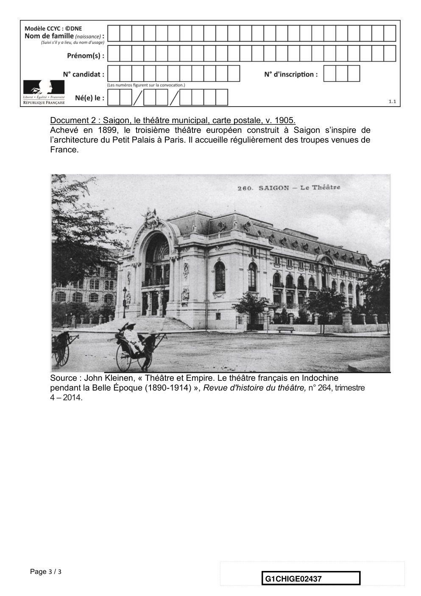

# e3c-histoire-geographie-general-premiere-02437-sujet-officiel

> Source : `../../../../pdf_version/01_hg_ponctuelle/e3c/2021_premiere/e3c-histoire-geographie-general-premiere-02437-sujet-officiel.pdf` — conversion Markdown (texte + visuels utiles).
> Stratégie : [STRATEGIE_MARKDOWN.md](../../../../STRATEGIE_MARKDOWN.md)

---

## Page 1

ÉPREUVES COMMUNES DE CONTRÔLE CONTINU

      CLASSE : Première

      E3C : ☒ E3C1 ☒ E3C2 ☐ E3C3

      VOIE : ☒ Générale ☐ Technologique ☐ Toutes voies (LV)
      ENSEIGNEMENT : histoire-géographie
      DURÉE DE L’ÉPREUVE : 2h
      Niveaux visés (LV) : LVA               LVB
      Axes de programme : espaces ruraux ; colonies

      CALCULATRICE AUTORISÉE : ☐Oui ☒ Non

      DICTIONNAIRE AUTORISÉ :           ☐Oui ☒ Non

      ☐ Ce sujet contient des parties à rendre par le candidat avec sa copie. De ce fait, il ne peut être
      dupliqué et doit être imprimé pour chaque candidat afin d’assurer ensuite sa bonne numérisation.

      ☐ Ce sujet intègre des éléments en couleur. S’il est choisi par l’équipe pédagogique, il est
      nécessaire que chaque élève dispose d’une impression en couleur.

      ☐ Ce sujet contient des pièces jointes de type audio ou vidéo qu’il faudra télécharger et jouer le jour
      de l’épreuve.
      Nombre total de pages : 3

Page 1 / 3
                                                                            G1CHIGE02437

---

## Page 2

Première partie : question problématisée (sur 10 points)

      Pourquoi peut-on dire que les espaces ruraux sont des espaces multifonctionnels ?
      A partir d’exemples précis, votre réponse pourra présenter les usages traditionnels,
      les nouveaux usages et les conflits qui en découlent.

      Deuxième partie : analyse des documents (sur 10 points)

      En vous appuyant sur l’exemple de la ville de Saigon présenté dans les documents,
      vous montrerez le projet de domination coloniale de la France sous la Troisième
      République. Vous aborderez les dimensions spatiales, politiques, économiques et
      culturelles de cette domination.
      L'analyse des documents constitue le cœur de votre travail, mais nécessite, pour être
      mené, la mobilisation de vos connaissances.

      Document 1 : plan de Saigon à la fin du XIXe siècle, capitale de l’Union indochinoise
      à partir de 1887
      Inspirés par le chantier haussmannien à Paris, les gouverneurs d’Indochine lancent à
      partir de 1862 de gros travaux. Ils visent à assainir les zones marécageuses,
      aménager les voies fluviales et les canaux et trace les rues et boulevards.

                                                      Source : L’Histoire, n°177, Mai 1994.

Page 2 / 3
                                                               G1CHIGE02437

---

## Page 3

Document 2 : Saigon, le théâtre municipal, carte postale, v. 1905.
      Achevé en 1899, le troisième théâtre européen construit à Saigon s’inspire de
      l’architecture du Petit Palais à Paris. Il accueille régulièrement des troupes venues de
      France.

      Source : John Kleinen, « Théâtre et Empire. Le théâtre français en Indochine
      pendant la Belle Époque (1890-1914) », Revue d'histoire du théâtre, n° 264, trimestre
      4 – 2014.

Page 3 / 3
                                                                 G1CHIGE02437

