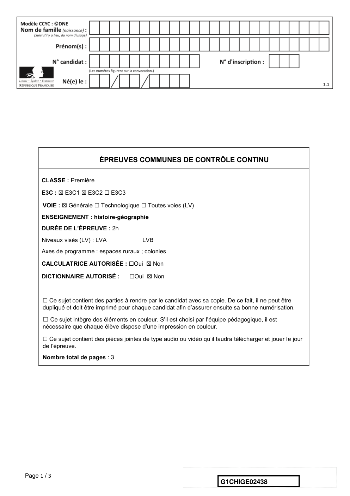
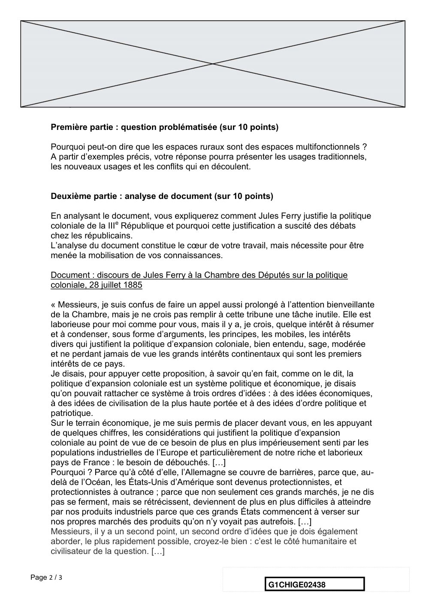
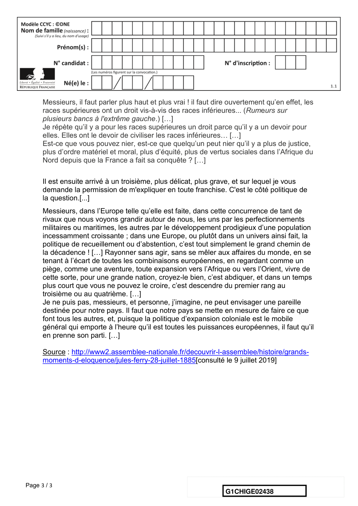

# e3c-histoire-geographie-general-premiere-02438-sujet-officiel

> Source : `../../../../pdf_version/01_hg_ponctuelle/e3c/2021_premiere/e3c-histoire-geographie-general-premiere-02438-sujet-officiel.pdf` — conversion Markdown (texte + visuels).
> Stratégie : [STRATEGIE_MARKDOWN.md](../../../../STRATEGIE_MARKDOWN.md)

---

## Page 1

ÉPREUVES COMMUNES DE CONTRÔLE CONTINU

      CLASSE : Première

      E3C : ☒ E3C1 ☒ E3C2 ☐ E3C3

      VOIE : ☒ Générale ☐ Technologique ☐ Toutes voies (LV)
      ENSEIGNEMENT : histoire-géographie
      DURÉE DE L’ÉPREUVE : 2h
      Niveaux visés (LV) : LVA               LVB
      Axes de programme : espaces ruraux ; colonies

      CALCULATRICE AUTORISÉE : ☐Oui ☒ Non

      DICTIONNAIRE AUTORISÉ :           ☐Oui ☒ Non

      ☐ Ce sujet contient des parties à rendre par le candidat avec sa copie. De ce fait, il ne peut être
      dupliqué et doit être imprimé pour chaque candidat afin d’assurer ensuite sa bonne numérisation.

      ☐ Ce sujet intègre des éléments en couleur. S’il est choisi par l’équipe pédagogique, il est
      nécessaire que chaque élève dispose d’une impression en couleur.

      ☐ Ce sujet contient des pièces jointes de type audio ou vidéo qu’il faudra télécharger et jouer le jour
      de l’épreuve.
      Nombre total de pages : 3

Page 1 / 3
                                                                            G1CHIGE02438

---

## Page 2

Première partie : question problématisée (sur 10 points)

      Pourquoi peut-on dire que les espaces ruraux sont des espaces multifonctionnels ?
      A partir d’exemples précis, votre réponse pourra présenter les usages traditionnels,
      les nouveaux usages et les conflits qui en découlent.

      Deuxième partie : analyse de document (sur 10 points)

      En analysant le document, vous expliquerez comment Jules Ferry justifie la politique
      coloniale de la IIIe République et pourquoi cette justification a suscité des débats
      chez les républicains.
      L’analyse du document constitue le cœur de votre travail, mais nécessite pour être
      menée la mobilisation de vos connaissances.

      Document : discours de Jules Ferry à la Chambre des Députés sur la politique
      coloniale, 28 juillet 1885

      « Messieurs, je suis confus de faire un appel aussi prolongé à l’attention bienveillante
      de la Chambre, mais je ne crois pas remplir à cette tribune une tâche inutile. Elle est
      laborieuse pour moi comme pour vous, mais il y a, je crois, quelque intérêt à résumer
      et à condenser, sous forme d’arguments, les principes, les mobiles, les intérêts
      divers qui justifient la politique d’expansion coloniale, bien entendu, sage, modérée
      et ne perdant jamais de vue les grands intérêts continentaux qui sont les premiers
      intérêts de ce pays.
      Je disais, pour appuyer cette proposition, à savoir qu’en fait, comme on le dit, la
      politique d’expansion coloniale est un système politique et économique, je disais
      qu’on pouvait rattacher ce système à trois ordres d’idées : à des idées économiques,
      à des idées de civilisation de la plus haute portée et à des idées d’ordre politique et
      patriotique.
      Sur le terrain économique, je me suis permis de placer devant vous, en les appuyant
      de quelques chiffres, les considérations qui justifient la politique d’expansion
      coloniale au point de vue de ce besoin de plus en plus impérieusement senti par les
      populations industrielles de l’Europe et particulièrement de notre riche et laborieux
      pays de France : le besoin de débouchés. […]
      Pourquoi ? Parce qu’à côté d’elle, l’Allemagne se couvre de barrières, parce que, au-
      delà de l’Océan, les États-Unis d’Amérique sont devenus protectionnistes, et
      protectionnistes à outrance ; parce que non seulement ces grands marchés, je ne dis
      pas se ferment, mais se rétrécissent, deviennent de plus en plus difficiles à atteindre
      par nos produits industriels parce que ces grands États commencent à verser sur
      nos propres marchés des produits qu’on n’y voyait pas autrefois. […]
      Messieurs, il y a un second point, un second ordre d’idées que je dois également
      aborder, le plus rapidement possible, croyez-le bien : c’est le côté humanitaire et
      civilisateur de la question. […]

Page 2 / 3
                                                                 G1CHIGE02438

---

## Page 3

Messieurs, il faut parler plus haut et plus vrai ! il faut dire ouvertement qu’en effet, les
      races supérieures ont un droit vis-à-vis des races inférieures... (Rumeurs sur
      plusieurs bancs à l'extrême gauche.) […]
      Je répète qu’il y a pour les races supérieures un droit parce qu’il y a un devoir pour
      elles. Elles ont le devoir de civiliser les races inférieures… […]
      Est-ce que vous pouvez nier, est-ce que quelqu’un peut nier qu’il y a plus de justice,
      plus d’ordre matériel et moral, plus d’équité, plus de vertus sociales dans l’Afrique du
      Nord depuis que la France a fait sa conquête ? […]

      Il est ensuite arrivé à un troisième, plus délicat, plus grave, et sur lequel je vous
      demande la permission de m'expliquer en toute franchise. C'est le côté politique de
      la question.[...]
      Messieurs, dans l’Europe telle qu’elle est faite, dans cette concurrence de tant de
      rivaux que nous voyons grandir autour de nous, les uns par les perfectionnements
      militaires ou maritimes, les autres par le développement prodigieux d’une population
      incessamment croissante ; dans une Europe, ou plutôt dans un univers ainsi fait, la
      politique de recueillement ou d’abstention, c’est tout simplement le grand chemin de
      la décadence ! […] Rayonner sans agir, sans se mêler aux affaires du monde, en se
      tenant à l’écart de toutes les combinaisons européennes, en regardant comme un
      piège, comme une aventure, toute expansion vers l’Afrique ou vers l’Orient, vivre de
      cette sorte, pour une grande nation, croyez-le bien, c’est abdiquer, et dans un temps
      plus court que vous ne pouvez le croire, c’est descendre du premier rang au
      troisième ou au quatrième. […]
      Je ne puis pas, messieurs, et personne, j’imagine, ne peut envisager une pareille
      destinée pour notre pays. Il faut que notre pays se mette en mesure de faire ce que
      font tous les autres, et, puisque la politique d’expansion coloniale est le mobile
      général qui emporte à l’heure qu’il est toutes les puissances européennes, il faut qu’il
      en prenne son parti. […]

      Source : http://www2.assemblee-nationale.fr/decouvrir-l-assemblee/histoire/grands-
      moments-d-eloquence/jules-ferry-28-juillet-1885[consulté le 9 juillet 2019]

Page 3 / 3
                                                                    G1CHIGE02438

