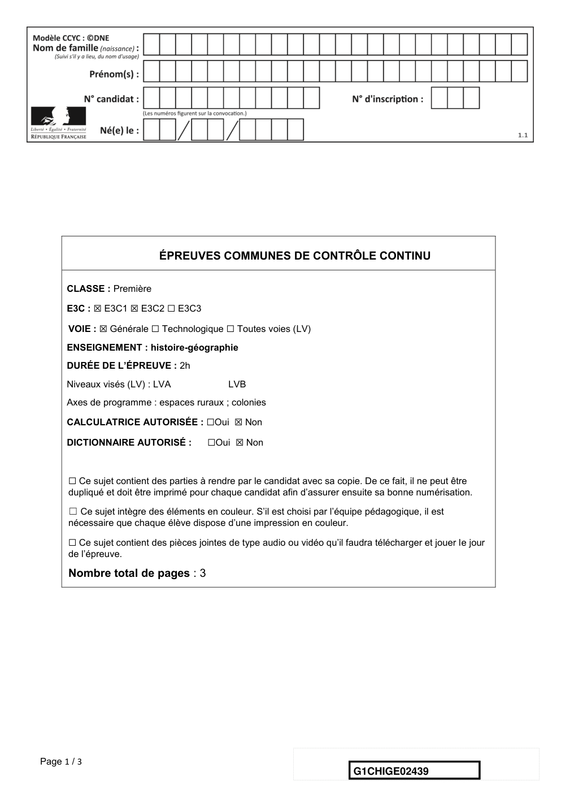
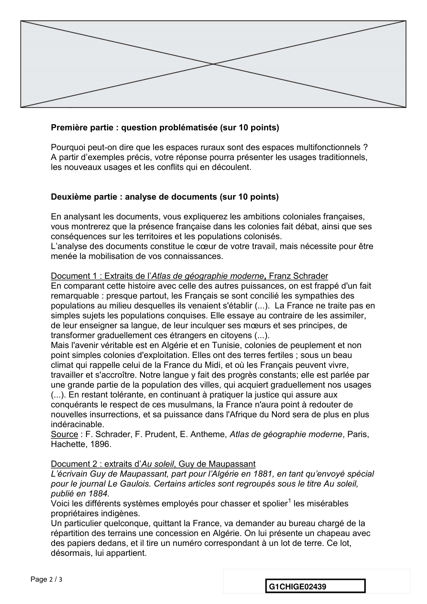
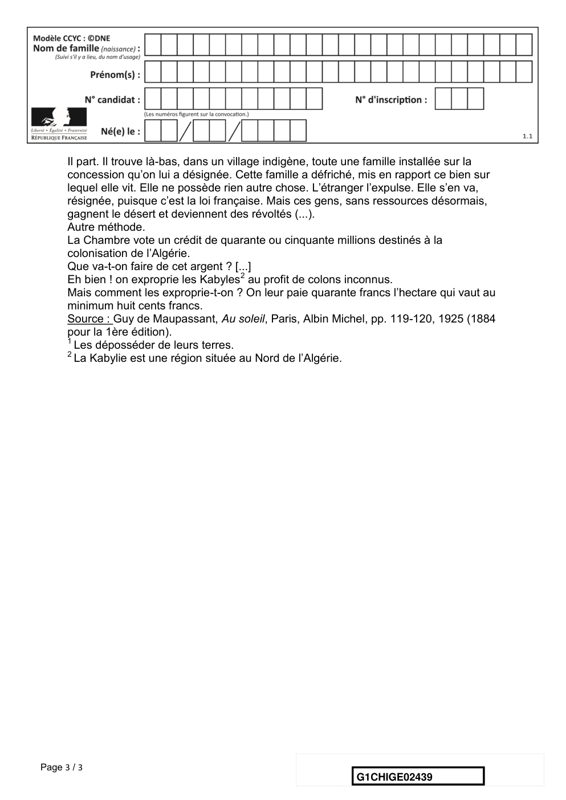

# e3c-histoire-geographie-general-premiere-02439-sujet-officiel

> Source : `../../../../pdf_version/01_hg_ponctuelle/e3c/2021_premiere/e3c-histoire-geographie-general-premiere-02439-sujet-officiel.pdf` — conversion Markdown (texte + visuels).
> Stratégie : [STRATEGIE_MARKDOWN.md](../../../../STRATEGIE_MARKDOWN.md)

---

## Page 1

ÉPREUVES COMMUNES DE CONTRÔLE CONTINU

      CLASSE : Première

      E3C : ☒ E3C1 ☒ E3C2 ☐ E3C3

      VOIE : ☒ Générale ☐ Technologique ☐ Toutes voies (LV)
      ENSEIGNEMENT : histoire-géographie
      DURÉE DE L’ÉPREUVE : 2h
      Niveaux visés (LV) : LVA               LVB
      Axes de programme : espaces ruraux ; colonies

      CALCULATRICE AUTORISÉE : ☐Oui ☒ Non

      DICTIONNAIRE AUTORISÉ :           ☐Oui ☒ Non

      ☐ Ce sujet contient des parties à rendre par le candidat avec sa copie. De ce fait, il ne peut être
      dupliqué et doit être imprimé pour chaque candidat afin d’assurer ensuite sa bonne numérisation.

      ☐ Ce sujet intègre des éléments en couleur. S’il est choisi par l’équipe pédagogique, il est
      nécessaire que chaque élève dispose d’une impression en couleur.

      ☐ Ce sujet contient des pièces jointes de type audio ou vidéo qu’il faudra télécharger et jouer le jour
      de l’épreuve.

      Nombre total de pages : 3

Page 1 / 3
                                                                            G1CHIGE02439

---

## Page 2

Première partie : question problématisée (sur 10 points)

      Pourquoi peut-on dire que les espaces ruraux sont des espaces multifonctionnels ?
      A partir d’exemples précis, votre réponse pourra présenter les usages traditionnels,
      les nouveaux usages et les conflits qui en découlent.

      Deuxième partie : analyse de documents (sur 10 points)

      En analysant les documents, vous expliquerez les ambitions coloniales françaises,
      vous montrerez que la présence française dans les colonies fait débat, ainsi que ses
      conséquences sur les territoires et les populations colonisés.
      L’analyse des documents constitue le cœur de votre travail, mais nécessite pour être
      menée la mobilisation de vos connaissances.

      Document 1 : Extraits de l’Atlas de géographie moderne, Franz Schrader
      En comparant cette histoire avec celle des autres puissances, on est frappé d'un fait
      remarquable : presque partout, les Français se sont concilié les sympathies des
      populations au milieu desquelles ils venaient s'établir (...). La France ne traite pas en
      simples sujets les populations conquises. Elle essaye au contraire de les assimiler,
      de leur enseigner sa langue, de leur inculquer ses mœurs et ses principes, de
      transformer graduellement ces étrangers en citoyens (...).
      Mais l'avenir véritable est en Algérie et en Tunisie, colonies de peuplement et non
      point simples colonies d'exploitation. Elles ont des terres fertiles ; sous un beau
      climat qui rappelle celui de la France du Midi, et où les Français peuvent vivre,
      travailler et s'accroître. Notre langue y fait des progrès constants; elle est parlée par
      une grande partie de la population des villes, qui acquiert graduellement nos usages
      (...). En restant tolérante, en continuant à pratiquer la justice qui assure aux
      conquérants le respect de ces musulmans, la France n'aura point à redouter de
      nouvelles insurrections, et sa puissance dans l'Afrique du Nord sera de plus en plus
      indéracinable.
      Source : F. Schrader, F. Prudent, E. Antheme, Atlas de géographie moderne, Paris,
      Hachette, 1896.

      Document 2 : extraits d’Au soleil, Guy de Maupassant
      L’écrivain Guy de Maupassant, part pour l’Algérie en 1881, en tant qu’envoyé spécial
      pour le journal Le Gaulois. Certains articles sont regroupés sous le titre Au soleil,
      publié en 1884.
      Voici les différents systèmes employés pour chasser et spolier1 les misérables
      propriétaires indigènes.
      Un particulier quelconque, quittant la France, va demander au bureau chargé de la
      répartition des terrains une concession en Algérie. On lui présente un chapeau avec
      des papiers dedans, et il tire un numéro correspondant à un lot de terre. Ce lot,
      désormais, lui appartient.

Page 2 / 3
                                                                 G1CHIGE02439

---

## Page 3

Il part. Il trouve là-bas, dans un village indigène, toute une famille installée sur la
      concession qu’on lui a désignée. Cette famille a défriché, mis en rapport ce bien sur
      lequel elle vit. Elle ne possède rien autre chose. L’étranger l’expulse. Elle s’en va,
      résignée, puisque c’est la loi française. Mais ces gens, sans ressources désormais,
      gagnent le désert et deviennent des révoltés (...).
      Autre méthode.
      La Chambre vote un crédit de quarante ou cinquante millions destinés à la
      colonisation de l’Algérie.
      Que va-t-on faire de cet argent ? [...]
      Eh bien ! on exproprie les Kabyles2 au profit de colons inconnus.
      Mais comment les exproprie-t-on ? On leur paie quarante francs l’hectare qui vaut au
      minimum huit cents francs.
      Source : Guy de Maupassant, Au soleil, Paris, Albin Michel, pp. 119-120, 1925 (1884
      pour la 1ère édition).
      1
        Les déposséder de leurs terres.
      2
        La Kabylie est une région située au Nord de l’Algérie.

Page 3 / 3
                                                                G1CHIGE02439

