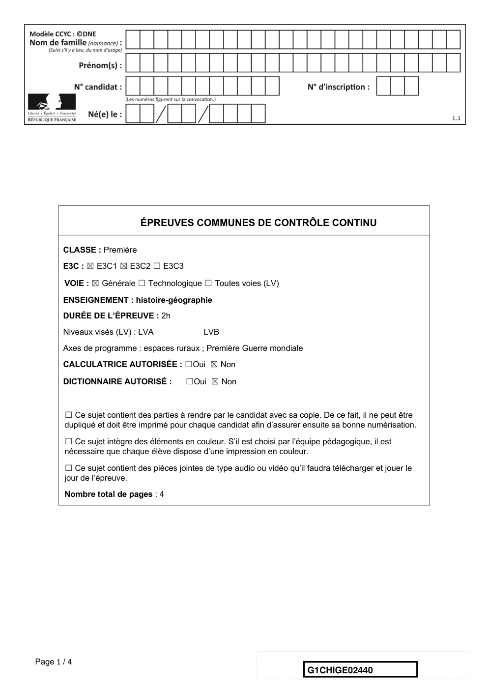
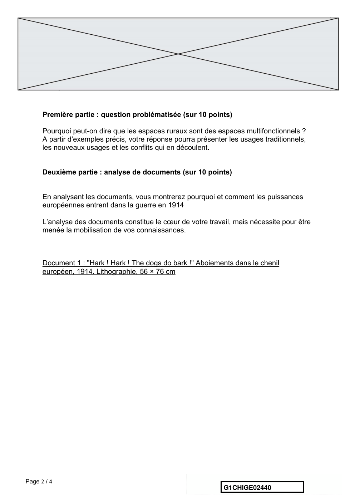
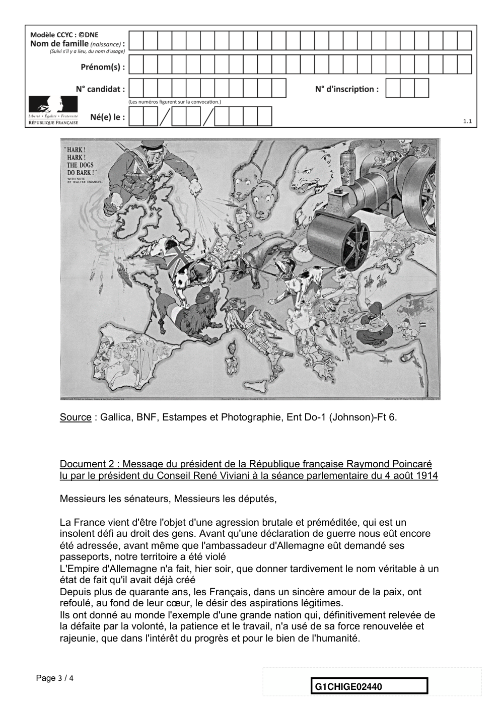
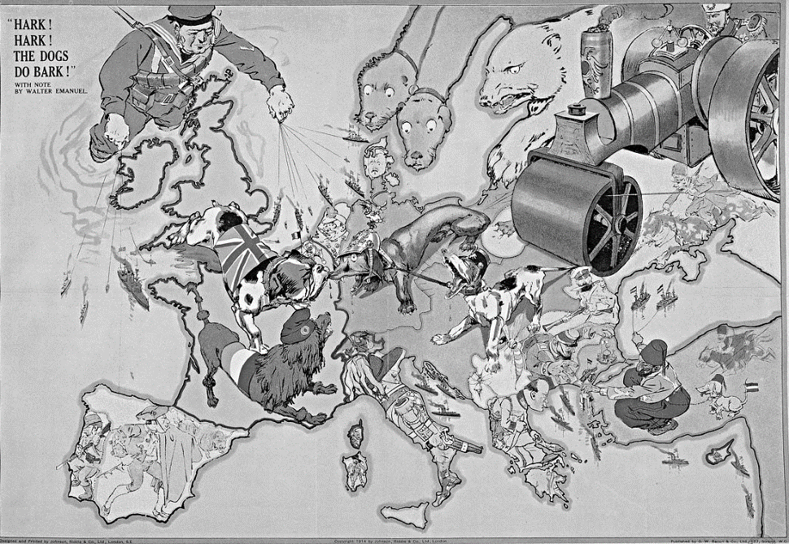
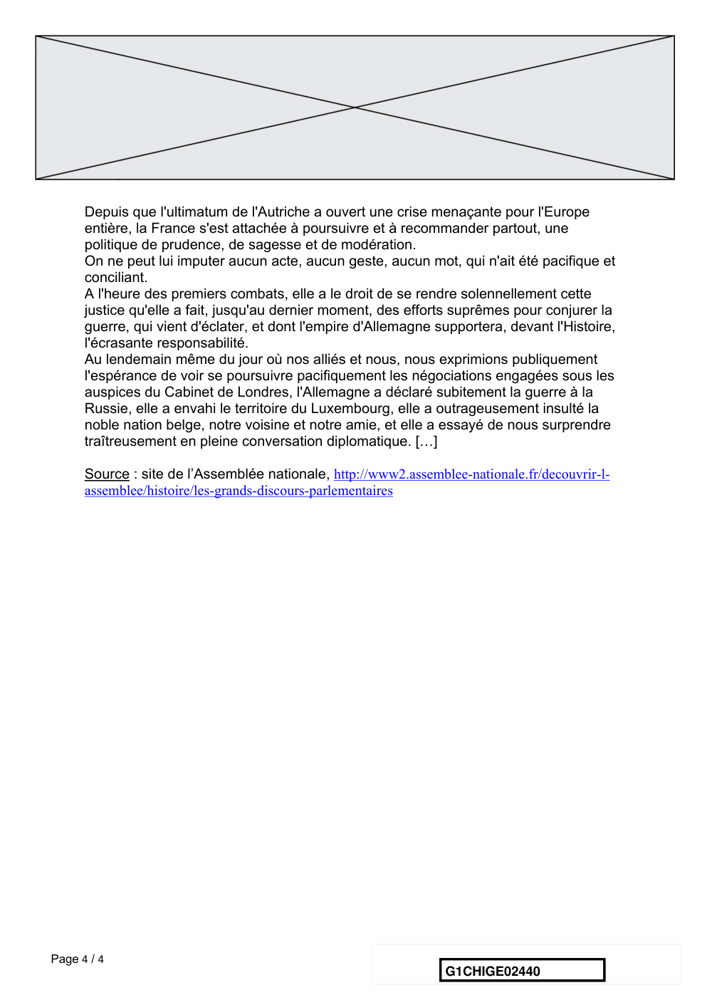

# e3c-histoire-geographie-general-premiere-02440-sujet-officiel

> Source : `../../../../pdf_version/01_hg_ponctuelle/e3c/2021_premiere/e3c-histoire-geographie-general-premiere-02440-sujet-officiel.pdf` — conversion Markdown (texte + visuels).
> Stratégie : [STRATEGIE_MARKDOWN.md](../../../../STRATEGIE_MARKDOWN.md)

---

## Page 1

ÉPREUVES COMMUNES DE CONTRÔLE CONTINU

       CLASSE : Première

       E3C : ☒ E3C1 ☒ E3C2 ☐ E3C3

        VOIE : ☒ Générale ☐ Technologique ☐ Toutes voies (LV)
       ENSEIGNEMENT : histoire-géographie
       DURÉE DE L’ÉPREUVE : 2h
       Niveaux visés (LV) : LVA                LVB
       Axes de programme : espaces ruraux ; Première Guerre mondiale

       CALCULATRICE AUTORISÉE : ☐Oui ☒ Non

       DICTIONNAIRE AUTORISÉ :            ☐Oui ☒ Non

        ☐ Ce sujet contient des parties à rendre par le candidat avec sa copie. De ce fait, il ne peut être
        dupliqué et doit être imprimé pour chaque candidat afin d’assurer ensuite sa bonne numérisation.

        ☐ Ce sujet intègre des éléments en couleur. S’il est choisi par l’équipe pédagogique, il est
        nécessaire que chaque élève dispose d’une impression en couleur.

        ☐ Ce sujet contient des pièces jointes de type audio ou vidéo qu’il faudra télécharger et jouer le
        jour de l’épreuve.
        Nombre total de pages : 4

Page 1 / 4
                                                                            G1CHIGE02440

---

## Page 2

Première partie : question problématisée (sur 10 points)

      Pourquoi peut-on dire que les espaces ruraux sont des espaces multifonctionnels ?
      A partir d’exemples précis, votre réponse pourra présenter les usages traditionnels,
      les nouveaux usages et les conflits qui en découlent.

      Deuxième partie : analyse de documents (sur 10 points)

      En analysant les documents, vous montrerez pourquoi et comment les puissances
      européennes entrent dans la guerre en 1914

      L’analyse des documents constitue le cœur de votre travail, mais nécessite pour être
      menée la mobilisation de vos connaissances.

      Document 1 : "Hark ! Hark ! The dogs do bark !" Aboiements dans le chenil
      européen, 1914. Lithographie, 56 × 76 cm

Page 2 / 4
                                                               G1CHIGE02440

---

## Page 3

Source : Gallica, BNF, Estampes et Photographie, Ent Do-1 (Johnson)-Ft 6.

      Document 2 : Message du président de la République française Raymond Poincaré
      lu par le président du Conseil René Viviani à la séance parlementaire du 4 août 1914

      Messieurs les sénateurs, Messieurs les députés,

      La France vient d'être l'objet d'une agression brutale et préméditée, qui est un
      insolent défi au droit des gens. Avant qu'une déclaration de guerre nous eût encore
      été adressée, avant même que l'ambassadeur d'Allemagne eût demandé ses
      passeports, notre territoire a été violé
      L'Empire d'Allemagne n'a fait, hier soir, que donner tardivement le nom véritable à un
      état de fait qu'il avait déjà créé
      Depuis plus de quarante ans, les Français, dans un sincère amour de la paix, ont
      refoulé, au fond de leur cœur, le désir des aspirations légitimes.
      Ils ont donné au monde l'exemple d'une grande nation qui, définitivement relevée de
      la défaite par la volonté, la patience et le travail, n'a usé de sa force renouvelée et
      rajeunie, que dans l'intérêt du progrès et pour le bien de l'humanité.

Page 3 / 4
                                                                G1CHIGE02440

---

## Page 4

Depuis que l'ultimatum de l'Autriche a ouvert une crise menaçante pour l'Europe
      entière, la France s'est attachée à poursuivre et à recommander partout, une
      politique de prudence, de sagesse et de modération.
      On ne peut lui imputer aucun acte, aucun geste, aucun mot, qui n'ait été pacifique et
      conciliant.
      A l'heure des premiers combats, elle a le droit de se rendre solennellement cette
      justice qu'elle a fait, jusqu'au dernier moment, des efforts suprêmes pour conjurer la
      guerre, qui vient d'éclater, et dont l'empire d'Allemagne supportera, devant l'Histoire,
      l'écrasante responsabilité.
      Au lendemain même du jour où nos alliés et nous, nous exprimions publiquement
      l'espérance de voir se poursuivre pacifiquement les négociations engagées sous les
      auspices du Cabinet de Londres, l'Allemagne a déclaré subitement la guerre à la
      Russie, elle a envahi le territoire du Luxembourg, elle a outrageusement insulté la
      noble nation belge, notre voisine et notre amie, et elle a essayé de nous surprendre
      traîtreusement en pleine conversation diplomatique. […]

      Source : site de l’Assemblée nationale, http://www2.assemblee-nationale.fr/decouvrir-l-
      assemblee/histoire/les-grands-discours-parlementaires

Page 4 / 4
                                                                 G1CHIGE02440

