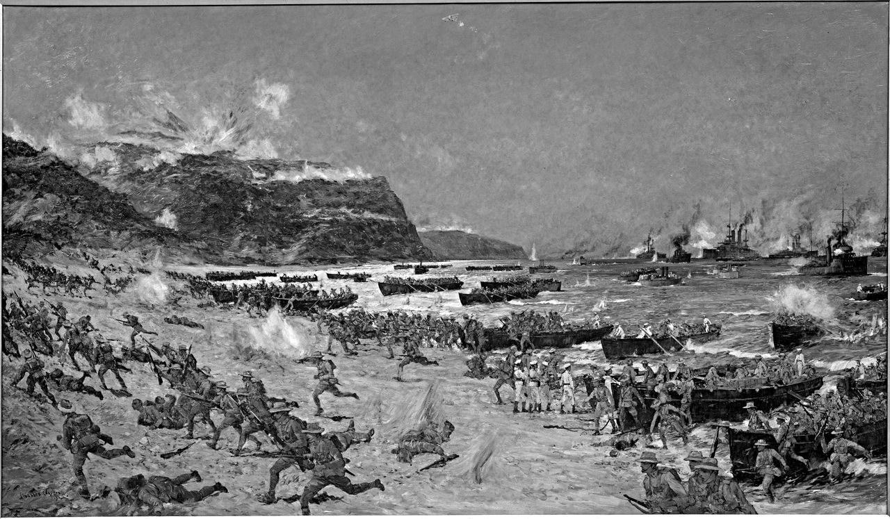

# e3c-histoire-geographie-general-premiere-02441-sujet-officiel

> Source : `../../../../pdf_version/01_hg_ponctuelle/e3c/2021_premiere/e3c-histoire-geographie-general-premiere-02441-sujet-officiel.pdf` — conversion Markdown (texte + visuels utiles).
> Stratégie : [STRATEGIE_MARKDOWN.md](../../../../STRATEGIE_MARKDOWN.md)

---

## Page 1

ÉPREUVES COMMUNES DE CONTRÔLE CONTINU

      CLASSE : Première

      E3C : ☒ E3C1 ☒ E3C2 ☐ E3C3

      VOIE : ☒ Générale ☐ Technologique ☐ Toutes voies (LV)

      ENSEIGNEMENT : histoire-géographie
      DURÉE DE L’ÉPREUVE : 2h
      Niveaux visés (LV) : LVA               LVB
      Axes de programme : espaces ruraux ; Première Guerre mondiale

      CALCULATRICE AUTORISÉE : ☐Oui ☒ Non

      DICTIONNAIRE AUTORISÉ :           ☐Oui ☒ Non

      ☐ Ce sujet contient des parties à rendre par le candidat avec sa copie. De ce fait, il ne peut être
      dupliqué et doit être imprimé pour chaque candidat afin d’assurer ensuite sa bonne numérisation.

      ☐ Ce sujet intègre des éléments en couleur. S’il est choisi par l’équipe pédagogique, il est
      nécessaire que chaque élève dispose d’une impression en couleur.

      ☐ Ce sujet contient des pièces jointes de type audio ou vidéo qu’il faudra télécharger et jouer le jour
      de l’épreuve.
      Nombre total de pages : 4

Page 1 / 4
                                                                            G1CHIGE02441

---

## Page 2

Première partie : question problématisée (sur 10 points)

      Pourquoi peut-on dire que les espaces ruraux sont des espaces multifonctionnels ?
      A partir d’exemples précis, votre réponse pourra présenter les usages traditionnels,
      les nouveaux usages et les conflits qui en découlent.

      Deuxième partie : analyse de documents (sur 10 points)

      En analysant les documents, vous montrerez que la bataille des Dardanelles s’inscrit
      dans une phase précise de la Première Guerre mondiale et qu’elle témoigne de la
      diversité des formes de combats pendant le conflit.

      L’analyse des documents constitue le cœur de votre travail, mais nécessite pour être
      menée la mobilisation de vos connaissances.

      Document 1 : Témoignage d’un combattant français aux Dardanelles

      Le sergent Arnaud Pomiro participe dans l’armée française à l’offensive des
      Dardanelles. Cet instituteur dans le civil note ses impressions jour après jour :

      26 avril 1915, sur un navire au large des Dardanelles : « Là un spectacle inoubliable
      s’offre à mes yeux. A gauche des îles montagneuses plongées dans un nuage [...]. A
      droite, des côtes basses où je vois s’abriter un grand nombre de paquebots : une
      cinquantaine environ. Un peu plus vers le nord, une cinquantaine de cuirassés
      [1] comme autant de traits noirs au-dessus des flots. Devant, un passage étroit entre
      des îles, occupé aussi par des navires de guerre. Tout à coup une lueur vive
      apparaît sur un cuirassé : c’est un obus qui part, puis un autre, un autre encore. »

      27 avril : « J’assiste à un bombardement des plus intenses exécuté par quatre
      cuirassés anglais distants d’environ cinq kilomètres. [...] On aperçoit sur la terre une
      batterie de 75 [2] qui se met de la partie. C’est par moments un bruit infernal,
      formidable qui nous fait pousser des ah ! des oh ! de surprise et d’admiration. [...] A
      11 heures j’aperçois un point noir : un aéroplane [3] des Alliés survolant le champ de
      bataille à une très grande hauteur. [...] La canonnade n’a pas cessé de toute l’après-
      midi. Elle est d’une intensité extraordinaire de 4 à 5 heures de l’après-midi. On
      entend jusqu’à quatre, cinq, six coups tirés presque en même temps par le même
      navire [...]. Par moments, c’est inimaginable le bruit causé par tous ces canons de
      différents calibres [4]. »

Page 2 / 4
                                                                 G1CHIGE02441

---

## Page 3

Le débarquement est ordonné en fin d’après-midi : « Il est exactement 19h25 quand
      je foule le sol de la Turquie d’Europe. [...] Pendant la marche, ai remarqué un grand
      nombre de tranchées démolies par les obus, des réseaux de fil de fer couchés, des
      armes turques, des munitions, des sacs, des effets. [...] Remarqué également les
      effets terribles des obus sur le village de Sedd-ul-Bahr [...]. Des trous béants dans
      presque tous les murs : il ne reste rien des maisons. Quelle dévastation !

      4 mai : Nous avons passé toute la nuit à faire des feux de salve sur un ennemi que
      nous ne voyions pas. Le combat a été très dur, très fatigant, beaucoup plus que les
      deux précédents. C’était terrifiant au plus haut degré : la canonnade des plus
      intenses avec la fusillade très nourrie de la première ligne de tranchées.

      A la pointe du jour, le combat atteint son état le plus aigu. Nous sommes débordés
      par les Turcs [...]. Ils avancent sur notre front gauche où les tirailleurs sénégalais [5]
      [...] abandonnent la tranchée occupée aussitôt après par l’ennemi [...]. Des renforts
      arrivent fort heureusement à temps pour arrêter et même refouler par une charge la
      horde (…). En même temps nous voyons sur notre front droit une colonne [de
      combattants turcs] qui s’avance [...]. Nous nous mettons à tirer dessus à répétition en
      même temps que les mitrailleuses. La colonne continue malgré tout pendant un petit
      moment, mais finalement, étant l’objet d’un feu de presque tous les tirailleurs, des
      mitrailleuses, des canons, elle opère un demi-tour et va se loger dans les tranchées
      d’où elle était sortie. »

      [1] Navires de guerre blindés et pourvus de canons.
      [2] Désigne un ensemble de quatre canons tirant des obus de calibre 75 et des
      éléments permettant de les ravitailler en munitions.
      [3] Le terme inventé au milieu du XIXe siècle désigne ici un avion.
      [4] Diamètre du canon.
      [5] Soldats des troupes coloniales intégrées à l'armée française.
      Source : POMIRO Arnaud, Les Carnets de guerre d’Arnaud POMIRO. Des
      Dardanelles au Chemin des Dames, Toulouse, Privat, collection « Témoignages pour
      l’histoire », 2006, pp. 97-115.

Page 3 / 4
                                                                  G1CHIGE02441

---

## Page 4

Document 2 : Le débarquement des ANZACS - corps d'armée australien et
             néo-zélandais - le 25 avril 1915 aux Dardanelles

      Source : « The landing at Anzac, April 25, 1915 », par Charles Dixon, Huile sur toile,
      1198 x 1962 mm.Archives de Nouvelle-Zélande, NCWA Q388.

Page 4 / 4
                                                                G1CHIGE02441

