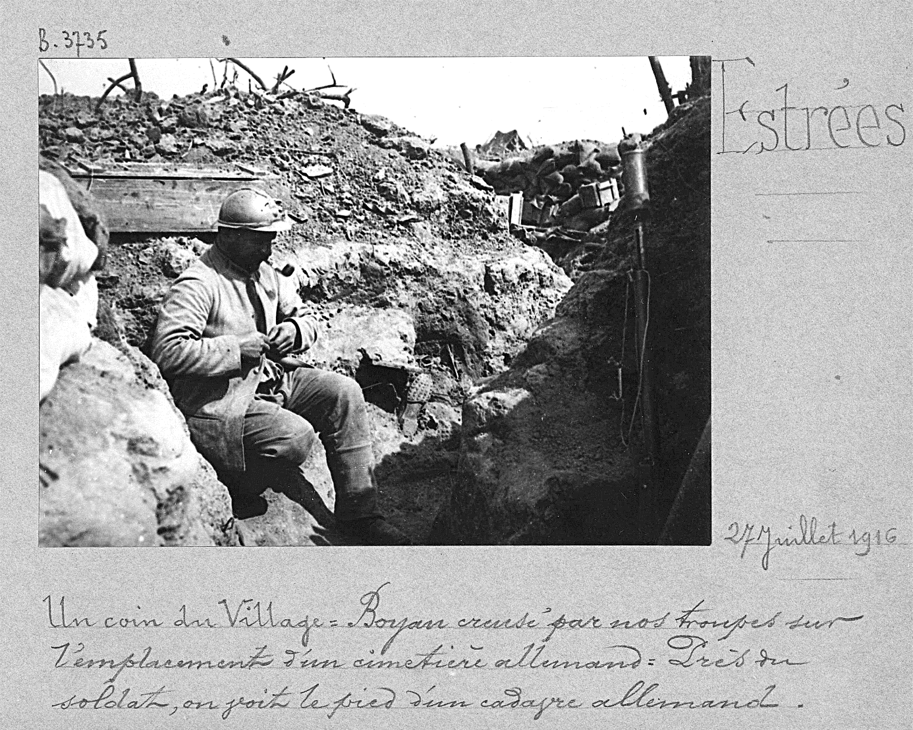

# e3c-histoire-geographie-general-premiere-02442-sujet-officiel

> Source : `../../../../pdf_version/01_hg_ponctuelle/e3c/2021_premiere/e3c-histoire-geographie-general-premiere-02442-sujet-officiel.pdf` — conversion Markdown (texte + visuels utiles).
> Stratégie : [STRATEGIE_MARKDOWN.md](../../../../STRATEGIE_MARKDOWN.md)

---

## Page 1

ÉPREUVES COMMUNES DE CONTRÔLE CONTINU

      CLASSE : Première

      E3C : ☒ E3C1 ☒ E3C2 ☐ E3C3

      VOIE : ☒ Générale ☐ Technologique ☐ Toutes voies (LV)

      ENSEIGNEMENT : histoire-géographie
      DURÉE DE L’ÉPREUVE : 2h
      Niveaux visés (LV) : LVA               LVB
      Axes de programme : espaces ruraux ; Première Guerre mondiale

      CALCULATRICE AUTORISÉE : ☐Oui ☒ Non

      DICTIONNAIRE AUTORISÉ :           ☐Oui ☒ Non

      ☐ Ce sujet contient des parties à rendre par le candidat avec sa copie. De ce fait, il ne peut être
      dupliqué et doit être imprimé pour chaque candidat afin d’assurer ensuite sa bonne numérisation.

      ☐ Ce sujet intègre des éléments en couleur. S’il est choisi par l’équipe pédagogique, il est
      nécessaire que chaque élève dispose d’une impression en couleur.

      ☐ Ce sujet contient des pièces jointes de type audio ou vidéo qu’il faudra télécharger et jouer le jour
      de l’épreuve.
      Nombre total de pages : 4

Page 1 / 4
                                                                            G1CHIGE02442

---

## Page 2

Première partie : question problématisée (sur 10 points)

      Pourquoi peut-on dire que les espaces ruraux sont des espaces multifonctionnels ?
      A partir d’exemples précis, votre réponse pourra présenter les usages traditionnels,
      les nouveaux usages et les conflits qui en découlent.

      Deuxième partie : analyse de documents (sur 10 points)

      En analysant les documents, vous montrerez que la Bataille de la Somme illustre
      une phase précise du conflit et des formes d'affrontement qui ont marqué la Première
      Guerre mondiale.

      L’analyse des documents constitue le cœur de votre travail, mais nécessite pour être
      menée la mobilisation de vos connaissances.

Page 2 / 4
                                                               G1CHIGE02442

---

## Page 3

Document 1 : Photographie prise à Estrées dans la Somme, 27 juillet 1916.

      Transcription de la légende manuscrite : "Un coin du village. Boyau creusé par nos
      troupes sur l'emplacement d'un cimetière allemand. Près du soldat, on voit le pied
      d'un cadavre allemand."

      Source : Album Valois (fonds photographique constitué par la section
      photographique de l’Armée, créée en 1915), n° 452, Bibliothèque de documentation
      internationale contemporaine.

      Document 2 : témoignage de Jacques Meyer, fantassin français blessé au cours de
      la bataille de la Somme

      4 juillet 1916, en direction de la première ligne la nuit : « Nous montons, avec des
      soupirs de fatigue, une pente interminable, creusée d’innombrables cagnas[1] ; […]
      à mesure que nous approchons […] les multiples bruits du combat se précisent. […]

Page 3 / 4
                                                               G1CHIGE02442

---

## Page 4

Les notes grêles de la fusillade lointaine et le « tacatacataca » des mitrailleuses se
      détachent à la fois sur le fond magnifiquement rugissant d’un tir de barrage de nos
      75 [2] et sur la basse grondante des pièces lourdes [3] . […]

      Un ravin dépouillé et boueux où éclatent quelques marmites [4] […]. Le sol se creuse
      toujours davantage ; les trous d’obus se font plus nombreux et se rejoignent, et puis
      c’est le chaos, mélange de trous énormes et d’entonnoirs immenses[5] , d’abris
      comblés et d’arbres abattus. […]

      En face, […] notre bombardement, qui a recommencé depuis un quart d’heure,
      semble s’acharner sur un mourant. Son intensité est extraordinaire, et les mots ne
      sauraient rendre compte de cette impression de force brutale et pourtant ordonnée :
      le calibre est au minimum du 155 et du 220 [6] , à la cadence d’environ un obus à la
      seconde. […]

      Source : Jacques Meyer, La Biffe, Paris, Albin Michel, 1928, 265 p.

      [1] Terme d'argot désignant un abri.
      [2] Canons de 75, les plus utilisés dans l'armée française.
      [3] Canons de plus gros calibres.
      [4] Terme d'argot désignant les obus.
      [5] Les entonnoirs désignent les trous immenses laissés par l'explosion de mines
      souterraines.
      [6] Pièces d'artillerie lourde.

Page 4 / 4
                                                                 G1CHIGE02442
