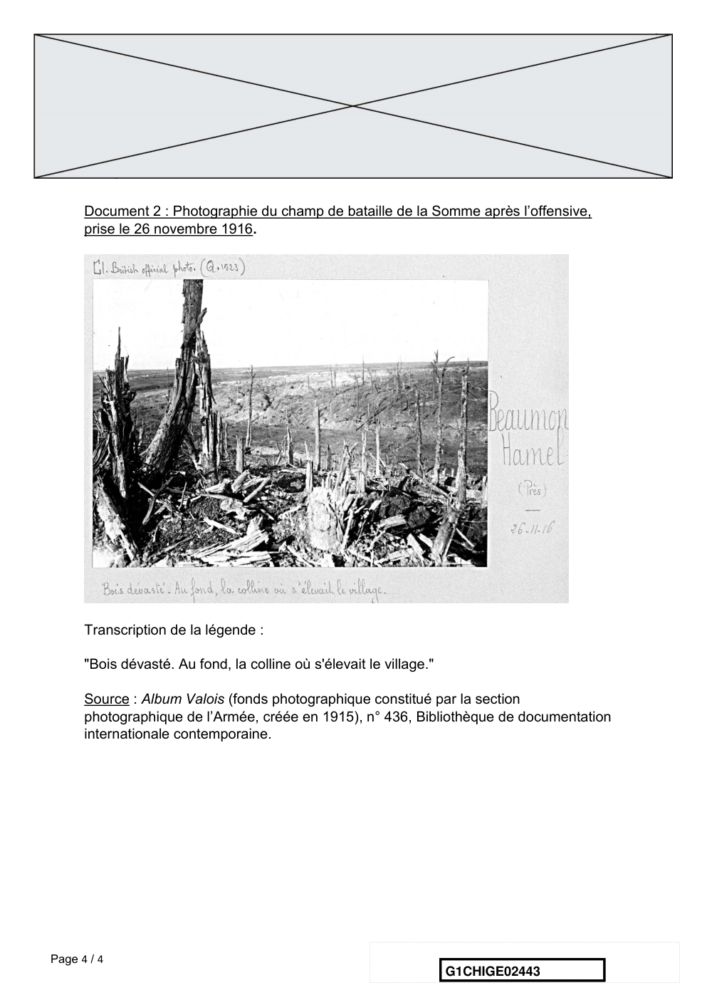

# e3c-histoire-geographie-general-premiere-02443-sujet-officiel

> Source : `../../../../pdf_version/01_hg_ponctuelle/e3c/2021_premiere/e3c-histoire-geographie-general-premiere-02443-sujet-officiel.pdf` — conversion Markdown (texte + visuels utiles).
> Stratégie : [STRATEGIE_MARKDOWN.md](../../../../STRATEGIE_MARKDOWN.md)

---

## Page 1

ÉPREUVES COMMUNES DE CONTRÔLE CONTINU

      CLASSE : Première

      E3C : ☒ E3C1 ☒ E3C2 ☐ E3C3

      VOIE : ☒ Générale ☐ Technologique ☐ Toutes voies (LV)

      ENSEIGNEMENT : histoire-géographie
      DURÉE DE L’ÉPREUVE : 2h
      Niveaux visés (LV) : LVA               LVB
      Axes de programme : espaces ruraux ; Première Guerre mondiale

      CALCULATRICE AUTORISÉE : ☐Oui ☒ Non

      DICTIONNAIRE AUTORISÉ :           ☐Oui ☒ Non

      ☐ Ce sujet contient des parties à rendre par le candidat avec sa copie. De ce fait, il ne peut être
      dupliqué et doit être imprimé pour chaque candidat afin d’assurer ensuite sa bonne numérisation.

      ☐ Ce sujet intègre des éléments en couleur. S’il est choisi par l’équipe pédagogique, il est
      nécessaire que chaque élève dispose d’une impression en couleur.

      ☐ Ce sujet contient des pièces jointes de type audio ou vidéo qu’il faudra télécharger et jouer le jour
      de l’épreuve.
      Nombre total de pages : 4

Page 1 / 4
                                                                            G1CHIGE02443

---

## Page 2

Première partie : question problématisée (sur 10 points)

      Pourquoi peut-on dire que les espaces ruraux sont des espaces multifonctionnels ?
      A partir d’exemples précis, votre réponse pourra présenter les usages traditionnels,
      les nouveaux usages et les conflits qui en découlent.

      Deuxième partie : analyse de documents (sur 10 points)

      En analysant les deux documents, vous montrerez comment la bataille de la Somme
      illustre les nouvelles formes d’affrontement et leurs conséquences depuis 1914.

      L’analyse des documents constitue le cœur de votre travail, mais nécessite pour être
      menée la mobilisation de vos connaissances.

      Document 1 : La bataille de la Somme vue par un officier allemand : Ernst Jünger

      Né en 1895, Ernst Jünger s’engage en 1914. En 1916, il commande une compagnie
      dans la Somme au moment où se déclenche l’offensive franco-britannique.

      Fin juin 1916 : « Nous entrions désormais en quelque sorte dans une guerre
      nouvelle. Ce que nous avions connu jusqu’à présent, sans d’ailleurs le savoir, c’était
      la tentative de gagner la guerre par des batailles rangées d’ancien style et
      l’enlisement dans la guerre de position. Maintenant, c’était la bataille de matériel qui
      nous attendait, avec son déploiement de moyens titanesques. […]

      Il y avait de l’offensive dans l’air […] De fait, la nuit fut pire que la précédente. Ce fut
      surtout un pilonnage, vers deux heures un quart, qui dépassa tout ce que nous
      avions vu jusqu’à présent. Une grêle de projectiles lourds s’abattit autour de mon
      abri. […]

      C’est à la fin de cette terrible nuit que nous fûmes relevés [… en marchant vers les
      lignes de repos à l’arrière…] nous eûmes une vue impressionnante sur le prélude de
      la bataille de la Somme. Les secteurs du front à notre gauche étaient enveloppés de
      nuages de fumée blanche et noire : les impacts faisaient jaillir, l’un après l’autre, des
      geysers de boue, hauts comme des tours ; au-dessus des explosions de shrapnells
      [1] . Seuls les signaux de couleur, appels muets de l’artillerie, révélait qu’ils étaient
      vivants. […]

Page 2 / 4
                                                                    G1CHIGE02443

---

## Page 3

[Le lendemain matin] « Alerte aux gaz ! » Je saisis en hâte mon casque, passai mes
      bottes, bouclai mon ceinturon, sortis en courant et vis au-dehors comme un énorme
      nuage de gaz qui roulait par-dessus Monchy [2] , en rideaux blancs et épais. […]

      Comme ma section était pour la plus grande part en ligne, et qu’une attaque était
      vraisemblable, il n’était pas question de perdre du temps à réfléchir. [Il court rejoindre
      ses hommes et, cinquante mètres avant de les rejoindre en première ligne, il subit un
      tir d’artillerie qui l’oblige à se cacher] Je semblais avoir choisi précisément le coin le
      plus éventé. Mines sphériques, légères et lourdes, mines-bouteilles, shrapnells, [...],
      obus en tout genre – je n’arrivai plus à distinguer tout ce qui ronflait, vrombissait et
      crevait pêle-mêle. […] Mais ces bruits sont plus faciles à décrire qu’à subir, car
      l’instinct lie à chacun de ces grondements de fer vibrant l’idée de la mort – et c’est
      ainsi que je restai accroupi dans mon trou, les mains devant les yeux, tandis que
      toutes les manières dont je pouvais être atteint défilait dans mon imagination. Je
      crois avoir imaginé une analogie qui rend fort bien le sentiment propre à une situation
      où je me suis trouvé souvent, comme tous les autres soldats de cette guerre : qu’on
      se représente ligoté à un poteau et constamment menacé par un bonhomme qui
      brandit un lourd marteau. Tantôt il arrive en sifflant, vous frôlant le crâne, puis il
      frappe le poteau si fort que les éclats en volent - c’est exactement cette situation que
      reproduit tout ce qu’on subit quand on est pris à découvert en plein milieu d’un
      pilonnage. […] ce bombardement, lui aussi, prit fin à la longue et cette fois je
      poursuivis mon chemin.

      A Monchy, nous vîmes une file de gazés assis devant le poste de secours ; ils
      étreignaient leurs flancs, gémissaient et vomissaient, tandis que l’eau leur ruisselait
      des yeux. L’affaire n’était pas sans gravité, car quelques-uns moururent dans les
      jours suivants parmi d’atroces souffrances. Nous avions subi une attaque soufflante
      de chlore pur, un gaz de combat qui agit en corrodant et en brûlant les poumons.

      Source : Ernst Jünger, Orages d’acier. Journal de guerre, Paris, Le Livre de Poche,
      2004.

      [1] Obus à balles
      [2] Commune située sur la ligne de front.

Page 3 / 4
                                                                  G1CHIGE02443

---

## Page 4

Document 2 : Photographie du champ de bataille de la Somme après l’offensive,
      prise le 26 novembre 1916.

      Transcription de la légende :

      "Bois dévasté. Au fond, la colline où s'élevait le village."

      Source : Album Valois (fonds photographique constitué par la section
      photographique de l’Armée, créée en 1915), n° 436, Bibliothèque de documentation
      internationale contemporaine.

Page 4 / 4
                                                                     G1CHIGE02443

