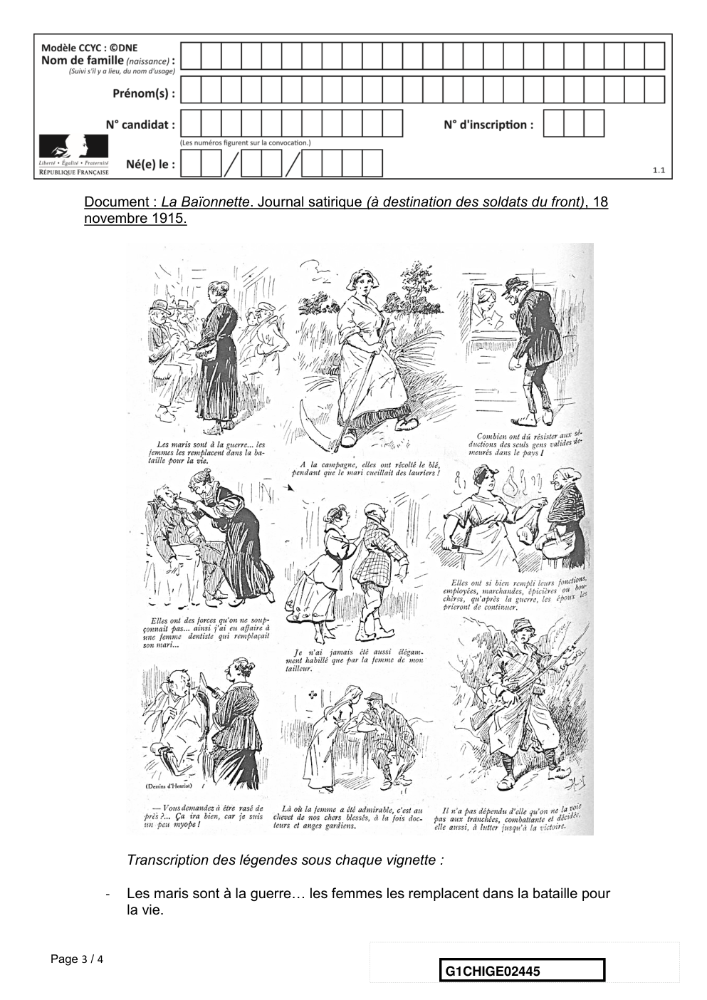

# e3c-histoire-geographie-general-premiere-02445-sujet-officiel

> Source : `../../../../pdf_version/01_hg_ponctuelle/e3c/2021_premiere/e3c-histoire-geographie-general-premiere-02445-sujet-officiel.pdf` — conversion Markdown (texte + visuels utiles).
> Stratégie : [STRATEGIE_MARKDOWN.md](../../../../STRATEGIE_MARKDOWN.md)

---

## Page 1

ÉPREUVES COMMUNES DE CONTRÔLE CONTINU

      CLASSE : Première

      E3C : ☒ E3C1 ☒ E3C2 ☐ E3C3

      VOIE : ☒ Générale ☐ Technologique ☐ Toutes voies (LV)

      ENSEIGNEMENT : histoire-géographie
      DURÉE DE L’ÉPREUVE : 2h
      Niveaux visés (LV) : LVA               LVB
      Axes de programme : espaces ruraux ; Première Guerre mondiale

      CALCULATRICE AUTORISÉE : ☐Oui ☒ Non

      DICTIONNAIRE AUTORISÉ :           ☐Oui ☒ Non

      ☐ Ce sujet contient des parties à rendre par le candidat avec sa copie. De ce fait, il ne peut être
      dupliqué et doit être imprimé pour chaque candidat afin d’assurer ensuite sa bonne numérisation.

      ☐ Ce sujet intègre des éléments en couleur. S’il est choisi par l’équipe pédagogique, il est
      nécessaire que chaque élève dispose d’une impression en couleur.

      ☐ Ce sujet contient des pièces jointes de type audio ou vidéo qu’il faudra télécharger et jouer le jour
      de l’épreuve.
      Nombre total de pages : 4

Page 1 / 4
                                                                            G1CHIGE02445

---

## Page 2

Première partie : question problématisée (sur 10 points)

      Pourquoi peut-on dire que les espaces ruraux sont des espaces multifonctionnels ?
      A partir d’exemples précis, votre réponse pourra présenter les usages traditionnels,
      les nouveaux usages et les conflits qui en découlent.

      Deuxième partie : analyse de document (sur 10 points)

      En analysant le document, vous étudierez le rôle des femmes dans la Première
      Guerre mondiale et les conséquences de leur mobilisation dans la société.

      L’analyse du document constitue le cœur de votre travail, mais nécessite pour être
      menée la mobilisation de vos connaissances.

Page 2 / 4
                                                               G1CHIGE02445

---

## Page 3

Document : La Baïonnette. Journal satirique (à destination des soldats du front), 18
      novembre 1915.

                 Transcription des légendes sous chaque vignette :

             -   Les maris sont à la guerre… les femmes les remplacent dans la bataille pour
                 la vie.

Page 3 / 4
                                                                     G1CHIGE02445

---

## Page 4

-   A la campagne, elles ont récolté le blé, pendant que le mari cueillait des
                 lauriers !
             -   Combien ont dû résister aux séductions des seuls gens valides demeurés
                 dans le pays !
             -   Elles ont des forces qu’on ne soupçonnait pas… ainsi j’ai eu affaire à une
                 femme dentiste qui remplaçait son mari…
             -   Je n’ai jamais été aussi élégamment habillé que par la femme de mon tailleur.
             -   Elles ont si bien rempli leurs fonctions, employées, marchandes, épicières ou
                 bouchères, qu’après la guerre, les époux les prieront de continuer.
             -   « Vous demandez à être rasé de près ?... ça ira bien, car je suis un peu
                 myope ! »
             -   Là où la femme a été admirable, c’est au chevet de chers blessés, à la fois
                 docteurs et anges gardiens.
             -   Il n’a pas dépendu d’elle qu’on ne la voit pas aux tranchées, combattante et
                 décidée, elle aussi, à lutter jusqu’à la victoire.

      Source : Gallica, Bnf.

Page 4 / 4
                                                                  G1CHIGE02445
