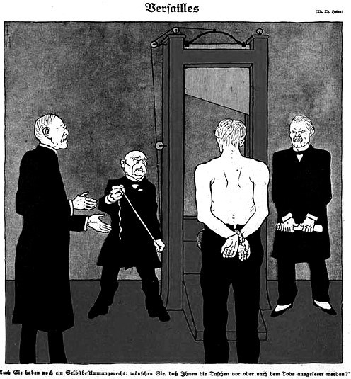

# e3c-histoire-geographie-general-premiere-02446-sujet-officiel

> Source : `../../../../pdf_version/01_hg_ponctuelle/e3c/2021_premiere/e3c-histoire-geographie-general-premiere-02446-sujet-officiel.pdf` — conversion Markdown (texte + visuels utiles).
> Stratégie : [STRATEGIE_MARKDOWN.md](../../../../STRATEGIE_MARKDOWN.md)

---

## Page 1

ÉPREUVES COMMUNES DE CONTRÔLE CONTINU

      CLASSE : Première

      E3C : ☒ E3C1 ☒ E3C2 ☐ E3C3

      VOIE : ☒ Générale ☐ Technologique ☐ Toutes voies (LV)

      ENSEIGNEMENT : histoire-géographie
      DURÉE DE L’ÉPREUVE : 2h
      Niveaux visés (LV) : LVA               LVB
      Axes de programme : espaces ruraux ; Sorties de guerre

      CALCULATRICE AUTORISÉE : ☐Oui ☒ Non

      DICTIONNAIRE AUTORISÉ :           ☐Oui ☒ Non

      ☐ Ce sujet contient des parties à rendre par le candidat avec sa copie. De ce fait, il ne peut être
      dupliqué et doit être imprimé pour chaque candidat afin d’assurer ensuite sa bonne numérisation.

      ☐ Ce sujet intègre des éléments en couleur. S’il est choisi par l’équipe pédagogique, il est
      nécessaire que chaque élève dispose d’une impression en couleur.

      ☐ Ce sujet contient des pièces jointes de type audio ou vidéo qu’il faudra télécharger et jouer le jour
      de l’épreuve.
      Nombre total de pages : 3

Page 1 / 3
                                                                            G1CHIGE02446

---

## Page 2

Première partie : question problématisée (sur 10 points)
      Pourquoi peut-on dire que les espaces ruraux sont des espaces multifonctionnels ?

      A partir d’exemples précis, votre réponse pourra présenter les usages traditionnels,
      les nouveaux usages et les conflits qui en découlent.

      Deuxième partie : analyse de documents (sur 10 points)

      En analysant les deux documents, vous montrerez la perception du traité de
      Versailles dans le camp des vainqueurs et dans celui des vaincus.

      L’analyse des documents constitue le cœur de votre travail, mais nécessite pour être
      menée la mobilisation de vos connaissances.

      Document 1 : extrait du message du Président Woodrow Wilson à la nation
      américaine, 29 juin 1919

      « Le traité de paix a été signé. S'il est ratifié, et s'il est exécuté dans toute la sincérité
      de ses termes, il sera la charte d'un nouvel ordre de choses pour le monde. Dans les
      obligations et les châtiments imposés à l'Allemagne, il est certainement dur, mais
      cette sévérité découle seulement des grandes offenses commises par elle, offenses
      qui doivent être redressées et compensées. Il n'impose rien que l'Allemagne ne
      puisse faire et elle peut regagner sa juste position dans le monde si elle en remplit
      les termes honorablement et avec promptitude.

      C'est plus qu'un traité de paix avec l’Allemagne ; il rend à la liberté de grands
      peuples qui jamais encore n'avaient pu trouver le chemin de cette liberté. Il termine,
      définitivement, un ancien et intolérable ordre de choses sous lequel des petits
      groupes d'hommes égoïstes se sont servi des peuples de grands empires pour
      satisfaire leurs désirs ambitieux de domination. Il unit les libres gouvernements du
      monde en une ligue permanente dans laquelle ils sont engagés à employer leurs
      forces réunies pour maintenir la paix en maintenant le droit et la justice […].

      Il substitue un nouvel ordre, sous lequel […] les peuples qui ne sont pas encore
      politiquement conscients et ceux qui sont prêts pour leur indépendance, mais ont
      encore besoin d'être protégés et guidés, ne seront plus soumis à la domination et à
      l'exploitation de nations plus puissantes, mais recevront d'appui amical et les
      conseils utiles de gouvernements qui s'engagent à répondre devant l'humanité de
      l'exécution de leur tâche en acceptant d'être guidés par la [Société] des nations. Il
      reconnaît les droits inaliénables des nations, le droit des minorités, la sainteté des
      croyances religieuses et la liberté des cultes. […] C'est pour cette raison que je parle

Page 2 / 3
                                                                     G1CHIGE02446

---

## Page 3

*(Suite de la page précédente — le document continue ici.)*

de ce traité comme de la grande charte d'un nouvel ordre de choses. Il y a là des
      causes pour une profonde satisfaction, une sécurité universelle et une espérance
      confiante. »

      Document 2 : Caricature sur le traité de Versailles

                                                                        Personnages
      de gauche à droite : Woodrow Wilson (Etats-Unis), Georges Clemenceau (France),
      Lloyd George (Royaume-Uni). De dos : l’Allemagne.

      Légende : « Vous aussi avez droit à l’auto-détermination. Voudriez-vous que vos
      poches soient vidées avant ou après votre mort ? »

      Source : Caricature de Thomas Heine, parue dans le journal satirique
      Simplicissimus, 3 juin 1919.

Page 3 / 3
                                                               G1CHIGE02446

