# e3c-enseignement-scientifique-premiere-02393-sujet-officiel

> Source : `../../../../pdf_version/02_es_ponctuelle/e3c/2020/e3c-enseignement-scientifique-premiere-02393-sujet-officiel.pdf` — conversion Markdown (texte + visuels).
> Stratégie : [STRATEGIE_MARKDOWN.md](../../../../STRATEGIE_MARKDOWN.md)

---

## Page 1

ÉPREUVES COMMUNES DE CONTRÔLE CONTINU

      CLASSE : Première

      E3C : ☐ E3C1 ☒ E3C2 ☐ E3C3

      VOIE : ☒ Générale ☐ Technologique ☐ Toutes voies (LV)
      ENSEIGNEMENT : Enseignement scientifique
      DURÉE DE L’ÉPREUVE : 2h
      Niveaux visés (LV) : LVA               LVB
      Axes de programme :

      CALCULATRICE AUTORISÉE : ☒Oui ☐ Non

      DICTIONNAIRE AUTORISÉ :           ☐Oui ☒ Non

      ☐ Ce sujet contient des parties à rendre par le candidat avec sa copie. De ce fait, il ne peut être
      dupliqué et doit être imprimé pour chaque candidat afin d’assurer ensuite sa bonne numérisation.

      ☐ Ce sujet intègre des éléments en couleur. S’il est choisi par l’équipe pédagogique, il est
      nécessaire que chaque élève dispose d’une impression en couleur.

      ☐ Ce sujet contient des pièces jointes de type audio ou vidéo qu’il faudra télécharger et jouer le jour
      de l’épreuve.
      Nombre total de pages : 9

Page 1 / 9
                                                                            G1CENSC02393

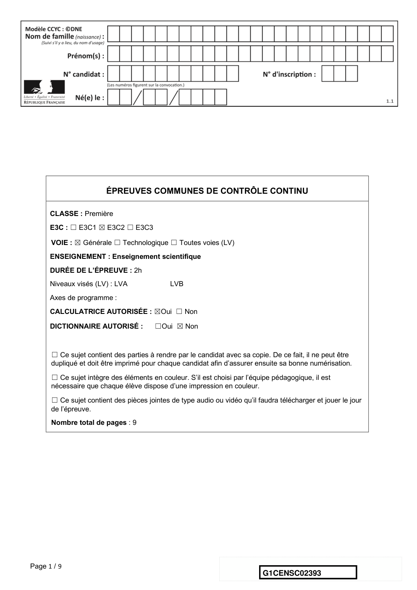

---

## Page 2

EXERCICE 1
                                      GEODE DE GALÈNE

      Le plomb est présent à l’état naturel sous diverses formes dans la croûte terrestre.
      On le trouve principalement dans la galène, qui en contient 86,6 % en masse. Cet
      élément a permis de donner une estimation précise de l’âge de la Terre.

                                        Géode de galène

      Partie 1 : la galène

      1- La galène est un solide minéral composé en majorité de sulfure de plomb qui
      possède une structure cristalline de type chlorure de sodium constituée des ions
      plomb Pb2+ et des ions sulfure S2-.
      Document 1 : une maille de la structure cristalline de sulfure de plomb.

        Pb2+
        Pb

                                                                          a
         S2-

Page 2 / 9
                                                                G1CENSC02393

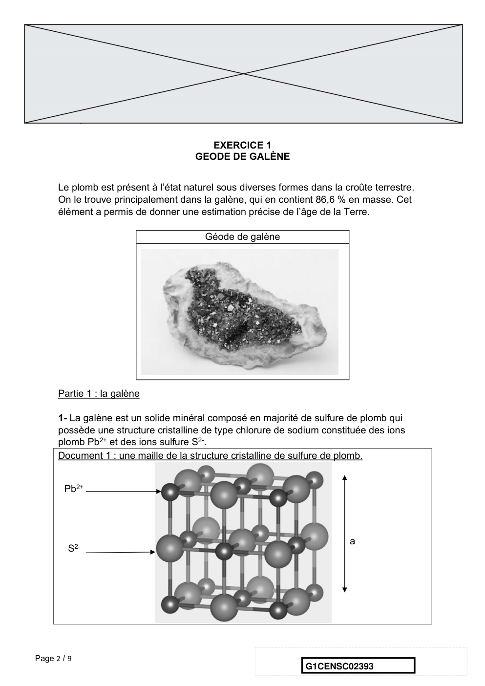

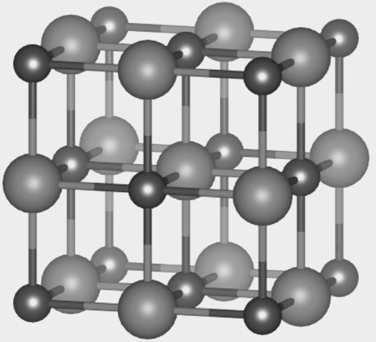

---

## Page 3

1-a- Déterminer le type de réseau cristallin formé par les ions plomb Pb2+.
      1-b- Préciser les différentes positions occupées par les ions sulfure S2- dans la
      maille.

      2-a- Justifier qu’il y a quatre ions plomb Pb2+ et quatre ions sulfure S2- dans la maille.
      2-b- Choisir la formule chimique du sulfure de plomb parmi les quatre proposées ci-
      dessous et la recopier sur la copie.
             A : Pb2S               B : PbS2            C : PbS              D : PbS4

      3- La forme géométrique de la maille et la nature des ions qui la constituent sont à
      l’origine des propriétés macroscopiques du cristal, notamment de sa masse
      volumique.
      En utilisant les données ci-dessous, calculer la masse et le volume d’une maille.
      En déduire la masse volumique du sulfure de plomb.

      Données :
      Masse d’un ion plomb Pb2+: mPb2+ = 3,44 × 10-22 g.
      Masse d’un ion sulfure S2- : mS2- = 5,33 × 10-23 g.
      Longueur d’une arête de la maille : a =5,94 × 10-8 cm.

      4- Outre ses utilisations industrielles, la galène peut servir d’objet de décoration. Elle
      est alors vendue sous forme de géode (cavité rocheuse tapissée de cristaux).
      Un vendeur de géodes de galène veut estimer la qualité de son stock de géodes.
      Pour cela, il effectue le prélèvement d’un lot de cinquante géodes dans son stock et
      détermine la masse volumique de chacune d’elle. Par souci de simplification, il se
      limite à étudier ce seul critère.

      Il obtient les résultats suivants :
      Masse volumique
                                 7,30        7,35     7,40     7,45     7,50     7,55     7,60
      (en g.cm-3)
      Effectif                        1         1        9       10       11       13        5

      Pour être conforme, un lot de géodes doit contenir au moins 95% de géodes dont la
      masse volumique est comprise entre 7,40 g.cm-3 et 7,60 g.cm-3.
      Le lot précédent est-il conforme ? Justifier la réponse.

Page 3 / 9
                                                                   G1CENSC02393

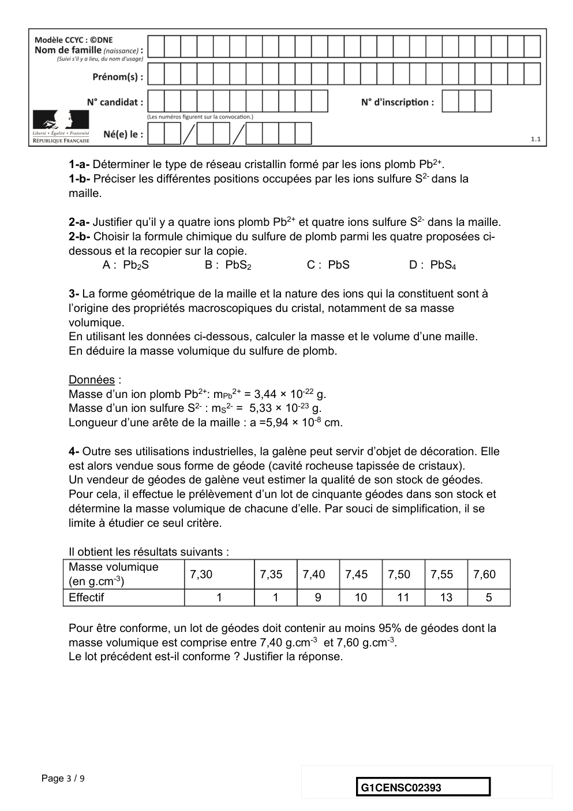

---

## Page 4

Partie 2 : détermination de l’âge de la Terre

      Dès le XVIe siècle, les scientifiques ont cherché à déterminer l’âge de roches. C’est
      la découverte de la radioactivité à la fin du XIXe siècle qui leur a permis de dater avec
      une plus grande fiabilité de nombreux échantillons de roches prélevés dans la croûte
      terrestre.

      Document 2 : principe de la datation uranium-plomb
      On fait l’hypothèse suivante : on considère qu’il n’y a pas de plomb 206 dans la
      roche au moment de sa formation, mais qu’elle contient des noyaux d’uranium 238
      radioactifs.
      On sait qu’un noyau d’uranium 238 radioactif se transforme en un noyau plomb 206
      stable à la suite d’une série de désintégrations successives.
                                   238 U ® 206 Pb + 6 0 e + 8 4 He
      L'équation globale est :      92      82       -1       2

      En mesurant la quantité de plomb 206 dans un échantillon de roche ancienne, on
      peut déterminer l'âge de l’échantillon de roche à partir de la courbe de décroissance
      radioactive du nombre de noyaux d'uranium 238.

      Ainsi, si on considère qu’un échantillon de roche contenant à la fois du plomb 206 et
      de l’uranium 238 a le même âge que la Terre, il est possible d’utiliser la datation
      uranium-plomb pour donner une estimation de l’âge de la Terre.

Page 4 / 9
                                                                     G1CENSC02393

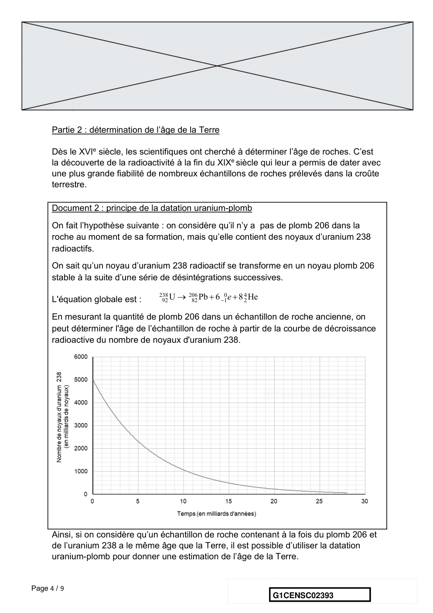

---

## Page 5

5- Donner la composition d’un noyau de plomb 206.
      6- On note NU(t) et NPb(t) les nombres de noyaux d’uranium 238 et de plomb 206
      présents dans l’échantillon à la date t à laquelle la mesure est réalisée et NU(0) le
      nombre de noyaux d’uranium 238 que contenait la roche au moment de sa formation.
      6-a : Justifier la relation : NU(0) = NU(t) + NPb(t)
      6-b- Déterminer graphiquement NU(0)
      6-c- Le nombre de noyaux de plomb 206 mesuré dans la roche à la date t est égal à
      NPb(t)= 2,5.1012 noyaux.
      Calculer le nombre NU(t) de noyaux d'uranium présents à la date t.
      7- En déduire une estimation de l’âge de la Terre. Expliquer la démarche employée.

                                          EXERCICE 2
                      LA LUMIERE CENDREE DE LA LUNE

      Périodiquement la Lune nous présente un aspect des
      plus surprenants. En plus d’une partie fortement
      lumineuse correspondante à la phase lunaire, il est
      possible d’apercevoir l’autre partie de la Lune. La
      lumière qui nous parvient de cette partie plus sombre
      est appelée « lumière cendrée de la Lune » (voir la
      photographie).

      Document 1. Observations de Galilée
      « Je veux noter aussi un fait que j’ai observé, non sans un certain émerveillement :
      presque au centre de la Lune se trouve une cavité plus grande que toute autre et
      parfaitement circulaire [...] : dans son obscurcissement et dans son illumination, elle
      présenterait le même aspect que celui de la Terre dans une région comparable à la
      Bohème, si cette région était de tous côtés entourés de hautes montagnes et

Page 5 / 9
                                                                G1CENSC02393

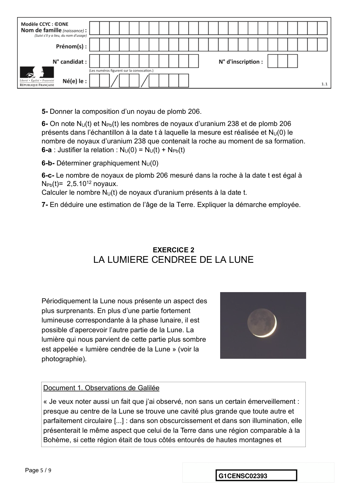

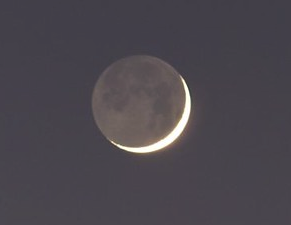

---

## Page 6

disposée en cercle parfait. Dans la lune, en effet, la cavité est entourée de cimes si
      élevées que la région extrême, attenante à la partie ténébreuse, se voit illuminée
      par les rayons solaires, avant que la ligne de partage entre la lumière et l’ombre
      atteigne le diamètre de la figure elle-même [...] ».
             Galilée, Sidereus Nuncius, trad. de E. Namer, Paris : Gauthier-Villars, p. 73 sq.
      « Chacun peut se rendre compte avec la certitude des sens, que la Lune est dotée
      d’une surface non point lisse et polie, mais faite d’aspérités et de rugosités, et que
      tout comme la face de la Terre elle-même, elle est toute en gros renflements,
      gouffres profonds et courbures. »
        Galilée, Sidereus Nuncius , trad. de E. Namer, Paris : Gauthier-Villars, 1964, p. 116

      Figure 1 : dessins de la Lune extraits du livre “Sidereus nuncius” de Galilée.
                                   Situation 1                Situation 2
                                                           D’après : https://media4.obspm.fr

Page 6 / 9
                                                                 G1CENSC02393

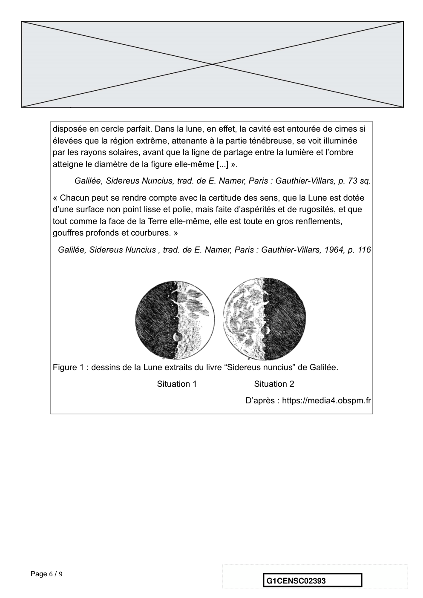

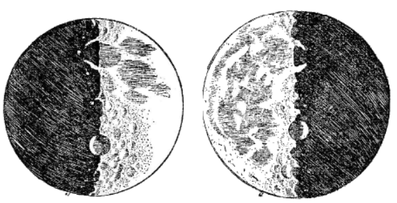

---

## Page 7

Document 2. Observations de Léonard de Vinci
      Il y a 500 ans de cela, Léonard de Vinci résolut une très ancienne énigme
      astronomique : l'origine de la lumière cendrée, cette douce lueur qui baigne la partie
      non éclairée de la Lune.
      Peu de gens le savent, mais une des plus grandes manifestations du génie de
      Léonard de Vinci n'a rien à voir avec la peinture ou l'ingénierie. Il s'agit en fait
      d'astronomie : il a compris l'origine de la lumière cendrée.

      On peut observer la lumière cendrée chaque nuit où la Lune est en croissant au-
      dessus de l'horizon, au coucher du soleil. Entre les pointes du croissant, vous
      devinez comme une image fantomatique de la Lune. C'est la lumière cendrée, le
      reflet sur la partie non éclairée de la Lune de la lumière renvoyée par la Terre.
      Pendant des milliers d'années, les hommes se sont émerveillés devant cette
      splendeur sans en comprendre la cause. Et il fallut attendre le 16e siècle pour que
      Léonard de Vinci la comprenne.
      Aujourd'hui, la réponse nous paraît évidente. Quand le Soleil se couche sur la Lune,
      il se produit exactement la même chose que sur Terre : c'est la nuit. Mais pas une
      nuit noire... Même quand le Soleil est couché, il y a encore une source de lumière
      dans la nuit lunaire : la Terre bien sûr !
                       D’après https://www.cidehom.com/science_at_nasa.php?_a_id=224

Page 7 / 9
                                                                  G1CENSC02393

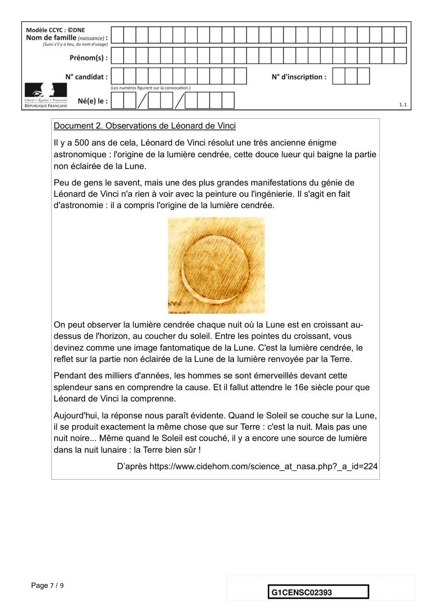

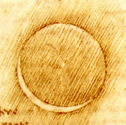

---

## Page 8

Document 3. Calendrier du premier semestre 2021
      Les disques noirs représentent les dates de nouvelle Lune et les disques blancs la
      pleine Lune. Ces dates ont été effacées pour le mois de juin.

                                                        Source : https://www.lecalendrier.fr/

      1- Les observations de Galilée (document 1)
      1-a- Pour les deux situations (notées Situation 1 et Situation 2) dessinées par Galilée
      sur la figure 1, représenter sur un schéma les positions de la Terre, de la Lune et du
      Soleil.

      1-b- Dessiner ce que Galilée aurait observé dans les deux situations de la figure 1 si
      la surface de la Lune était parfaitement lisse.

      1-c- Galilée a pu aisément comparer les observations qu’il a réalisées à différents
      moments de l’année parce que la Lune présente toujours la même face à la Terre.

Page 8 / 9
                                                                G1CENSC02393

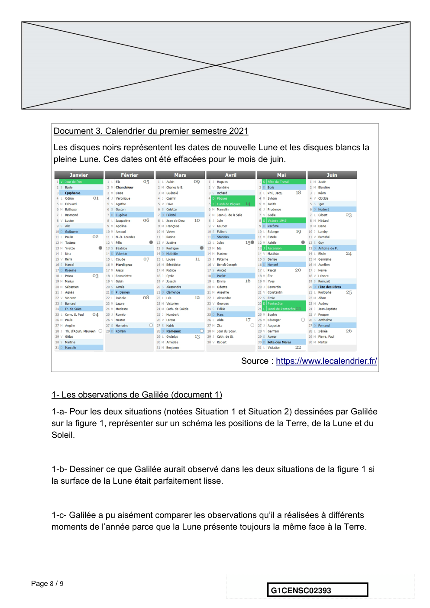

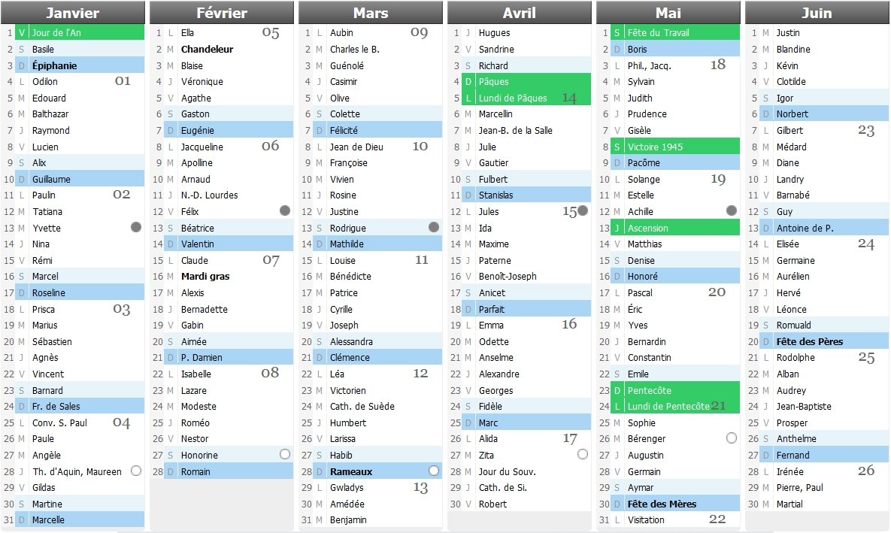

---

## Page 9

Voici plusieurs propositions pour expliquer ce phénomène :
      (a) la Lune tourne sur elle-même avec la même période que celle de son mouvement
      de rotation autour du Soleil ;
      (b) la Lune tourne sur elle-même avec la même période que celle de son mouvement
      de rotation autour de la Terre ;
      (c) la Lune ne tourne pas sur elle-même tout en tournant autour de la Terre,
      (d) la Lune reste fixe dans le ciel pour un observateur terrestre.
      Recopier sur votre copie la bonne explication ; justifier votre réponse en vous
      appuyant sur un schéma clair.

      2- Les observations de Léonard de Vinci
      2-a- Schématiser, sans souci d’échelle, les positions relatives de la Lune, du Soleil et
      de la Terre dans la situation décrite par Léonard de Vinci dans le document 2.

      2-b- À partir du document 2 et du schéma réalisé dans la question précédente,
      expliquer comment un individu, sur Terre, peut observer la lumière cendrée de la
      Lune.

      2-c- Expliquer en quoi l’observation de la lumière cendrée montre que l'albedo de la
      Terre n’est pas nul.

      3- Période favorable à l’observation de la lumière cendrée
      3-a- À partir des données figurant sur le calendrier du document 3, calculer la durée
      moyenne, en jour, de l’intervalle de temps qui sépare deux pleines lunes
      successives.

      3-b- En décrivant avec précision le raisonnement utilisé, déterminer une période de
      10 jours a priori favorable à l’observation de la lumière cendrée pendant le mois de
      juin 2021.

Page 9 / 9
                                                                 G1CENSC02393

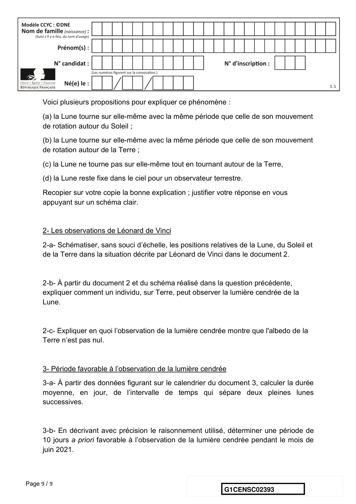

