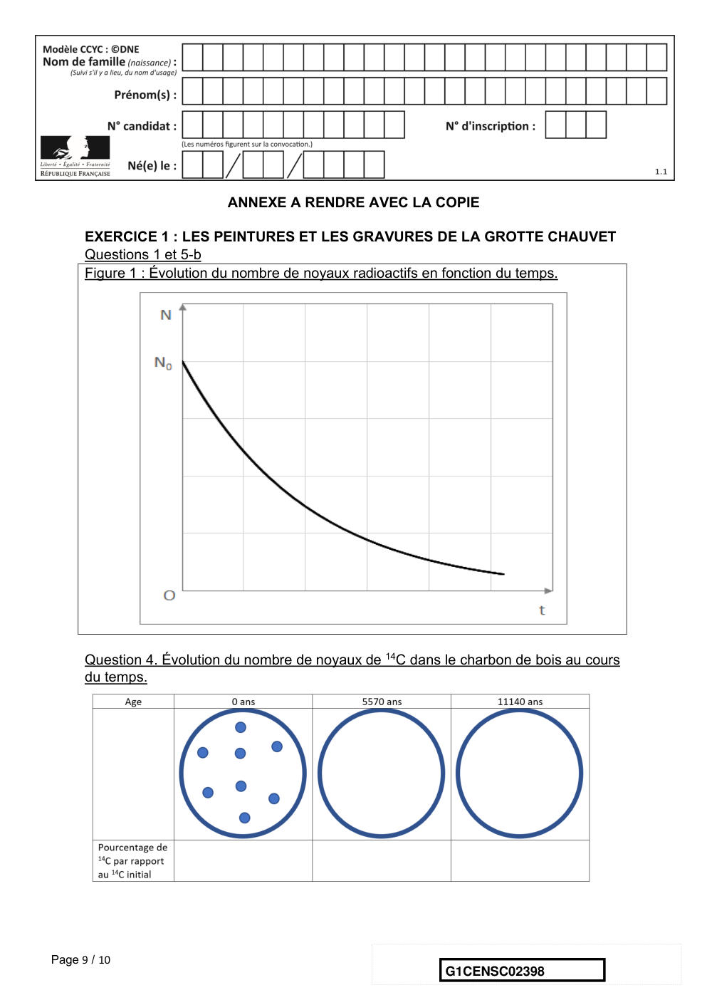

# e3c-enseignement-scientifique-premiere-02398-sujet-officiel

> Source : `../../../../pdf_version/02_es_ponctuelle/e3c/2020/e3c-enseignement-scientifique-premiere-02398-sujet-officiel.pdf` — conversion Markdown (texte + visuels utiles).
> Stratégie : [STRATEGIE_MARKDOWN.md](../../../../STRATEGIE_MARKDOWN.md)

---

## Page 1

ÉPREUVES COMMUNES DE CONTRÔLE CONTINU

      CLASSE : Première

      E3C : ☐ E3C1 ☒ E3C2 ☐ E3C3

      VOIE : ☒ Générale ☐ Technologique ☐ Toutes voies (LV)
      ENSEIGNEMENT : Enseignement scientifique
      DURÉE DE L’ÉPREUVE : 2h
      Niveaux visés (LV) : LVA               LVB
      Axes de programme :

      CALCULATRICE AUTORISÉE : ☒Oui ☐ Non

      DICTIONNAIRE AUTORISÉ :           ☐Oui ☒ Non

      ☒ Ce sujet contient des parties à rendre par le candidat avec sa copie. De ce fait, il ne peut être
      dupliqué et doit être imprimé pour chaque candidat afin d’assurer ensuite sa bonne numérisation.

      ☐ Ce sujet intègre des éléments en couleur. S’il est choisi par l’équipe pédagogique, il est
      nécessaire que chaque élève dispose d’une impression en couleur.

      ☐ Ce sujet contient des pièces jointes de type audio ou vidéo qu’il faudra télécharger et jouer le jour
      de l’épreuve.
      Nombre total de pages : 10

Page 1 / 10
                                                                            G1CENSC02398

---

## Page 2

EXERCICE 1
              LES PEINTURES ET LES GRAVURES DE LA GROTTE CHAUVET

      La grotte Chauvet, découverte en décembre 1994, s’ouvre au pied d’une falaise
      bordant les gorges de l’Ardèche. Elle contient de nombreuses peintures et gravures
      mais ne semble pas avoir servi d’habitat car les outils de silex et les restes de faune
      apportés par les humains sont rares.

      Document 1. Photographies de deux œuvres de la grotte Chauvet (source
      Wikipedia)
       1-a- Peintures de chevaux, aurochs et       1-b- Gravure du hibou moyen-duc
       rhinocéros

      On cherche à associer la peinture de chevaux, aurochs et rhinocéros (document 1a)
      à l’une des phases d’occupation de la grotte. Pour cela, on utilise une méthode de
      datation basée sur la désintégration des noyaux radioactifs.

      1- L’évolution du nombre de noyaux radioactifs d’une composition donnée au cours
      du temps suit une loi de décroissance représentée dans le document réponse à
      rendre avec la copie.
      Rappeler la définition de la demi-vie t1/2 associée à cette désintégration radioactive.
      Sur le document réponse, faire apparaître la construction graphique permettant de
      repérer la valeur de la demi-vie du noyau.

Page 2 / 10
                                                                 G1CENSC02398

---

## Page 3

2- La grotte a connu deux phases d'occupation, l'une à l'Aurignacien (entre 37000 et
      33500 années avant aujourd’hui), l'autre au Gravettien (31000 à 28000 années avant
      aujourd’hui).
      Il existe de nombreux noyaux radioactifs mais leur demi-vie est différente (quelques
      exemples sont donnés dans le document 2).

      Document 2 : différents noyaux radioactifs et leur demi-vie
                  Noyaux radioactifs                Demi-vie (années)
                  Uranium 238                       4,4688×109
                  Uranium 235                       7,03×108
                  Potassium 40                      1,248×109
                  Carbone 14                        5,568×103
                  Iode 131                          2×10-2

      Déterminer le noyau radioactif dont la demi-vie est la mieux adaptée pour dater
      l’occupation de la grotte. Justifier.

      3- Le charbon de bois est obtenu à partir du bois, qui est un matériau d'origine
      végétale. La peinture des chevaux (document 1-a) a été réalisée sur les parois de la
      grotte avec du charbon de bois.
      On rappelle que le carbone radioactif (14C) est présent naturellement dans le dioxyde
      de carbone (CO2) atmosphérique.
      Préciser le phénomène qui permet aux végétaux de fixer le carbone atmosphérique
      au sein de leur matière organique.

      4 - Après la mort du végétal ou son prélèvement par l’être humain, le végétal
      n’échange plus de carbone avec l’atmosphère.
      4-a Compléter le document réponse représentant la désintégration de 14C au sein du
      charbon de bois.
      4-b Indiquer si, en principe, la datation pourrait être réalisée avec un échantillon
      comprenant initialement un seul noyau de 14C, en admettant que l’on dispose
      d’appareils susceptibles de détecter la présence d’un seul noyau de 14C.

Page 3 / 10
                                                                G1CENSC02398

---

## Page 4

5-a- Sachant qu’il ne reste que 2,34 % du 14C initial dans le charbon de la peinture,
      donner un encadrement en nombre entiers de demi-vies de la date de la mort du
      bois qui a servi – sous forme de charbon de bois - à réaliser la peinture.

      5-b On utilise la figure 1 du document réponse dans laquelle on prend comme
      origine des âges l’instant correspondant à 5 demi-vies du 14C, pour lequel N0
      représente 3,13 % du nombre initial de noyaux de 14C présents dans le charbon de la
      peinture. Déterminer graphiquement en années la durée nécessaire pour que le
      pourcentage de 14C restant dans le charbon de bois passe de 3,13 % à 2,34 %.

      5-c Indiquer si cette peinture a été faite lors de l'occupation à l'Aurignacien ou au
      Gravettien. Justifier.

      6 - Au sein de cette grotte, on trouve également des gravures réalisées dans le
      calcaire (exemple de la gravure du hibou moyen-duc – document 1b).
      La méthode précédente ne peut pas être utilisée pour la dater. Proposer une
      explication.

                                   EXERCICE 2
                  DÉTERMINATION DE L'ÂGE DE LA TERRE PAR BUFFON

      Cet exercice propose d’étudier une méthode historique de détermination de l’âge de
      la Terre (proposée par Buffon au 18e siècle) et de la mettre en perspective avec une
      méthode actuelle.

      Partie 1. Expérience de Buffon et détermination de l’âge de la Terre

      Document 1. Description du protocole expérimental mis en œuvre par Buffon
      « J'ai fait faire dix boulets de fer forgé et battu :
              Le premier d'un demi-pouce de diamètre. Le second d'un pouce. Le troisième d'un
      pouce et demi. Le quatrième de deux pouces. Le cinquième de deux pouces et demi. Le
      sixième de trois pouces. Le septième de trois pouces et demi. Le huitième de quatre pouces.
      Le neuvième de quatre pouces et demi. Le dixième de cinq pouces.
              Ce fer venait de la forge de Chameçon près de Châtillon-sur-Seine, et comme tous les
      boulets ont été faits du fer de cette même forge, leurs poids se sont trouvés à très-peu près
      proportionnels aux volumes. [...]

Page 4 / 10
                                                                  G1CENSC02398

---

## Page 5

J'ai cherché à saisir deux instants dans le refroidissement, le premier où les boulets
      cessaient de brûler, c'est-à-dire le moment où on pouvait les toucher et les tenir avec la main,
      pendant une seconde, sans se brûler ; le second temps de ce refroidissement était celui où les
      boulets se sont trouvés refroidis jusqu'au point de la température actuelle, c'est-à-dire, à
      10 degrés au-dessus de la congélation. »
                                                       Extrait : Premier tome, rédigé par Buffon (1774)

      Document 2. Tableau présentant un extrait des mesures réalisées par Buffon

                          Diamètre (en pouce)       1    1,5    2    3     4    5

                          Temps de
                          « refroidissement au
                                                    93   145 196 308 415
                          point de la température
                          actuelle » (en minute)

      1- « Le boulet de 5 pouces a été chauffé à blanc en 34 minutes. Il s'est refroidi au
      point de le tenir dans la main en 3 heures 52 min. Refroidi au point de la température
      actuelle en 8 heures 42 minutes. »
      Indiquer laquelle des quatre valeurs proposées ci-dessous correspond à la valeur
      manquante dans le document 2 (case grisée) pour le boulet de 5 pouces.

         Valeur A : 842        Valeur B : 352       Valeur C : 522        Valeur D : 232

      2- Le pouce est une ancienne unité de longueur, valant environ 2,7 cm. Convertir en
      centimètre le diamètre du plus grand boulet.

      3- Sur l’annexe, représenter les points correspondant au temps de
      « refroidissement au point de la température actuelle » (en minute) en fonction du
      diamètre du boulet (en pouce).

      4- Indiquer laquelle des trois affirmations suivantes permet d’exprimer la relation
      entre le diamètre du boulet en fer forgé et son temps de « refroidissement au point
      de la température actuelle » au vu de l’expérience de Buffon.

Page 5 / 10
                                                                G1CENSC02398

---

## Page 6

• Affirmation A : « Le temps de refroidissement est proportionnel au diamètre. »

      • Affirmation B : « La vitesse de refroidissement est proportionnelle au diamètre. »

      • Affirmation C : « L’accroissement du temps de refroidissement est proportionnel à
      l’accroissement du diamètre. »

      5- L’utilisation d’un tableur permet d’ajuster le nuage des points construits à la
      question 3 par la fonction f définie par 𝑓(𝑑) = 108𝑑 − 16 pour des valeurs de
      𝑑 supérieures ou égales à 1 et où d correspond au diamètre (en pouce) et f(d) la
      durée de refroidissement (en minute).
      À l’aide de ce modèle et sachant que le diamètre de la Terre est de 12 742 km,
      calculer l’âge de la Terre (en année).

      Partie 2. Mise en perspective avec les connaissances actuelles

      Nous cherchons à porter un regard critique sur l’utilisation de boulets en fer pour
      déterminer l’âge de la Terre.

      6- En utilisant le document 3, expliquer en quoi le modèle de Buffon utilisant des
      boulets de fer n’est pas adapté pour déterminer l’âge de la Terre.

Page 6 / 10
                                                                 G1CENSC02398

---

## Page 7

Document 3. Composition simplifiée des principales enveloppes terrestres

                                   Composition chimique des différentes
                                         enveloppes terrestres
                                 Croûte            Oxydes de :
                                 (continentale     Si (50 à 70 %)
                                 et océanique)     Al (13 à 16 %)
                                                   Fe (5 %)
                                                   …
                                 Manteau           Oxydes de :
                                                   Si (45 %)
                                                   Mg (37 %)
                                                   Fe (8 %)
                                                   …
                                 Noyau             Alliage fer-
                                                   nickel (teneur en fer
                                                   environ 98 %)
          D’après : http://avg85.fr/category/mediatheque/galerie-de-photos/cartes-et-coupes-geologiques/

      Légende :
      Si : silicium
      Al : aluminium
      Fe : fer
      Mg : magnésium

      7- Indiquer l’âge de la Terre estimé actuellement. Nommer la méthode utilisée
      pour déterminer cet âge et décrire son principe.

Page 7 / 10
                                                                    G1CENSC02398

---

## Page 8

G1CENSC02398

---

## Page 9

ANNEXE A RENDRE AVEC LA COPIE

      EXERCICE 1 : LES PEINTURES ET LES GRAVURES DE LA GROTTE CHAUVET
      Questions 1 et 5-b
      Figure 1 : Évolution du nombre de noyaux radioactifs en fonction du temps.

      Question 4. Évolution du nombre de noyaux de 14C dans le charbon de bois au cours
      du temps.

Page 9 / 10
                                                            G1CENSC02398

---

## Page 10

Dans la première ligne du tableau chaque point représente un très grand nombre de
      noyaux de 14C.
      Compléter la première ligne de ce tableau avec les nombres de points appropriés.
      Compléter la deuxième ligne en indiquant les pourcentages de 14C restant par
      rapport à la valeur initiale au moment de la mort.

           EXERCICE 2 : DÉTERMINATION DE L'ÂGE DE LA TERRE PAR BUFFON
                                          Question 3
      Représenter les points correspondant au temps de « refroidissement au point de la
      température actuelle » (en minute) en fonction du diamètre du boulet (en pouce).

Page 10 / 10
                                                             G1CENSC02398
