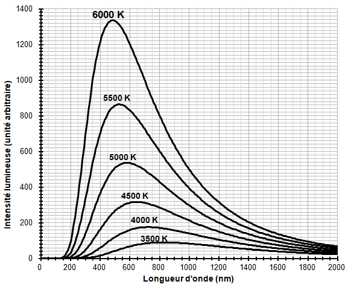
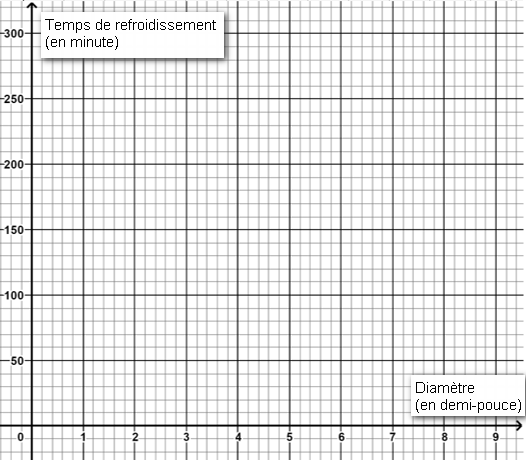
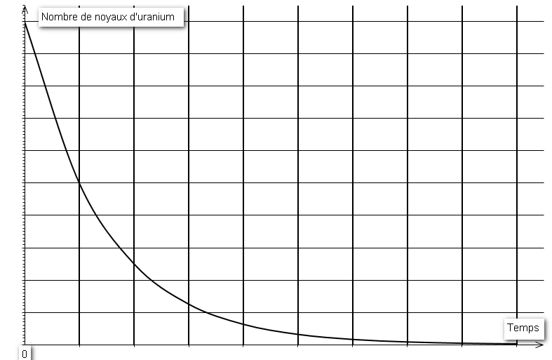

# e3c-enseignement-scientifique-premiere-02405-sujet-officiel

> Source : `../../../../pdf_version/02_es_ponctuelle/e3c/2020/e3c-enseignement-scientifique-premiere-02405-sujet-officiel.pdf` — conversion Markdown (texte + visuels utiles).
> Stratégie : [STRATEGIE_MARKDOWN.md](../../../../STRATEGIE_MARKDOWN.md)

---

## Page 1

ÉPREUVES COMMUNES DE CONTRÔLE CONTINU

      CLASSE : Première

      E3C : ☐ E3C1 ☒ E3C2 ☐ E3C3

      VOIE : ☒ Générale ☐ Technologique ☐ Toutes voies (LV)

      ENSEIGNEMENT : Enseignement scientifique
      DURÉE DE L’ÉPREUVE : 2h
      Niveaux visés (LV) : LVA               LVB
      Axes de programme :

      CALCULATRICE AUTORISÉE : ☒Oui ☐ Non

      DICTIONNAIRE AUTORISÉ :           ☐Oui ☒ Non

      ☒ Ce sujet contient des parties à rendre par le candidat avec sa copie. De ce fait, il ne peut être
      dupliqué et doit être imprimé pour chaque candidat afin d’assurer ensuite sa bonne numérisation.

      ☐ Ce sujet intègre des éléments en couleur. S’il est choisi par l’équipe pédagogique, il est
      nécessaire que chaque élève dispose d’une impression en couleur.

      ☐ Ce sujet contient des pièces jointes de type audio ou vidéo qu’il faudra télécharger et jouer le jour
      de l’épreuve.
      Nombre total de pages : 8

Page 1 / 8
                                                                            G1CENSC02405

---

## Page 2

EXERCICE 1

                     TEMPERATURE MOYENNE DE SURFACE DE LA TERRE

      La Terre reçoit l’essentiel de son énergie du soleil. Cette énergie conditionne sa
      température de surface.

      1- Préciser le phénomène physique à l’origine de l’énergie dégagée par le soleil.

      2- Calculer la masse solaire transformée chaque seconde en énergie, sachant que la
      puissance rayonnée par le soleil a pour valeur 3,9×1026 W.
      Donnée : vitesse de la lumière dans le vide c = 3,0×108 m·s–1
      3- L’étude du spectre du rayonnement émis par le Soleil, que l’on peut modéliser
      comme un spectre de corps noir, permet de déterminer la température de la surface
      du Soleil.
      Document 1 : spectres d’émission

      Figure 1a : spectres d’émission du corps noir à différentes températures
      (exprimées en K).

Page 2 / 8
                                                               G1CENSC02405

---

## Page 3

Figure 1b : modèle du spectre d’émission du soleil.

      À l’aide du document 1 répondre aux consignes suivantes :

      3-a- Déterminer les longueurs d’ondes correspondant au maximum d’émission pour
      les températures de 4000, 5000 et 6000 K. Décrire qualitativement l’évolution de la
      longueur d’onde au maximum d'émission en fonction de la température du corps.

      3-b- Justifier à partir de la valeur de la longueur d’onde d’émission maximale du
      spectre solaire que la température du Soleil est comprise entre 5500 K et 6000 K.

      3-c- La température de surface du Soleil peut être déterminée plus précisément à
      partir de la loi de Wien. Cette loi permet de déterminer la température d’un corps noir
      à partir de la longueur d’onde λmax de son maximum d’émission par la relation :
                                          λmax = k/T
       avec :
         T : température du corps noir, en kelvin (K)
         k : constante égale à 2,898×10-3 m·K
      En considérant que le Soleil se comporte comme un corps noir, déterminer sa
      température de surface T à partir de la loi de Wien.

      4-a- Sachant que l’albedo terrestre est en moyenne égal à 0,30 et que la puissance
      surfacique transportée par la lumière solaire vers la Terre est en moyenne de 342
      W·m-2, calculer la puissance surfacique solaire moyenne absorbée par le sol
      terrestre.

Page 3 / 8
                                                                G1CENSC02405

---

## Page 4

4-b- Préciser, en justifiant la réponse, si une augmentation de l’albedo terrestre
      conduirait à une augmentation ou une diminution de la température moyenne à la
      surface de la Terre.

                                               EXERCICE 2

                            DÉTERMINATION DE L’ÂGE DE LA TERRE

      Première Partie

      Buffon est un scientifique du XVIIIe Siècle, voici un extrait de son premier mémoire.

      Document 1. Recherches sur le refroidissement de la Terre et des planètes
      En supposant, comme tous les phénomènes paraissent l’indiquer, que la Terre
      ait été autrefois dans un état de liquéfaction causée par le feu, il est démontré,
      par nos expériences, que si le globe était entièrement composé de fer ou de
      matière ferrugineusea, il ne se serait consolidé jusqu’au centre qu’en 4 026 ans,
      refroidi au point de pouvoir le toucher sans se brûler en 46 991 ans ; et qu’il ne
      se serait refroidi au point de la température actuelle qu’en 100 696 ans ; mais
      comme la Terre, dans tout ce qui nous est connu, nous paraît être composée
      de matières vitresciblesb et calcaires qui se refroidissent en moins de temps que
      les matières ferrugineuses, […] on trouvera que le globe terrestre s’est
      consolidé jusqu’au centre en 2 905 ans environ, qu’il s’est refroidi au point de
      pouvoir le toucher en 33 911 ans environ, et à la température actuelle en 74
      047 ans environ.
                Buffon, G.-L. L. (s. d.). Supplément à la théorie de la Terre.

      Notes :
      a. Matière composée en grande partie de fer.
      b. Qui peut être changé en verre.

Page 4 / 8
                                                                       G1CENSC02405

---

## Page 5

1- Dans le document 1, Buffon présente sa démarche pour trouver l’âge de la Terre.
      Il modélise la Terre par une boule de matière en fusion qui se refroidit.
         1-a- Indiquer les trois étapes du refroidissement de la Terre décrites par Buffon.
         1-b- Donner l’argument sur lequel s’appuie Buffon pour réévaluer sa première
              estimation de l’âge de la Terre.
      2- À partir d’expériences, Buffon établit les données contenues dans le tableau ci-
      dessous, donnant le temps de refroidissement « au point de pouvoir la toucher sans
      se brûler » (en minute) d’une boule de fer en fonction de son diamètre (en demi-
      pouces) :

             Document 2. Temps de refroidissement « au point de pouvoir toucher sans se
                                             brûler »

               Diamètre 𝑑 (en demi-pouce)              1     3      5     7     9
               Temps 𝑡 de refroidissement observé
                                                      12    58    102    156   205
               (en minute)

      Dans le repère du document-réponse 1 de l’annexe, placer les points représentant
      les données du tableau, puis tracer la droite passant par les points d’abscisses 3
      et 9.

      3- On suppose que la Terre a un diamètre égal à 12 740 km, c’est-à-dire à environ
      1 milliard de demi-pouces.

      La droite précédemment tracée a pour équation 𝑡 = 24,5 × 𝑑 − 15,5, où 𝑡 est la durée
      de refroidissement (en minute) et 𝑑 le diamètre de la boule (en demi-pouce).
      En supposant que cette droite modélise l’évolution du temps de refroidissement en
      fonction du diamètre, retrouve-t-on les 46 991 années obtenues par Buffon comme
      temps de refroidissement d’une boule de fer de la taille de la Terre ? Présenter les
      calculs permettant de répondre à la question.

Page 5 / 8
                                                                 G1CENSC02405

---

## Page 6

Deuxième Partie

      Des méthodes de datation de l’âge de la Terre plus récentes font intervenir la
      décroissance radioactive. Lors de la formation de la Terre, de l’uranium naturel s’est
      créé, en particulier l’isotope radioactif 235U. L’examen de roches montre
      qu’aujourd’hui, il reste environ 1 % de l’uranium 235 présent lors de la formation de
      la Terre.

      4- Le graphique du document-réponse 2 de l’annexe représente le nombre de
      noyaux d’uranium 235 restants en fonction du temps.
      On note 𝑁0 le nombre de noyaux à l’instant initial 𝑡 = 0.

         4-a- Sur ce graphique, repérer la demi-vie 𝑇1⁄2 de l’uranium 235. Faire apparaître
              les traits de construction.
         4-b- Sur ce graphique, graduer l’axe des abscisses en multiples de la demi-vie.
         4-c- En utilisant ce graphique, estimer au bout de combien de demi-vies il ne reste
              plus que 1% des noyaux d’uranium 235 ? On notera sur la copie la bonne
              réponse parmi les trois suivantes, sans justifier.

         Réponse A : entre 1 et 3 demi-vies
         Réponse B : entre 3 et 5 demi-vies
         Réponse C : entre 6 et 8 demi-vies

      5- Sachant que la demi-vie 𝑇1⁄2 de l’uranium 235 est de 0,704 milliard d’années,
      proposer une estimation de l’âge de la Terre.

Page 6 / 8
                                                               G1CENSC02405

---

## Page 7

ANNEXE A RENDRE AVEC LA COPIE

                   EXERCICE 2: DETERMINATION DE L’AGE DE LA TERRE
      Question 2
      Document-réponse 1 à compléter

Page 7 / 8
                                                     G1CENSC02405

---

## Page 8

Question 4

      Document-réponse 2 à compléter

    𝑁0

Page 8 / 8
                                       G1CENSC02405

