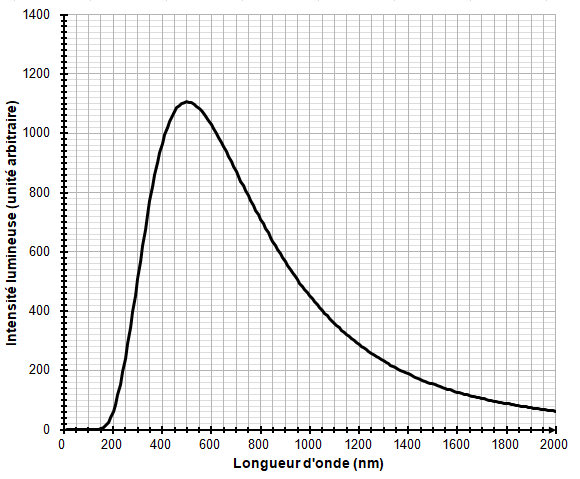
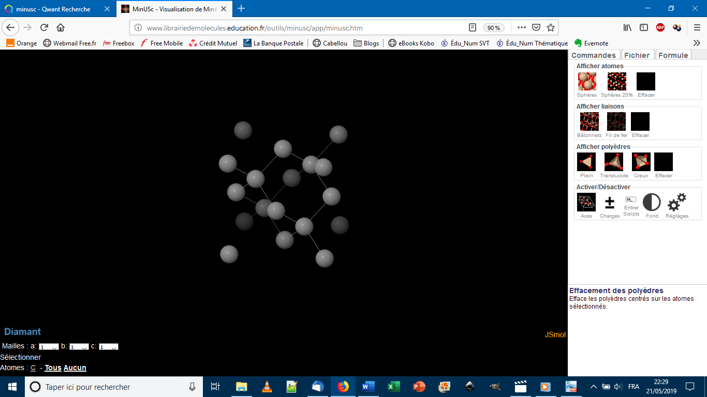

# e3c-enseignement-scientifique-premiere-02406-sujet-officiel

> Source : `../../../../pdf_version/02_es_ponctuelle/e3c/2020/e3c-enseignement-scientifique-premiere-02406-sujet-officiel.pdf` — conversion Markdown (texte + visuels utiles).
> Stratégie : [STRATEGIE_MARKDOWN.md](../../../../STRATEGIE_MARKDOWN.md)

---

## Page 1

ÉPREUVES COMMUNES DE CONTRÔLE CONTINU

       CLASSE : Première

       E3C : ☐ E3C1 ☒ E3C2 ☐ E3C3

        VOIE : ☒ Générale ☐ Technologique ☐ Toutes voies (LV)
       ENSEIGNEMENT : Enseignement scientifique
       DURÉE DE L’ÉPREUVE : 2h
       Niveaux visés (LV) : LVA                LVB
       Axes de programme :

       CALCULATRICE AUTORISÉE : ☒Oui ☐ Non

       DICTIONNAIRE AUTORISÉ :            ☐Oui ☐ Non

        ☐ Ce sujet contient des parties à rendre par le candidat avec sa copie. De ce fait, il ne peut être
        dupliqué et doit être imprimé pour chaque candidat afin d’assurer ensuite sa bonne numérisation.

        ☐ Ce sujet intègre des éléments en couleur. S’il est choisi par l’équipe pédagogique, il est
        nécessaire que chaque élève dispose d’une impression en couleur.

        ☐ Ce sujet contient des pièces jointes de type audio ou vidéo qu’il faudra télécharger et jouer le
        jour de l’épreuve.
        Nombre total de pages : 6

Page 1 / 6
                                                                            G1CENSC02406

---

## Page 2

EXERCICE 1

                     TEMPÉRATURE MOYENNE DE SURFACE DE LA TERRE

      La Terre reçoit l’essentiel de son énergie du soleil. Cette énergie conditionne sa
      température de surface.

      1- Préciser le phénomène physique à l’origine de l’énergie dégagée par le soleil.

      2- Calculer la masse solaire transformée chaque seconde en énergie, sachant que la
         puissance rayonnée par le soleil a pour valeur 3,9×1026 W.
         Donnée : vitesse de la lumière dans le vide c = 3,0×108 m·s–1.

      3- L’étude du spectre du rayonnement émis par le Soleil, que l’on peut modéliser
         comme un spectre de corps noir, permet de déterminer la température de la surface
         du Soleil.

       Document 1 : Spectres d’émission.

                                                            Figure      1a :     Spectres
                                                            d’émission du corps noir à
                                                            différentes      températures
                                                            (exprimées en K).

Page 2 / 6
                                                               G1CENSC02406

---

## Page 3

Figure 1b : Modèle du
                                                               spectre d’émission du soleil.

      À l’aide du document 1 répondre aux consignes suivantes :

      3-a- Déterminer les longueurs d’ondes correspondant au maximum d’émission pour
      les températures de 4000, 5000 et 6000 K. Décrire qualitativement l’évolution de la
      longueur d’onde au maximum d'émission en fonction de la température du corps.

      3-b- Justifier à partir de la valeur de la longueur d’onde d’émission maximale du
      spectre solaire que la température du Soleil est comprise entre 5500 K et 6000 K.

      3-c- La température de surface du Soleil peut être déterminée plus précisément à partir
      de la loi de Wien. Cette loi permet de déterminer la température d’un corps noir à partir
      de la longueur d’onde λmax de son maximum d’émission par la relation :
          λmax = k/T avec
         T : température du corps noir, en kelvin (K)
         k : constante égale à 2,898×10-3 m·K
      En considérant que le Soleil se comporte comme un corps noir, déterminer sa
      température de surface T à partir de la loi de Wien.

      4-a- Sachant que l’albedo terrestre est en moyenne égal à 0,30 et que la puissance
      surfacique transportée par la lumière solaire vers la Terre est en moyenne de 342
      W·m-2, calculer la puissance surfacique solaire moyenne absorbée par le sol terrestre.

      4-b- Préciser, en justifiant la réponse, si une augmentation de l’albedo terrestre
      conduirait à une augmentation ou une diminution de la température moyenne à la
      surface de la Terre.

Page 3 / 6
                                                                 G1CENSC02406

---

## Page 4

EXERCICE 2

                      Les diamants, des mines de crayon de haute pression

      Le graphite et le diamant sont deux minéraux qui possèdent la même composition
      chimique : ils sont tous deux composés exclusivement de carbone. Cependant, leurs
      propriétés physiques sont très différentes : alors que le graphite est opaque, friable,
      avec une conductivité électrique élevée, le diamant, lui, est transparent, très dur et est
      un isolant électrique.

      Partie 1. Structure cristalline du diamant

      Ne sachant pas à quel type de réseau cristallin appartient le diamant, on fait
      l’hypothèse qu’il s’agit d’une structure cubique à faces centrées et que les atomes de
      carbone sont des sphères tangentes.

      1- Représenter en perspective cavalière le cube modélisant une maille élémentaire
      cubique à faces centrées.

      2- Représenter une face de ce cube et justifier que le rayon r des sphères modélisant
                                                                                 #√%
      les atomes de carbone et l’arête a du cube sont liés par la relation 𝑟 =    &
                                                                                       .

      3- Calculer la compacité d’une structure cristalline cubique à faces centrées (volume
      effectivement occupé par les atomes d’une maille divisé par le volume de la maille).
      La clarté et l’explicitation du calcul sera prise en compte.

      4- À partir d’une mesure de la masse volumique du diamant, on déduit que sa
      compacité est en fait égale à 0,34. Que peut-on conclure quant à l’hypothèse d’une
      structure cubique à faces centrées ?

Page 4 / 6
                                                                  G1CENSC02406

---

## Page 5

Partie 2. Les conditions de formation du diamant

      Document 1 : L'origine des diamants
      Les diamants sont des cristaux de carbone pur, qui ne sont stables qu'à très forte
      pression. La majorité des diamants ont cristallisé très profondément, dans le manteau
      terrestre, au sein de veines où circulent des fluides carbonés. Les diamants remontent
      en surface, dans la quasi-totalité des cas, en étant inclus dans une lave volcanique
      atypique et très rare : la kimberlite. […] Le dynamisme éruptif à l’origine des kimberlites
      est extrêmement explosif. La vitesse d'ascension des kimberlites est de plusieurs
      dizaines de km/h en profondeur, et les laves arrivent en surface à une vitesse
      supérieure à la vitesse du son. C'est cette importante vitesse de remontée qui entraîne
      une décompression et un refroidissement extrêmement rapides des diamants, trop
      rapides pour qu'ils aient le temps de se transformer en graphite. Les diamants n'ont
      pas cristallisé dans la lave kimberlitique, mais ne sont que des enclaves arrachées au
      manteau par la kimberlite sur son trajet ascensionnel.
                                                             Adapté de planet-terre.ens-lyon.fr

Page 5 / 6
                                                                  G1CENSC02406

---

## Page 6

Document 2 : Comparaison des propriétés physiques du graphite et du diamant

              Propriétés physiques            Graphite                     Diamant
                     Dureté          Friable (débit en feuillets)          Très dur

         Arrangement des atomes
              de carbone C

                    Opacité           Opaque (sert pour les           Transparent (sert en
                                       mines de crayon de                  joaillerie)
                                             papier)
        Masse volumique (kg.m-3)            2,1x103                         3,5x103

       Les réponses aux questions suivantes s’appuieront sur vos connaissances et sur les
       informations contenues dans les différents documents.

       5- Proposer une hypothèse pour expliquer la différence de masse volumique entre le
       graphite et le diamant.

       6- Le diamant est exploité dans des mines qui peuvent être en surface ou à une
       profondeur maximale d’un kilomètre. Comment expliquer que l’on retrouve des
       diamants en surface alors que le minéral carboné stable en surface est le graphite ?

 Page 6 / 6
                                                                    G1CENSC02406

