# e3c-enseignement-scientifique-premiere-02409-sujet-officiel

> Source : `../../../../pdf_version/02_es_ponctuelle/e3c/2020/e3c-enseignement-scientifique-premiere-02409-sujet-officiel.pdf` — conversion Markdown (texte + visuels).
> Stratégie : [STRATEGIE_MARKDOWN.md](../../../../STRATEGIE_MARKDOWN.md)

---

## Page 1

ÉPREUVES COMMUNES DE CONTRÔLE CONTINU

      CLASSE : Première

      E3C : ☐ E3C1 ☒ E3C2 ☐ E3C3

      VOIE : ☒ Générale ☐ Technologique ☐ Toutes voies (LV)
      ENSEIGNEMENT : Enseignement scientifique
      DURÉE DE L’ÉPREUVE : 2h
      Niveaux visés (LV) : LVA               LVB
      Axes de programme :

      CALCULATRICE AUTORISÉE : ☒Oui ☐ Non

      DICTIONNAIRE AUTORISÉ :           ☐Oui ☒ Non

      ☒ Ce sujet contient des parties à rendre par le candidat avec sa copie. De ce fait, il ne peut être
      dupliqué et doit être imprimé pour chaque candidat afin d’assurer ensuite sa bonne numérisation.

      ☐ Ce sujet intègre des éléments en couleur. S’il est choisi par l’équipe pédagogique, il est
      nécessaire que chaque élève dispose d’une impression en couleur.

      ☐ Ce sujet contient des pièces jointes de type audio ou vidéo qu’il faudra télécharger et jouer le jour
      de l’épreuve.
      Nombre total de pages : 9

Page 1 / 9
                                                                            G1CENSC02409

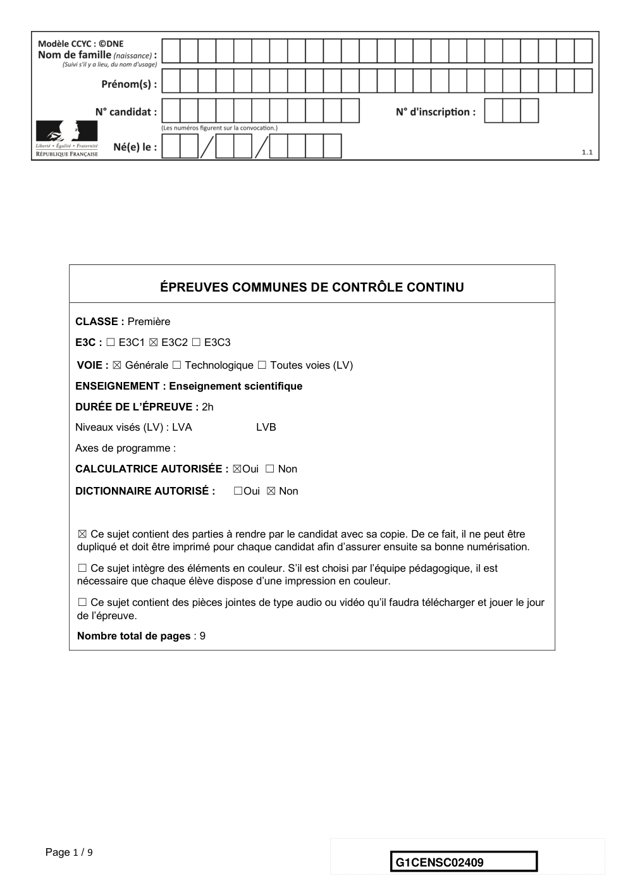

---

## Page 2

EXERCICE 1
                                 Terre Plate ou Terre sphérique

      Anaxagore (v. -500 ; -428) et Ératosthène (v. -276; v. -194) sont deux
      mathématiciens qui se sont intéressés à la forme de la Terre : Anaxagore pensait
      qu’elle était plate alors qu’Ératosthène pensait qu’elle était sphérique.

      Document 1 : Anaxagore

      Anaxagore est un philosophe grec qui s’est
      intéressé aux mathématiques et à l’astronomie. Il a
      l’intuition, par exemple, que la Lune brille en
      réfléchissant les rayons du Soleil et fournit une
      explication valable des éclipses lunaires et solaires.
      Il pense, d’autre part, que la Terre est un disque plat
      et, sous cette hypothèse, il cherche à calculer la
      distance de la Terre au Soleil.
      Il a appris par des voyageurs venant de la ville de
      Syène (S) que, lors du solstice d’été, le Soleil (H)
      est au zénith à midi et donc que les objets n’ont pas
      d’ombre à ce moment précis. Au même moment,
      quelques 800 km plus au nord, à l’emplacement de
      ce qui deviendra la ville d’Alexandrie (A), le soleil              Figure 1
      éclaire un puits de 2 m de diamètre jusqu’à une
      profondeur de 16 m.
      La figure 1 représente la situation à midi lors du
      solstice d’été.

      1- Compléter le schéma de l’annexe avec les informations chiffrées du document 1.
      Quelle longueur de ce schéma Anaxagore cherche-t-il à calculer ?
      2- Calculer la distance Terre-Soleil dans le modèle d’Anaxagore.

Page 2 / 9
                                                                G1CENSC02409

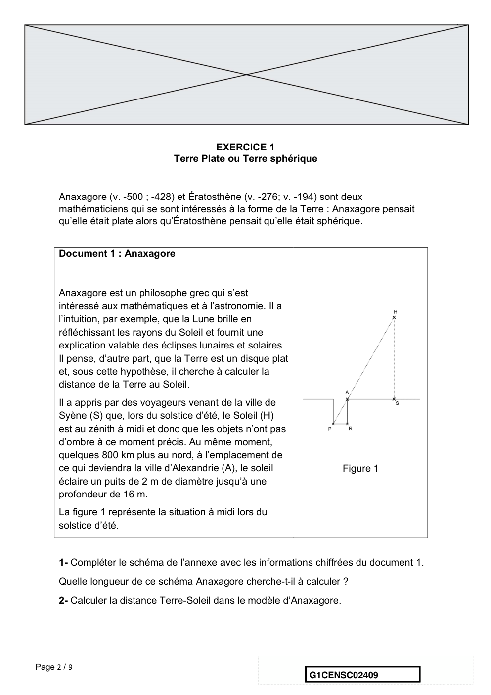

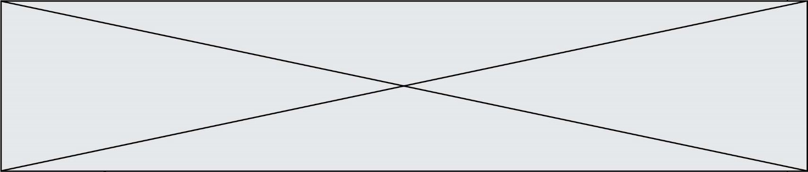

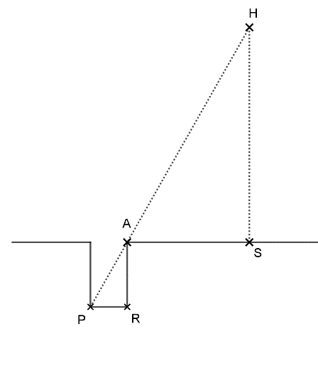

---

## Page 3

3- On estime aujourd’hui que la distance moyenne Terre-Soleil est de 150 millions de
      kilomètres soit 25000 fois plus. Expliquer pourquoi la valeur trouvée par Anaxagore
      est très éloignée de la valeur réelle.
      Document 2 : Eratosthène

      Eratosthène, autre philosophe grec intéressé lui
      aussi par les mathématiques et la forme de la
      Terre, considère que la Terre est sphérique et il
      cherche à calculer son rayon.

      Il connaît lui aussi la distance de 800 km entre
      Syène (S) et Alexandrie (A) et sait qu’à midi, lors
      du solstice d’été, le soleil est au zénith à Syène.
      Il fait une hypothèse importante pour son
      modèle : il pense que le soleil est très éloigné de
      la Terre et que, par conséquent, ses rayons sont
      parallèles en arrivant sur la Terre.
      Il utilise un instrument de mesure qui lui permet
      de trouver un angle d’un cinquantième de tour,
      soit 7,2°, entre les rayons du soleil et la
      verticale à Alexandrie.                                        Figure 2

      La figure 2 représente la situation à midi lors du
      solstice d’été. Le segment [EA] représente la
      verticale à Alexandrie et C le centre de la Terre.

      4- Compléter le schéma de l’annexe avec les informations chiffrées du texte du
      document 2.
      Quelle longueur de ce schéma Ératosthène cherche-t-il à calculer ?
                                          $ . Justifier la réponse en s’appuyant sur des
      5- Déterminer la mesure de l’angle ACS
      propriétés géométriques.

Page 3 / 9
                                                               G1CENSC02409

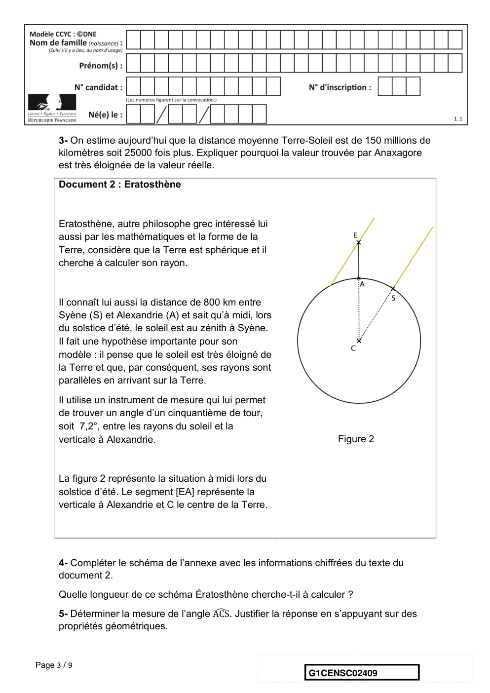

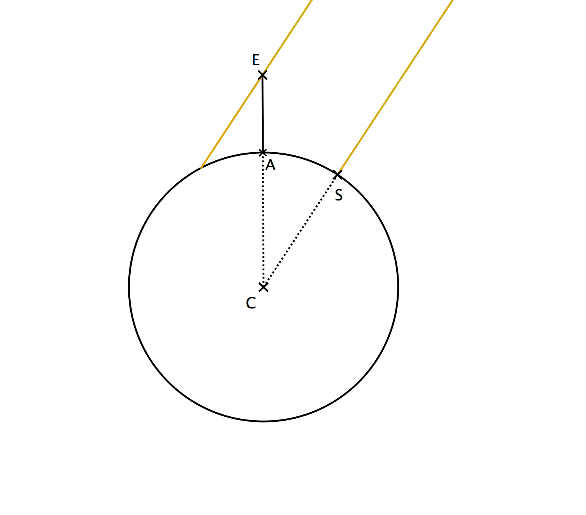

---

## Page 4

Calculer la circonférence de la Terre puis en déduire le rayon de la Terre au
      kilomètre près.
      6- On estime aujourd’hui que le rayon de la Terre est de 6371 km. Calculer l’erreur
      en pourcentage commise par Ératosthène. Commenter.

                                              EXERCICE 2

                                       L’OREILLE ET L’AUDITION

      L’audition joue un rôle primordial dans les interactions sociales. L’oreille est l’organe
      sensoriel de l’audition, dont on étudiera tout d’abord le fonctionnement avant
      d’envisager la prévention d’un traumatisme acoustique.
      Partie 1. L’oreille et son fonctionnement
      1- Compléter la phrase suivante par l’une des propositions parmi les quatre
      proposées ci-dessous, .

      Les vibrations sonores perçues par les cils des cellules ciliées sont :

             a- acheminées au cerveau sous la forme d’ondes sonores.
             b- transformées en messages nerveux, qui sont acheminés au cerveau.
             c- acheminées au cerveau sous une forme moléculaire.
             d- directement analysées au niveau de l’oreille interne, ce qui permet l’audition.

      2- À l’aide de vos connaissances et du document 1 (page suivante), expliquer par un
      texte et/ou un schéma, comment les différentes parties de l’oreille permettent une
      réception et une transmission des vibrations sonores puis du message sensoriel
      auditif.

Page 4 / 9
                                                                    G1CENSC02409

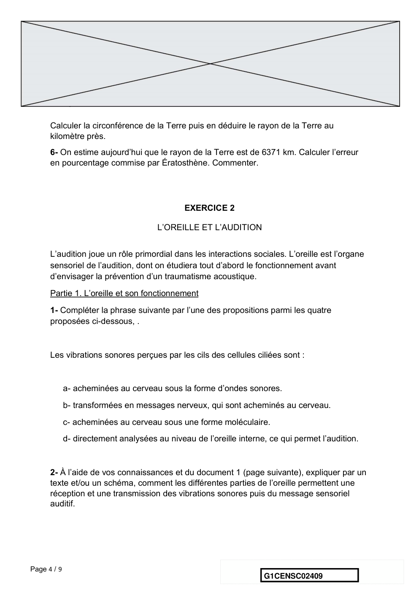

---

## Page 5

Document 1. L’oreille humaine
      Figure 1. Schéma de                Figure 2. Schéma d’une coupe transversale de la
      l’anatomie de l’oreille            cochlée humaine (à gauche) et zoom sur les cellules
      humaine.                           ciliées (à droite).

                                                                                   Membrane
                                                                                   tectoriale

                                                                                    Cils
                                                                                    Cellule
                                                                                    ciliée

      Source :                           Source :
      https://fr.wikibooks.org/wiki/N    https://fr.wikipedia.org/wiki/Organe_de_Corti
      eurosciences/L%27audition

      Partie 2. La prévention d’un traumatisme acoustique
      Pour prévenir le risque lié aux sur-stimulations sonores, il existe des protections
      auditives de nature différente selon leur type d’utilisation.
      On peut distinguer, par exemple, deux catégories de bouchons d'oreilles qui
      permettent de s’isoler du bruit :
             - les bouchons en mousse, généralement jetables ;
             - les bouchons moulés en silicone, fabriqués sur mesure et nécessitant la prise
               d'empreinte du conduit auditif. Ils sont lavables à l'eau et se conservent
               plusieurs années.

Page 5 / 9
                                                                  G1CENSC02409

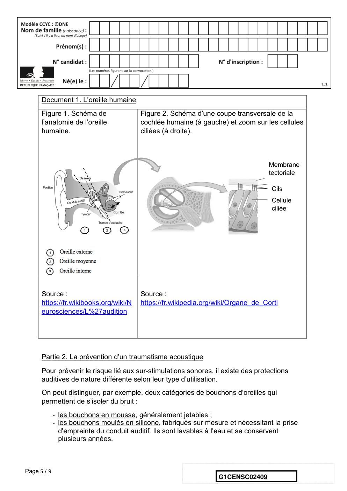

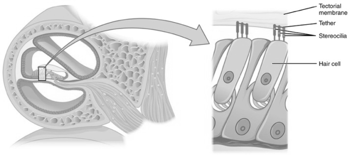

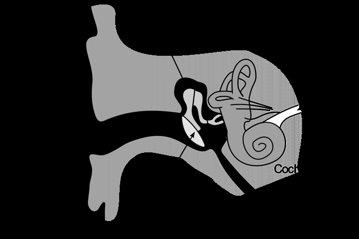

---

## Page 6

L’atténuation des sons par un bouchon est égale à la diminution du niveau d’intensité
      sonore perçu par l’oreille en présence du bouchon. Un fabricant fournit les courbes
      d'atténuation en fonction de la fréquence du son pour les deux types de bouchons
      (document 2).

      Document 2. Courbes d’atténuation du son correspondant aux deux types de
      bouchons.

                                                               Bouchons en mousse
             Atténuation (dB)

                                                               Bouchons moulés

                                                                          Source : Auteur

      3- Un musicien qui pratique régulièrement un instrument tel que la batterie ou la
      guitare électrique a besoin d’une atténuation du niveau sonore. Cependant, cette
      atténuation ne doit pas dépasser 25 dB afin qu’il entende suffisamment.

      3-a- À l’aide du document 2, indiquer pour chaque bouchon si cette condition est
      respectée. Justifier.

      3-b- En utilisant le document 2, indiquer si un bouchon en mousse atténue
      davantage les sons aigus ou les sons graves. Justifier.
      Afin de comparer la qualité acoustique des deux types de bouchons, on a enregistré
      le son émis par une guitare, ainsi que les sons obtenus après passage à travers les
      deux types de bouchons. Le document 3 présente les résultats obtenus.

Page 6 / 9
                                                               G1CENSC02409

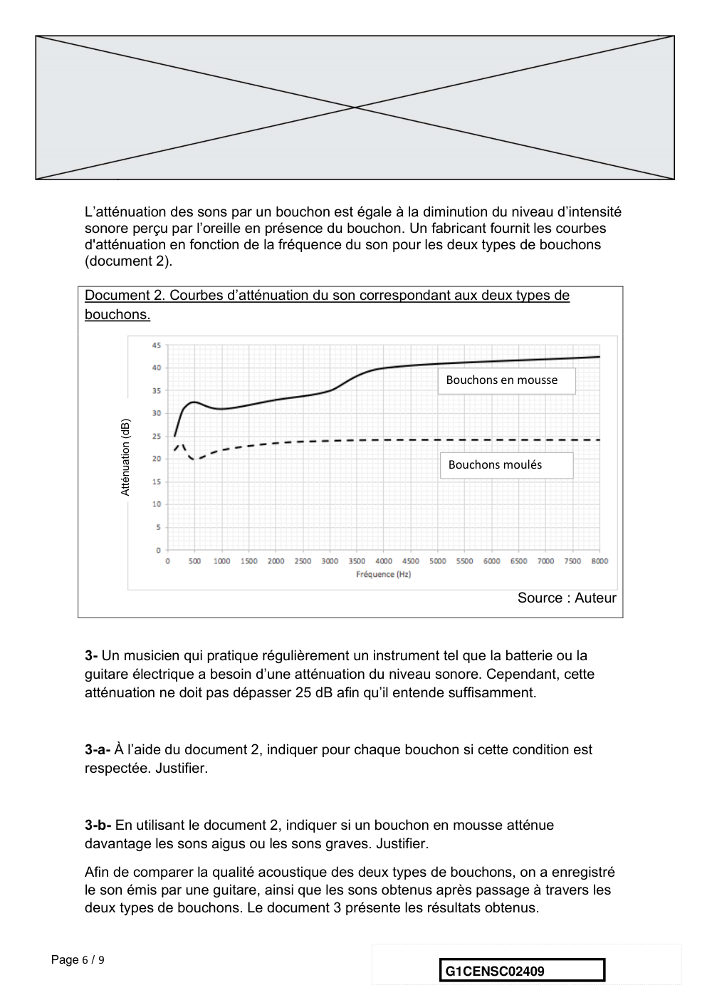

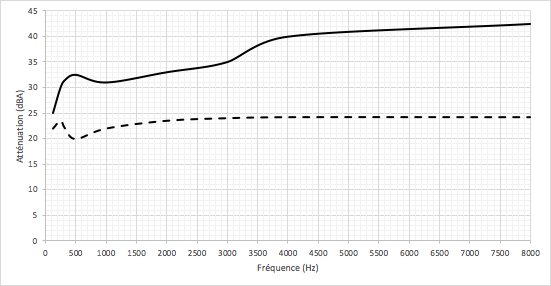

---

## Page 7

Document 3. Spectres du son émis par une guitare et des sons restitués après
      passage à travers les deux types de bouchons (Source : Auteur)
      L’amplitude relative est le rapport entre une amplitude et une amplitude de référence, ici
      celle de la fréquence fondamentale.

                     Figure 1. Spectre correspondant au mi4 joué par la guitare

             Figure 2. Spectre du mi4 restitué après passage par un bouchon en mousse
                                                         Suite du document 3 en page suivante

Page 7 / 9
                                                                     G1CENSC02409

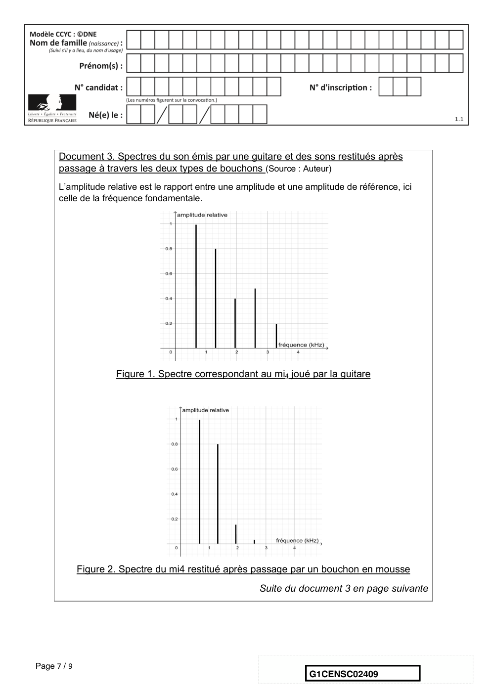

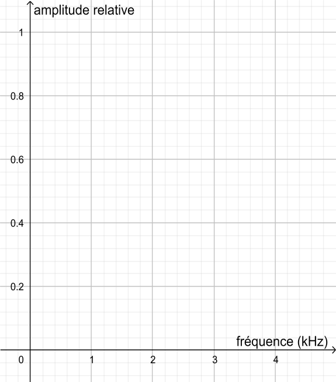

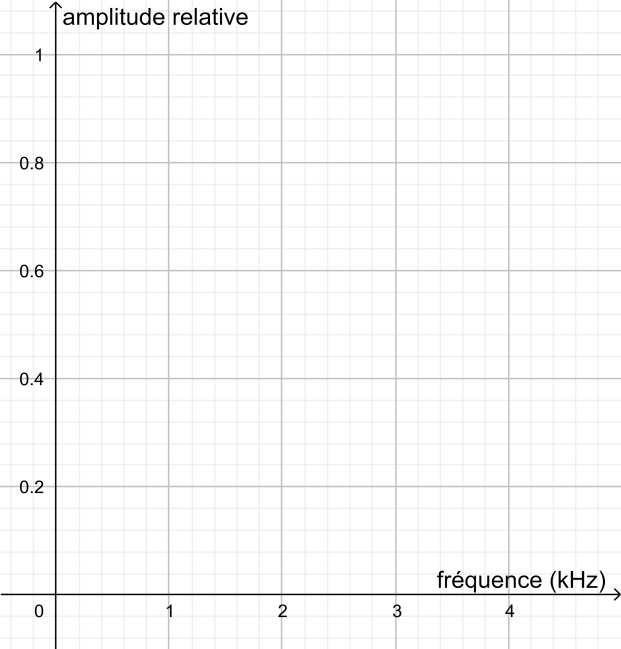

---

## Page 8

Figure 3. Spectre du mi4 restitué après passage par un bouchon moulé en silicone

      4-a- À partir de la figure 1 du document 3, indiquer, en justifiant, si le son émis par la
      guitare est un son pur ou un son composé.
      4-b- À partir de la figure 1 du document 3, déterminer la fréquence du mi4 joué par la
      guitare. Décrire la démarche employée.

      Une exposition prolongée à un niveau d’intensité sonore de 85 dB est nocive pour
      l'oreille humaine.
      5- Durant un concert de rock, un guitariste est soumis en moyenne à un niveau
      d’intensité sonore de 100 dB. Il désire préserver son audition tout en préservant une
      bonne qualité sonore.
      À partir de l’étude des documents 2 et 3, indiquer quel type de bouchon choisir et
      argumenter ce choix.

Page 8 / 9
                                                                   G1CENSC02409

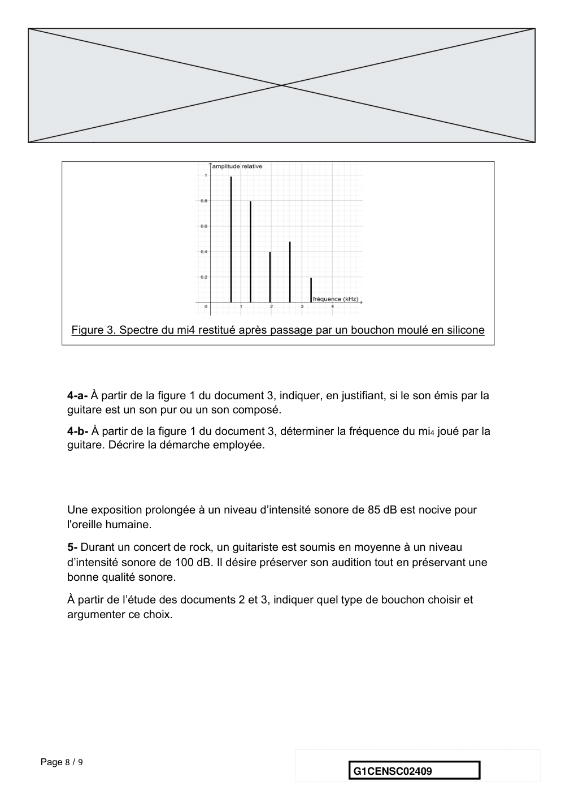

---

## Page 9

ANNEXE A RENDRE AVEC LA COPIE
                     EXERCICE 1 : TERRE PLATE OU TERRE SPHERIQUE
      Question 1
      H représente le Soleil, S la ville de Syène, A la ville
      d’Alexandrie et le segment [𝑃𝑅] le fond du puit. Le
      schéma n’est pas à l’échelle.

      Question 4

      C représente le centre de la
      Terre, S la ville de Syène, A
      la ville d’Alexandrie et le
      segment [𝐸𝐴] la verticale à
      Alexandrie. Le schéma n’est
      pas à l’échelle.

Page 9 / 9
                                                                G1CENSC02409

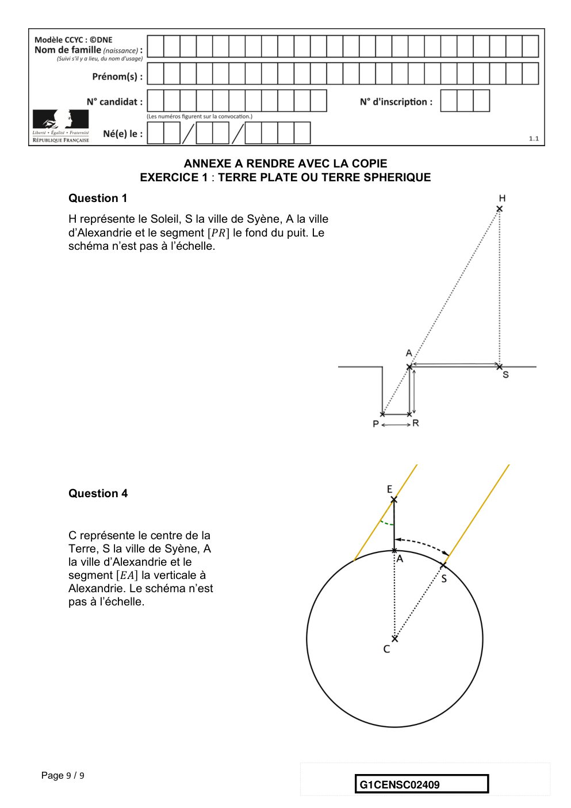

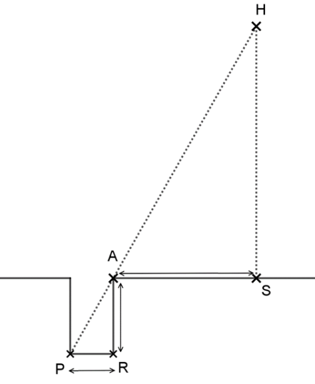

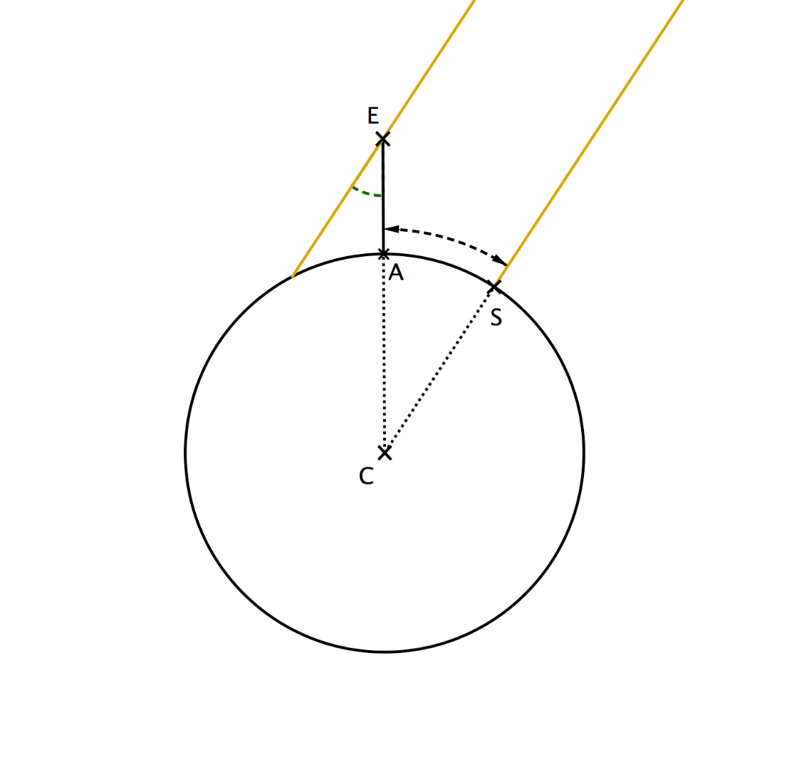

