# e3c-enseignement-scientifique-premiere-02413-sujet-officiel

> Source : `../../../../pdf_version/02_es_ponctuelle/e3c/2020/e3c-enseignement-scientifique-premiere-02413-sujet-officiel.pdf` — conversion Markdown (texte + visuels).
> Stratégie : [STRATEGIE_MARKDOWN.md](../../../../STRATEGIE_MARKDOWN.md)

---

## Page 1

ÉPREUVES COMMUNES DE CONTRÔLE CONTINU

      CLASSE : Première

      E3C : ☐ E3C1 ☒ E3C2 ☐ E3C3

      VOIE : ☒ Générale ☐ Technologique ☐ Toutes voies (LV)

      ENSEIGNEMENT : Enseignement scientifique
      DURÉE DE L’ÉPREUVE : 2h
      Niveaux visés (LV) : LVA               LVB
      Axes de programme :

      CALCULATRICE AUTORISÉE : ☒Oui ☐ Non

      DICTIONNAIRE AUTORISÉ :           ☐Oui ☒ Non

      ☒ Ce sujet contient des parties à rendre par le candidat avec sa copie. De ce fait, il ne peut être
      dupliqué et doit être imprimé pour chaque candidat afin d’assurer ensuite sa bonne numérisation.

      ☐ Ce sujet intègre des éléments en couleur. S’il est choisi par l’équipe pédagogique, il est
      nécessaire que chaque élève dispose d’une impression en couleur.

      ☐ Ce sujet contient des pièces jointes de type audio ou vidéo qu’il faudra télécharger et jouer le jour
      de l’épreuve.
      Nombre total de pages : 9

Page 1 / 9
                                                                            G1CENSC02413

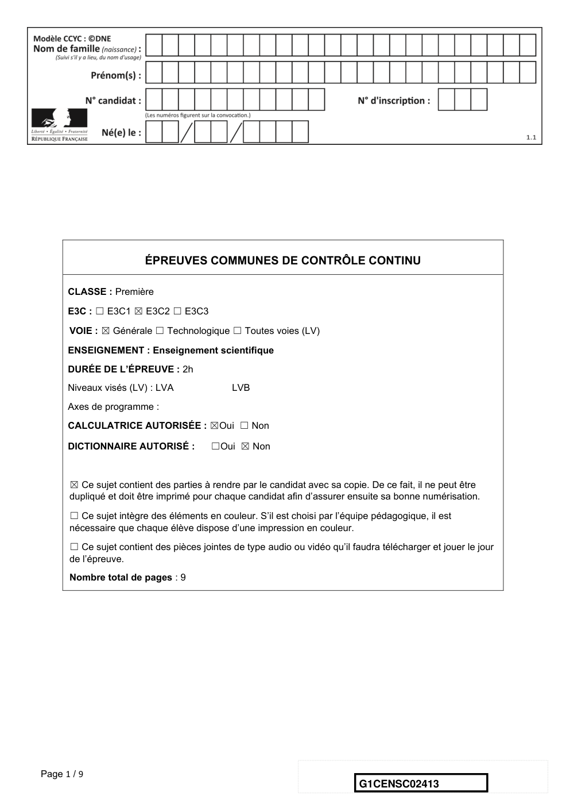

---

## Page 2

EXERCICE 1

             LA DATATION DE L’OCCUPATION D’UNE GROTTE PAR HOMO SAPIENS
      Les analyses stylistiques des peintures et des objets ornant une grotte d’Europe de
      l’ouest ont permis aux paléoanthropologues de dater son occupation par Homo
      sapiens à la fin du Paléolithique supérieur.
      Un désaccord persiste cependant entre les scientifiques lorsqu’il s’agit de préciser si
      les peintures et objets ont été réalisés au Gravettien, au Solutréen ou au
      Magdalénien, les trois dernières périodes géologiques du Paléolithique supérieur
      comme l’indique le document ci-dessous.

      Les périodes géologiques de la fin du Paléolithique supérieur

                      Fin du paléolithique supérieur

                Gravettien                         Magdalénien

                                    Solutréen

       -27000 ans              -20000 ans -18000 ans           -12000 ans           0 an       +2000 ans

       27000                   27000         27000               27000
                             D’après https://multimedia.inrap.fr/archeologie-preventive/chronologie-generale

      Remarque : la proportionnalité sur l’échelle des temps n’est pas respectée.

      1. Préciser ce qui distingue un noyau stable d’un noyau radioactif. Définir la demi-vie
      d’un isotope radioactif. Préciser si, pour un échantillon macroscopique contenant cet
      isotope, la demi-vie dépend de la quantité d’isotopes présente initialement.
      2. L’élément carbone présent dans le bois d’un végétal provient de l’air et a été
      assimilé dans le végétal grâce à la photosynthèse au niveau des feuilles. En
      analysant le document ci-dessous, justifier l’utilisation de la méthode de datation au
      carbone 14 pour dater les peintures ornant la paroi de cette grotte.
      3. Compléter la courbe en annexe représentant la décroissance radioactive du
      nombre d’atomes de 14C au cours du temps (annexe à rendre avec la copie – les
      coordonnées des points calculés doivent être précisées).

Page 2 / 9
                                                                            G1CENSC02413

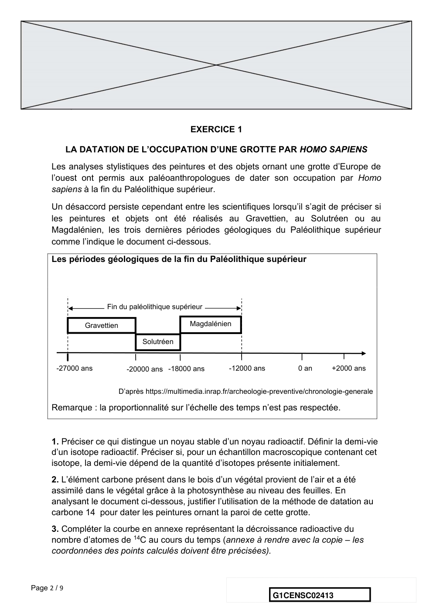

---

## Page 3

4. En s’appuyant sur les documents ci-dessous, expliquer, sous la forme d'une
      courte rédaction argumentée, comment la datation au 14C permet de faire évoluer le
      désaccord entre les scientifiques sur la période de réalisation des peintures.

      Document.
      Principe de la datation au carbone 14
      Le carbone 14 (14C) est un noyau radioactif en proportion constante dans
      l’atmosphère.
      Les êtres vivants, formant la biosphère, échangent entre eux ainsi qu’avec
      l’atmosphère du dioxyde de carbone (CO2) dont une fraction connue comprend du
      carbone 14. Tout être vivant contient donc dans son organisme du 14C en même
      proportion que l’atmosphère..
      À sa mort, un être vivant cesse d’absorber du dioxyde de carbone, par contre le
      carbone 14 qu’il contient continue à se désintégrer.
      En 5730 ans la moitié des atomes de carbone 14 aura disparu d’un échantillon
      macroscopique de cet être vivant. C’est la demi-vie (t ½) de ce noyau radioactif. Au-
      delà de 8 demi-vie, la quantité de 14C présente dans l’échantillon, inférieure à 1 %,
      est trop faible pour que la méthode puisse être utilisée pour dater un évènement.

                                                             Voir fin du document au verso.

Page 3 / 9
                                                                G1CENSC02413

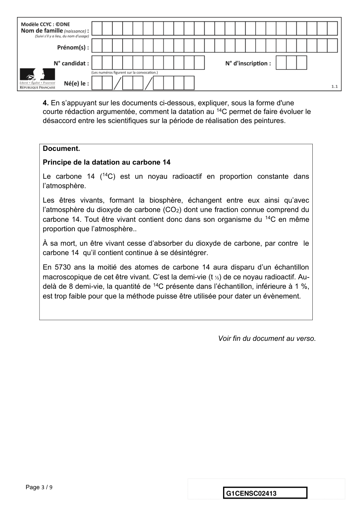

---

## Page 4

Document.
         Décroissance du nombre d’atomes de 14C dans une feuille fossilisée après sa
                                          mort.

                            Grand nombre d’atomes de 14C
                            Grand nombre d’atomes de 14N

                                                              Source : illustration de l’auteur

      Résultats des mesures effectuées sur un fragment de charbon de bois
      prélevé dans la grotte
      Pour réaliser les peintures ornant les parois de la grotte, les êtres humains du
      Paléolithique supérieur ont utilisé du charbon de bois.
      Les mesures, réalisées sur un prélèvement de ce charbon de bois par les
      scientifiques, montrent que la quantité de 14C mesurée en l’an 2000 n’est plus
      égale qu’à 8,0 % de la quantité du 14C initialement présent dans l’échantillon.

Page 4 / 9
                                                             G1CENSC02413

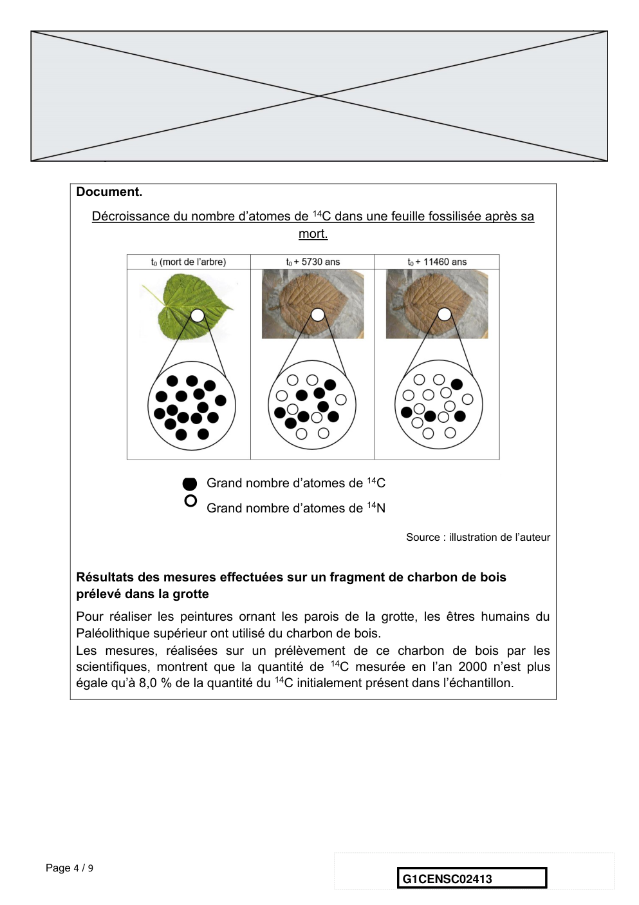

---

## Page 5

EXERCICE 2

                                    MASSE, TENSION, FRÉQUENCE
                Les parties 1 et 2 peuvent être traitées indépendamment l’une de l’autre.
                  La partie 3 est une argumentation s’appuyant sur les parties 1 et 2.

      Partie 1 : masse et fréquence

      On dispose de trois marteaux M1, M2 et M3 de masses respectives m1 = 0,24 kg,
       m2 = 0,48 kg et m3 = 1,44 kg.
      L’expérience consiste à les laisser tomber sur une enclume. Un logiciel d’acquisition
      enregistre le signal sonore émis.
      On désigne respectivement par f1 , f2 et f3 les fréquences fondamentales des sons émis par
      les marteaux M1 , M2 et M3 lors de l’expérience.

      1- Lire sur le document 1 les fréquences fondamentales f1 , f2 , et f3 des sons émis lors de
      l’expérience et noter leurs valeurs sur la copie.

      2- Comparer ces fréquences. La masse du marteau influe-t-elle sur la fréquence
      fondamentale du son émis ?

      Document 1 : Spectre des fréquences des sons émis lors de la chute des marteaux.

      Spectre du son obtenu avec le marteau 1

                                                         Voir suite du document 1 page suivante

Page 5 / 9
                                                                    G1CENSC02413

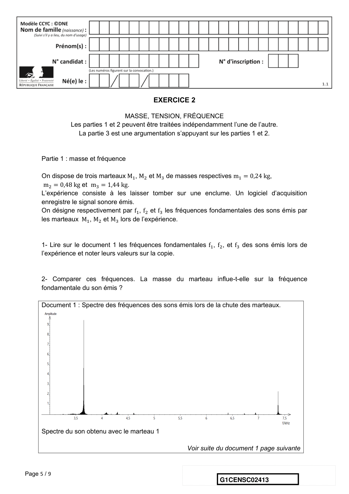

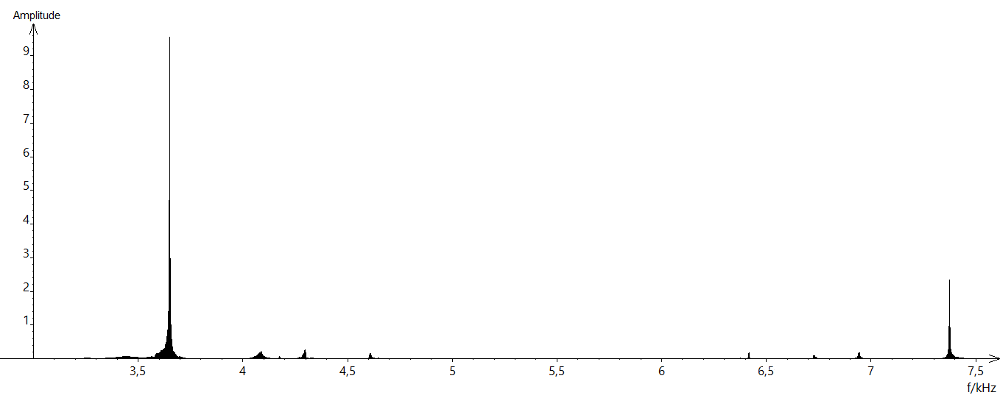

---

## Page 6

Suite du document 1

      Spectre du son obtenu avec le marteau 2

      Spectre du son obtenu avec le marteau 3

Page 6 / 9
                                                G1CENSC02413

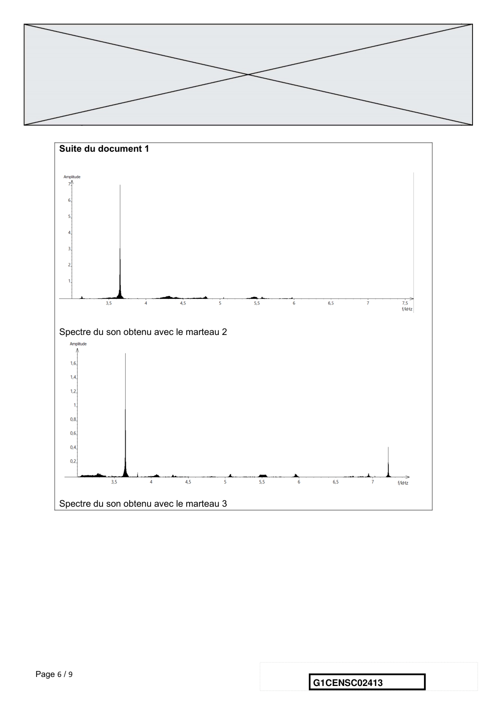

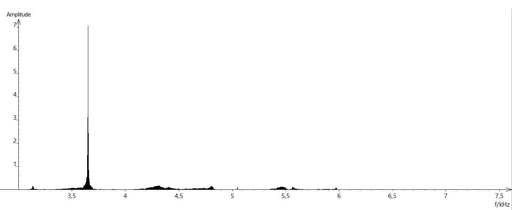

---

## Page 7

Partie 2 : tension et fréquence

      Dans cette partie, on tend une corde de longueur quelconque à l'aide d'une masse variable
      m

      On a relevé dans le tableau ci-dessous les fréquences fondamentales obtenues en pinçant
      la corde :

                     Masse (en kg)            0        8,070      9,990     11,110

                     Fréquence (en Hz)        0        202         224        237

      3- Peut-on affirmer que la fréquence fondamentale du son est proportionnelle à la masse
      utilisée pour tendre la corde ? Justifier par la méthode de votre choix.

      4- On propose de modéliser la manière dont la fréquence fondamentale varie en fonction de
      la masse à l'aide d'une fonction définie sur l'ensemble des réels positifs. On considère les
      trois fonctions suivantes :
                                   9
                       g ∶ m ⟼ m2               h ∶ m ⟼ 71√m           et    j ∶ m ⟼ 25m
                                   4
          Les trois fonctions g, h et j sont représentées graphiquement dans le document 2 ci-
          dessous.
          4-1- Pour chaque fonction g, h et j, retrouver la courbe qui la représente.
          4-2- Quelle fonction modélise le mieux le problème ? Justifier.

Page 7 / 9
                                                                    G1CENSC02413

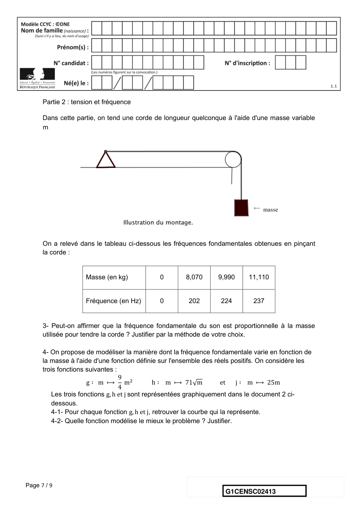

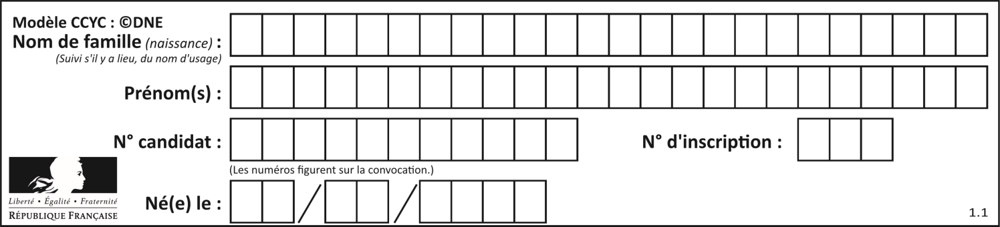

---

## Page 8

Document 2 :

      Partie 3 : analyse de document

      Voici un extrait du Commentaire au songe de Scipion écrit par Macrobe aux alentours de
      400 après JC.

       « [...] la diversité des sons, indépendante des hommes, correspondait aux marteaux. Alors il
      mit tout son soin à en évaluer le poids, et après avoir noté la différence de poids qui
      caractérisait chacun il fit fabriquer des marteaux de poids différents, en plus ou en moins ;
      les sons produits par leurs coups ne ressemblaient en rien à ceux d’avant et ne
      s’accordaient plus aussi bien. Il constata alors que l’harmonie sonore était réglée par les
      poids, et après avoir relevé les nombres qui définissaient la diversité bien accordée de ces
      poids, il passa des marteaux à l’examen des instruments à cordes : il tendit des boyaux de
      mouton ou des nerfs de bœuf en y attachant des poids aussi variés que ceux qu’il avait
      découverts à propos des marteaux, et il en résulta bien le genre d’accord que lui avait fait
      espérer son observation antérieure, à laquelle il ne s’était pas livré pour rien. »
                                                          Commentaire au songe de Scipion, II, 1, 9-13

      5- En quelques lignes, émettre une critique scientifique des affirmations contenues dans le
      Commentaire au songe de Scipion. On pourra s’appuyer sur les résultats obtenus dans les
      parties 1 et 2.

Page 8 / 9
                                                                     G1CENSC02413

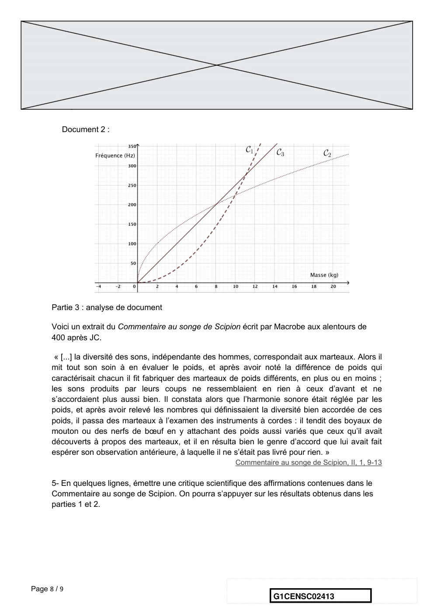

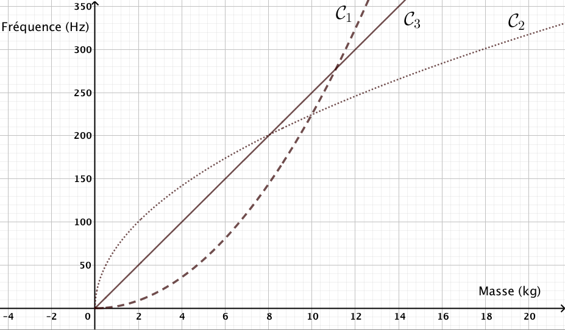

---

## Page 9

ANNEXE A RENDRE AVEC LA COPIE
      EXERCICE 1
      LA DATATION DE L’OCCUPATION D’UNE GROTTE PAR HOMO SAPIENS
      QUESTION 3

Page 9 / 9
                                               G1CENSC02413

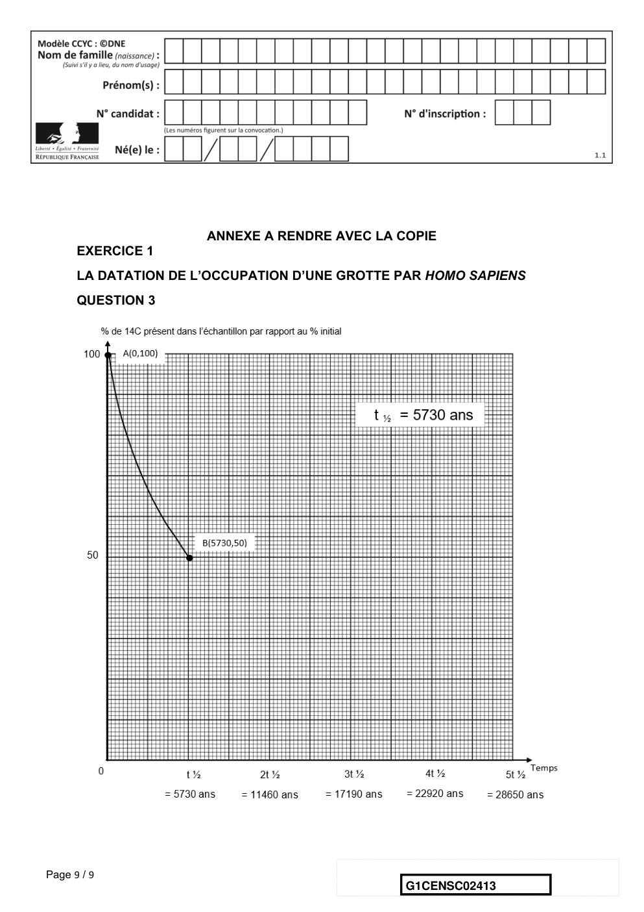

