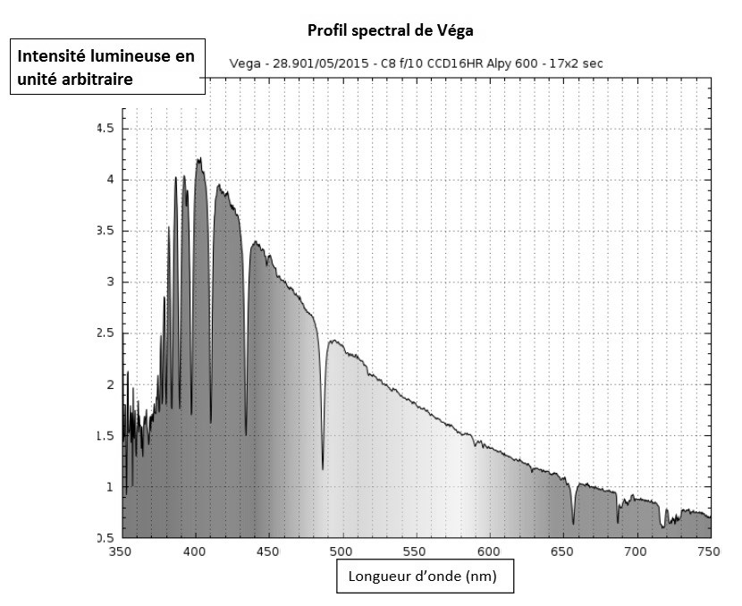
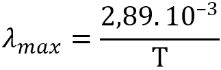
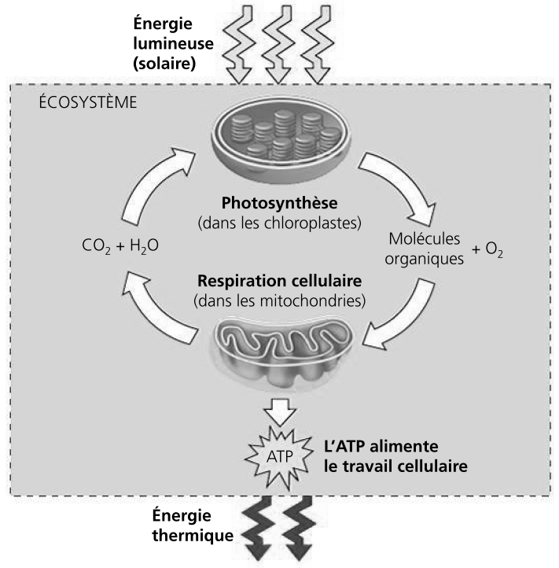
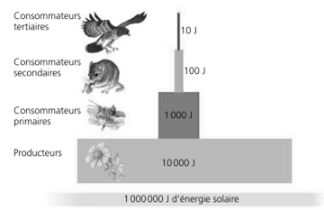

# e3c-enseignement-scientifique-premiere-02415-sujet-officiel

> Source : `../../../../pdf_version/02_es_ponctuelle/e3c/2020/e3c-enseignement-scientifique-premiere-02415-sujet-officiel.pdf` — conversion Markdown (texte + visuels utiles).
> Stratégie : [STRATEGIE_MARKDOWN.md](../../../../STRATEGIE_MARKDOWN.md)

---

## Page 1

ÉPREUVES COMMUNES DE CONTRÔLE CONTINU

      CLASSE : Première

      E3C : ☐ E3C1 ☒ E3C2 ☐ E3C3

      VOIE : ☒ Générale ☐ Technologique ☐ Toutes voies (LV)

      ENSEIGNEMENT : Enseignement scientifique
      DURÉE DE L’ÉPREUVE : 2h
      Niveaux visés (LV) : LVA               LVB
      Axes de programme :

      CALCULATRICE AUTORISÉE : ☒Oui ☐ Non

      DICTIONNAIRE AUTORISÉ :           ☐Oui ☒ Non

      ☒ Ce sujet contient des parties à rendre par le candidat avec sa copie. De ce fait, il ne peut être
      dupliqué et doit être imprimé pour chaque candidat afin d’assurer ensuite sa bonne numérisation.

      ☐ Ce sujet intègre des éléments en couleur. S’il est choisi par l’équipe pédagogique, il est
      nécessaire que chaque élève dispose d’une impression en couleur.

      ☐ Ce sujet contient des pièces jointes de type audio ou vidéo qu’il faudra télécharger et jouer le jour
      de l’épreuve.
      Nombre total de pages : 9

Page 1 / 9
                                                                            G1CENSC02415

---

## Page 2

EXERCICE 1

                        Détermination de l’âge de la Terre avec algorithme
      Première Partie

      Buffon est un scientifique du XVIIIe siècle. Voici un extrait de son Premier Mémoire :

              Document 1 : Recherches sur le refroidissement de la Terre et
              des planètes
              En supposant, comme tous les phénomènes paraissent l’indiquer,
              que la Terre ait été autrefois dans un état de liquéfaction causée par
              le feu, il est démontré, par nos expériences, que si le globe était
              entièrement composé de fer ou de matière ferrugineusea, il ne se
              serait consolidé jusqu’au centre qu’en 4 026 ans, refroidi au point de
              pouvoir le toucher sans se brûler en 46 991 ans ; et qu’il ne se serait
              refroidi au point de la température actuelle qu’en 100 696 ans ; mais
              comme la Terre, dans tout ce qui nous est connu, nous paraît être
              composée de matières vitresciblesb et calcaires qui se refroidissent
              en moins de temps que les matières ferrugineuses, […] on trouvera
              que le globe terrestre s’est consolidé jusqu’au centre en 2 905 ans
              environ, qu’il s’est refroidi au point de pouvoir le toucher en 33 911
              ans environ, et à la température actuelle en 74 047 ans environ.
                                     Buffon, G.-L. L. (s. d.). Supplément à la théorie de la terre.

              Notes :
              a. Matière composée en grande partie de fer.
              b. Qui peut être changé en verre.

      1- Dans ce document 1, Buffon présente sa démarche pour trouver l’âge de la Terre.
      Il modélise la Terre par une boule de matière en fusion qui se refroidit.
         1-a- Indiquer les trois étapes du refroidissement de la Terre décrites par Buffon.
         1-b- Donner les deux durées de refroidissement de la Terre jusqu’à la température
              actuelle proposées par Buffon.

Page 2 / 9
                                                                       G1CENSC02415

---

## Page 3

1-c- Donner l’argument sur lequel s’appuie Buffon pour réévaluer sa première
      estimation de l’âge de la Terre.

      Deuxième Partie

      Des méthodes de datation de l’âge de la Terre plus récentes font intervenir la
      décroissance radioactive. Lors de la formation de la Terre, de l’uranium naturel s’est
      créé, en particulier l’isotope radioactif 235𝑈. L’examen de roches montre
      qu’aujourd’hui, il reste environ 1 % de l’uranium 235 présent lors de la formation de
      la Terre.

      2- Le graphique du document-réponse 1 de l’annexe à rendre avec la copie
      représente le nombre de noyaux d’uranium 235 restants en fonction du temps.
      On note 𝑁0 le nombre de noyaux à l’instant initial 𝑡 = 0.

         2-a- Sur ce graphique, repérer la demi-vie 𝑇1⁄2 de l’uranium 235. On fera
              apparaître les traits de construction.
         2-b- Sur ce graphique, graduer l’axe des abscisses en multiples de la demi-vie.
         2-c- En utilisant ce graphique, estimer au bout de combien de demi-vies il ne reste
              plus que 1 % des noyaux ? On notera sur la copie la bonne réponse parmi
              les trois suivantes, sans justifier.
         Réponse A : entre 1 et 3 demi-vies
         Réponse B : entre 3 et 5 demi-vies
         Réponse C : entre 6 et 8 demi-vies

      3 - Sachant que la demi-vie 𝑇1⁄2 de l’uranium 235 est de 0,704 milliard d’années,
      proposer une estimation de l’âge de la Terre.

Page 3 / 9
                                                                G1CENSC02415

---

## Page 4

4- L’algorithme suivant modélise la décroissance radioactive de 𝑁0 = 1000 noyaux
      d’uranium 235 au cours du temps :

             N0 ← 1000
             N ← N0
             Nb_demi_vie ← 0
             Tant que N > N0 × 0,01
                   Nb_demi_vie ← Nb_demi_vie + 1
                      𝑁
                 N←2

             Fin Tant que

      Déterminer la valeur contenue dans la variable Nb_demi_vie après exécution de cet
      algorithme.

                                 EXERCICE 2
        L’ÉNERGIE RAYONNÉE PAR LES ÉTOILES ET UTILISATION BIOLOGIQUE DU
                            RAYONNEMENT SOLAIRE

      Les étoiles, comme notre Soleil ou Véga de la constellation de la Lyre, sont des
      sources d’énergie.

      1- Nommer et décrire le mécanisme qui est à l’origine de l’énergie rayonnée par une
      étoile.

Page 4 / 9
                                                             G1CENSC02415

---

## Page 5

Document 1. Informations sur la lumière émise par Véga et sur l’influence de la
      température de surface
      Source : ci2mrduthoit.weebly.com

      Rappel sur la loi de Wien : la longueur d’onde correspondant à l’intensité lumineuse
      maximale λmax est donnée par :

      Avec λmax en mètre et T en Kelvin.
      - relation entre température Θ en degré Celsius (°C) et température T en Kelvin (K) :
          Θ = T - 273,15
      - La longueur d’onde correspondante à l’intensité lumineuse maximale pour le Soleil est
       λmax = 500 nm.

      À partir de vos connaissances et des informations apportées par les documents,
      répondre aux questions suivantes.

Page 5 / 9
                                                              G1CENSC02415

---

## Page 6

2- Indiquer si la température de surface de l’étoile Véga est supérieure ou inférieure
      à celle du Soleil. Justifier votre réponse.

      3- Recopier sur votre copie la proposition la plus juste parmi les suivantes et justifier
      votre réponse.
      La température de surface de l’étoile Véga vaut environ :
         • 750 K
         • 7500 K
         • 7200 °C
         • 72000 °C

      4- L’énergie nécessaire à la production de biomasse par les animaux provient
      indirectement du Soleil. Justifier cette affirmation en s’appuyant sur des informations
      extraites des documents 2 et 3 ainsi que de vos connaissances.
      La réponse ne doit pas excéder une page.
      Document 2. Photosynthèse, respiration et fonctionnement d’une plante

      La photosynthèse est un métabolisme qui se déroule dans les cellules
      chlorophylliennes. La respiration cellulaire est un métabolisme se déroulant dans toutes
      les cellules et qui produit un type de molécule permettant des transferts d’énergie et

Page 6 / 9
                                                                 G1CENSC02415

---

## Page 7

*(Suite de la page précédente — le document continue ici.)*

ainsi le fonctionnement cellulaire : l’ATP (adénosine tri-phosphate).
        Source : d’après Biologie, Reece, Urry, Cain, Wasserman, Minorsky, Jackson et Campbell ; 4ème édition.
      Document 3. Représentation schématique des flux d’énergie et de matière organique
      (biomasse) dans un écosystème.

                              Figure 1 : une pyramide énergétique dans un
                                            écosystème terrestre
                       Les différents maillons d’un réseau trophique sont positionnés
                       verticalement en fonction de leur place fonctionnelle (des
                       producteurs primaires à la base aux consommateurs tertiaires en
                       haut). Dans cet exemple d’écosystème, environ 10 % de
                       l’énergie disponible à chaque niveau trophique sont convertis en
                       nouvelle biomasse au niveau suivant, ce qui représente une
                       efficacité trophique de 10 %.

                                                          Suite du document 3 page suivante

Page 7 / 9
                                                                         G1CENSC02415

---

## Page 8

Figure 2 : la répartition de l’énergie dans un niveau de chaîne trophique.
             Moins de 17 % de la nourriture d’une chenille sert réellement à la production de
                                          biomasse (croissance).
                D’après Biologie, Reece, Urry, Cain, Wasserman, Minorsky, Jackson et Campbell ; 4ème édition.

Page 8 / 9
                                                                               G1CENSC02415

---

## Page 9

ANNEXE A RENDRE AVEC LA COPIE

       EXERCICE 1 : DETERMINATION DE L’AGE DE LA TERRE AVEC ALGORITHME

       Question 2
       Document-réponse à compléter : nombre de noyaux radioactifs d’uranium 235
       non désintégrés en fonction du temps

  𝑁0

Page 9 / 9
                                                        G1CENSC02415

