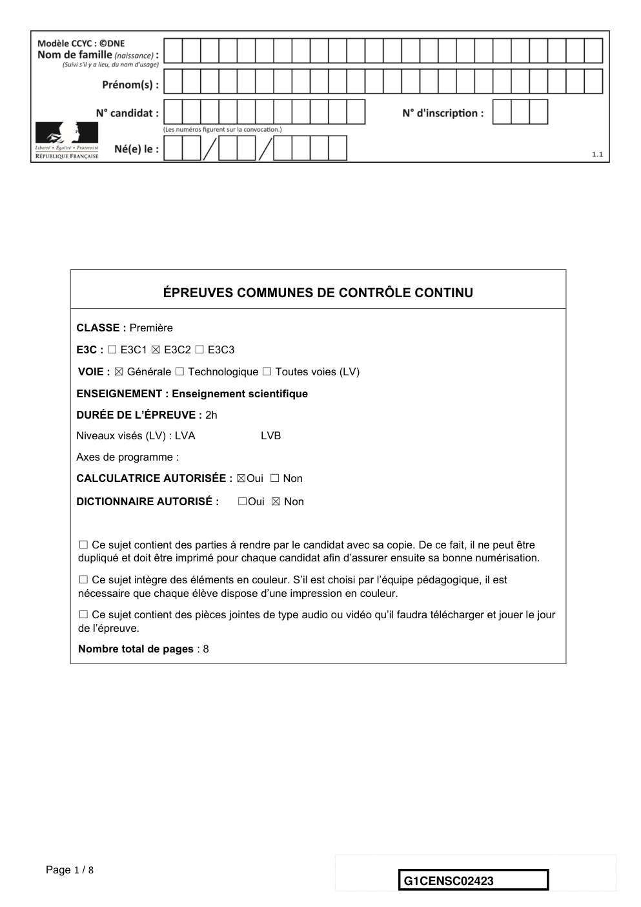
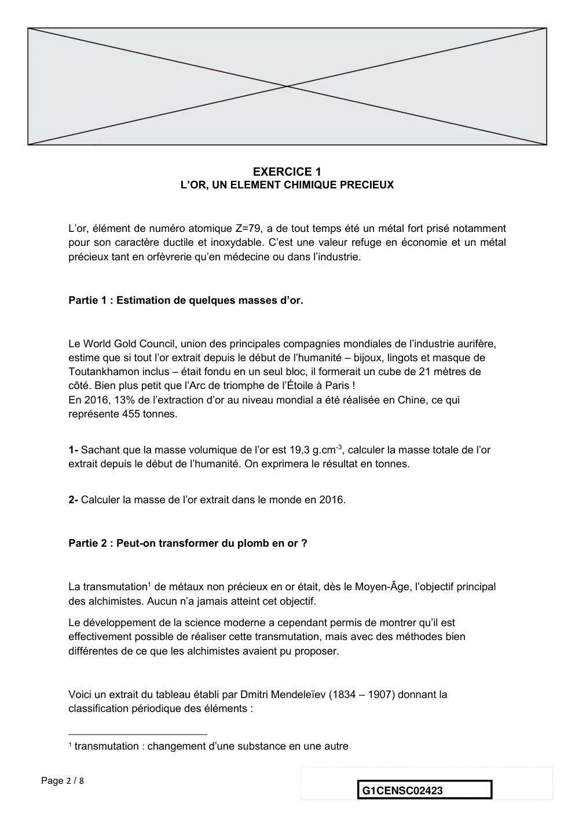
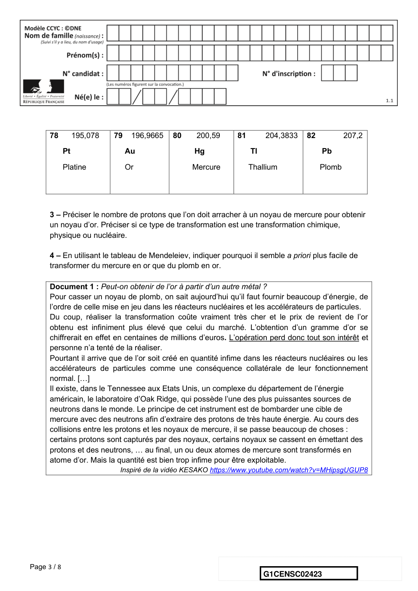
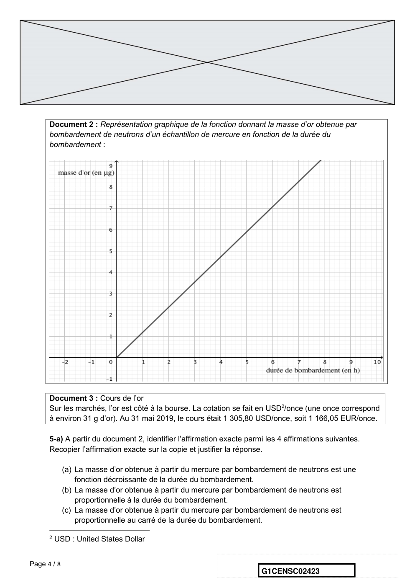
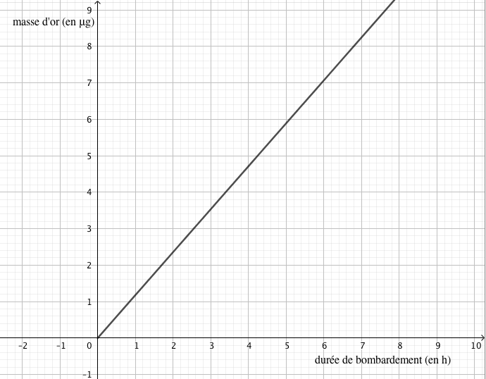
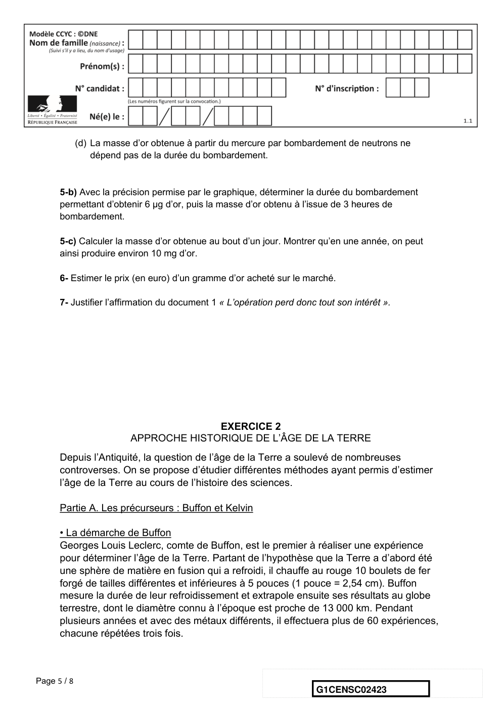
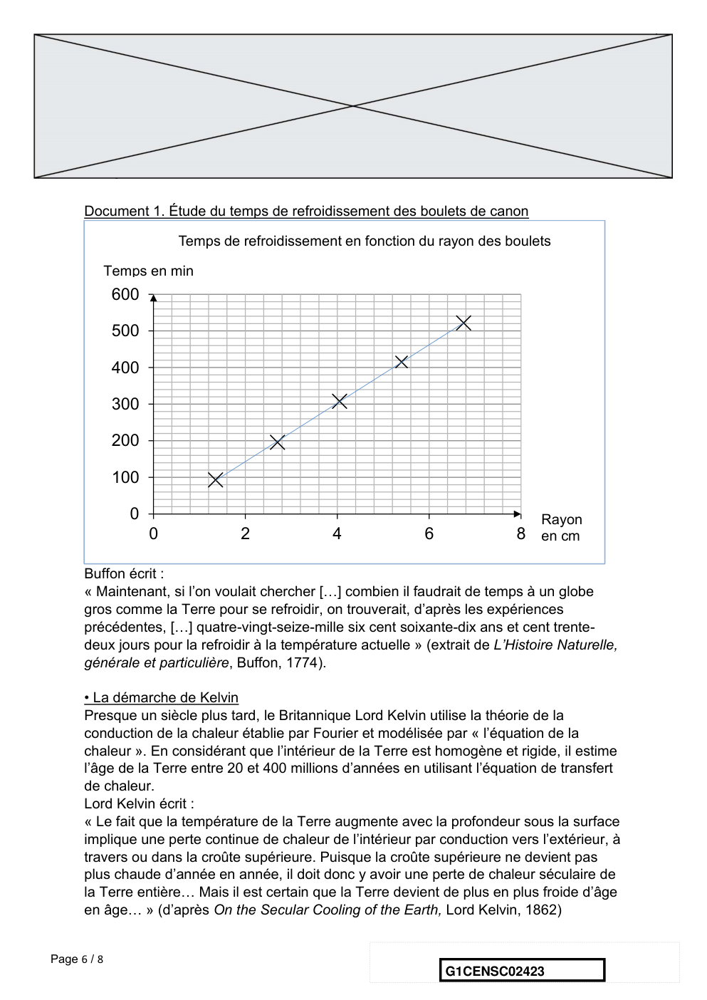
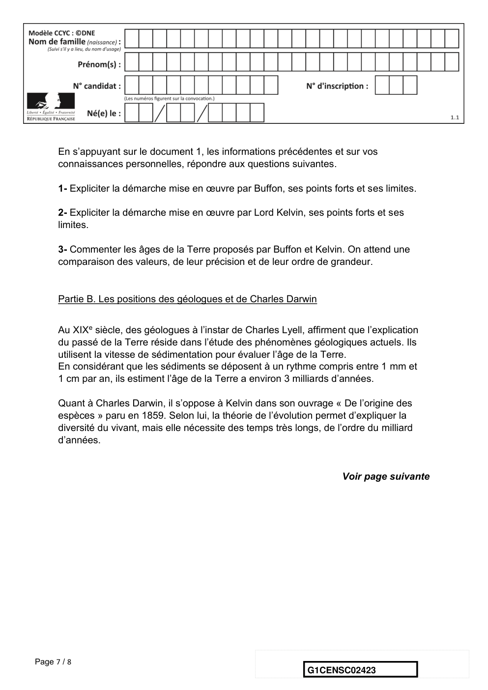
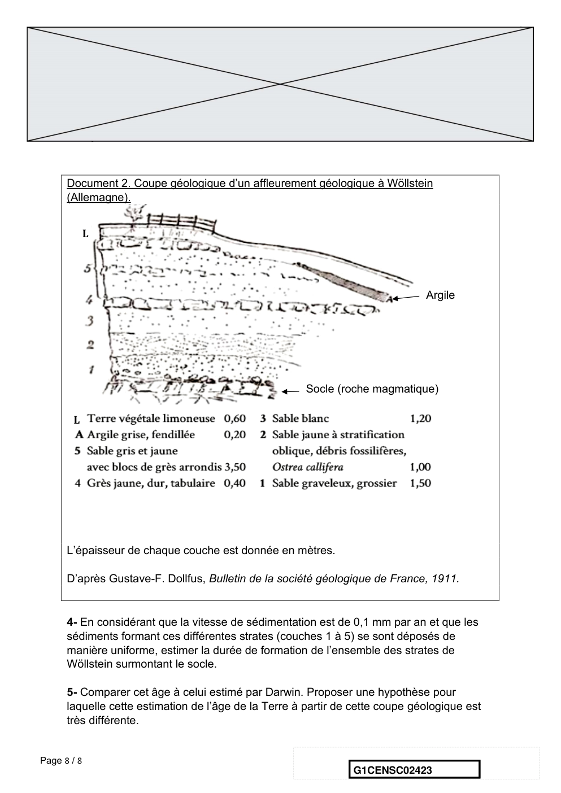
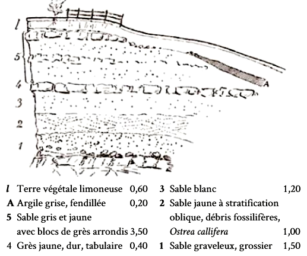

# e3c-enseignement-scientifique-premiere-02423-sujet-officiel

> Source : `../../../../pdf_version/02_es_ponctuelle/e3c/2020/e3c-enseignement-scientifique-premiere-02423-sujet-officiel.pdf` — conversion Markdown (texte + visuels).
> Stratégie : [STRATEGIE_MARKDOWN.md](../../../../STRATEGIE_MARKDOWN.md)

---

## Page 1

ÉPREUVES COMMUNES DE CONTRÔLE CONTINU

      CLASSE : Première

      E3C : ☐ E3C1 ☒ E3C2 ☐ E3C3

      VOIE : ☒ Générale ☐ Technologique ☐ Toutes voies (LV)

      ENSEIGNEMENT : Enseignement scientifique
      DURÉE DE L’ÉPREUVE : 2h
      Niveaux visés (LV) : LVA               LVB
      Axes de programme :

      CALCULATRICE AUTORISÉE : ☒Oui ☐ Non

      DICTIONNAIRE AUTORISÉ :           ☐Oui ☒ Non

      ☐ Ce sujet contient des parties à rendre par le candidat avec sa copie. De ce fait, il ne peut être
      dupliqué et doit être imprimé pour chaque candidat afin d’assurer ensuite sa bonne numérisation.

      ☐ Ce sujet intègre des éléments en couleur. S’il est choisi par l’équipe pédagogique, il est
      nécessaire que chaque élève dispose d’une impression en couleur.

      ☐ Ce sujet contient des pièces jointes de type audio ou vidéo qu’il faudra télécharger et jouer le jour
      de l’épreuve.
      Nombre total de pages : 8

Page 1 / 8
                                                                            G1CENSC02423

---

## Page 2

EXERCICE 1
                               L’OR, UN ELEMENT CHIMIQUE PRECIEUX

      L’or, élément de numéro atomique Z=79, a de tout temps été un métal fort prisé notamment
      pour son caractère ductile et inoxydable. C’est une valeur refuge en économie et un métal
      précieux tant en orfèvrerie qu’en médecine ou dans l’industrie.

      Partie 1 : Estimation de quelques masses d’or.

      Le World Gold Council, union des principales compagnies mondiales de l’industrie aurifère,
      estime que si tout l’or extrait depuis le début de l’humanité – bijoux, lingots et masque de
      Toutankhamon inclus – était fondu en un seul bloc, il formerait un cube de 21 mètres de
      côté. Bien plus petit que l’Arc de triomphe de l’Étoile à Paris !
      En 2016, 13% de l’extraction d’or au niveau mondial a été réalisée en Chine, ce qui
      représente 455 tonnes.

      1- Sachant que la masse volumique de l’or est 19,3 g.cm-3, calculer la masse totale de l’or
      extrait depuis le début de l’humanité. On exprimera le résultat en tonnes.

      2- Calculer la masse de l’or extrait dans le monde en 2016.

      Partie 2 : Peut-on transformer du plomb en or ?

      La transmutation1 de métaux non précieux en or était, dès le Moyen-Âge, l’objectif principal
      des alchimistes. Aucun n’a jamais atteint cet objectif.

      Le développement de la science moderne a cependant permis de montrer qu’il est
      effectivement possible de réaliser cette transmutation, mais avec des méthodes bien
      différentes de ce que les alchimistes avaient pu proposer.

      Voici un extrait du tableau établi par Dmitri Mendeleïev (1834 – 1907) donnant la
      classification périodique des éléments :

      1   transmutation : changement d’une substance en une autre

Page 2 / 8
                                                                     G1CENSC02423

---

## Page 3

78          195,078   79    196,9665   80    200,59      81        204,3833   82           207,2

             Pt                  Au               Hg                Tl                   Pb

             Platine             Or               Mercure           Thallium             Plomb

      3 – Préciser le nombre de protons que l’on doit arracher à un noyau de mercure pour obtenir
      un noyau d’or. Préciser si ce type de transformation est une transformation chimique,
      physique ou nucléaire.

      4 – En utilisant le tableau de Mendeleiev, indiquer pourquoi il semble a priori plus facile de
      transformer du mercure en or que du plomb en or.

      Document 1 : Peut-on obtenir de l’or à partir d’un autre métal ?
      Pour casser un noyau de plomb, on sait aujourd’hui qu’il faut fournir beaucoup d’énergie, de
      l’ordre de celle mise en jeu dans les réacteurs nucléaires et les accélérateurs de particules.
      Du coup, réaliser la transformation coûte vraiment très cher et le prix de revient de l’or
      obtenu est infiniment plus élevé que celui du marché. L’obtention d’un gramme d’or se
      chiffrerait en effet en centaines de millions d’euros. L’opération perd donc tout son intérêt et
      personne n’a tenté de la réaliser.
      Pourtant il arrive que de l’or soit créé en quantité infime dans les réacteurs nucléaires ou les
      accélérateurs de particules comme une conséquence collatérale de leur fonctionnement
      normal. […]
      Il existe, dans le Tennessee aux Etats Unis, un complexe du département de l’énergie
      américain, le laboratoire d’Oak Ridge, qui possède l’une des plus puissantes sources de
      neutrons dans le monde. Le principe de cet instrument est de bombarder une cible de
      mercure avec des neutrons afin d’extraire des protons de très haute énergie. Au cours des
      collisions entre les protons et les noyaux de mercure, il se passe beaucoup de choses :
      certains protons sont capturés par des noyaux, certains noyaux se cassent en émettant des
      protons et des neutrons, … au final, un ou deux atomes de mercure sont transformés en
      atome d’or. Mais la quantité est bien trop infime pour être exploitable.
                             Inspiré de la vidéo KESAKO https://www.youtube.com/watch?v=MHipsgUGUP8

Page 3 / 8
                                                                         G1CENSC02423

---

## Page 4

Document 2 : Représentation graphique de la fonction donnant la masse d’or obtenue par
      bombardement de neutrons d’un échantillon de mercure en fonction de la durée du
      bombardement :

      Document 3 : Cours de l’or
      Sur les marchés, l’or est côté à la bourse. La cotation se fait en USD2/once (une once correspond
      à environ 31 g d’or). Au 31 mai 2019, le cours était 1 305,80 USD/once, soit 1 166,05 EUR/once.

      5-a) A partir du document 2, identifier l’affirmation exacte parmi les 4 affirmations suivantes.
      Recopier l’affirmation exacte sur la copie et justifier la réponse.

             (a) La masse d’or obtenue à partir du mercure par bombardement de neutrons est une
                 fonction décroissante de la durée du bombardement.
             (b) La masse d’or obtenue à partir du mercure par bombardement de neutrons est
                 proportionnelle à la durée du bombardement.
             (c) La masse d’or obtenue à partir du mercure par bombardement de neutrons est
                 proportionnelle au carré de la durée du bombardement.

      2
          USD : United States Dollar

Page 4 / 8
                                                                       G1CENSC02423

---

## Page 5

(d) La masse d’or obtenue à partir du mercure par bombardement de neutrons ne
                 dépend pas de la durée du bombardement.

      5-b) Avec la précision permise par le graphique, déterminer la durée du bombardement
      permettant d’obtenir 6 µg d’or, puis la masse d’or obtenu à l’issue de 3 heures de
      bombardement.

      5-c) Calculer la masse d’or obtenue au bout d’un jour. Montrer qu’en une année, on peut
      ainsi produire environ 10 mg d’or.

      6- Estimer le prix (en euro) d’un gramme d’or acheté sur le marché.

      7- Justifier l’affirmation du document 1 « L’opération perd donc tout son intérêt ».

                                       EXERCICE 2
                         APPROCHE HISTORIQUE DE L’ÂGE DE LA TERRE
      Depuis l’Antiquité, la question de l’âge de la Terre a soulevé de nombreuses
      controverses. On se propose d’étudier différentes méthodes ayant permis d’estimer
      l’âge de la Terre au cours de l’histoire des sciences.

      Partie A. Les précurseurs : Buffon et Kelvin

      • La démarche de Buffon
      Georges Louis Leclerc, comte de Buffon, est le premier à réaliser une expérience
      pour déterminer l’âge de la Terre. Partant de l’hypothèse que la Terre a d’abord été
      une sphère de matière en fusion qui a refroidi, il chauffe au rouge 10 boulets de fer
      forgé de tailles différentes et inférieures à 5 pouces (1 pouce = 2,54 cm). Buffon
      mesure la durée de leur refroidissement et extrapole ensuite ses résultats au globe
      terrestre, dont le diamètre connu à l’époque est proche de 13 000 km. Pendant
      plusieurs années et avec des métaux différents, il effectuera plus de 60 expériences,
      chacune répétées trois fois.

Page 5 / 8
                                                                       G1CENSC02423

---

## Page 6

Document 1. Étude du temps de refroidissement des boulets de canon

                       Temps de refroidissement en fonction du rayon des boulets

         Temps en min
             600

             500

             400

             300

             200

             100

              0                                                                    Rayon
                   0            2              4               6              8 en cm

      Buffon écrit :
      « Maintenant, si l’on voulait chercher […] combien il faudrait de temps à un globe
      gros comme la Terre pour se refroidir, on trouverait, d’après les expériences
      précédentes, […] quatre-vingt-seize-mille six cent soixante-dix ans et cent trente-
      deux jours pour la refroidir à la température actuelle » (extrait de L’Histoire Naturelle,
      générale et particulière, Buffon, 1774).

      • La démarche de Kelvin
      Presque un siècle plus tard, le Britannique Lord Kelvin utilise la théorie de la
      conduction de la chaleur établie par Fourier et modélisée par « l’équation de la
      chaleur ». En considérant que l’intérieur de la Terre est homogène et rigide, il estime
      l’âge de la Terre entre 20 et 400 millions d’années en utilisant l’équation de transfert
      de chaleur.
      Lord Kelvin écrit :
      « Le fait que la température de la Terre augmente avec la profondeur sous la surface
      implique une perte continue de chaleur de l’intérieur par conduction vers l’extérieur, à
      travers ou dans la croûte supérieure. Puisque la croûte supérieure ne devient pas
      plus chaude d’année en année, il doit donc y avoir une perte de chaleur séculaire de
      la Terre entière… Mais il est certain que la Terre devient de plus en plus froide d’âge
      en âge… » (d’après On the Secular Cooling of the Earth, Lord Kelvin, 1862)

Page 6 / 8
                                                                   G1CENSC02423

---

## Page 7

En s’appuyant sur le document 1, les informations précédentes et sur vos
      connaissances personnelles, répondre aux questions suivantes.

      1- Expliciter la démarche mise en œuvre par Buffon, ses points forts et ses limites.

      2- Expliciter la démarche mise en œuvre par Lord Kelvin, ses points forts et ses
      limites.

      3- Commenter les âges de la Terre proposés par Buffon et Kelvin. On attend une
      comparaison des valeurs, de leur précision et de leur ordre de grandeur.

      Partie B. Les positions des géologues et de Charles Darwin

      Au XIXe siècle, des géologues à l’instar de Charles Lyell, affirment que l’explication
      du passé de la Terre réside dans l’étude des phénomènes géologiques actuels. Ils
      utilisent la vitesse de sédimentation pour évaluer l’âge de la Terre.
      En considérant que les sédiments se déposent à un rythme compris entre 1 mm et
      1 cm par an, ils estiment l’âge de la Terre a environ 3 milliards d’années.

      Quant à Charles Darwin, il s’oppose à Kelvin dans son ouvrage « De l’origine des
      espèces » paru en 1859. Selon lui, la théorie de l’évolution permet d’expliquer la
      diversité du vivant, mais elle nécessite des temps très longs, de l’ordre du milliard
      d’années.

                                                                          Voir page suivante

Page 7 / 8
                                                                 G1CENSC02423

---

## Page 8

Document 2. Coupe géologique d’un affleurement géologique à Wöllstein
      (Allemagne).

             L

                                                                               Argile

                                                       Socle (roche magmatique)

       L

      L’épaisseur de chaque couche est donnée en mètres.

      D’après Gustave-F. Dollfus, Bulletin de la société géologique de France, 1911.

      4- En considérant que la vitesse de sédimentation est de 0,1 mm par an et que les
      sédiments formant ces différentes strates (couches 1 à 5) se sont déposés de
      manière uniforme, estimer la durée de formation de l’ensemble des strates de
      Wöllstein surmontant le socle.

      5- Comparer cet âge à celui estimé par Darwin. Proposer une hypothèse pour
      laquelle cette estimation de l’âge de la Terre à partir de cette coupe géologique est
      très différente.

Page 8 / 8
                                                                G1CENSC02423

