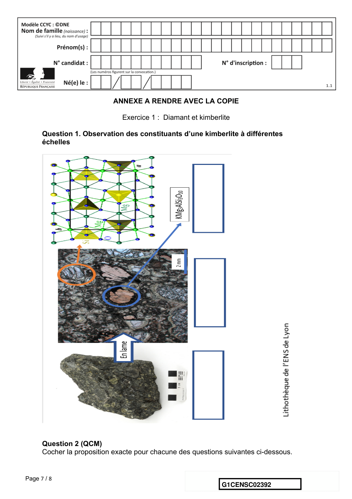
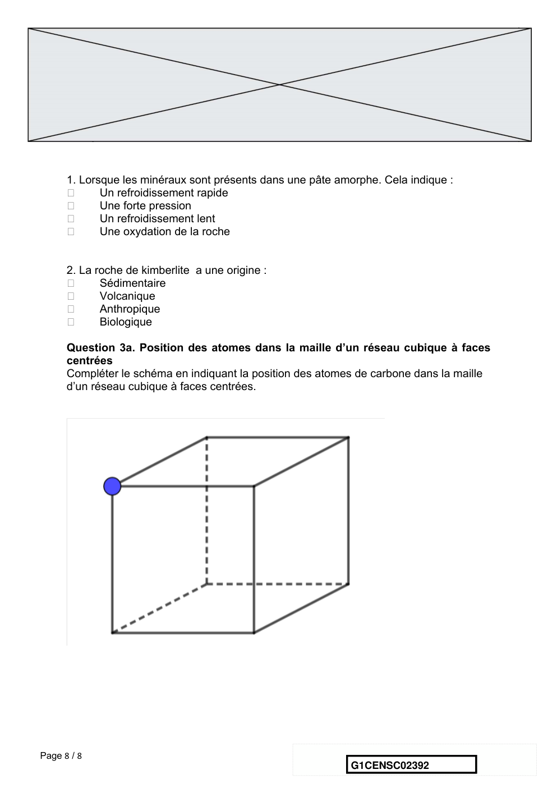

# e3c-enseignement-scientifique-premiere-02392-sujet-officiel

> Source : `../../../../pdf_version/02_es_ponctuelle/e3c/2021/e3c-enseignement-scientifique-premiere-02392-sujet-officiel.pdf` — conversion Markdown (texte + visuels utiles).
> Stratégie : [STRATEGIE_MARKDOWN.md](../../../../STRATEGIE_MARKDOWN.md)

---

## Page 1

ÉPREUVES COMMUNES DE CONTRÔLE CONTINU

       CLASSE : Première

       E3C : ☐ E3C1 ☒ E3C2 ☐ E3C3

        VOIE : ☒ Générale ☐ Technologique ☐ Toutes voies (LV)
       ENSEIGNEMENT : Enseignement scientifique
       DURÉE DE L’ÉPREUVE : 2h
       Niveaux visés (LV) : LVA                LVB
       Axes de programme :

       CALCULATRICE AUTORISÉE : ☒Oui ☐ Non

       DICTIONNAIRE AUTORISÉ :            ☐Oui ☐ Non

        ☒ Ce sujet contient des parties à rendre par le candidat avec sa copie. De ce fait, il ne peut être
        dupliqué et doit être imprimé pour chaque candidat afin d’assurer ensuite sa bonne numérisation.

        ☐ Ce sujet intègre des éléments en couleur. S’il est choisi par l’équipe pédagogique, il est
        nécessaire que chaque élève dispose d’une impression en couleur.

        ☐ Ce sujet contient des pièces jointes de type audio ou vidéo qu’il faudra télécharger et jouer le
        jour de l’épreuve.
        Nombre total de pages : 8

Page 1 / 8
                                                                            G1CENSC02392

---

## Page 2

EXERCICE 1

                                    DIAMANT ET KIMBERLITE

       La kimberlite est une roche qui peut contenir des cristaux de diamant. Elle est issue
       du refroidissement d’une lave et doit son nom à la ville de Kimberley en Afrique du
       sud, où elle fut découverte pour la première fois.

Observation de la kimberlite

       La kimberlite est présentée à différentes échelles sur le document réponse en
       annexe.

       1- Identifier les structures observées en inscrivant, parmi les propositions suivantes,
       les réponses dans les cadres prévus : « cellule », « roche », « organite »,
       « minéral », « modélisation à l’échelle de l’atome ».
       2- Cocher la proposition juste dans le QCM du document réponse à rendre avec la
       copie.

Structure cristalline du diamant

       Des diamants sont souvent présents dans la kimberlite sous forme d’inclusions. Le
       diamant est un minéral transparent composé de cristaux de carbone pur. Cette
       « pierre précieuse » est connue pour être le minéral le plus dur qui soit.
       On cherche à savoir si, dans le cas du diamant, le carbone cristallise sous une forme
       cubique à face centrée.

Données :
     • Rayon d’un atome de carbone : 𝑟 = 70 pm
     • Masse d’un atome de carbone : m = 2,0x10-26 kg.

3- Étude d’un réseau cubique à faces centrées.
   3-a Compléter le schéma de maille d’un réseau cubique à faces centrées présenté dans
       le document réponse en indiquant la position des atomes.
   3-b Déterminer, en le justifiant, le nombre d’atomes présents à l’intérieur d’une maille.

 Page 2 / 8
                                                                  G1CENSC02392

---

## Page 3

Document 1. Vue d’une face du cube (réseau cubique à faces centrées)

        Illustration de l’auteur

       3-c Le paramètre de maille, noté a, est la longueur d’une arête du cube.
       Démontrer que a = 2√2𝑟
       3-d Montrer que la masse volumique 𝜌 qu’aurait le diamant s’il possédait une
       structure cubique à faces centrées vérifierait approximativement la formule 𝜌 =
              /
       0,18 × 0 1 ( avec m : masse d’un atome de carbone et r : rayon d’un atome de carbone
       modélisée par une sphère).
       4- La masse volumique du diamant est 3,51x 103 kg.m-3. Indiquer si le diamant
       possède une structure cubique à face centrée.

Recherche de la profondeur de formation du diamant

       Le carbone pur est présent dans la nature sous deux formes principales : le diamant,
       qui est transparent, et le graphite, qui est gris et opaque. En laboratoire, il est
       possible de fabriquer artificiellement du diamant à partir du graphite en modifiant les
       paramètres de pression et de température : le diamant peut être produit si la
       pression est comprise entre 5 et 12 GPa . (1 GPa = 1x109 Pa).

 Page 3 / 8
                                                                 G1CENSC02392

---

## Page 4

Document 2. Pression en fonction de la profondeur sous la surface terrestre

                     D’après un modèle simplifié de la structure de la Terre

      5- À l’aide du document 2, estimer la profondeur minimale à partir de laquelle les
      diamants peuvent se former.

                                         EXERCICE 2
                          GAMME TEMPEREE ET GUITARE CLASSIQUE

      Après avoir rappelé quelques généralités sur la gamme tempérée, cet exercice
      s’intéresse à l’espacement des frettes d’une guitare classique.

      Partie A. Gamme tempérée
      Il y a eu dans l’histoire de nombreuses méthodes de construction de gammes pour
      ordonner les notes à l’intérieur d’une octave.
      On peut diviser l’octave en douze intervalles à l’aide de treize notes de base (Do,
      Do#, Ré, Mib, Mi, Fa, Fa#, Sol, Sol#, La, Sib, Si, Do). La gamme fréquemment utilisée
      de nos jours est la gamme au tempérament égal (ou gamme tempérée), dans
      laquelle le rapport de fréquences entre deux notes consécutives est constant.

      1- Rappeler la valeur du rapport des fréquences de deux notes situées aux
      extrémités d’une octave.
      2- Expliquer pourquoi la valeur exacte du rapport des fréquences entre deux notes
                                                23
      consécutives de la gamme tempérée est √2.
      3- Le tableau suivant indique les fréquences (en Hertz), arrondies au dixième, de

Page 4 / 8
                                                                G1CENSC02392

---

## Page 5

*(Suite de la page précédente — le document continue ici.)*

quelques notes de la gamme tempérée.

       Note          Mi3       Fa3      Fa3#      Sol3     Sol3#     La3      Si3b      Si3     Do4
       Fréquence
                     329,6     349,2    370,0     392,0              440,0    466,2     493,9   523,3
       (Hz)

      Calculer la valeur, arrondie au dixième, de la fréquence qui manque dans le tableau
      ci-dessus.

      Partie B. Application aux frettes de la guitare classique
      En observant le manche d’une guitare classique, on remarque que les barrettes
      métalliques, appelées frettes, situées sur les cordes, ne sont pas espacées
      régulièrement : plus on s’approche du chevalet, plus elles sont resserrées.
      Cette partie se propose d’expliquer pourquoi.

      Document 1 : manche d’une guitare classique
      Une guitare classique est constituée de 6 cordes. La longueur située entre le
      chevalet et le sillet est la plus grande longueur de corde pouvant vibrer. On la note
      𝐿5 . On suppose ici que 𝐿5 = 650 mm. Le manche de la guitare est divisé en plusieurs
      cases délimitées par les frettes. Ces frettes permettent au joueur de guitare de
      modifier la longueur de la corde pouvant vibrer, et par conséquent de faire varier la
      fréquence du son issu de cette vibration.
      On se place dans le cas simple où le joueur utilise une seule corde.

      S’il joue à vide, c’est-à-dire sans pincer la corde au niveau d’une case, la corde qui
      vibre, de longueur 𝐿5 , produit un son d’une fréquence 𝑓5 .

Page 5 / 8
                                                                   G1CENSC02392

---

## Page 6

Lorsqu’il pince la corde au niveau de la case 𝑛, située juste au- dessus de la 𝑛-ième
      frette, la corde qui vibre, de longueur 𝐿9 , émet un son de fréquence 𝑓9 .
      Ces grandeurs sont reliées entre elles par la relation :
                                           𝐿9 × 𝑓9 = 𝐿5 × 𝑓5 où :
      - 𝑛 est le numéro de la frette, compté à partir du haut du manche (𝑛 = 0 pour une
      corde jouée « à vide »).
      - 𝐿9 est la longueur de la corde entre le chevalet et la 𝑛-ième frette.
      - 𝑓9 est la fréquence de la note jouée lorsque l’on pince la corde au niveau de la case
      𝑛.
      4- Lorsqu’on joue à vide la corde la plus fine de la guitare, le son émis est le Mi3.
      Pour obtenir un Mi4 le joueur pince cette même corde au niveau de la 12e case
      (située juste au-dessus de la 12e frette), ce qui produit un son de fréquence
      𝑓:; = 2 × 𝑓5 .
      4-a- Le Mi4 est-il plus aigu ou plus grave que le Mi3 ?
      4-b- Parmi les réponses suivantes, indiquer celle quelle qui correspond à la longueur
      𝐿:; correspondant à la fréquence 𝑓:; . Justifier la réponse.
                                                  <                        ;
    1) 𝐿:; = 2 × 𝐿5                      2) 𝐿:; = ;=             3) 𝐿:; = <
                                                                              =
      5- Longueur de la 1re case.
                                                            23
      On rappelle que la fréquence du Fa3 est égale à 𝑓: = √2 𝑓5 . Pour obtenir un Fa3, on
      pince la corde au niveau de la première case, la longueur de la corde vibrante étant
      alors égale à L1.
                         <
      Sachant que 𝐿: = 23= , donner l’expression de la longueur de la première case en
                          √;
      fonction de L0.

Page 6 / 8
                                                                 G1CENSC02392

---

## Page 7

ANNEXE A RENDRE AVEC LA COPIE

                              Exercice 1 : Diamant et kimberlite

      Question 1. Observation des constituants d’une kimberlite à différentes
      échelles

      Question 2 (QCM)
      Cocher la proposition exacte pour chacune des questions suivantes ci-dessous.

Page 7 / 8
                                                             G1CENSC02392

---

## Page 8

1. Lorsque les minéraux sont présents dans une pâte amorphe. Cela indique :
             Un refroidissement rapide
             Une forte pression
             Un refroidissement lent
             Une oxydation de la roche

      2. La roche de kimberlite a une origine :
             Sédimentaire
             Volcanique
             Anthropique
             Biologique

      Question 3a. Position des atomes dans la maille d’un réseau cubique à faces
      centrées
      Compléter le schéma en indiquant la position des atomes de carbone dans la maille
      d’un réseau cubique à faces centrées.

Page 8 / 8
                                                             G1CENSC02392

