# e3c-enseignement-scientifique-premiere-02394-sujet-officiel

> Source : `../../../../pdf_version/02_es_ponctuelle/e3c/2021/e3c-enseignement-scientifique-premiere-02394-sujet-officiel.pdf` — conversion Markdown (texte + visuels).
> Stratégie : [STRATEGIE_MARKDOWN.md](../../../../STRATEGIE_MARKDOWN.md)

---

## Page 1

ÉPREUVES COMMUNES DE CONTRÔLE CONTINU

       CLASSE : Première

       E3C : ☐ E3C1 ☒ E3C2 ☐ E3C3

        VOIE : ☒ Générale ☐ Technologique ☐ Toutes voies (LV)
       ENSEIGNEMENT : Enseignement scientifique
       DURÉE DE L’ÉPREUVE : 2h
       Niveaux visés (LV) : LVA                LVB
       Axes de programme :

       CALCULATRICE AUTORISÉE : ☒Oui ☐ Non

       DICTIONNAIRE AUTORISÉ :            ☐Oui ☐ Non

        ☒ Ce sujet contient des parties à rendre par le candidat avec sa copie. De ce fait, il ne peut être
        dupliqué et doit être imprimé pour chaque candidat afin d’assurer ensuite sa bonne numérisation.

        ☐ Ce sujet intègre des éléments en couleur. S’il est choisi par l’équipe pédagogique, il est
        nécessaire que chaque élève dispose d’une impression en couleur.

        ☐ Ce sujet contient des pièces jointes de type audio ou vidéo qu’il faudra télécharger et jouer le
        jour de l’épreuve.
        Nombre total de pages : 9

Page 1 / 9
                                                                            G1CENSC02394

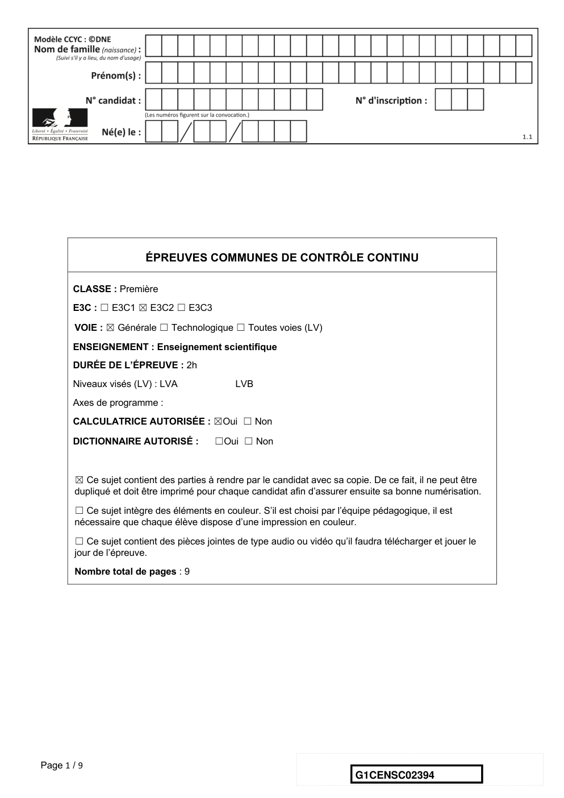

---

## Page 2

EXERCICE 1

                                        GÉODE DE GALÈNE

      Le plomb est présent à l’état naturel sous diverses formes dans la croûte terrestre.
      On le trouve principalement dans la galène, qui en contient 86,6 % en masse. Cet
      élément a permis de donner une estimation précise de l’âge de la Terre.

                            Géode de galène

      Partie 1 : la galène

             1- La galène est un solide minéral composé en majorité de sulfure de plomb qui
                possède une structure cristalline de type chlorure de sodium constituée des
                ions plomb Pb2+ et des ions sulfure S2- .

Page 2 / 9
                                                                 G1CENSC02394

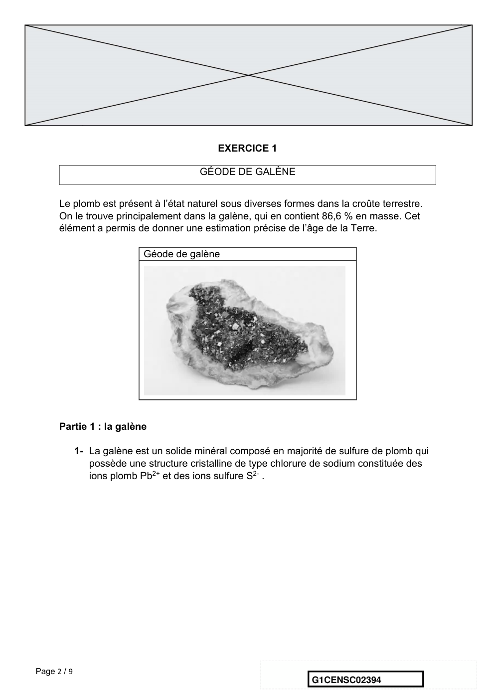

---

## Page 3

1-a- Déterminer le type de réseau cristallin formé par les ions plomb Pb2+.
      1-b- Préciser les différentes positions occupées par les ions sulfure S2- dans la
      maille.

      2-a- Justifier qu’il y a quatre ions plomb Pb2+ et quatre ions sulfure S2- dans la maille.
      2-b- Choisir la formule chimique du sulfure de plomb parmi les quatre proposées ci-
      dessous et la recopier sur la copie.
             A : Pb2S               B : PbS2            C : PbS              D : PbS4

      3- La forme géométrique de la maille et la nature des ions qui la constituent sont à
      l’origine des propriétés macroscopiques du cristal, notamment de sa masse
      volumique.
      En utilisant les données ci-dessous, calculer la masse et le volume d’une maille.
      En déduire la masse volumique du sulfure de plomb.

      Données :
      Masse d’un ion plomb Pb2+: mPb2+ = 3,44 × 10-22 g.
      Masse d’un ion sulfure S2- : mS2- = 5,33 × 10-23 g.
      Longueur d’une arête de la maille : a =5,94 × 10-8 cm.

      4- Outre ses utilisations industrielles, la galène peut servir d’objet de décoration. Elle
      est alors vendue sous forme de géode (cavité rocheuse tapissée de cristaux).
      Un vendeur de géodes de galène veut estimer la qualité de son stock de géodes.
      Pour cela, il effectue le prélèvement d’un lot de cinquante géodes dans son stock et
      détermine la masse volumique de chacune d’elle. Par souci de simplification, il se
      limite à étudier ce seul critère.

Page 3 / 9
                                                                   G1CENSC02394

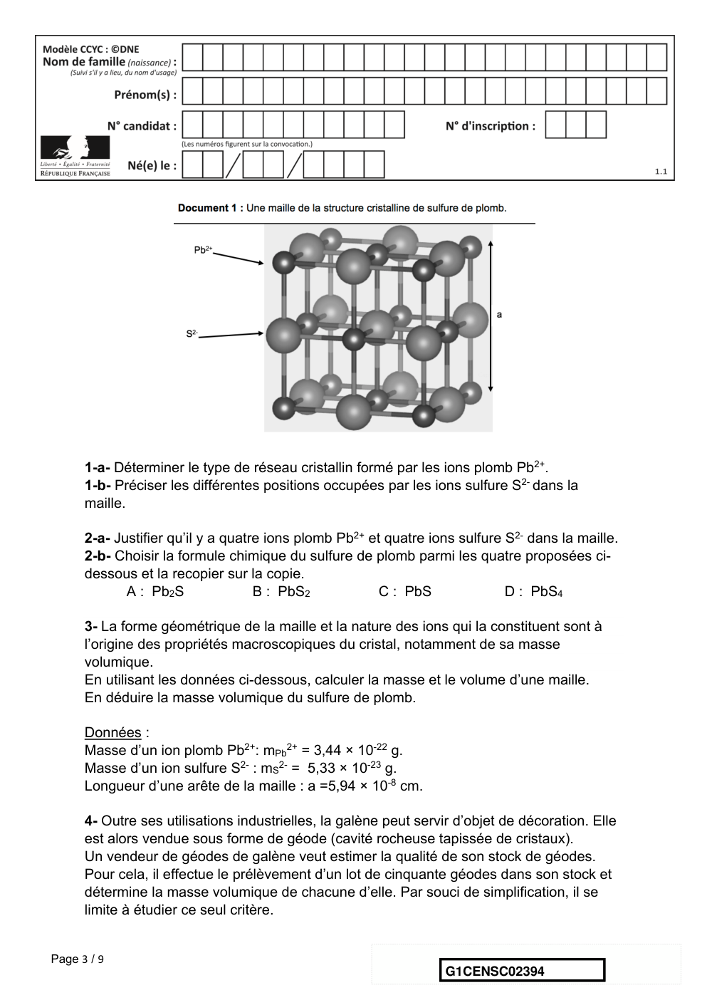

---

## Page 4

Il obtient les résultats suivants :
       Masse
       volumique      7,30     7,35         7,40        7,45            7,50       7,55     7,60
       (en g.cm-3)
       Effectif       1        1            9           10              11         13       5

      Pour être conforme, un lot de géodes doit contenir au moins 95% de géodes dont la
      masse volumique est comprise entre 7,40 g.cm-3 et 7,60 g.cm-3.
      Le lot précédent est-il conforme ? Justifier la réponse.

      Partie 2 : détermination de l’âge de la Terre

      Dès le XVIe siècle, les scientifiques ont cherché à déterminer l’âge de roches. C’est
      la découverte de la radioactivité à la fin du XIXe siècle qui leur a permis de dater avec
      une plus grande fiabilité de nombreux échantillons de roches prélevés dans la croûte
      terrestre.
      Principe de la datation uranium-plomb
      On fait l’hypothèse suivante : on considère qu’il n’y a pas de plomb 206 dans la
      roche au moment de sa formation, mais qu’elle contient des noyaux d’uranium 238
      radioactifs.
      On sait qu’un noyau d’uranium 238 radioactif se transforme en un noyau plomb 206
      stable à la suite d’une série de désintégrations successives.
                                      238 U ® 206 Pb + 6 0 e + 8 4 He
      L'équation globale est :         92      82       -1       2

      En mesurant la quantité de plomb 206 dans un échantillon de roche ancienne, on
      peut déterminer l'âge de l’échantillon de roche à partir de la courbe de décroissance
      radioactive du nombre de noyaux d'uranium 238.

Page 4 / 9
                                                                             G1CENSC02394

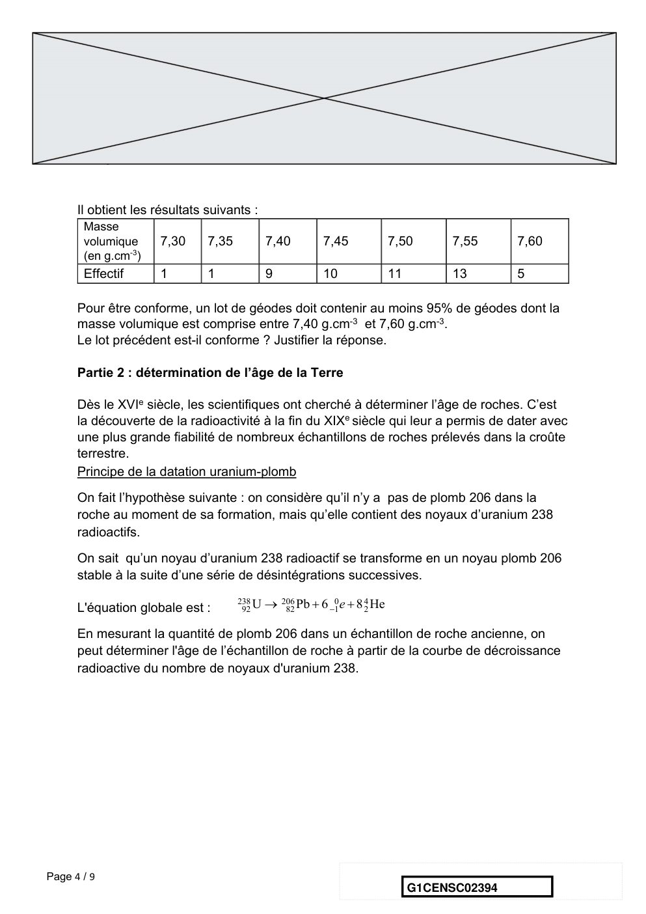

---

## Page 5

Ainsi, si on considère qu’un échantillon de roche contenant à la fois du plomb 206 et
      de l’uranium 238 a le même âge que la Terre, il est possible d’utiliser la datation
      uranium-plomb pour donner une estimation de l’âge de la Terre.
      5- Donner la composition d’un noyau de plomb 206.
      6- On note NU(t) et NPb(t) les nombres de noyaux d’uranium 238 et de plomb 206
      présents dans l’échantillon à la date t à laquelle la mesure est réalisée et NU(0) le
      nombre de noyaux d’uranium 238 que contenait la roche au moment de sa formation.
      6-a : Justifier la relation : NU(0) = NU(t) + NPb(t).
      6-b- Déterminer graphiquement NU(0).
      6-c- Le nombre de noyaux de plomb 206 mesuré dans la roche à la date t est égal à
      NPb(t)= 2,5.1012 noyaux.
      Calculer le nombre NU(t) de noyaux d’uranium présents à la date t.

      7- En déduire une estimation de l’âge de la Terre. Expliquer la démarche employée.

Page 5 / 9
                                                               G1CENSC02394

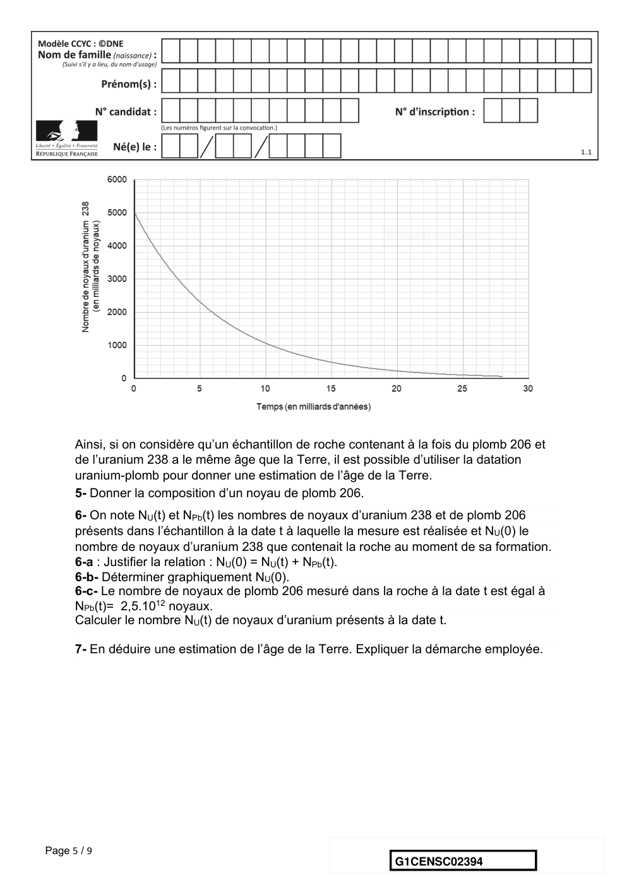

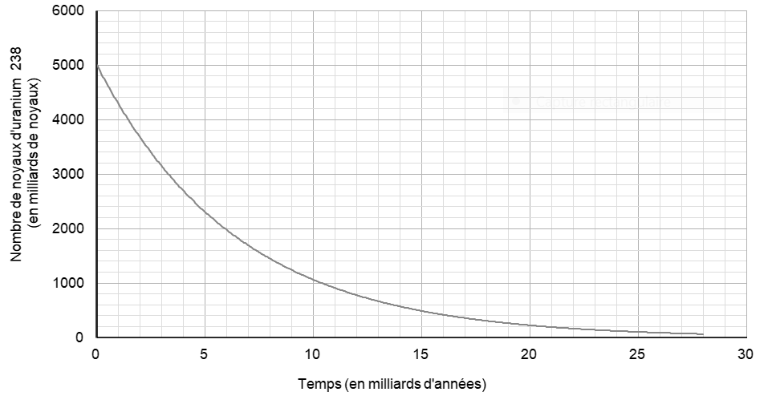

---

## Page 6

EXERCICE 2

                                  New-York – Pékin en avion

      Les constructeurs d’avions ayant fait de grandes améliorations en matière de
      sécurité sur leurs biréacteurs, les autorités américaines de l’aviation civile ont revu fin
      décembre 2011 la réglementation sur ces avions, en les autorisant à voler au-dessus
      du Pôle Nord.
      Ce sujet étudie les durées de vol sur le trajet New York-Pékin en fonction de deux
      trajectoires possibles : soit le long du 40e parallèle, soit en passant par le Pôle Nord.

       Document 1 : deux planisphères – deux représentations de la Terre

       Figure 1a – Représentation de la Terre en projection cylindrique

Page 6 / 9
                                                                   G1CENSC02394

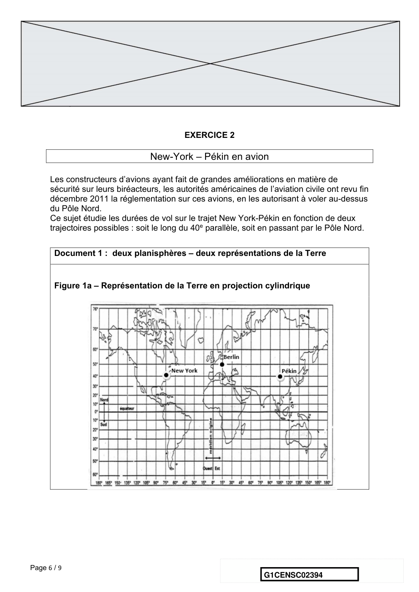

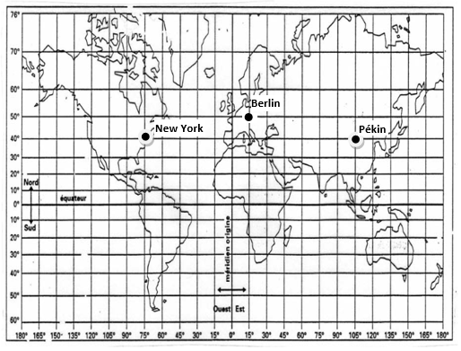

---

## Page 7

Document 2 : représentation de la Terre pour l’étude du trajet en passant par
       le Pôle Nord

             N : New York
             P : Pékin
             O : centre de la Terre
             H : centre du cercle
             formé par le 40e parallèle

      Calcul du rayon de la Terre
      1- On admet que la longueur du méridien terrestre est égale à 40 000 km. En déduire
      le rayon de la sphère terrestre.
      Trajet New York – Pékin en suivant le 40e parallèle
      Jusqu’au début des années 2010, la liaison aérienne New York – Pékin à bord
      d’avions biréacteurs suivait une route relativement proche de la ligne du 40e
      parallèle.
      2- Tracer, sur le schéma du document-réponse situé en Annexe, un des deux arcs
      de parallèle qui relie New York à Pékin.
      3- D’après le document 1, figure 1a, indiquer les coordonnées terrestres (latitude,
      longitude) de chacune des villes de New York et de Pékin. Il est attendu des
      coordonnées entières.
      4- En utilisant les coordonnées de New York et de Pékin, montrer que chacun des
      arcs de parallèle reliant New-York à Pékin est un demi-cercle.
      5- Parmi les quatre propositions ci-dessous, une seule représente la distance New
      York – Pékin le long du 40e parallèle :

Page 7 / 9
                                                                G1CENSC02394

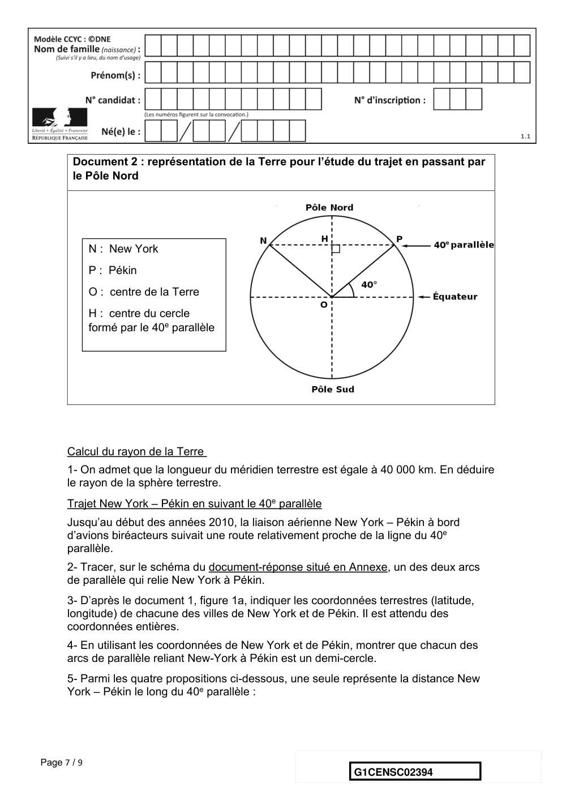

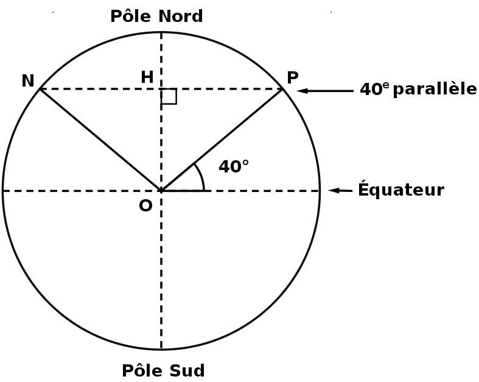

---

## Page 8

Proposition A        Proposition B         Proposition C        Proposition D
       1 200 km             15 300 km             20 000 km            40 000 km

      Éliminer les trois propositions fausses pour trouver la distance New York – Pékin le
      long du 40e parallèle. Justifier. On pourra utiliser l’égalité cos(40°)=0,766.

      Trajet New York – Pékin en passant par le Pôle Nord
      Depuis décembre 2011, les avions biréacteurs peuvent survoler le pôle Nord.
      6- Tracer (d’une autre couleur que celle utilisée en question 2) sur le schéma du
      document-réponse situé en Annexe, la route que les avions biréacteurs sont
      autorisés à emprunter entre New York et Pékin en passant par le Pôle Nord.
      7- Montrer que la distance New York – Pékin par la route polaire mesure environ
      11 100 km.

      8- D’un point de vue environnemental, indiquer un avantage lié à la route aérienne
      passant par le Pôle Nord par rapport à la route suivant le 40e parallèle.

Page 8 / 9
                                                               G1CENSC02394

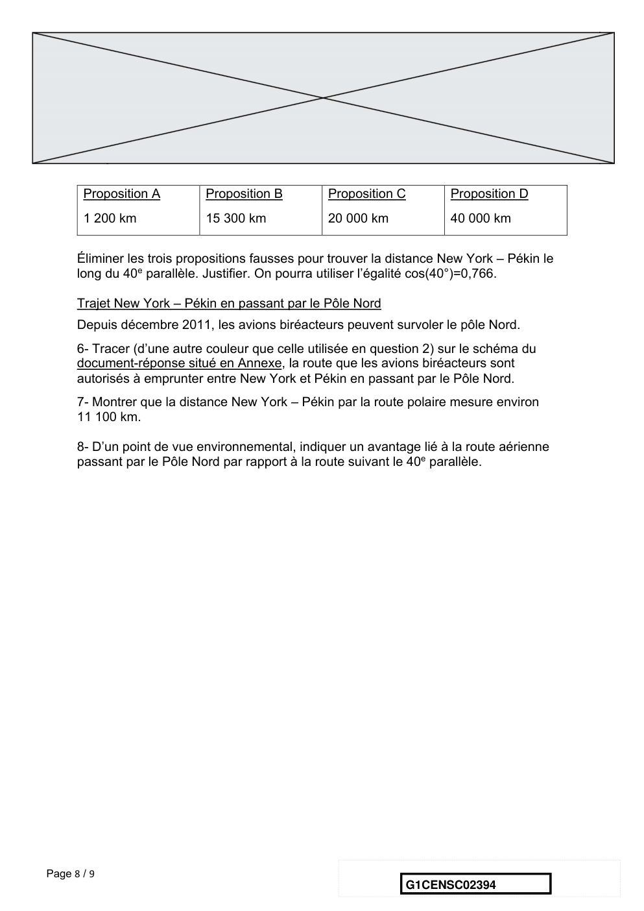

---

## Page 9

ANNEXE A RENDRE AVEC LA COPIE

             Exercice : New-York Pékin en avion – Questions 2 et 6

Page 9 / 9
                                                   G1CENSC02394

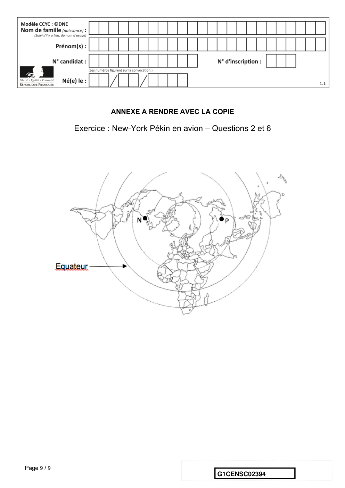

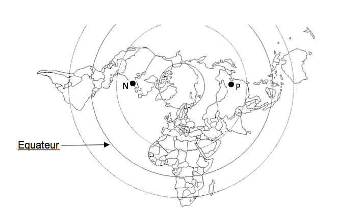

