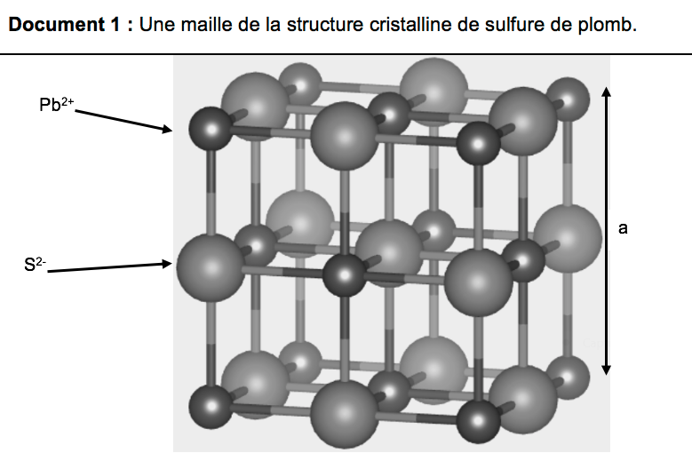

# e3c-enseignement-scientifique-premiere-02397-sujet-officiel

> Source : `../../../../pdf_version/02_es_ponctuelle/e3c/2021/e3c-enseignement-scientifique-premiere-02397-sujet-officiel.pdf` — conversion Markdown (texte + visuels utiles).
> Stratégie : [STRATEGIE_MARKDOWN.md](../../../../STRATEGIE_MARKDOWN.md)

---

## Page 1

ÉPREUVES COMMUNES DE CONTRÔLE CONTINU

       CLASSE : Première

       E3C : ☐ E3C1 ☒ E3C2 ☐ E3C3

        VOIE : ☒ Générale ☐ Technologique ☐ Toutes voies (LV)
       ENSEIGNEMENT : Enseignement scientifique
       DURÉE DE L’ÉPREUVE : 2h
       Niveaux visés (LV) : LVA                LVB
       Axes de programme :

       CALCULATRICE AUTORISÉE : ☒Oui ☐ Non

       DICTIONNAIRE AUTORISÉ :            ☐Oui ☐ Non

        ☐ Ce sujet contient des parties à rendre par le candidat avec sa copie. De ce fait, il ne peut être
        dupliqué et doit être imprimé pour chaque candidat afin d’assurer ensuite sa bonne numérisation.

        ☐ Ce sujet intègre des éléments en couleur. S’il est choisi par l’équipe pédagogique, il est
        nécessaire que chaque élève dispose d’une impression en couleur.

        ☐ Ce sujet contient des pièces jointes de type audio ou vidéo qu’il faudra télécharger et jouer le
        jour de l’épreuve.
        Nombre total de pages : 7

Page 1 / 7
                                                                            G1CENSC02397

---

## Page 2

EXERCICE 1

                                        GÉODE DE GALÈNE

      Le plomb est présent à l’état naturel sous diverses formes dans la croûte terrestre.
      On le trouve principalement dans la galène, qui en contient 86,6 % en masse. Cet
      élément a permis de donner une estimation précise de l’âge de la Terre.

                            Géode de galène

      Partie 1 : la galène

             1- La galène est un solide minéral composé en majorité de sulfure de plomb qui
                possède une structure cristalline de type chlorure de sodium constituée des
                ions plomb Pb2+ et des ions sulfure S2- .

Page 2 / 7
                                                                 G1CENSC02397

---

## Page 3

1-a- Déterminer le type de réseau cristallin formé par les ions plomb Pb2+.
      1-b- Préciser les différentes positions occupées par les ions sulfure S2- dans la
      maille.

      2-a- Justifier qu’il y a quatre ions plomb Pb2+ et quatre ions sulfure S2- dans la maille.
      2-b- Choisir la formule chimique du sulfure de plomb parmi les quatre proposées ci-
      dessous et la recopier sur la copie.
             A : Pb2S               B : PbS2            C : PbS              D : PbS4

      3- La forme géométrique de la maille et la nature des ions qui la constituent sont à
      l’origine des propriétés macroscopiques du cristal, notamment de sa masse
      volumique.
      En utilisant les données ci-dessous, calculer la masse et le volume d’une maille.
      En déduire la masse volumique du sulfure de plomb.
      Données :
      Masse d’un ion plomb Pb2+: mPb2+ = 3,44 × 10-22 g.
      Masse d’un ion sulfure S2- : mS2- = 5,33 × 10-23 g.
      Longueur d’une arête de la maille : a =5,94 × 10-8 cm.

      4- Outre ses utilisations industrielles, la galène peut servir d’objet de décoration. Elle
      est alors vendue sous forme de géode (cavité rocheuse tapissée de cristaux).
      Un vendeur de géodes de galène veut estimer la qualité de son stock de géodes.
      Pour cela, il effectue le prélèvement d’un lot de cinquante géodes dans son stock et
      détermine la masse volumique de chacune d’elle. Par souci de simplification, il se
      limite à étudier ce seul critère.

Page 3 / 7
                                                                   G1CENSC02397

---

## Page 4

Il obtient les résultats suivants :

       Masse
       volumique      7,30     7,35         7,40        7,45            7,50       7,55     7,60
       (en g.cm-3)
       Effectif       1        1            9           10              11         13       5

      Pour être conforme, un lot de géodes doit contenir au moins 95% de géodes dont la
      masse volumique est comprise entre 7,40 g.cm-3 et 7,60 g.cm-3.
      Le lot précédent est-il conforme ? Justifier la réponse.

      Partie 2 : détermination de l’âge de la Terre

      Dès le XVIe siècle, les scientifiques ont cherché à déterminer l’âge de roches. C’est
      la découverte de la radioactivité à la fin du XIXe siècle qui leur a permis de dater avec
      une plus grande fiabilité de nombreux échantillons de roches prélevés dans la croûte
      terrestre.
      Principe de la datation uranium-plomb
      On fait l’hypothèse suivante : on considère qu’il n’y a pas de plomb 206 dans la
      roche au moment de sa formation, mais qu’elle contient des noyaux d’uranium 238
      radioactifs.
      On sait qu’un noyau d’uranium 238 radioactif se transforme en un noyau plomb 206
      stable à la suite d’une série de désintégrations successives.
                                      238 U ® 206 Pb + 6 0 e + 8 4 He
      L'équation globale est :         92      82       -1       2

      En mesurant la quantité de plomb 206 dans un échantillon de roche ancienne, on
      peut déterminer l'âge de l’échantillon de roche à partir de la courbe de décroissance
      radioactive du nombre de noyaux d'uranium 238.

Page 4 / 7
                                                                             G1CENSC02397

---

## Page 5

Ainsi, si on considère qu’un échantillon de roche contenant à la fois du plomb 206 et
      de l’uranium 238 a le même âge que la Terre, il est possible d’utiliser la datation
      uranium-plomb pour donner une estimation de l’âge de la Terre.
      5- Donner la composition d’un noyau de plomb 206.
      6- On note NU(t) et NPb(t) les nombres de noyaux d’uranium 238 et de plomb 206
      présents dans l’échantillon à la date t à laquelle la mesure est réalisée et NU(0) le
      nombre de noyaux d’uranium 238 que contenait la roche au moment de sa formation.
      6-a : Justifier la relation : NU(0) = NU(t) + NPb(t).
      6-b- Déterminer graphiquement NU(0).
      6-c- Le nombre de noyaux de plomb 206 mesuré dans la roche à la date t est égal à
      NPb(t)= 2,5.1012 noyaux.
      Calculer le nombre NU(t) de noyaux d’uranium présents à la date t.
      7- En déduire une estimation de l’âge de la Terre. Expliquer la démarche employée.

Page 5 / 7
                                                               G1CENSC02397

---

## Page 6

EXERCICE 2

                         ENREGISTREMENT DE FICHIERS SONORES

      On s’interroge sur la pertinence d’utiliser un smartphone pour télécharger et stocker
      de la musique. Pour cela, on étudie le lien entre la qualité de la numérisation d’un
      signal audio et la taille des fichiers numériques correspondants.

   Partie A : échantillonnage et quantification d’un signal audio

   Le document 1 donné en annexe et à rendre avec la copie représente une portion de
   signal enregistré et l’échantillonnage effectué avant la conversion en signal numérique.

   1- Préciser la fréquence d’échantillonnage, choisie parmi les valeurs proposées ci-
      dessous :
      2000 Hz ;           12 500 Hz ;         26 000 Hz ;         44 100 Hz

   2- Après l’échantillonnage du signal audio, on procède à sa quantification. On admet
      que la tension quantifiée ne prend que des valeurs entières ; la valeur quantifiée
      d’une tension est l’entier le plus proche de cette tension.
      Sur le document 1 en annexe, à rendre avec la copie, représenter la courbe des
      tensions après quantification.

   3- Une plateforme de service de musique en ligne propose de la musique en qualité
      « 16-Bits / 44.1 kHz ».
      Expliquer ce que représentent ces deux valeurs.

   4- Combien de niveaux de quantification différents peut-on obtenir lorsque le codage
      s’effectue sur 16 bits ? Choisir la bonne réponse parmi les propositions suivantes :

             16           2 × 16 = 32          16+ = 256         2,- = 65 536

   Partie B : taille d’un fichier en haute définition
     Dans un studio d’enregistrement, on enregistre un morceau de musique en stéréo
     haute définition en choisissant un encodage sur 24 bits et une fréquence
     d’échantillonnage de 192 kHz.

   5- La taille T(en bit) d’un fichier audio numérique s’exprime en fonction de la fréquence
      d’échantillonnage 𝑓/ (en Hertz), du nombre 𝑛 de bits utilisés pour la quantification, de
      la durée Δ𝑡 de l’enregistrement et du nombre 𝑘 de voies d’enregistrement (une en
      mono, deux en stéréo) selon la relation
                                           𝑇 = 𝑓/ × 𝑛 × Δ𝑡 × 𝑘

Page 6 / 7
                                                                 G1CENSC02397

---

## Page 7

Vérifier que l’espace de stockage nécessaire pour enregistrer en stéréo haute
    définition une seconde de musique est de 1,152 Mo. On rappelle qu’un octet est égal à
    8 bits.

  6- Avec 200 Mo de stockage, dispose-t-on de suffisamment d’espace pour enregistrer
     cinq minutes de musique en stéréo haute définition ?

  7- Le dispositif d’encodage et de compression FLAC (Free Lossless Audio Codec)
     permet, par compression sans perte, de réduire de 55 % la taille des fichiers.

      Son taux de compression, défini comme le rapport de la taille du fichier compressé
      sur la taille du fichier initial, est donc de 45%.
      Avec 200 Mo de stockage, dispose-t-on de suffisamment d’espace pour enregistrer
      cinq minutes de musique en stéréo haute définition compressées par FLAC ?

Page 7 / 7
                                                              G1CENSC02397
