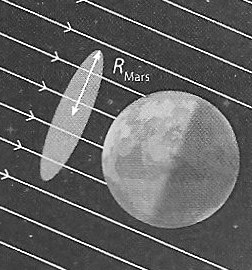

# e3c-enseignement-scientifique-premiere-02400-sujet-officiel

> Source : `../../../../pdf_version/02_es_ponctuelle/e3c/2021/e3c-enseignement-scientifique-premiere-02400-sujet-officiel.pdf` — conversion Markdown (texte + visuels utiles).
> Stratégie : [STRATEGIE_MARKDOWN.md](../../../../STRATEGIE_MARKDOWN.md)

---

## Page 1

ÉPREUVES COMMUNES DE CONTRÔLE CONTINU

      CLASSE : Première

      E3C : ☐ E3C1 ☒ E3C2 ☐ E3C3

      VOIE : ☒ Générale ☐ Technologique ☐ Toutes voies (LV)

      ENSEIGNEMENT : Enseignement scientifique
      DURÉE DE L’ÉPREUVE : 2h
      Niveaux visés (LV) : LVA               LVB
      Axes de programme :

      CALCULATRICE AUTORISÉE : ☒Oui ☐ Non

      DICTIONNAIRE AUTORISÉ :           ☐Oui ☒ Non

      ☐ Ce sujet contient des parties à rendre par le candidat avec sa copie. De ce fait, il ne peut être
      dupliqué et doit être imprimé pour chaque candidat afin d’assurer ensuite sa bonne numérisation.

      ☐ Ce sujet intègre des éléments en couleur. S’il est choisi par l’équipe pédagogique, il est
      nécessaire que chaque élève dispose d’une impression en couleur.

      ☐ Ce sujet contient des pièces jointes de type audio ou vidéo qu’il faudra télécharger et jouer le jour
      de l’épreuve.
      Nombre total de pages : 9

Page 1 / 9
                                                                            G1CENSC02400

---

## Page 2

EXERCICE 1
                                              SEUL SUR MARS

                              En 2035, lors d’une expédition de la mission Ares III sur Mars,
                              l’astronaute Mark Watney est laissé pour mort par ses
                              coéquipiers, une tempête les ayant obligés à décoller de la
                              planète en urgence.
                              Le lendemain, Mark Watney, qui n’est que blessé, se réveille et
                              découvre qu’il est seul sur Mars.
                              Pour survivre, il décide de cultiver des pommes de terre sous le
                              dôme de la base, en utilisant le sol martien fertilisé avec les
                              excréments de l’équipage, de l’eau et l’énergie solaire.
      Source : http://www.allocine.fr/film/fichefilm-221524/dvd-blu-ray/?cproduct=443240

      Partie 1. Puissance rayonnée par le Soleil
      Le Soleil, d’une masse totale de 2,0×1030 kg, est l’étoile du système solaire. Il est
      composé majoritairement d’atomes d’hydrogène H et d’atomes d’hélium He. Autour
      de lui gravitent la Terre et d’autres planètes comme Mars. La puissance rayonnée
      par le Soleil est voisine de 3,9×1026 W.
      Document 1. Réaction nucléaire de synthèse de l’hélium à partir de l’hydrogène dans
      le Soleil

      Sous l’effet de la température suffisamment élevée existant au cœur du Soleil, quatre
      atomes d’hydrogène peuvent réagir pour former un atome d’hélium et deux électrons
      selon l’équation de la réaction nucléaire simplifiée, dans laquelle -10e représente un
      électron :

                                             4 11H → 42He + 2 -10e
      Cette réaction s’accompagne d’une perte de masse et donc d’un dégagement
      d’énergie.

Page 2 / 9
                                                                          G1CENSC02400

---

## Page 3

1- Indiquer en le justifiant, si la formation de l’hélium dans le Soleil est une réaction
      de fusion ou de fission nucléaire.

      2- À l’aide de la relation d’Einstein précisant l’équivalence masse-énergie, calculer en
      kilogramme la masse solaire perdue par seconde.
      Donnée : vitesse de la lumière c = 3,0×108 m·s–1

      Partie 2. Puissance solaire reçue par Mars

      La base martienne de la mission Ares III est alimentée en énergie par des panneaux
      solaires qui captent le rayonnement solaire arrivant sur le sol martien. On souhaite
      connaître la puissance reçue par ces panneaux solaires.

      3- Sachant que la planète Mars est située à la distance dM-S = 2,3×108 km du Soleil,
      et à partir des données de la partie 1, calculer en W·m -2 la puissance par unité de
      surface traversant la sphère dont le centre est le Soleil et dont le rayon est dM-S.
      Cette puissance par unité de surface appelée constante solaire de Mars et notée
      CMars .
      Donnée : aire S d’une sphère de rayon d : S = 4×π×d²

      Document 2. Schéma d’un disque recevant une puissance solaire égale à celle
      reçue par Mars

                                 La puissance solaire reçue par Mars traverse un disque
                                 fictif de rayon RMars et se répartit ensuite sur toute la
                                 surface de la sphère martienne de rayon RMars. Celle-ci est
                                 en rotation sur elle-même.
                                 On peut considérer que le disque fictif est situé à la même
                                 distance du Soleil que Mars.
      Source : Daujean, C. D., & Guilleray, F. G. (2019). Le bilan radiatif terrestre. In Hatier
      (Éd.), Enseignement scientifique (p. 101). Paris, France: Hatier.

Page 3 / 9
                                                                  G1CENSC02400

---

## Page 4

4- La puissance solaire moyenne reçue sur Mars par unité de surface est proche de
      CMars/4 ; sa valeur est voisine de 150 W·m-2. Expliquer qualitativement pourquoi cette
      puissance moyenne par unité de surface est plus petite que CMars.

      Partie 3. Des pommes de terre sur Mars

      Document 3. Fixation du CO2 par une feuille
      Une feuille est mise au contact en son centre avec du CO2 marqué au 14C radioactif
      durant 5 minutes. Le CO2 marqué peut diffuser dans la feuille à partir de la zone
      centrale. Seule la moitié de la feuille est exposée à la lumière. La technique
      d’autoradiographie permet de localiser des sucres radioactifs qui impressionnent
      fortement une plaque photographique mise au contact de la feuille (zone sombre sur
      le document).

      D’après : http://svt.ac-dijon.fr/schemassvt/IMG/gif/co2_feuill_maz.gif

Page 4 / 9
                                                                 G1CENSC02400

---

## Page 5

Le dôme de la base martienne permet de recréer l’atmosphère terrestre. Grâce à un
      ingénieux système permettant de fournir l’eau nécessaire à la croissance des
      végétaux et à un éclairage adapté alimenté en électricité par les panneaux solaires,
      Mark Watney, botaniste de formation, décide de réaliser une culture végétale qui lui
      fournira de la nourriture nécessaire à sa survie.

      5- À partir de l’exploitation des résultats expérimentaux du document 3, identifier un
      facteur essentiel à la production de glucides par la plante.

      6- Au 79ème jour, Mark Watney récolte les tubercules de pomme de terre, qui ont
      stocké de l’énergie sous forme chimique.
      Calculer le nombre de jours d’autonomie dont dispose Mark Watney grâce à sa
      récolte de pommes de terre avant qu’une nouvelle mission ne vienne le récupérer
      sur Mars.
      Expliciter la démarche.
      Données :
      - surface du champ de pommes de terre : S = 126 m²
      - rendement* de la pomme de terre : r = 3 kg·m-2
      * En agriculture, on appelle rendement la masse végétale récoltée par unité de
      surface et par saison.
      - apport énergétique des pommes de terre : A = 3400 kJ·kg-1
      - dépense énergétique moyenne par sol martien de Mark Watney : D = 11000 kJ

Page 5 / 9
                                                               G1CENSC02400

---

## Page 6

EXERCICE 2

                                          Histoire de l’âge de la Terre

      « La Terre a un âge et cet âge a une histoire peu banale. Calculé à 4000 ans avant
      J.-C. à la Renaissance, il sera estimé à quelques dizaines de millions d’années à la
      fin du XIXème siècle. Il est maintenant fixé à 4,55 milliards d’années. Comment notre
      planète a-t-elle pu vieillir de plus de 4 milliards d’années en 400 ans ? ».
      Krivine, H. Histoire de l’âge de la Terre. En ligne : http://www.cnrs.fr

      L’objectif de l’exercice est d’analyser différents arguments, scientifiques ou non, sur
      lesquels on s’est appuyé, au cours de l’histoire, pour évaluer l’âge de la Terre.

      Document 1 - L’âge biblique.
      « Pour Aristote [4e siècle av. J.-C.], la Terre a toujours existé, tandis que les grandes
      religions monothéistes (juive, chrétienne et musulmane) introduisirent une création du
      monde. Notons qu’à la différence de la chronologie moderne, il s’agissait de
      l’apparition quasi-simultanée de l’Univers, de la Terre, des plantes, des animaux, du
      genre humain. Pour les savants de la Renaissance, le récit biblique, incontestable,
      était la seule base de calcul possible. La Bible contient une chronologie détaillée des
      premières générations : Adam a vécu 930 ans, il enfanta Seth à l’âge de 130 ans, qui
      engendra Énoch à 105 ans, qui engendra Qénân à 90 ans, etc. Il est alors facile de
      déduire la date de naissance de Noé : 1 056 ans après la création. Comme Noé avait
      600 ans quand arriva le Déluge, ce dernier est daté de 1 656 ans après la Création.
      Abraham naît 292 années plus tard. [...] Donnons quelques dates de naissance [de la
      Terre] établies sur cette base : 3993 av. J.-C., selon Johannes Kepler (1571-1630),
      3998 av. J.-C., selon Isaac Newton (1643-1727), 4004 av. J.-C., selon l’archevêque
      anglican James Ussher [en 1650]. »
      Krivine, H. L'Âge de la Terre.

Page 6 / 9
                                                                                 G1CENSC02400

---

## Page 7

Document 2 - Les temps de sédimentation et d’érosion par Charles Darwin (1859)

      « Ainsi que Lyell l’a très justement fait remarquer, l’étendue et l’épaisseur de nos
      couches de sédiments sont le résultat et donnent la mesure de la dénudation1 que la
      croûte terrestre a éprouvée ailleurs. Il faut donc examiner par soi-même ces
      énormes entassements de couches superposées, étudier les petits ruisseaux
      charriant de la boue, contempler les vagues rongeant les antiques falaises, pour se
      faire quelque notion de la durée des périodes écoulées [...]. Il faut surtout errer le
      long des côtes formées de roches modérément dures, et constater les progrès de
      leur désagrégation. [...] Rien ne peut mieux nous faire concevoir ce qu’est l’immense
      durée du temps, selon les idées que nous nous faisons du temps, que la vue des
      résultats si considérables produits par des agents atmosphériques2 qui nous
      paraissent avoir si peu de puissance et agir si lentement. Après s’être ainsi
      convaincu de la lenteur avec laquelle les agents atmosphériques et l’action des
      vagues sur les côtes rongent la surface terrestre, il faut ensuite, pour apprécier la
      durée des temps passés, considérer, d’une part, le volume immense des rochers qui
      ont été enlevés sur des étendues considérables, et, de l’autre, examiner l’épaisseur
      de nos formations sédimentaires. [...]
      J’ai vu, dans les Cordillères, une masse de conglomérat3 dont j’ai estimé l’épaisseur
      à environ 10 000 pieds [3 km] ; et, bien que les conglomérats aient dû probablement
      s’accumuler plus vite que des couches de sédiments plus fins, ils ne sont cependant
      composés que de cailloux roulés et arrondis qui, portant chacun l’empreinte du
      temps, prouvent avec quelle lenteur des masses aussi considérables ont dû
      s’entasser. [...] M. Croll démontre, relativement à la dénudation produite par les
      agents atmosphériques, en calculant le rapport de la quantité connue de matériaux
      sédimentaires que charrient annuellement certaines rivières, relativement à
      l'entendue des surfaces drainées, qu'il faudrait six millions d'années pour
      désagréger et pour enlever […] une épaisseur de 1 000 pieds [35 mètres] de roches.
      Un tel résultat peut paraitre étonnant, et le serait encore si, d'après quelques
      considérations qui peuvent faire supposer qu'il est exagéré, on le réduisait à la
      moitié ou au quart. Bien peu de personnes, d'ailleurs, se rendent un compte exact
      de ce que signifie réellement un million. »
      Darwin, C. (1859) L'Origine des espèces. Chapitre “Du laps de temps écoulé, déduit de l’appréciation
      de la rapidité des dépôts et de l’étendue des dénudations”.

      Quelques précisions

Page 7 / 9
                                                                          G1CENSC02400

---

## Page 8

1 – La dénudation correspond à l’effacement des reliefs par érosion.

      2 - Les agents atmosphériques désignent les agents responsables de l’érosion comme la pluie,
      le gel, le vent.

      3 - Un conglomérat est une roche issue de la dégradation mécanique d'autres roches et
      composée de sédiments liés par un ciment naturel.

      Document 3 – Âge de la Terre et évolution biologique par Charles Darwin (1859).

      « Sir W. Thompson4 admet que la consolidation de la croûte terrestre ne peut pas
      remonter à moins de 20 millions ou à plus de 400 millions d'années, et doit être plus
      probablement comprise entre 98 et 200 millions. L'écart considérable entre ces
      limites prouve combien les données sont vagues, et il est probable que d'autres
      éléments doivent être introduits dans le problème. M. Croll estime à 60 millions
      d'années le temps écoulé depuis le dépôt des terrains cambriens5 ; mais, à en juger
      par le peu d'importance des changements organiques6 qui ont eu lieu depuis le
      commencement de l'époque glaciaire, cette durée parait courte relativement aux
      modifications nombreuses et considérables que les formes vivantes ont subies
      depuis la formation cambrienne. Quant aux 140 millions d'années antérieures, c'est
      à peine si l'on peut les considérer comme suffisantes pour le développement des
      formes variées qui existaient déjà pendant l'époque cambrienne. [...]. Je considère
      les archives géologiques7, selon la métaphore de Lyell, comme une histoire du
      globe incomplètement conservée, écrite dans un dialecte toujours changeant, et
      dont nous ne possédons que le dernier volume traitant de deux ou trois pays
      seulement. Quelques fragments de chapitres de ce volume et quelques lignes
      éparses de chaque page sont seuls parvenus jusqu'à nous. Chaque mot de ce
      langage changeant lentement, plus ou moins différent dans les chapitres successifs,
      peut représenter les formes qui ont vécu, qui sont ensevelies dans les formations
      successives ».
      Darwin, C. (1859). L’origine des espèces, Chapitre “De l'apparition soudaine de groupes d'espèces
      alliées dans les couches fossilifères les plus anciennes”.

      Quelques précisions
      4 - Sir W. Thompson (1824-1907), également appelé Lord Kelvin, était un physicien renommé qui a
      estimé l’âge de la Terre par le temps de refroidissement des matériaux qui la compose.

      5 - Les terrains cambriens désignent des roches datées de l’époque du Cambrien (période
      géologique très ancienne).

Page 8 / 9
                                                                         G1CENSC02400

---

## Page 9

6 - Les changements organiques désignent les variations de caractères liés à l’évolution des
      espèces qui peuvent être observées en comparant des fossiles présents dans des strates
      géologiques successives (donc d’âges différents).

      7 - Les archives géologiques désignent les roches que l’on peut observer actuellement et
      qui nous permettent de reconstituer le passé par l’étude de ce qui les compose (fossiles,
      disposition des strates…).

      1- En comparant les documents 1 et 2, identifier parmi les argumentations fournies
      celles que l’on peut qualifier de scientifiques. Justifier.

      2- À partir des documents 2 et 3, présenter les différents arguments développés par
      Charles Darwin lui permettant d’avancer l’idée d’un âge de la Terre plus important
      que celui formulé par Sir W. Thompson, également nommé Lord Kelvin.

      3- Aujourd’hui, on estime l’âge de la Terre à 4,5× 109 ans. Indiquer une méthode
      utilisée pour déterminer cet âge et décrire son principe.

Page 9 / 9
                                                                    G1CENSC02400
