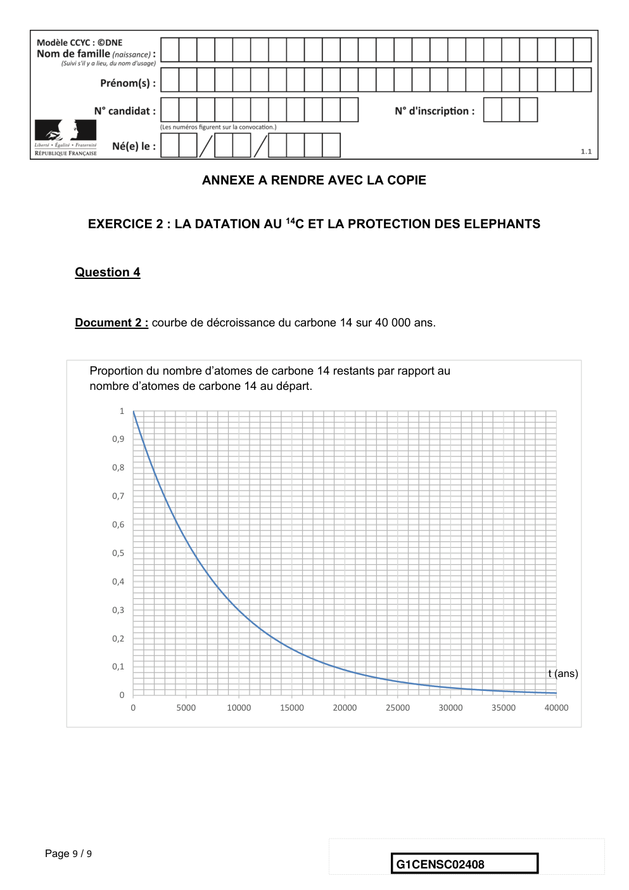

# e3c-enseignement-scientifique-premiere-02408-sujet-officiel

> Source : `../../../../pdf_version/02_es_ponctuelle/e3c/2021/e3c-enseignement-scientifique-premiere-02408-sujet-officiel.pdf` — conversion Markdown (texte + visuels utiles).
> Stratégie : [STRATEGIE_MARKDOWN.md](../../../../STRATEGIE_MARKDOWN.md)

---

## Page 1

ÉPREUVES COMMUNES DE CONTRÔLE CONTINU

      CLASSE : Première

      E3C : ☐ E3C1 ☒ E3C2 ☐ E3C3

      VOIE : ☒ Générale ☐ Technologique ☐ Toutes voies (LV)

      ENSEIGNEMENT : Enseignement scientifique
      DURÉE DE L’ÉPREUVE : 2h
      Niveaux visés (LV) : LVA               LVB
      Axes de programme :

      CALCULATRICE AUTORISÉE : ☒Oui ☐ Non

      DICTIONNAIRE AUTORISÉ :           ☐Oui ☒ Non

      ☒ Ce sujet contient des parties à rendre par le candidat avec sa copie. De ce fait, il ne peut être
      dupliqué et doit être imprimé pour chaque candidat afin d’assurer ensuite sa bonne numérisation.

      ☐ Ce sujet intègre des éléments en couleur. S’il est choisi par l’équipe pédagogique, il est
      nécessaire que chaque élève dispose d’une impression en couleur.

      ☐ Ce sujet contient des pièces jointes de type audio ou vidéo qu’il faudra télécharger et jouer le jour
      de l’épreuve.
      Nombre total de pages : 9

Page 1 / 9
                                                                            G1CENSC02408

---

## Page 2

EXERCICE 1
                              L’HISTOIRE DE L’ÂGE DE LA TERRE
      « La Terre a un âge et cet âge a une histoire peu banale. Calculé à 4000 ans avant
      J.-C. à la Renaissance, il sera estimé à quelques dizaines de millions d’années à la
      fin du XIXème siècle. Il est maintenant fixé à 4,55 milliards d’années. Comment notre
      planète a-t-elle pu vieillir de plus de 4 milliards d’années en 400 ans ? ».
      Krivine, H. Histoire de l’âge de la Terre. En ligne : http://www.cnrs.fr

      L’exercice consiste à étudier quelques aspects de l’évolution des savoirs
      scientifiques concernant l’âge de la Terre au cours du XIXe siècle.
      Document 1. Un exemple de destruction d’une falaise due à l’érosion.

                                                                          Le “Grind of the
                                                                          Navir” correspond à
                                                                          une ouverture faite
                                                                          par la mer dans une
                                                                          falaise des îles
                                                                          Shetland. Cette
                                                                          ouverture est élargie
                                                                          d’hiver en hiver par
                                                                          la houle qui s’y
                                                                          engouffre
                                                                          Lyell, C. (1833).
                                                                          Principles of geology.
                                                                          Sixième édition.

Page 2 / 9
                                                                   G1CENSC02408

---

## Page 3

Document 2. L’argument des temps de sédimentation et d’érosion par Charles
      Darwin, extrait de « L’Origine des espèces » (1859).
      “Ainsi que Lyell l’a très justement fait remarquer, l’étendue et l’épaisseur de nos
      couches de sédiments sont le résultat et donnent la mesure de la dénudation1 que la
      croûte terrestre a éprouvée ailleurs. Il faut donc examiner par soi-même ces énormes
      entassements de couches superposées, étudier les petits ruisseaux charriant de la
      boue, contempler les vagues rongeant les antiques falaises, pour se faire quelque
      notion de la durée des périodes écoulées [...]. Il faut surtout errer le long des côtes
      formées de roches modérément dures, et constater les progrès de leur
      désagrégation. [...] Rien ne peut mieux nous faire concevoir ce qu’est l’immense
      durée du temps, selon les idées que nous nous faisons du temps, que la vue des
      résultats si considérables produits par des agents atmosphériques2 qui nous
      paraissent avoir si peu de puissance et agir si lentement. Après s’être ainsi
      convaincu de la lenteur avec laquelle les agents atmosphériques et l’action des
      vagues sur les côtes rongent la surface terrestre, il faut ensuite, pour apprécier la
      durée des temps passés, considérer, d’une part, le volume immense des rochers qui
      ont été enlevés sur des étendues considérables, et, de l’autre, examiner l’épaisseur
      de nos formations sédimentaires. [...]
      J’ai vu, dans les Cordillères4, une masse de conglomérat4 dont j’ai estimé l’épaisseur
      à environ 10 000 pieds [3km] ; et, bien que les conglomérats aient dû probablement
      s’accumuler plus vite que des couches de sédiments plus fins, ils ne sont cependant
      composés que de cailloux roulés et arrondis qui, portant chacun l’empreinte du
      temps, prouvent avec quelle lenteur des masses aussi considérables ont dû
      s’entasser. [...] M. Croll démontre, relativement à la dénudation produite par les
      agents atmosphériques, en calculant le rapport de la quantité connue de matériaux
      sédimentaires que charrient annuellement certaines rivières, relativement à
      l'entendue des surfaces drainées, qu'il faudrait six millions d'années pour désagréger
      et pour enlever au niveau moyen de l'aire totale qu'on considère une épaisseur de
      1000 pieds [305 mètres] de roches. Un tel résultat peut paraitre étonnant, et le serait
      encore si, d'après quelques considérations qui peuvent faire supposer qu'il est
      exagèré, on le réduisait à la moitié ou au quart. Bien peu de personnes, d'ailleurs, se
      rendent un compte exact de ce que signifie réellement un million”.

      Darwin, C. Du laps de temps écoulé, déduit de l’appréciation de la rapidité des
      dépôts et de l’étendue des dénudations. L'Origine des espèces. (p. 393 - 398).
                                                    Voir suite du document 2 page suivante

Page 3 / 9
                                                                G1CENSC02408

---

## Page 4

Glossaire :
      1 - La dénudation correspond à l’effacement des reliefs par érosion.
      2 - Les agents atmosphériques désignent les agents responsables de l’érosion
      comme la pluie, le gel, le vent.
      3- Les Cordillères désignent une chaîne de montagnes.
      4 - Un conglomérat est une roche issue de la dégradation mécanique d'autres roches
      et composée de sédiments liés par un ciment naturel.

      Document 3. L’argument du temps de refroidissement par William Thomson,
      également appelé Lord Kelvin (1824-1907).
      “On constate aujourd’hui que lorsqu’on s’enfonce sous la Terre on gagne en moyenne de
      l’ordre de 3 °C tous les 100 mètres. À la naissance de la Terre, ce gradient était beaucoup
      plus élevé, presque infini : on passait très rapidement – c’est-à-dire sur une très courte
      distance – de la température (basse) de surface à la température (élevée) du cœur ; puis le
      froid, petit à petit, gagne les profondeurs et le gradient diminue, pour atteindre sa valeur
      actuelle. La façon dont ce gradient diminue avec le temps peut être déterminée
      théoriquement grâce à l’équation de Fourier5 : [...] on en déduit le temps nécessaire pour
      faire baisser le gradient de température jusqu’à sa valeur actuelle. [...] Kelvin aboutit en
      1863 à la fourchette 20-400 millions d’années. [...] La validité de l’équation de Fourier,
      toujours testée avec succès, semble impossible à mettre en défaut ; elle avait presque la
      même autorité que la loi de la gravitation. [...]

      Certainement un des plus grands physiciens de son temps, Kelvin jouissait d’une autorité
      immense ; de plus son évaluation semblait confirmée, comme nous l’avons vu, par d’autres
      méthodes indépendantes. Aussi les temps – relativement – courts des physiciens vont être
      finalement acceptés par la communauté scientifique dans la seconde moitié du XIXème
      siècle : après tout, une Terre chaude pouvait avoir accéléré les processus physico-
      chimiques. Mais Charles Darwin (1809-1882) n’y croyait pas.”

      Krivine, H. L'Âge de la Terre.

      Glossaire :
      5 - L'équation de Fourier ou équation de la chaleur est une équation introduite
      initialement en 1807 par Joseph Fourier qui permet de décrire la propagation de la
      chaleur dans un corps.

Page 4 / 9
                                                                     G1CENSC02408

---

## Page 5

1 - À partir des documents 1 et 2, présenter les arguments sur lesquels se fonde
      Charles Darwin pour déterminer l’âge de la Terre.

      2– Dans le document 2, Darwin cite l’exemple de l’érosion de conglomérats observés
      dans les Cordillères, une chaîne de montagnes, mais ne calcule pas explicitement la
      durée nécessaire à cette érosion. Proposer un ordre de grandeur pour cette durée,
      compte tenu des analyses de M. Croll et justifier votre réponse.

      3- À partir du document 3, donner l’âge de la Terre proposé par William Thomson et
      expliquer la façon dont il a abouti à ce résultat (Lord Kelvin).

      4 – Aujourd’hui, l’âge de la Terre déterminé par les scientifiques est de plus de
      4,5.109 ans. Proposer une réponse synthétique à la question posée par H. Krivine :
      « comment notre planète a-t-elle pu vieillir de plus de 4 milliards d’années en
      400 ans ? »

      Une rédaction structurée et argumentée est attendue.

                                         EXERCICE 2

               LA DATATION AU 14C ET LA PROTECTION DES ELEPHANTS

      L’Union européenne a interdit le commerce de l’ivoire depuis 1989, à l’exception de
      celui des antiquités acquises avant 1947.
      Selon un rapport remis à la Commission européenne en juillet 2018, l’ivoire vendu en
      Europe proviendrait pourtant essentiellement de défenses d’éléphants abattus
      récemment. Ce rapport s’appuie sur des résultats obtenus par datation au carbone
      14C de l’ivoire saisie par les autorités.

      Les trafiquants contournent la loi en faisant passer l’ivoire récent pour de l’ivoire
      ancien.

Page 5 / 9
                                                               G1CENSC02408

---

## Page 6

Document 1 : Principe de la datation au 14C

      « Le carbone 14 (14C) est un isotope radioactif du carbone. Sa demi-vie est de 5 730 ans.
      Se formant dans la haute atmosphère de la Terre, il existe 1 atome de carbone 14 pour
      1 000 milliards de carbone 12 (isotope non radioactif). Comme tout isotope du carbone, le
      carbone 14 se combine avec l’oxygène de notre atmosphère pour former du CO 2 (dioxyde
      de carbone). Ce CO2 est assimilé par les organismes vivants tout au long de leur vie :
      respiration, alimentation…Lorsque les organismes meurent, ils n’assimilent plus le CO2. La
      quantité de carbone 14 présente dans les organismes diminue alors au cours du temps de
      façon exponentielle, tandis que celle de carbone 12 reste constante.

      La datation repose sur la comparaison du rapport entre les quantités de carbone 12 et de
      carbone 14 contenues dans un échantillon avec celui d’un échantillon standard de
      référence. On déduit de cette comparaison « l’âge carbone 14 » de l’échantillon qu’on
      cherche à dater. Cet « âge carbone 14 » est ensuite traduit en âge réel (ou « âge
      calendaire »), en le comparant à une courbe-étalon, réalisée par les chercheurs à force de
      nombreuses mesures complémentaires. On peut ainsi en déduire l'âge de l’objet étudié et
      remonter jusqu'à 50 000 ans environ (au-delà, la technique n’est pas assez précise). »

                                                                                    Source : CEA

      Partie A
      1- Parmi les propositions suivantes, quelle est celle qui correspond à la désintégration du
      carbone 14 ? Il est rappelé que la notation −10𝑒 désigne conventionnellement un électron.

                  18    14   4
             a)    8𝑂 → 6𝐶 + 2𝐻𝑒
                  14    14     0
             b)    6𝐶 → 7𝑁 + −1𝑒
                  6     8      14
             c)   2𝐻𝑒 + 4𝐵𝑒 → 6𝐶

      2- Le document 1 indique que la demi-vie du carbone 14 est de 5730 ans. Expliquer le terme
      « demi-vie ».
      3- On considère un échantillon d’ivoire d’éléphant contenant à un instant donné 16 milliards
      de noyaux de carbone 14. Calculer le nombre de noyaux de carbone 14 restants au bout de :
             3-a- 5 730 ans.
             3-b- 11 460 ans.

Page 6 / 9
                                                                     G1CENSC02408

---

## Page 7

Document 2 : Courbe de décroissance du carbone 14 sur 40 000 ans.

             Proportion du nombre d’atomes de carbone 14 restants par
             rapport au nombre d’atomes de carbone 14 au départ.
                 1

                0,9

                0,8

                0,7

                0,6

                0,5

                0,4

                0,3

                0,2

                0,1
                                                                                              t (ans)
                 0
                      0    5000      10000    15000     20000    25000     30000     35000    40000

      4- Repérer sur le graphique du document 2 la valeur de la demi-vie du carbone 14. On fera
      figurer les traits de construction sur la courbe reproduite dans l’annexe à rendre avec la
      copie.

      5- Estimer la proportion du nombre de noyaux de carbone 14 restants après 25 000 ans.

      Partie B
      On s’intéresse désormais à la datation au carbone 14 d’échantillons d’ivoire plus récents.
      Sur une période de 100 ans, on peut approcher la portion de courbe du document 2 par un
      segment de droite représenté dans le document 3 ci-dessous.

      6- En 2019, l’analyse d’un échantillon d’ivoire d’éléphant a permis d’estimer à 0,994 la
      proportion d’atomes de carbone 14 restants par rapport au nombre initial d’atomes de
      carbone 14.

      6-a- En utilisant le document 3, dater la mort de l’éléphant.

      6-b- Cet ivoire provient-il d’un éléphant abattu illégalement ? Justifier la réponse.

Page 7 / 9
                                                                         G1CENSC02408

---

## Page 8

Document 3 : décroissance radioactive du carbone 14 sur 100 ans.

         Proportion du nombre d’atomes de carbone 14 restants par
         rapport au nombre d’atomes de carbone 14 au départ.
                 1
              0,999
              0,998
              0,997
              0,996
              0,995
              0,994
              0,993
              0,992
              0,991
               0,99
              0,989
                                                                                             t (ans)
              0,988
                      0   10    20      30     40      50      60     70      80      90     100

      7- L’objectif des trois sous-questions suivantes est d’étudier la validité du modèle affine
      présenté dans le document 3 pour un nombre d’années supérieur à 100.

      7-a- On note 𝑓 la fonction affine ayant pour représentation graphique la droite du
      document 3. Parmi les expressions suivantes, dans lesquelles t est exprimé en années
      choisir celle de 𝑓 :

             a) 𝑓(𝑡) = −1,2 × 10−4 𝑡 + 1
             b) 𝑓(𝑡) = 1,2 × 10−4 𝑡 + 1
             c) 𝑓(𝑡) = −8,3 × 102 𝑡 + 1

      7-b- Calculer 𝑓(5730).

      7-c- Expliquer pourquoi on peut en déduire que ce modèle n’est pas pertinent pour des
      durées comparables à une demi-vie.

Page 8 / 9
                                                                       G1CENSC02408

---

## Page 9

ANNEXE A RENDRE AVEC LA COPIE

         EXERCICE 2 : LA DATATION AU 14C ET LA PROTECTION DES ELEPHANTS

      Question 4

      Document 2 : courbe de décroissance du carbone 14 sur 40 000 ans.

         Proportion du nombre d’atomes de carbone 14 restants par rapport au
         nombre d’atomes de carbone 14 au départ.

              1

             0,9

             0,8

             0,7

             0,6

             0,5

             0,4

             0,3

             0,2

             0,1
                                                                                          t (ans)

              0
                   0     5000      10000    15000     20000    25000      30000   35000   40000

Page 9 / 9
                                                                 G1CENSC02408

