# e3c-enseignement-scientifique-premiere-02411-sujet-officiel

> Source : `../../../../pdf_version/02_es_ponctuelle/e3c/2021/e3c-enseignement-scientifique-premiere-02411-sujet-officiel.pdf` — conversion Markdown (texte + visuels).
> Stratégie : [STRATEGIE_MARKDOWN.md](../../../../STRATEGIE_MARKDOWN.md)

---

## Page 1

ÉPREUVES COMMUNES DE CONTRÔLE CONTINU

       CLASSE : Première
       E3C : ☐ E3C1 ☒ E3C2 ☐ E3C3

        VOIE : ☒ Générale ☐ Technologique ☐ Toutes voies (LV)

       ENSEIGNEMENT : Enseignement Scientifique
       DURÉE DE L’ÉPREUVE : 2h00
       Niveaux visés (LV) : LVA                LVB
       Axes de programme :

       CALCULATRICE AUTORISÉE : ☒Oui ☐ Non

       DICTIONNAIRE AUTORISÉ :            ☐Oui ☐ Non

        ☐ Ce sujet contient des parties à rendre par le candidat avec sa copie. De ce fait, il ne peut être
        dupliqué et doit être imprimé pour chaque candidat afin d’assurer ensuite sa bonne numérisation.
        ☐ Ce sujet intègre des éléments en couleur. S’il est choisi par l’équipe pédagogique, il est
        nécessaire que chaque élève dispose d’une impression en couleur.
        ☐ Ce sujet contient des pièces jointes de type audio ou vidéo qu’il faudra télécharger et jouer le
        jour de l’épreuve.
        Nombre total de pages : 10

Page 1 / 9

                                                                            G1CENSC02411

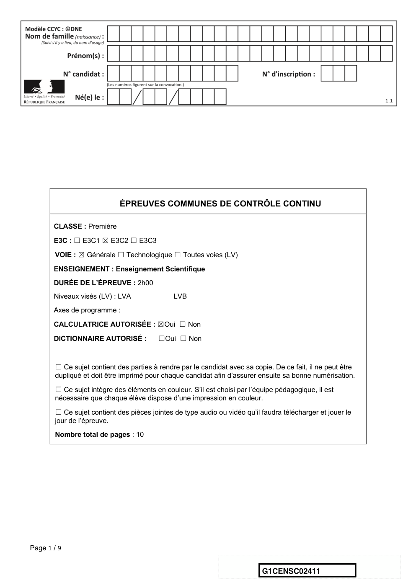

---

## Page 2

EXERCICE 1

                                                  IMPLANT COCHLÉAIRE

      L’implant cochléaire est un dispositif auditif destiné aux personnes atteintes d’une
      surdité sévère ou profonde. Il transforme les sons en signaux électriques envoyés
      directement au nerf auditif grâce à des électrodes posées chirurgicalement.
               Document 1. Fonctionnement d’un implant cochléaire

                                                                                                     osselets

                                                                                                cochlée

       Modifié d’après : https://idataresearch.com/cascination-and-med-el-collaborate-on-state-of-the-art-cochlear-implantation-
       method/

       Le microphone             capte les sons en provenance de l’extérieur.
       L’audio-processeur              numérise les sons.
       L’antenne           transmet les signaux numériques à l’implant situé sous la peau.
       L’implant          envoie des signaux électriques dans les électrodes                         situées dans la cochlée
       (comprenant les cellules sensorielles ciliées) ⑧.
       Les fibres du nerf auditif captent les signaux électriques et les transmettent au cerveau.
      1- Indiquer les légendes des structures numérotées 6, 9, 10, 11 et 12.

Page 2 / 9

                                                                                  G1CENSC02411

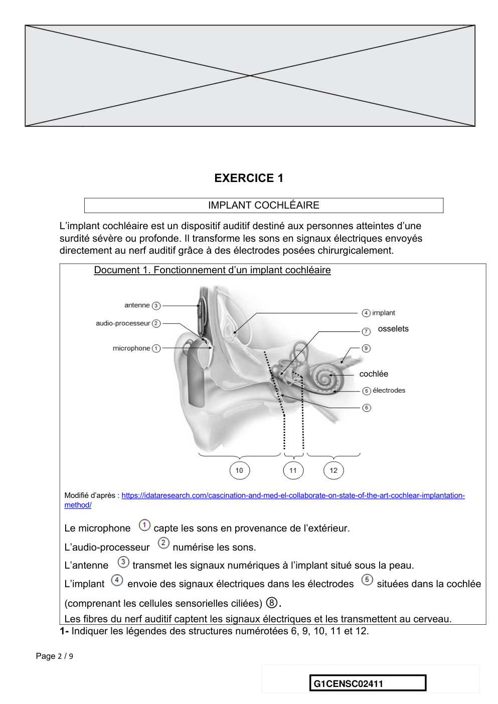

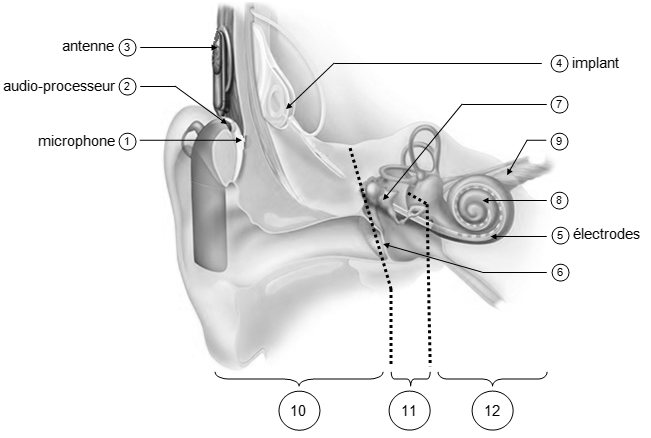

---

## Page 3

2- Certaines personnes subissent une surdité consécutive à un dommage des cellules
      ciliées de l’oreille interne. Elles peuvent alors être appareillées avec un implant
      cochléaire.
      Expliquer le rôle des cellules ciliées de l’oreille interne dans le cas d’une audition
      normale et comment l’implant cochléaire permet de corriger la surdité.
      3- Le microphone d’un implant cochléaire capte un son périodique en provenance de
      l’extérieur. Un motif élémentaire de période T de ce son est représenté sur le
      document 2.
      Déterminer la valeur de la fréquence f du son capté par le microphone.
       Document 2. Son capté par le microphone et numérisation par l’audio-processeur

              Source : http://www.ostralo.net/3_animations/js/CAN/index_v2nmoins1.htm

      4- Déterminer graphiquement la valeur de la période d’échantillonnage Te utilisée
      pour cette numérisation puis justifier que la valeur de la fréquence d’échantillonnage
      fe est égale à 10 000 Hz.
      5-a- Sachant qu’une quantification sur n bits permet 2n paliers numériques, indiquer,
      en le justifiant, pourquoi ici n=3 .
Page 3 / 9

                                                                            G1CENSC02411

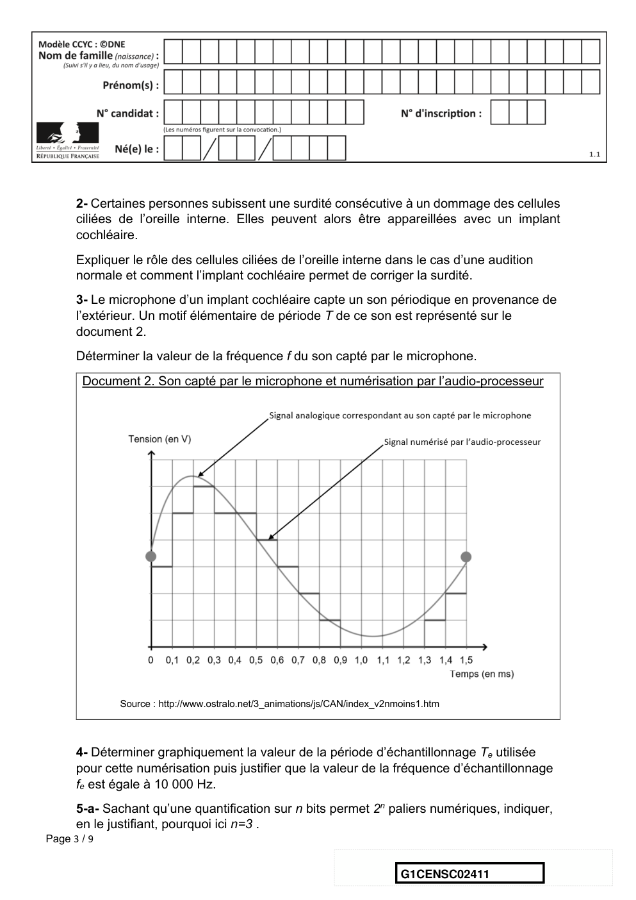

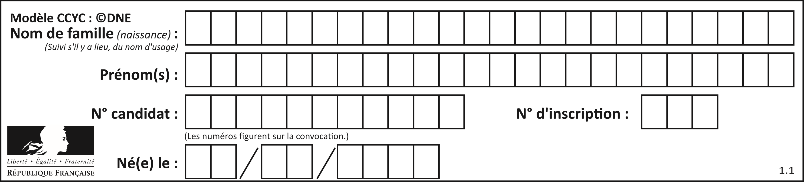

---

## Page 4

5-b- La taille L en octet d’un fichier audio est donnée par la formule :
                                                          n
                                               L = fe ×     × ∆t
                                                          8
      avec : fe = fréquence d’échantillonnage (en Hertz) ; n= quantification (en bit) ; ∆t=
      durée (en seconde).
      Pendant une journée, l’audio-processeur numérise en moyenne 10 heures de sons
      différents. Calculer la taille L d’un fichier audio équivalent à une journée de
      fonctionnement de l’implant cochléaire.

Page 4 / 9

                                                                   G1CENSC02411

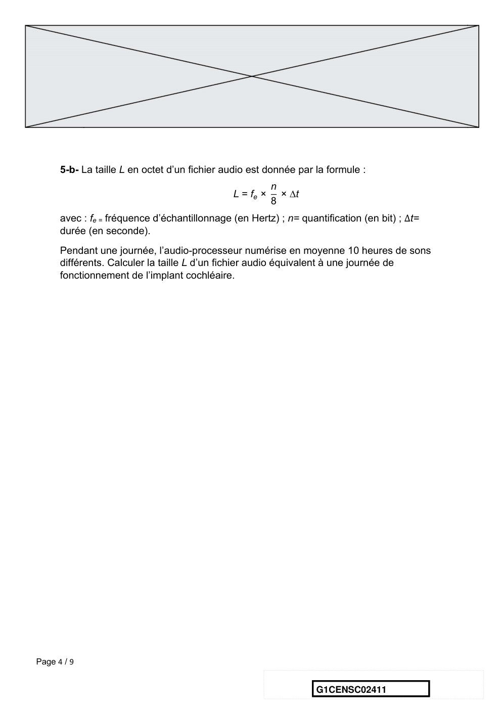

---

## Page 5

EXERCICE 2
                                            LA GUITARE ÉLECTRIQUE

      La guitare électrique a été créée dans les années 1920 aux États-Unis.
      Elle produit des sons grâce à des micros qui captent et transforment les vibrations
      des cordes en signaux électriques.

                                        Mi
                                        cr
                                        os                 C               Cl
                                                           or              és
                                                           d

      Source image : http://genresmusicaux.weebly.com/la-guitare-eacutelectrique.html
      Document 1 : Fréquence des sons produits par les cordes à vide de la guitare
      électrique
      La guitare électrique est composée de six cordes métalliques. Une corde est dite « à
      vide » lorsqu'elle vibre sur toute sa longueur.
      Les fréquences des notes produites par les cordes à vide d’une guitare bien
      accordée sont données dans le tableau suivant :

             n° de la corde             1         2        3        4           5           6

                  note                  mi1       la1      ré2      sol2        si2     mi3
     (le chiffre en indice indique le
     numéro de l'octave)
      1 - Rappeler la relation liant les fréquences de deux notes séparées par une octave.
      En déduire  la fréquence
            fréquence  (en Hz) du son    émis par
                                       82,4       la corde n°6 jouée 196,0
                                                110,0                à vide. 246,9

Page 5 / 9

                                                                 G1CENSC02411

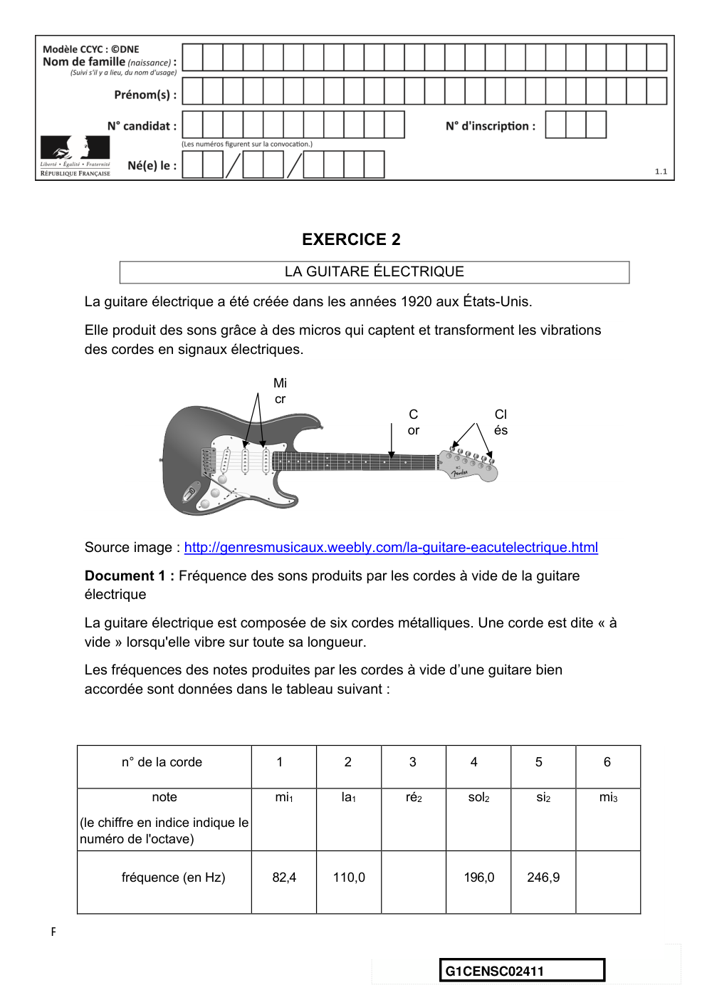

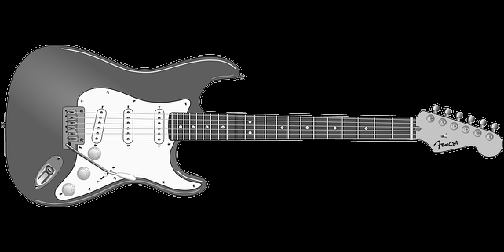

---

## Page 6

2- La gamme tempérée, représentée ci-dessous, est construite en divisant l’octave
      en douze intervalles égaux (au sens où les rapports entre deux fréquences
      successives sont égaux), appelés demi-tons.

      Parmi les algorithmes ci-dessous, indiquer celui qui permet de calculer la fréquence
      du Ré2 à partir du Sol2.
      Calculer cette fréquence.

       Algorithme 1               Algorithme 2               Algorithme 3               Algorithme 4
       𝑓 ← 196                    𝑓 ← 196                    𝑓 ← 196                    𝑓 ← 196
       Pour i allant de 1 à 5 :   Pour i allant de 1 à 5 :   Pour i allant de 1 à 6 :   Pour i allant de 1 à 6 :
                         *                          *                         -                             -
             𝑓 ←𝑓÷2     *+             𝑓 ←𝑓×2      *+                𝑓 ← 𝑓 ÷ 2-.                𝑓 ← 𝑓 × 2-.
       Fin Pour                   Fin Pour                   Fin Pour                   Fin Pour

      3 - Comme tous les instruments de musique, une guitare électrique doit être
         accordée. Il faut pour cela vérifier que les fréquences des sons émis par les
         cordes à vide sont égales à celles du document 1.

         Un système d'acquisition a permis d’enregistrer et de visualiser le signal
         correspondant au son émis par la corde n°2 d’une guitare électrique jouée à vide.

Page 6 / 9

                                                                         G1CENSC02411

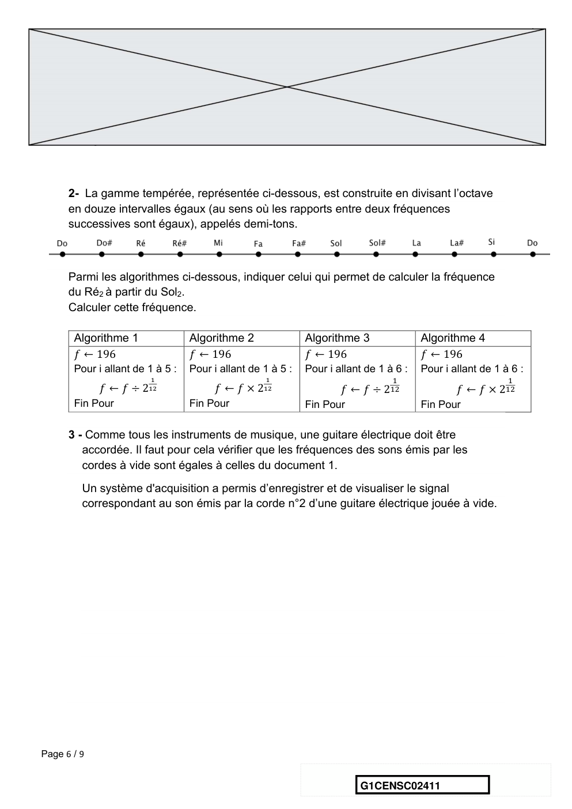

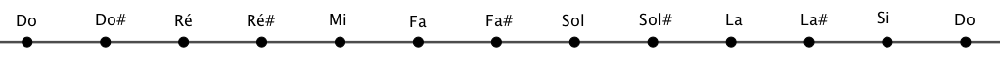

---

## Page 7

Document 2 : Signal correspondant au son émis par la corde n°2 jouée à vide

             Source : Auteur

      Indiquer si la corde n°2 de la guitare électrique est accordée. Justifier la réponse.

      4- La fréquence du son émis par une corde mise en vibration dépend de plusieurs
      paramètres dont la longueur L et la force de tension T de la corde.

Page 7 / 9

                                                                  G1CENSC02411

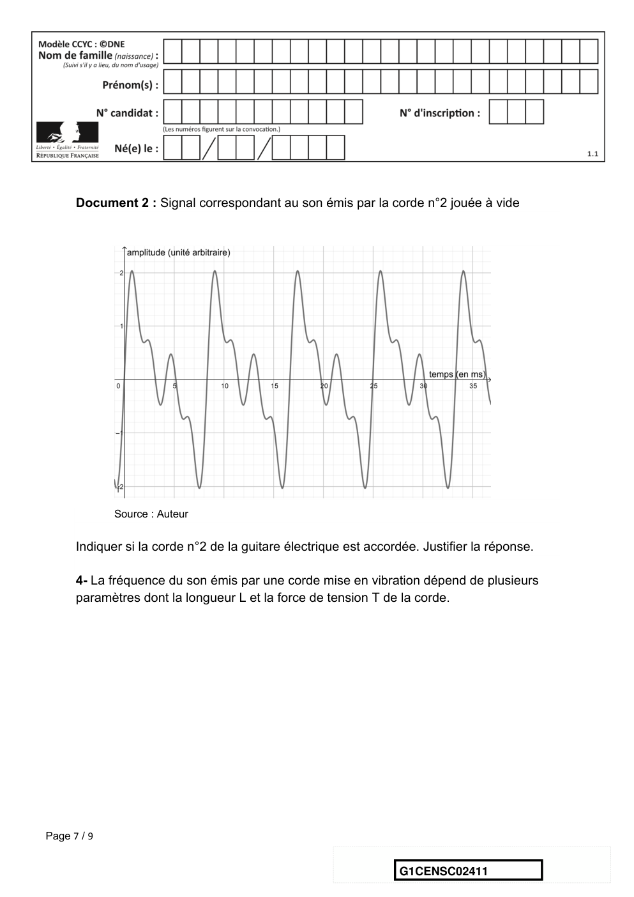

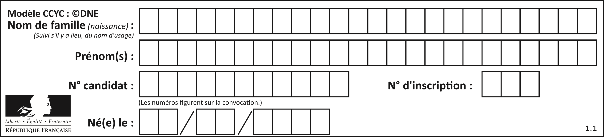

---

## Page 8

Document 3 : Étude de l’influence de différents paramètres sur la fréquence du son émis
 par une corde

 Expérience 1 :                                                                         Expérience 2 :
 On fait varier la longueur L de la corde et                    On fait varier la force de tension T de la corde et
 on mesure la fréquence f du son émis (la                       on mesure la fréquence f du son émis (la
 force de tension T de la corde est                             longueur L de la corde est maintenue
 maintenue constante).                                          constante).

                         700
                         600                                                           80
                                                                 Fréquence f (en Hz)
  Fréquence f (en Hz)

                         500                                                           70
                                                                                       60
                         400
                                                                                       50
                         300                                                           40
                         200                                                           30
                         100                                                           20
                                                                                       10
                           0
                                                                                        0
                             0                50          100
                                                                                            0            50          100   150
                         Longueur de la corde L (en cm)
                                                                                            Tension T de la corde (en N)

                        4-a- Indiquer comment varie la fréquence de la corde en fonction de la longueur.
                        4-b- Indiquer comment varie la fréquence de la corde en fonction de la tension.

                        4-c- On propose ci-dessous quatre relations entre la fréquence 𝑓 du son produit par
                        une corde et les paramètres qui l’influencent. 𝑘 est une constante qui dépend de la
                        corde.

Page 8 / 9

                                                                                                        G1CENSC02411

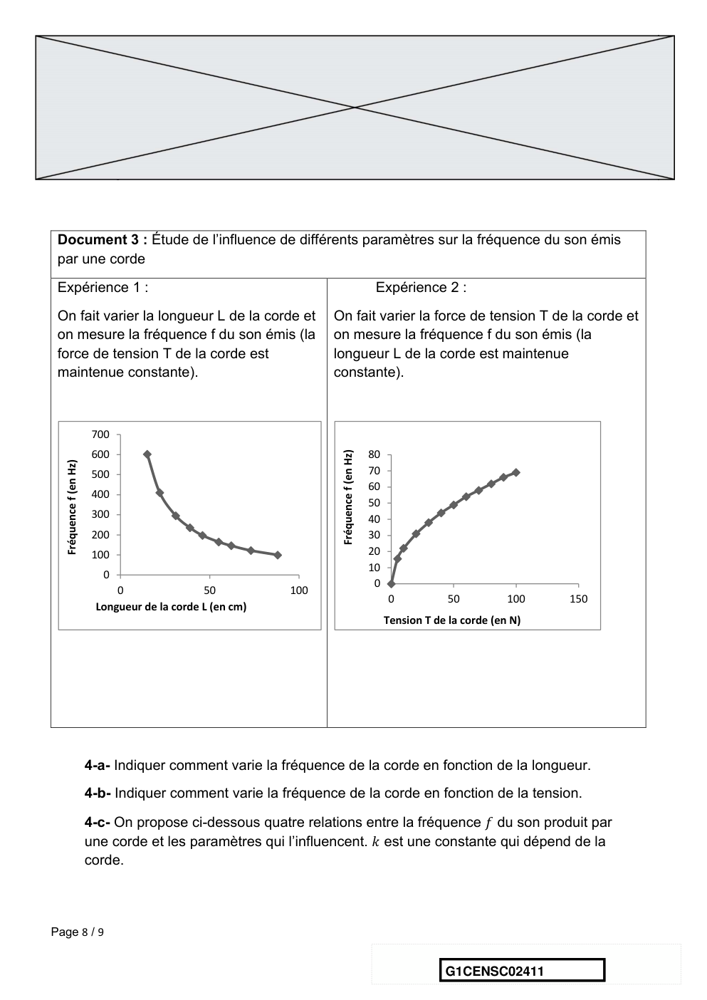

---

## Page 9

-                                 -
             Relation A : 𝑓 = 𝑘 × 1 × √𝑇       Relation B : 𝑓 = 𝑘 × 1 × 𝑇 ;

             Relation C : 𝑓 = 𝑘 × 𝐿 × √𝑇        Relation D : 𝑓 = 𝑘√𝑇 × 𝐿.
      Choisir et recopier sur la copie la relation qui convient.

      4-d- Un guitariste souhaite accorder sa guitare. Pour cela, il peut agir sur les
      différentes clés pour augmenter ou diminuer la tension des cordes. Avant accord, le
      son émis par la corde n°4 à vide est de 192,0 Hz.
      Indiquer comment il doit agir pour accorder la corde n°4 de sa guitare.

Page 9 / 9

                                                                   G1CENSC02411

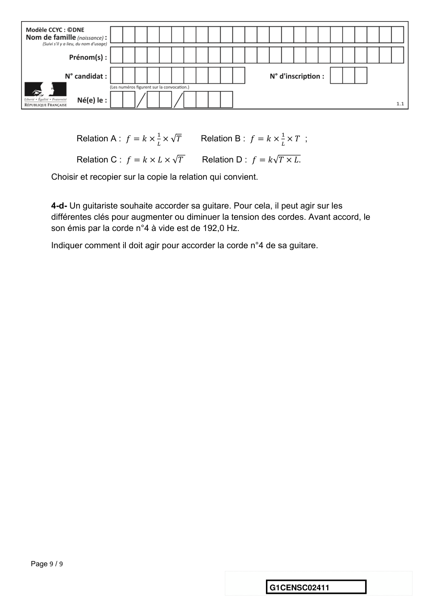

