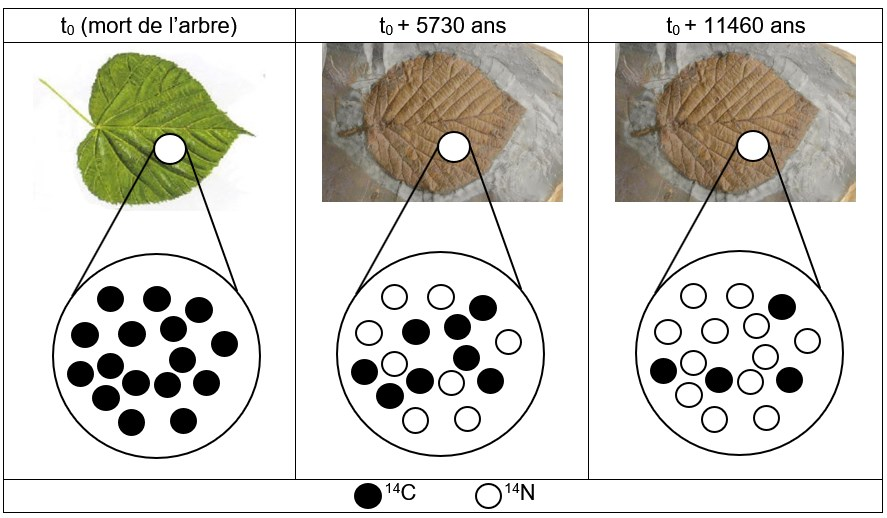
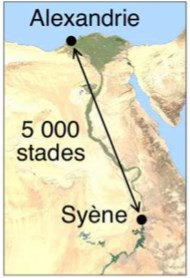
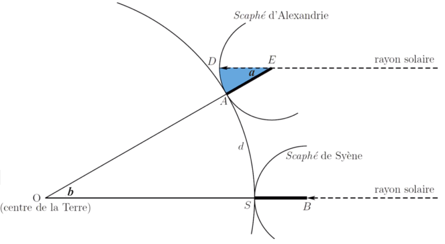
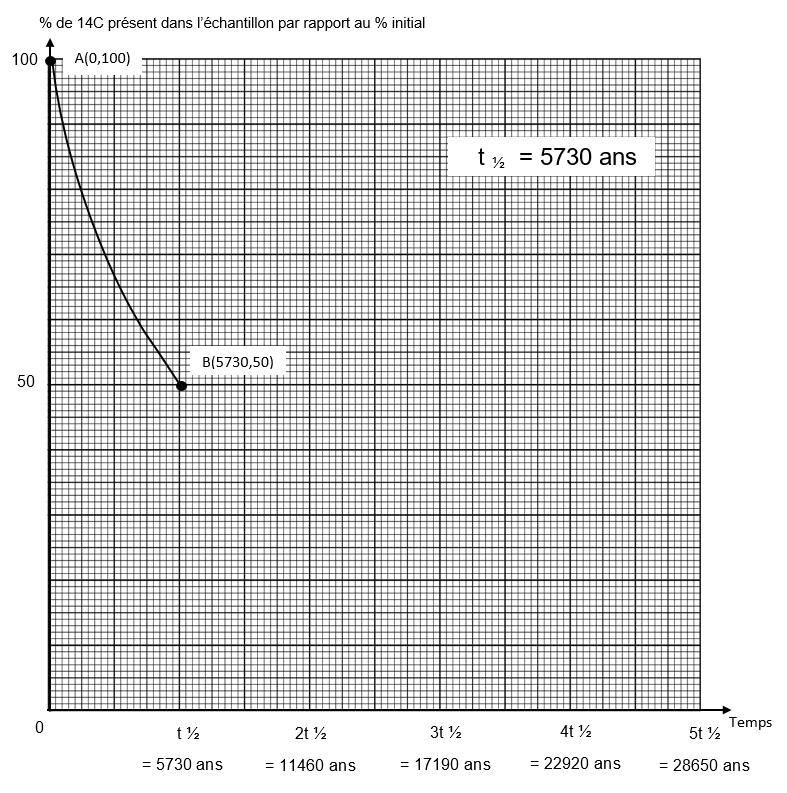

# e3c-enseignement-scientifique-premiere-02414-sujet-officiel

> Source : `../../../../pdf_version/02_es_ponctuelle/e3c/2021/e3c-enseignement-scientifique-premiere-02414-sujet-officiel.pdf` — conversion Markdown (texte + visuels utiles).
> Stratégie : [STRATEGIE_MARKDOWN.md](../../../../STRATEGIE_MARKDOWN.md)

---

## Page 1

ÉPREUVES COMMUNES DE CONTRÔLE CONTINU

      CLASSE : Première

      E3C : ☐ E3C1 ☒ E3C2 ☐ E3C3

      VOIE : ☒ Générale ☐ Technologique ☐ Toutes voies (LV)

      ENSEIGNEMENT : Enseignement scientifique
      DURÉE DE L’ÉPREUVE : 2h
      Niveaux visés (LV) : LVA               LVB
      Axes de programme :

      CALCULATRICE AUTORISÉE : ☒Oui ☐ Non

      DICTIONNAIRE AUTORISÉ :           ☐Oui ☒ Non

      ☒ Ce sujet contient des parties à rendre par le candidat avec sa copie. De ce fait, il ne peut être
      dupliqué et doit être imprimé pour chaque candidat afin d’assurer ensuite sa bonne numérisation.

      ☐ Ce sujet intègre des éléments en couleur. S’il est choisi par l’équipe pédagogique, il est
      nécessaire que chaque élève dispose d’une impression en couleur.

      ☐ Ce sujet contient des pièces jointes de type audio ou vidéo qu’il faudra télécharger et jouer le jour
      de l’épreuve.
      Nombre total de pages : 7

Page 1 / 7
                                                                            G1CENSC02414

---

## Page 2

EXERCICE 1

             LA DATATION DE L’OCCUPATION D’UNE GROTTE PAR HOMO SAPIENS
      Les analyses stylistiques des peintures et des objets ornant une grotte d’Europe de
      l’ouest ont permis aux paléoanthropologues de dater son occupation par Homo
      sapiens à la fin du Paléolithique supérieur.
      Un désaccord persiste cependant entre les scientifiques lorsqu’il s’agit de préciser si
      les peintures et objets ont été réalisés au Gravettien, au Solutréen ou au
      Magdalénien, les trois dernières périodes géologiques du Paléolithique supérieur
      comme l’indique le document ci-dessous.

      Les périodes géologiques de la fin du Paléolithique supérieur

                      Fin du paléolithique supérieur

                Gravettien                         Magdalénien

                                    Solutréen

       -27000 ans              -20000 ans -18000 ans           -12000 ans           0 an       +2000 ans

       27000                   27000         27000               27000
                             D’après https://multimedia.inrap.fr/archeologie-preventive/chronologie-generale

      Remarque : la proportionnalité sur l’échelle des temps n’est pas respectée.

      1. Préciser ce qui distingue un noyau stable d’un noyau radioactif. Définir la demi-vie
      d’un isotope radioactif. Préciser si, pour un échantillon macroscopique contenant cet
      isotope, la demi-vie dépend de la quantité d’isotopes présente initialement.
      2. L’élément carbone présent dans le bois d’un végétal provient de l’air et a été
      assimilé dans le végétal grâce à la photosynthèse au niveau des feuilles. En
      analysant le document ci-dessous, justifier l’utilisation de la méthode de datation au
      carbone 14 pour dater les peintures ornant la paroi de cette grotte.
      3. Compléter la courbe en annexe représentant la décroissance radioactive du
      nombre d’atomes de 14C au cours du temps (annexe à rendre avec la copie – les
      coordonnées des points calculés doivent être précisées).

Page 2 / 7
                                                                            G1CENSC02414

---

## Page 3

4. En s’appuyant sur les documents ci-dessous, expliquer, sous la forme d'une
      courte rédaction argumentée, comment la datation au 14C permet de faire évoluer le
      désaccord entre les scientifiques sur la période de réalisation des peintures.

      Document.
      Principe de la datation au carbone 14
      Le carbone 14 (14C) est un noyau radioactif en proportion constante dans
      l’atmosphère.
      Les êtres vivants, formant la biosphère, échangent entre eux ainsi qu’avec
      l’atmosphère du dioxyde de carbone (CO2) dont une fraction connue comprend du
      carbone 14. Tout être vivant contient donc dans son organisme du 14C en même
      proportion que l’atmosphère..
      À sa mort, un être vivant cesse d’absorber du dioxyde de carbone, par contre le
      carbone 14 qu’il contient continue à se désintégrer.
      En 5730 ans la moitié des atomes de carbone 14 aura disparu d’un échantillon
      macroscopique de cet être vivant. C’est la demi-vie (t ½) de ce noyau radioactif. Au-
      delà de 8 demi-vie, la quantité de 14C présente dans l’échantillon, inférieure à 1 %,
      est trop faible pour que la méthode puisse être utilisée pour dater un évènement.

                                                             Voir fin du document au verso.

Page 3 / 7
                                                                G1CENSC02414

---

## Page 4

Document.
         Décroissance du nombre d’atomes de 14C dans une feuille fossilisée après sa
                                          mort.

                            Grand nombre d’atomes de 14C
                            Grand nombre d’atomes de 14N

                                                              Source : illustration de l’auteur

      Résultats des mesures effectuées sur un fragment de charbon de bois
      prélevé dans la grotte
      Pour réaliser les peintures ornant les parois de la grotte, les êtres humains du
      Paléolithique supérieur ont utilisé du charbon de bois.
      Les mesures, réalisées sur un prélèvement de ce charbon de bois par les
      scientifiques, montrent que la quantité de 14C mesurée en l’an 2000 n’est plus
      égale qu’à 8,0 % de la quantité du 14C initialement présent dans l’échantillon.

Page 4 / 7
                                                             G1CENSC02414

---

## Page 5

EXERCICE 2

                                      Mesure du méridien terrestre
      Eratosthène de Cyrène est un astronome, géographe, philosophe et mathématicien
      grec du IIIe siècle av. J.-C. (né à Cyrène, v. -276 et mort à Alexandrie, Egypte, v. -
      194).
      Eratosthène fut nommé́ à la tête de la bibliothèque d’Alexandrie vers -245 à la
      demande de Ptolémée III, pharaon d’Egypte, et fut précepteur de son fils Ptolémée
      IV.
      Il est célèbre pour avoir établi la première méthode connue de mesure de la
      circonférence de la Terre.

      Document 1 : données
      •      Le 21 juin, à midi, à Syène (Assouan), on voit le fond des puits.
      •      Le 21 juin, à midi, à Alexandrie, on mesure la longueur de l’ombre d’un gnomon* de 1
             mètre. Celle-ci vaut 0,126 mètre.
      (*un gnomon est un instrument astronomique qui visualise par son ombre les déplacements du Soleil.
      Sa forme la plus simple est un bâton planté verticalement dans le sol.)
      •      La distance entre Alexandrie et Syène est estimée à 5000 stades.
      •      Un stade est une unité de longueur correspondant à la longueur du stade d'Olympie, soit
             environ 157,5 mètres.
      •      Alexandrie et Syène sont supposées être sur un même méridien.
      Le soleil étant lointain, on suppose que les rayons qu’il émet sont parallèles.

          Document 2 : Calcul de la circonférence de la Terre par
          la méthode dite d’Ératosthène

Page 5 / 7
                                                                        G1CENSC02414

---

## Page 6

1- Proposer un schéma représentant le gnomon, son ombre et les rayons du soleil
      avec les longueurs données dans le document 1 (il n’est pas demandé que le
      schéma soit à l’échelle).
      2- Calculer la tangente de l’angle 𝑎 formé par le gnomon et le rayon de soleil, et
      démontrer que cet angle mesure environ 7,2 °. On rappelle que dans un triangle
      rectangle, la tangente d’un angle est égale au rapport du côté opposé sur le côté
      adjacent.
      3- À l’aide d’un scaphé (instrument de mesure ancien, sorte de cadran solaire),
      Ératosthène a trouvé que l’angle 𝑎 correspondait à un cinquantième de tour.
      Comparer avec le résultat de la question précédente.
      4- Préciser la distance qui mesure 5000 stades sur la représentation de la Terre du
      document 2.
      5- Justifier que les angles 𝑎 et 𝑏 du document 2 ont la même mesure.
      En déduire la circonférence de la Terre d’abord en stade, puis en kilomètre.
      6- Grâce à des mesures par satellites, on estime aujourd’hui la circonférence de la
      Terre à 40 075 km. Proposer au moins une source d’erreur possible pour la valeur
      estimée par Eratosthène.

Page 6 / 7
                                                               G1CENSC02414

---

## Page 7

ANNEXE A RENDRE AVEC LA COPIE
      EXERCICE 1
      LA DATATION DE L’OCCUPATION D’UNE GROTTE PAR HOMO SAPIENS
      QUESTION 3

Page 7 / 7
                                               G1CENSC02414

