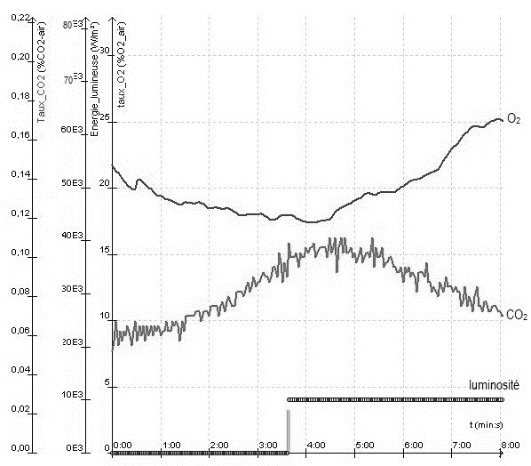
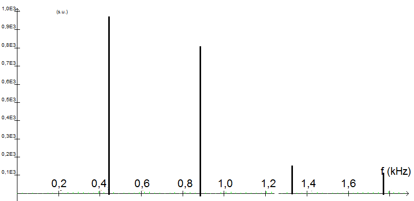
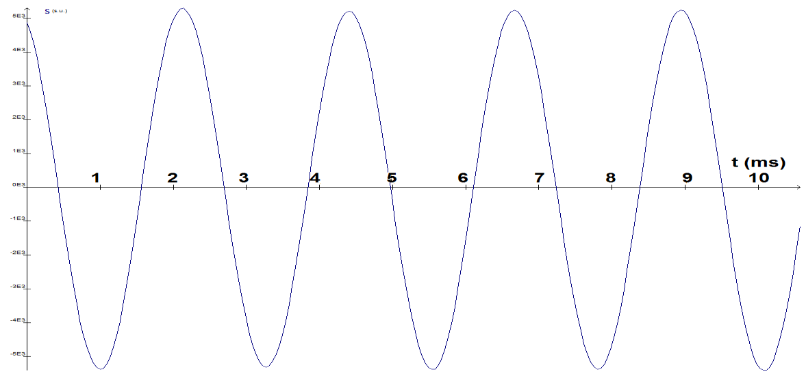

# e3c-enseignement-scientifique-premiere-02417-sujet-officiel

> Source : `../../../../pdf_version/02_es_ponctuelle/e3c/2021/e3c-enseignement-scientifique-premiere-02417-sujet-officiel.pdf` — conversion Markdown (texte + visuels utiles).
> Stratégie : [STRATEGIE_MARKDOWN.md](../../../../STRATEGIE_MARKDOWN.md)

---

## Page 1

ÉPREUVES COMMUNES DE CONTRÔLE CONTINU

      CLASSE : Première

      E3C : ☐ E3C1 ☒ E3C2 ☐ E3C3

      VOIE : ☒ Générale ☐ Technologique ☐ Toutes voies (LV)

      ENSEIGNEMENT : Enseignement scientifique
      DURÉE DE L’ÉPREUVE : 2h
      Niveaux visés (LV) : LVA               LVB
      Axes de programme :

      CALCULATRICE AUTORISÉE : ☒Oui ☐ Non

      DICTIONNAIRE AUTORISÉ :           ☐Oui ☒ Non

      ☒ Ce sujet contient des parties à rendre par le candidat avec sa copie. De ce fait, il ne peut être
      dupliqué et doit être imprimé pour chaque candidat afin d’assurer ensuite sa bonne numérisation.

      ☐ Ce sujet intègre des éléments en couleur. S’il est choisi par l’équipe pédagogique, il est
      nécessaire que chaque élève dispose d’une impression en couleur.

      ☐ Ce sujet contient des pièces jointes de type audio ou vidéo qu’il faudra télécharger et jouer le jour
      de l’épreuve.
      Nombre total de pages : 8

Page 1 / 8
                                                                            G1CENSC02417

---

## Page 2

EXERCICE 1

                                    PRODUCTION D’UN SON

      PARTIE 1 : SPECTRES SONORES ET INSTRUMENTS DE MUSIQUE
      On a enregistré trois sons. Chacun a été produit par l’un des trois instruments
      suivants : un diapason, une flûte traversière, une guitare.

      1- Le son (La 3) produit par le diapason est un son pur. Les autres sons sont des
      sons composés.
      Identifier parmi les trois enregistrements représentés dans l’annexe celui qui
      correspond au son produit par le diapason.

      2- On suppose que, dans les enregistrements étudiés, le son produit par la guitare
      est plus aigu que celui produit par la flûte traversière.

      2-a- Un son plus aigu correspond-il à une fréquence plus élevée ou plus basse ?
      Aucune justification n’est attendue.

      2-b- Identifier, parmi les trois enregistrements représentés dans l’annexe à rendre
      avec la copie celui qui correspond à au son produit par la flûte traversière et celui qui
      correspond à celui de la guitare.
      L’annexe, à rendre avec la copie, fera apparaître les éléments de lecture
      permettant de répondre à la question.

      2-c-Le tableau suivant donne les fréquences des notes de l’octave 3.

Page 2 / 8
                                                                 G1CENSC02417

---

## Page 3

Note             Octave 3
                          Do                  262
                          Ré                  294
                           Mi                 330
                          Fa                  349
                          Sol                 392
                           La                 440
                           Si                 494

      Identifier la note produite par la guitare et la note produite par la flûte traversière.

      3- Pour jouer une note plus aigüe avec la guitare, le musicien devra-t-il raccourcir ou
      allonger la portion de corde qu’il fait vibrer ?
      PARTIE II – STOCKAGE ET COMPRESSION D’UN SIGNAL NUMERIQUE.

      Le tableau ci-dessous donne les caractéristiques de deux formats de stockage du
      son : format CD audio et mp3 à 16kHz.
                                     CD                              mp3
      Fréquence                      44,1 kHz                        16 kHz
      d’échantillonnage
      Nombre de bits pour le         16                              8
      codage
      Nombre de voies                2 (son stéréo)                  1 (son mono)

      La taille d’un fichier, en octets, est donnée par la formule suivante :
                                                𝑄
                                       𝑁 = 𝑓 × 8 × 𝛥𝑡 × 𝑛
      avec :
      𝑁 : taille du fichier (en octet)
      𝑓 : fréquence d’échantillonnage (en Hz)
      𝑄 : nombre de bits de codage

Page 3 / 8
                                                                    G1CENSC02417

---

## Page 4

𝛥𝑡 : durée de l’enregistrement (en s)
      𝑛 : nombre de voies

    4- Calculer la taille d’un fichier correspondant au stockage sur un CD audio d’un
       morceau de musique d’une durée de trente minutes.
    5- Calculer le taux de la compression du format CD au format mp3 à 16kHz, défini
       comme le rapport de la taille du fichier compressé par celle du fichier initial. Le
       résultat sera exprimé en pourcentage.
    6- Expliquer pourquoi on dit que le format mp3 est un format de compression « avec
       pertes ». On précisera notamment ce qui est perdu pour un auditeur.

                                               EXERCICE 2

                                        LA PILE VÉGÉTALE

      Il est possible de produire de l’électricité en installant des électrodes
      dans un sol gorgé d'eau où poussent des plantes telles que le riz.
      Cette technologie permet de convertir l’énergie chimique issue de la
      photosynthèse en énergie électrique. Le rendement de ce dispositif
      reste pour le moment faible mais cela pourrait à terme transformer
      les rizières en unités de production électrique.

      On cherche ici à déterminer si cette technologie peut réellement
      constituer une solution d’avenir.

      Les deux parties peuvent être traitées indépendamment.

      Partie 1. La photosynthèse et ses caractéristiques

      Document 1 : étude expérimentale des échanges gazeux d’une plante
      chlorophyllienne
       On mesure trois paramètres environnementaux d’une enceinte fermée
       hermétiquement et contenant un végétal chlorophyllien :
       - la teneur en dioxygène (O2) – courbe du haut
       - la teneur en dioxyde de carbone (CO2) -courbe du bas-
       - la luminosité reçue par l’enceinte.

Page 4 / 8
                                                                   G1CENSC02417

---

## Page 5

D’après : https://www.pedagogie.ac-nantes.fr

      1- Indiquer sur votre copie si chacune des trois propositions est juste (réponse
      « oui ») ou fausse (réponse « non »). Justifier à l’aide de données chiffrées.

      a- À la lumière, la teneur en O2 augmente dans l’enceinte                    □ oui □ non
      b- À la lumière, la teneur en CO2 augmente dans l’enceinte                   □ oui □ non
      c- La luminosité a un effet sur l’échange gazeux réalisé par le végétal      □ oui □ non

      Partie 2. La conversion de l’énergie chimique en énergie électrique

      Cette partie présente le principe de fonctionnement de la « pile végétale » étudiée et
      ses applications potentielles.

Page 5 / 8
                                                                 G1CENSC02417

---

## Page 6

La plante utilise la photosynthèse pour produire de la matière organique. Autour des
      racines vivent de très nombreux microorganismes qui se nourrissent de la matière
      organique issue du végétal. La réaction chimique correspondante peut être exploitée
      au sein d’une pile comportant deux électrodes dont l’une est positionnées près de la
      racine de la plante et l’autre en est plus éloignée. Cette pile peut délivrer un courant
      électrique qui transporte de l’énergie. On admet que la puissance électrique fournie
      par une « pile végétale » de cette sorte est proportionnelle à la surface que les
      plantes exposées au soleil et qui se trouvent au voisinage des électrodes occupent
      sur le sol.
      2- L’énergie solaire moyenne reçue en une année par unité de surface est égale à
      107 J et on peut estimer en moyenne qu’une plante doit recevoir 20×106 J d’énergie
      solaire pour produire 1 kg de matière organique.
      Montrer que 1 m2 de surface végétale peut produire théoriquement 0,5 kg de matière
      organique au cours d’une année.

      3- On peut estimer qu’une « pile végétale » de 1 m2 de surface fournit une puissance
      de 3 W et que l’énergie moyenne nécessaire à la recharge d’un smartphone est de
      10 Wh.
      Indication : le Watt-heure (Wh) est l’énergie correspondant à une puissance d’un
      Watt fournie pendant une durée d’une heure.

      3-a- Calculer la durée de recharge d’un smartphone avec 1 m2 de surface de « pile
      végétale ».
      3-b- L’énergie moyenne consommée par une famille pendant une année est 3000
      kWh.
      Calculer la surface nécessaire en m2 de surface de « pile végétale » pour fournir
      l’énergie annuelle à une famille.

      4- À partir des arguments issus de l’étude des deux parties de l’exercice et de vos
      connaissances, indiquer un intérêt et une limite au procédé de la « pile végétale ».

Page 6 / 8
                                                                 G1CENSC02417

---

## Page 7

ANNEXE A RENDRE AVEC LA COPIE

                              EXERCICE 1 : PRODUCTION D’UN SON

      Questions 1 et 2b

      Graphique A (Variation d’un signal sonore en fonction du temps)

      Graphique B (Spectre d’un son)

Page 7 / 8
                                                                   G1CENSC02417

---

## Page 8

Graphique C (Variation d’un signal sonore en fonction du temps)

Page 8 / 8
                                                                   G1CENSC02417

