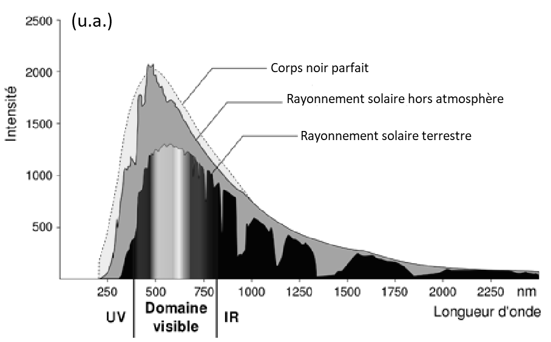
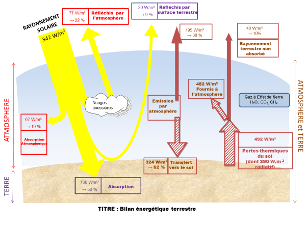
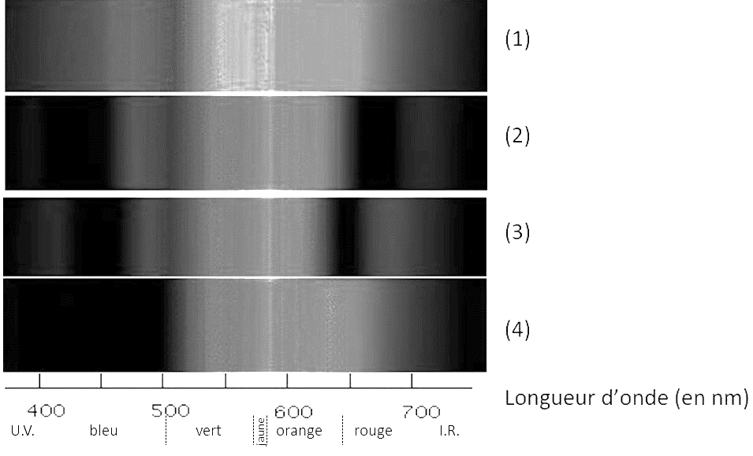
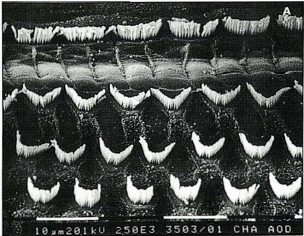
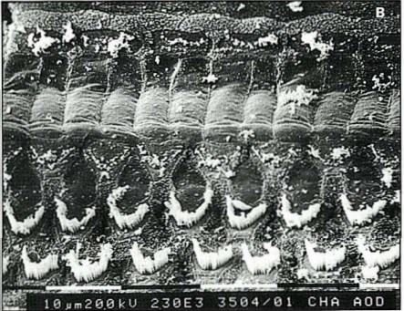
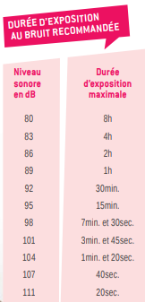

# e3c-enseignement-scientifique-premiere-02420-sujet-officiel

> Source : `../../../../pdf_version/02_es_ponctuelle/e3c/2021/e3c-enseignement-scientifique-premiere-02420-sujet-officiel.pdf` — conversion Markdown (texte + visuels utiles).
> Stratégie : [STRATEGIE_MARKDOWN.md](../../../../STRATEGIE_MARKDOWN.md)

---

## Page 1

ÉPREUVES COMMUNES DE CONTRÔLE CONTINU

      CLASSE : Première

      E3C : ☐ E3C1 ☒ E3C2 ☐ E3C3

      VOIE : ☒ Générale ☐ Technologique ☐ Toutes voies (LV)

      ENSEIGNEMENT : Enseignement scientifique
      DURÉE DE L’ÉPREUVE : 2h
      Niveaux visés (LV) : LVA               LVB
      Axes de programme :

      CALCULATRICE AUTORISÉE : ☒Oui ☐ Non

      DICTIONNAIRE AUTORISÉ :           ☐Oui ☒ Non

      ☐ Ce sujet contient des parties à rendre par le candidat avec sa copie. De ce fait, il ne peut être
      dupliqué et doit être imprimé pour chaque candidat afin d’assurer ensuite sa bonne numérisation.

      ☐ Ce sujet intègre des éléments en couleur. S’il est choisi par l’équipe pédagogique, il est
      nécessaire que chaque élève dispose d’une impression en couleur.

      ☐ Ce sujet contient des pièces jointes de type audio ou vidéo qu’il faudra télécharger et jouer le jour
      de l’épreuve.
      Nombre total de pages : 9

Page 1 / 9
                                                                            G1CENSC02420

---

## Page 2

EXERCICE 1
                         LE SOLEIL, SOURCE DE VIE SUR TERRE ?
      Le Soleil émet un rayonnement électromagnétique dans toutes les directions ; une
      partie de ce rayonnement est reçue par la Terre et constitue une source d’énergie
      essentielle à la vie. De même, l’atmosphère terrestre contribue à créer des
      conditions propices à la vie sur Terre.
      Partie 1. Le rayonnement solaire
      La relation entre la température en degré Celsius θ (°C) et la température absolue T
      en Kelvin (K) est : T(K) = 273 + θ(°C)
      Le Soleil peut être modélisé par un corps noir, qui émet un rayonnement thermique
      correspondant à une température d’environ 5800 K.
      La loi de Wien est la relation entre la température de surface T d’un corps et la
      longueur d’onde λmax au maximum d’émission :

              λmax × T = 2,90 ×10-3 m.K    avec T en Kelvin et λmax en m

      Document 1 : spectre du rayonnement émis par le Soleil en fonction de la longueur
      d’onde

Page 2 / 9
                                                               G1CENSC02420

---

## Page 3

D’après   https://www.ilephysique.net/img/forum_img/0258/forum_258713_1.jpg

      Document 2 : schéma du bilan énergétique terrestre
      Le schéma ci-dessus présente les flux énergétiques émis, diffusés et réfléchis par les
      différentes parties de l’atmosphère. L’albédo terrestre moyen est de 30 %.
      Les flèches pleines correspondent à des transferts radiatifs. Les flèches hachurées
      correspondent à des transferts mixtes- radiatifs et non radiatifs.
      Sont précisés : les puissances par unité de surface associées à chaque transfert et le
      pourcentage qu’elles représentent relativement à la puissance solaire incidente
      (342 W∙m-2)

                                         Document créé par l’auteur

      1- Déterminer approximativement, à partir du document 1, la valeur de la longueur
      d’onde correspondant au maximum d’intensité du rayonnement solaire hors
      atmosphère ?

Page 3 / 9
                                                                   G1CENSC02420

---

## Page 4

2- Justifier par un calcul que dans l’hypothèse où le soleil est modélisé par un corps
      noir, sa température de surface est voisine de 5800 K.

      3- Définir, l’albédo terrestre à l’aide de vos connaissances.

      4- À partir des valeurs indiquées dans le document 2, montrer que le bilan
      énergétique à la surface de la Terre est équilibré, autrement dit que la puissance que
      la Terre reçoit est égale à celle qu’elle fournit à l’extérieur. Montrer que cela est
      également le cas pour le système global Terre-atmosphère.

      Partie 2. La conversion de l’énergie solaire

      Document 3 : spectre des chlorophylles
      Les    organismes      chlorophylliens   renferment     de     nombreux      pigments
      photosynthétiques comme les chlorophylles a et b, et les caroténoïdes. En faisant
      traverser par de la lumière blanche (spectre 1), des solutions contenant chacune un
      seul de de ces pigments, on obtient les spectres suivants : chlorophylle a (spectre 2),
      chlorophylle b (spectre 3) et caroténoïdes (spectre 4).

                                  D’après http://www.snv.jussieu.fr/bmedia/Photosynthese/exp233.html

Page 4 / 9
                                                                   G1CENSC02420

---

## Page 5

5- Pour chacune des propositions suivantes (5.1 à 5.3), indiquer la bonne
      réponse.

      5-1- Ces différents spectres nous permettent alors :
      a- de déterminer la température de la plante.

      b- d’en déduire la composition chimique des pigments.

      c- d’en déduire les longueurs d’ondes absorbées par chaque pigment
      photosynthétique.

      d- d’en déduire la quantité de chaque pigment.

      5-2- Dans la cellule, l’énergie solaire captée par les pigments photosynthétiques :

      a- permet la synthèse de la matière minérale.

      b- permet la synthèse de la matière organique.

      c- permet la consommation de matière organique.

      d- permet la consommation de dioxygène.

      5-3- L’être humain est dépendant de l’énergie solaire utilisée par les plantes pour son
      fonctionnement car, en présence de lumière et lors de la photosynthèse,n les
      plantes produisent :
      a- matière organique et O2 .
      b- matière organique et CO2 .
      c- matière minérale et O2 .
      d- matière minérale et CO2.

Page 5 / 9
                                                                G1CENSC02420

---

## Page 6

EXERCICE 2
                                UN DÉCRET QUI FAIT GRAND BRUIT

       « À partir d'aujourd'hui, les salles de spectacles, mais aussi les cinémas et les
      festivals vont devoir limiter le maximum de leur volume sonore, en le baissant de 105
      décibels (c'était jusqu'ici la norme) à 102. C'est donc 3 décibels en moins. Cela n'a
      l'air de rien comme ça, mais cela revient tout de même à diviser par deux l’intensité
      sonore. 102 décibels, cela reste toutefois encore beaucoup. Beaucoup trop disent
      certains, des médecins notamment, qui rappellent par exemple qu'un marteau
      piqueur équivaut à 100 décibels. » (D’après extrait d’un article : https://www.rtl.fr
      publié le 01/10/2018)

      1- À partir du document 1 et de vos connaissances, expliquer pourquoi il est
      nécessaire de baisser le niveau sonore dans les salles de spectacles. Une réponse
      argumentée et structurée est attendue.
       Document 1. Vues de surface d'une cochlée de chat avant et après des
       traumatismes auditifs
       La cochlée représente la partie auditive de l'oreille interne. On observe une cochlée
       de chat au microscope électronique à balayage dans différentes conditions.
       Partie de cochlée
       normale
                                                                                     CCI

       On observe une
       rangée de cellules
       ciliées internes (CCI)                                                        CCE
       et 3 rangées de
       cellules ciliées
       externes (CCE).
       Les cellules ciliées
       sont toutes visibles.
                                           Cils vibratiles des cellules de la CCE

                                                   Voir suite du document 1 page suivante

Page 6 / 9
                                                                G1CENSC02420

---

## Page 7

Partie de cochlée
       après une exposition à
                                                                                                  CCI
       un son pur de 8 kHz à
       120 dB pendant 20
       minutes
       Les cils vibratiles des
                                                                                                  CCE
       cellules ciliées internes
       sont absents ainsi que
       certains des cellules
       ciliées externes

      D’après http://www.ipubli.inserm.fr/bitstream/handle/10608/4361/MS_1991_4_357.pdf?sequence=1

      2- À partir de vos connaissances et des documents 2, 3 et 4, expliquer les
      précautions à adopter afin de réduire les risques d’un traumatisme sonore au niveau
      de l’oreille interne. Une réponse argumentée et structurée est attendue.

      Document 2. Effet d’un bouchon d’oreille sur le niveau sonore d’un son au sein de
      l’oreille interne en fonction de sa fréquence
                                  60

                                                                                    Son sans
                                  50
                                                                                    protection
                                                                                    (dB)
             Niveau sonore (dB)

                                  40
                                                                                    Son avec
                                  30                                                bouchon
                                                                                    mousse
                                  20                                                (dB)
                                                                                    Son avec
                                  10                                                bouchon
                                                                                    silicone (dB)
                                   0
                                        10   100          1000             10000

                                  -10
                                              Fréquence (Hz)

      D’après https://www.lesnumeriques.com/accessoire-audio/risques-auditifs-quelle-protection-auditive-
      choisir-a3795.html

Page 7 / 9
                                                                         G1CENSC02420

---

## Page 8

Document 3. Durées admissibles d’exposition quotidienne au bruit

                                                      Le document 3 indique la durée
                                                      admissible d’exposition quotidienne au
                                                      bruit à différents niveaux d’intensité en
                                                      décibels (dB). Au-dessous de 80 dB, il
                                                      n’y a pas de risque de dégradation
                                                      brutale de l’audition.
                                                      D’après https://www.journee-
                                                      audition.org/pdf/guide-jeunes.pdf

       Document 4. Évolution du niveau sonore en fonction de la distance à la scène
                                       du concert

                                   110

                                   100

                                   90
              Niveau sonore (dB)

                                   80

                                   70

                                   60

                                   50

                                   40
                                         0   5   10    15        20         25        30
                                                      Distance (m)

Page 8 / 9
                                                                         G1CENSC02420

---

## Page 9

3- Louise écoute son groupe de rock préféré et ne veut rien rater du concert dont elle
      ne connait pas la durée exacte.
      Pour cela, elle se met au plus près de la scène à une distance d’environ 1,0 m.
      Les mesures effectuées par les techniciens de la salle montrent que le groupe
      respecte la nouvelle législation en vigueur : le niveau sonore à l’endroit où est Louise
      est de 101 dB. Pourtant au bout de quelques minutes, Louise ressent une gêne et
      décide de s’éloigner un peu de la scène.

      À partir des documents 3 et 4, déterminer graphiquement à quelle distance de la
      scène Louise doit se placer pour être sûre de ne subir aucun risque de dégradation
      brutale de son audition.

Page 9 / 9
                                                                 G1CENSC02420
