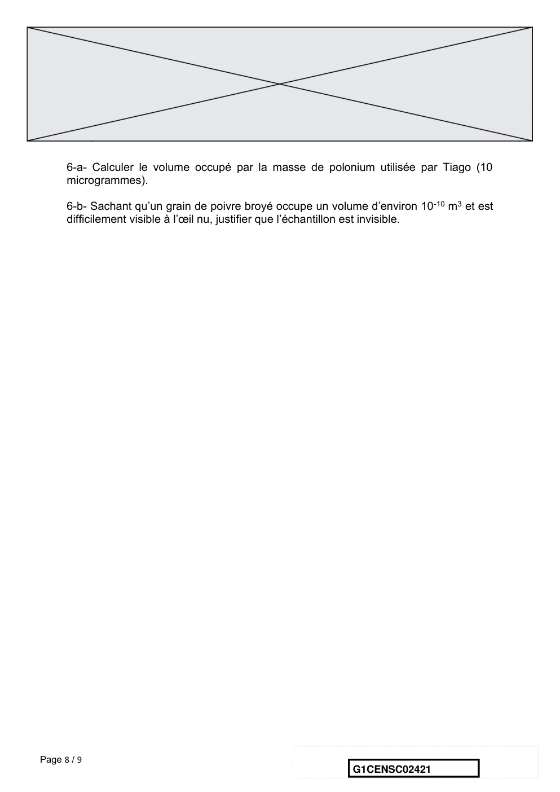

# e3c-enseignement-scientifique-premiere-02421-sujet-officiel

> Source : `../../../../pdf_version/02_es_ponctuelle/e3c/2021/e3c-enseignement-scientifique-premiere-02421-sujet-officiel.pdf` — conversion Markdown (texte + visuels utiles).
> Stratégie : [STRATEGIE_MARKDOWN.md](../../../../STRATEGIE_MARKDOWN.md)

---

## Page 1

ÉPREUVES COMMUNES DE CONTRÔLE CONTINU

      CLASSE : Première

      E3C : ☐ E3C1 ☒ E3C2 ☐ E3C3

      VOIE : ☒ Générale ☐ Technologique ☐ Toutes voies (LV)

      ENSEIGNEMENT : Enseignement scientifique
      DURÉE DE L’ÉPREUVE : 2h
      Niveaux visés (LV) : LVA               LVB
      Axes de programme :

      CALCULATRICE AUTORISÉE : ☒Oui ☐ Non

      DICTIONNAIRE AUTORISÉ :           ☐Oui ☒ Non

      ☒ Ce sujet contient des parties à rendre par le candidat avec sa copie. De ce fait, il ne peut être
      dupliqué et doit être imprimé pour chaque candidat afin d’assurer ensuite sa bonne numérisation.

      ☐ Ce sujet intègre des éléments en couleur. S’il est choisi par l’équipe pédagogique, il est
      nécessaire que chaque élève dispose d’une impression en couleur.

      ☐ Ce sujet contient des pièces jointes de type audio ou vidéo qu’il faudra télécharger et jouer le jour
      de l’épreuve.
      Nombre total de pages : 9

Page 1 / 9
                                                                            G1CENSC02421

---

## Page 2

EXERCICE 1

              L’ÉNERGIE LUMINEUSE ET SON UTILISATION PAR LES ALGUES

      Les algues sont des organismes chlorophylliens photosynthétiques. Les documents
      proposés permettent de comprendre les caractéristiques du rayonnement solaire et
      son utilisation par les différentes algues de zones côtières.
      Les 2 parties peuvent être traitées de façon indépendante.

      Partie 1. Les caractéristiques du rayonnement solaire extraterrestre et terrestre

      Document 1. Le spectre solaire
      Le spectre solaire représente les variations de l’intensité lumineuse de la lumière
      solaire (par unité de longueur d’onde) en fonction de la longueur d’onde. Il peut
      être obtenu en dehors de l’atmosphère terrestre (courbe « rayonnement hors
      atmosphère ») ou à la surface de la Terre (courbe « rayonnement solaire
      terrestre »).

Page 2 / 9
                                                                G1CENSC02421

---

## Page 3

La loi de Wien caractérise le lien entre la température de surface d’un corps noir et la
      longueur d’onde d’émission maximale de ce corps par la relation :
      max x T = 2,898.10-3 (avec max en m et T en K).

      On rappelle que l'échelle des températures Celsius est, par définition, la température
      absolue décalée en origine de 273 K : T = θ+ 273 avec T la température en kelvin et
      θ la température en degré Celsius.

      1- Estimer graphiquement la longueur d’onde au maximum d’émission du
      rayonnement solaire hors atmosphère.

      2- On considère le Soleil comme un corps noir dont la température de surface est
      estimée à 5620 °C. Calculer la longueur d’onde d’émission maximale du solaire.

      3- Expliquer la différence d’intensité observée entre les courbes « rayonnement
      solaire hors atmosphère » et « rayonnement solaire terrestre » du document 1.

      Partie 2. L’utilisation du rayonnement solaire par les algues dans les zones côtières
      Dans les zones côtières, les grands groupes d’algues ont une répartition
      préférentielle selon la profondeur. On se propose d’expliquer cette répartition des
      algues en lien avec leur utilisation de l’énergie solaire.

      4- À partir de l’exploitation des documents 2 et 3 (pages suivantes) et de vos
      connaissances, expliquer la capacité des algues rouges à vivre à une plus grande
      profondeur.
      Votre réponse structurée ne dépassera pas une page.

Page 3 / 9
                                                                 G1CENSC02421

---

## Page 4

Document 2. Répartition des différentes algues et devenir du spectre solaire
      dans l’eau en fonction de la profondeur.

      Document 3. Pigments photosynthétiques des algues vertes et des algues rouges
      et spectres d’absorption correspondants
      Il existe chez les végétaux différents pigments photosynthétiques.
      - Les algues vertes possèdent dans leurs cellules de la chlorophylle a et de la
      chlorophylle b.
      - Les algues rouges possèdent de la chlorophylle a et beaucoup de pigments
      rouges appelés phycoérythrine.
      Le graphique suivant présente les spectres d’absorption des différents pigments
      photosynthétiques, à savoir le pourcentage de lumière absorbée en fonction de la
      longueur d’onde.

                                                  Voir suite du document 3 page suivante

Page 4 / 9
                                                                G1CENSC02421

---

## Page 5

D’après http://svt.ac-dijon.fr/schemassvt/

                                           EXERCICE 2

                                        Un poison radioactif

      Un écrivain vous contacte pour achever un roman d’espionnage … suspense !

      Document 1 : lettre de l’écrivain à votre attention

      Bonjour, je suis Jules Servadac, écrivain de roman policier. Je vous sollicite afin de
      valider quelques aspects scientifiques de mon roman.
      Voici mes premières lignes :
      « Pierre et Marie Curie ont découvert le polonium, juste avant le radium qui les
      rendit célèbres. Le polonium-210 (210Po) est mille fois plus toxique que le plutonium,
      et un million de fois plus encore que le cyanure. Sachez que dix microgrammes (µg)
      sont nécessaires pour empoisonner un homme de poids moyen en quelques
      semaines et que cette dose mortelle est invisible à l’œil nu. »

Page 5 / 9
                                                                   G1CENSC02421

---

## Page 6

Dans mon roman, Tiago, agent secret de Folivie, souhaite s’en servir pour éliminer
      un agent infiltré. Celui-ci dîne tous les soirs dans le même restaurant : l’agent secret
      compte en profiter pour « poivrer » à sa façon son dîner.
      Pour cela, Tiago doit se procurer du polonium-210. Pour des raisons logistiques, il
      ne peut récupérer le polonium que 100 jours avant le dîner programmé dans un
      autre pays. Or le polonium perd la moitié de sa radioactivité tous les 138 jours.
      J’ai deux problèmes à vous soumettre concernant la quantité de polonium que Tiago
      doit transporter :
             -   Restera-t-il suffisamment de Polonium-210 radioactif à la fin de son voyage ?
             -   La dose sera-t-elle invisible à l’œil nu ?

      Document 2 : données relatives au polonium

      Le polonium est un des rares éléments à cristalliser dans le réseau cubique simple.
      Paramètre de maille : a = 3,359 x 10-10 m
      Masse molaire du polonium : M(Po) = 209,98 g∙mol-1
      Donnée complémentaire : nombre d’Avogadro NA = 6,022 x 1023 mol-1

      Il est rappelé que la masse molaire d’un élément est la masse d’une mole de
      quantité de matière de cet élément

      Partie 1 : la radioactivité du polonium

      L’objectif est ici de vérifier qu’en partant avec 20 µg de polonium-210, il restera
      suffisamment de polonium radioactif à l’issue du voyage.

      1- Déterminer en µg la masse initiale de Polonium présente dans l’échantillon utilisé
      pour réaliser le graphique du document 1.

      2- Jules Servadac écrit dans son roman : « Le polonium perd la moitié de sa
      radioactivité tous les 138 jours ».

      2-a- Définir scientifiquement la grandeur physique sur laquelle il appuie cette
      affirmation, en donnant son nom.

      2-b- La faire figurer sur le graphique du document réponse à rendre avec la copie en
      laissant apparents les traits de construction.

Page 6 / 9
                                                                   G1CENSC02421

---

## Page 7

3- Justifier, par la méthode de votre choix, que pour l’échantillon considéré la
      quantité de polonium restant après le voyage sera suffisante pour accomplir la
      mission.

      Document 3 : courbe de décroissance radioactive du polonium

                                                     Courbe de décroissance d'un échantillon de
                                                                  polonium 210
         Nombre d'atomes restants (×1016)

                                            7

                                            6

                                            5

                                            4

                                            3

                                            2

                                            1

                                            0
                                                0   50   100   150   200   250   300   350     400   450    500   550
                                                                                                      durée en jour

      Partie 2 : la structure du polonium

      L’objectif est ici de vérifier que les 10 µg de polonium dont Tiago a besoin pour
      empoisonner l’agent infiltré sont bien invisibles à l’œil nu.

      4- À partir de vos connaissances et des informations apportées par le document 1,
      répondre aux questions suivantes :

      4-a- Représenter la structure cubique simple du polonium en perspective cavalière.

      4-b- Dénombrer, en indiquant les calculs effectués, les atomes par maille.

      5- Montrer que la masse volumique du polonium est de 9,20 x 106 g.m-3 .

      6- Comparaison avec la taille d’un grain de poivre.

Page 7 / 9
                                                                                             G1CENSC02421

---

## Page 8

6-a- Calculer le volume occupé par la masse de polonium utilisée par Tiago (10
      microgrammes).

      6-b- Sachant qu’un grain de poivre broyé occupe un volume d’environ 10 -10 m3 et est
      difficilement visible à l’œil nu, justifier que l’échantillon est invisible.

Page 8 / 9
                                                              G1CENSC02421

---

## Page 9

ANNEXE A RENDRE AVEC LA COPIE

                                                            EXERCICE 2 : UN POISON RADIOACTIF

                                                 Courbe de décroissance d'un échantillon de
                                                              polonium 210

                                         7
       Nombre d'atomes restant (×1016)

                                         6

                                         5

                                         4

                                         3

                                         2

                                         1

                                         0
                                             0   50   100    150   200   250   300   350   400   450   500   550
                                                                                                   durée en jour

Page 9 / 9
                                                                                           G1CENSC02421
