# e3c-enseignement-scientifique-premiere-02426-sujet-officiel

> Source : `../../../../pdf_version/02_es_ponctuelle/e3c/2021/e3c-enseignement-scientifique-premiere-02426-sujet-officiel.pdf` — conversion Markdown (texte + visuels).
> Stratégie : [STRATEGIE_MARKDOWN.md](../../../../STRATEGIE_MARKDOWN.md)

---

## Page 1

ÉPREUVES COMMUNES DE CONTRÔLE CONTINU

      CLASSE : Première

      E3C : ☐ E3C1 ☒ E3C2 ☐ E3C3

      VOIE : ☒ Générale ☐ Technologique ☐ Toutes voies (LV)

      ENSEIGNEMENT : Enseignement scientifique
      DURÉE DE L’ÉPREUVE : 2h
      Niveaux visés (LV) : LVA               LVB
      Axes de programme :

      CALCULATRICE AUTORISÉE : ☒Oui ☐ Non

      DICTIONNAIRE AUTORISÉ :           ☐Oui ☒ Non

      ☐ Ce sujet contient des parties à rendre par le candidat avec sa copie. De ce fait, il ne peut être
      dupliqué et doit être imprimé pour chaque candidat afin d’assurer ensuite sa bonne numérisation.

      ☐ Ce sujet intègre des éléments en couleur. S’il est choisi par l’équipe pédagogique, il est
      nécessaire que chaque élève dispose d’une impression en couleur.

      ☐ Ce sujet contient des pièces jointes de type audio ou vidéo qu’il faudra télécharger et jouer le jour
      de l’épreuve.
      Nombre total de pages : 8

Page 1 / 8
                                                                            G1CENSC02426

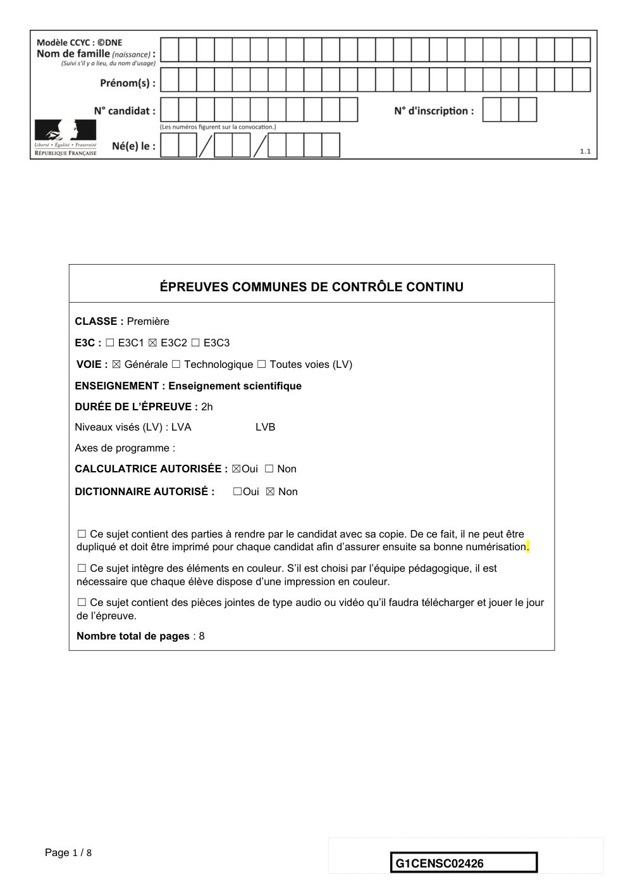

---

## Page 2

EXERCICE 1

                              Le son : de l’analogique au numérique

      L’industrie de la musique a connu au cours des dernières décennies de nombreuses
      évolutions (disque vinyle, CD, MP3, plateformes de musique en ligne). Ces
      évolutions sont dues au développement de la numérisation du son qui permet un
      stockage, une transmission et un accès plus aisés.
      L’objectif de l’exercice est de comprendre l’influence de certains paramètres sur la
      qualité du son numérisé.

      Document 1. Discrétisation du signal analogique d’un même son.
      Pour numériser un son, on procède à la discrétisation du signal analogique sonore
      (échantillonnage et quantification), comme l’illustrent les graphiques ci-après.
      Les échelles de tension et de temps sont les mêmes pour tous les graphiques.
      On note Te , la période d’échantillonnage.

Page 2 / 8
                                                               G1CENSC02426

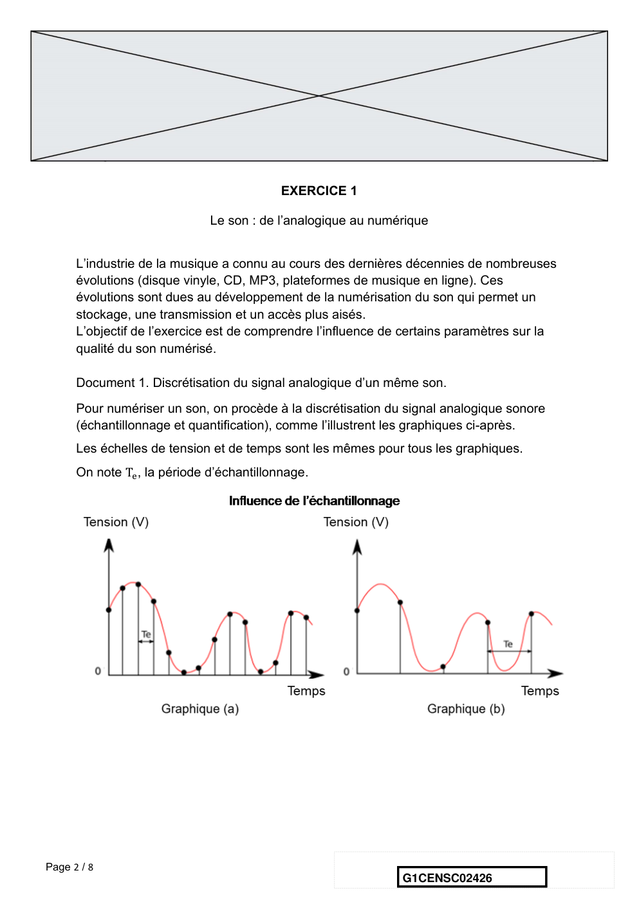

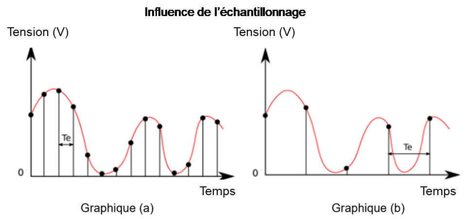

---

## Page 3

Document 2. Caractéristiques de numérisation de signaux audio suivant l’application.

                          Plage des                           Nombre de
                                         Fréquence
                         fréquences                           bits pour la         Applications
                                      d’échantillonnage
                         transmises                          quantification

           Qualité       300-3400
                                             8 kHz                  8              Téléphonie
         téléphonie         Hz

       Qualité bande
                         50-7000 Hz         16 kHz                  8           Audioconférence
          élargie

              Haute      50-15000
                                            32 kHz                  14           Radiodiffusion
             qualité        Hz

             Qualité     20-20000
                                           44,1 kHz                 16              CD audio
             « Hi-Fi »      Hz

                              D’après Des données à l’information de Florent Chavand (ISTE éditions)

Page 3 / 8
                                                                   G1CENSC02426

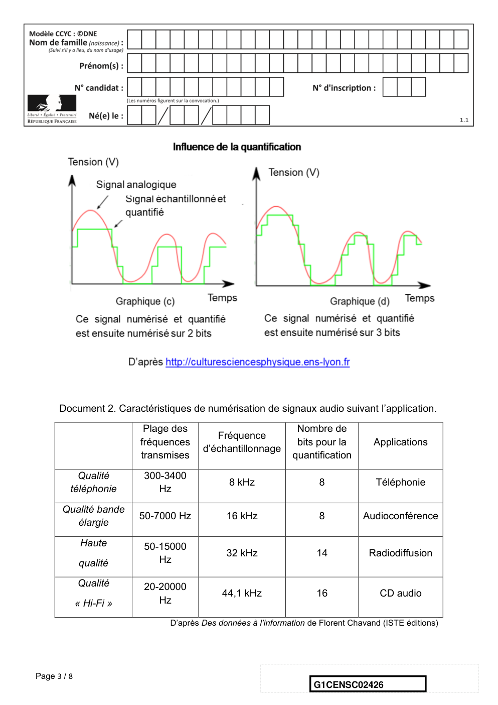

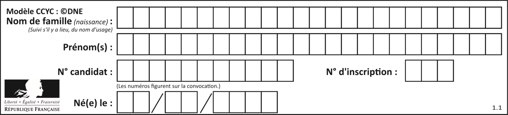

---

## Page 4

Document 3. Taille d’un fichier numérique et taux de compression

      La taille T d’un fichier audio numérique (en bit) peut être calculée à partir de la
      fréquence d’échantillonnage fe (en Hertz), du nombre n de bits utilisés pour la
      quantification, de la durée t (en secondes) de l’enregistrement et du nombre k de
      voies ou canaux utilisés (1 en mono, 2 en stéréo…), à l’aide de la formule
      suivante :

                                        T = fe × n × t × k

      Le taux de compression est ici défini comme le rapport de la taille du fichier
      compressé sur la taille du fichier original.

      1- À partir de l’exploitation des graphiques du document 1, recopier la ou les bonnes
      réponses pour chaque situation ci-dessous.
                ❑ La fréquence d’échantillonnage est plus élevée dans le cas du
                  graphique (a) que dans le cas du graphique (b).
                ❑ Le son numérisé est plus fidèle au signal analogique dans la situation
                  correspondant au graphique (b) que dans celle correspondant au
                  graphique (a).
                ❑ Le fichier numérique correspondant à la situation du graphique (c) a
                  une plus petite taille que le cas du graphique (d).
                ❑ Le son numérisé est plus fidèle au signal analogique dans la situation
                  correspondant au graphique (c) que dans celle correspondant au
                  graphique (d).
      2- À partir de vos connaissances, indiquer la condition que doit vérifier la fréquence
      d’échantillonnage si on veut numériser fidèlement un son analogique sinusoïdal de
      fréquence 𝑓.

      3- Justifier à partir des informations du document 2 que le choix de la fréquence
      d’échantillonnage permet une numérisation fidèle des sons sur un CD audio.
      4- À partir de vos connaissances, donner l’intervalle des fréquences des sons
      audibles par les humains. Indiquer, en justifiant, si tous les sons correspondant à ces
      fréquences sont transmis lors d’une audioconférence numérisée.
      5- Un morceau de musique de 4 minutes 27 secondes est enregistré en stéréo sur
      un CD audio. Justifier par un calcul que la taille du fichier enregistré est de 47 Mo.

Page 4 / 8
                                                                 G1CENSC02426

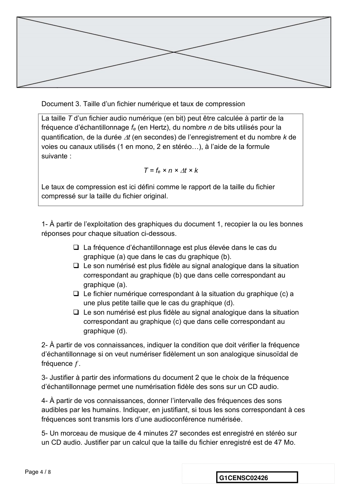

---

## Page 5

6- Le format MP3 est un format de compression audio avec perte d’informations.
      Si on admet que le taux de compression du format CD au format MP3 à 128 kbits/s
      est égal à 9%, calculer la taille du fichier MP3 à 128 kbits/s correspondant à
      l’enregistrement précédent.
      7- Comparer, en termes d’avantages et d’inconvénients, les formats CD audio et
      MP3.
                                             EXERCICE 2

                              Les minerais d’argent et leur exploitation
      L’argent est connu depuis des millénaires et son utilisation pour des applications
      industrielles s’est fortement développée au XXème siècle.
      L'argent est l'élément chimique de numéro atomique Z = 47 et de symbole Ag. À
      l’état métallique, il est blanc, très brillant, malléable ainsi que très ductile (c’est-à-dire
      qu’il peut être étiré sans se rompre).

     Données :
     Nombre d’entités par mole : N = 6,022×1023 mol-1 ;
     Rayon moyen d’un atome d’argent : r = 1,45 Å. L’angström (Å) est une unité de
     longueur utilisée en cristallographie (valant 10-10 m).

      Document 1. Maille élémentaire du cristal d’argent

      À l’état microscopique, l’argent métallique solide est organisé selon un réseau
      cubique à faces centrées.

      Figure 1a : représentation en                  Figure 1b : vue de l’une des faces du
      perspective cavalière                          cube

Page 5 / 8
                                                                     G1CENSC02426

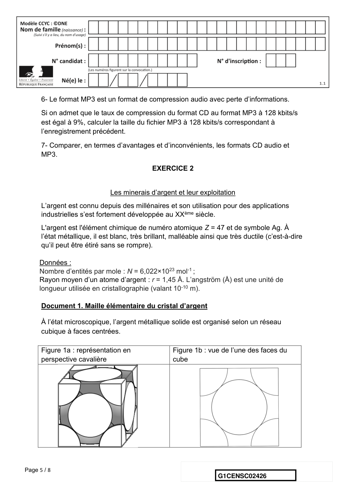

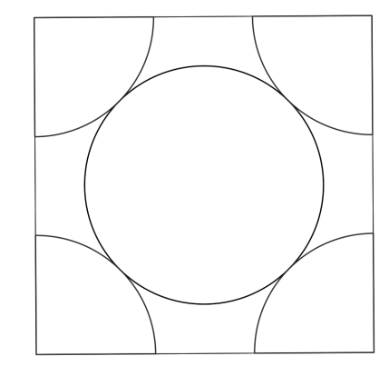

---

## Page 6

Document 2. Les minerais d’argent

      L'argent est rarement présent dans le sous-sol à l'état natif (pépite ou filon).
      Cependant dans les minerais, on le trouve souvent associé à d’autres éléments
      chimiques : par exemple, dans la chlorargyrite de formule AgCl, il est associé à
      l’élément chlore Cl ; dans l’acanthite de formule Ag2S, il est associé à l’élément
      soufre S.
      Figure 2a : maille élémentaire de la chlorargyrite

                                                          Ag+ : ion
                                                          argent
                                                          Cl- : ion
                                                          chlorure

      Figure 2b : maille élémentaire de l’acanthite

                                                            Ag+ : ion
                                                            argent
                                                            S2- : ion
                                                            sulfure

Page 6 / 8
                                                                 G1CENSC02426

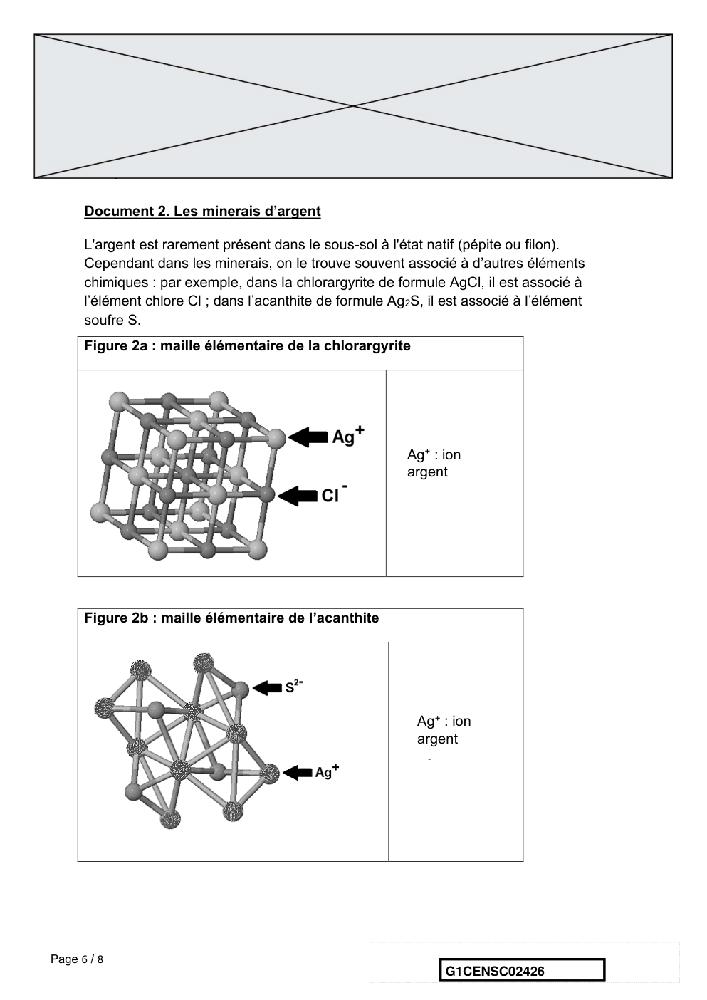

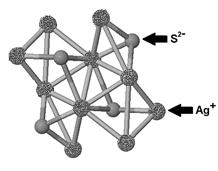

---

## Page 7

Document 3. Analyse d’un échantillon du gisement minier d’Ain-Kerma

      Le gisement minier d’Ain-Kerma est situé en Algérie à 15 km au Nord-Ouest de la
      ville de Constantine. Il a été activement exploité de 1913 à 1951 pour son minerai
      contenant 40 % d’antimoine de symbole chimique Sb.

      Figure 3 : Echantillon de minerai observé microscopie électroniqueMEB)

                                                                  Stibine (Sb2S3)
                                                                  Quartz (Q)
                                                                  Acanthite (Ag2S)

      D’après :https://www.researchgate.net/publication/279533102_Testing_of_Silver_Sul
      phide_in_Antimony_Mineralization_Hydrothermal_Karst_Formations_Ain-Kerma
      1- En utilisant la figure 1a, montrer en explicitant la démarche que le nombre
      d’atomes contenus dans une maille élémentaire du cristal d’argent est égal à 4.

      2- En utilisant la figure 1b et en notant 𝑎 le paramètre de maille du cristal d’argent
      (égal à la longueur de l’arête du cube), démontrer que √2 𝑎 = 4𝑟. En déduire que
      𝑎 = 4,10 Å.

      3- Calculer la compacité du cristal d’argent et en déduire que 26 % de la maille
      élémentaire est vide. On rappelle que la compacité d’un cristal est égale au rapport
      du volume des atomes contenus dans une maille élémentaire par le volume de cette
      maille.

Page 7 / 8
                                                                  G1CENSC02426

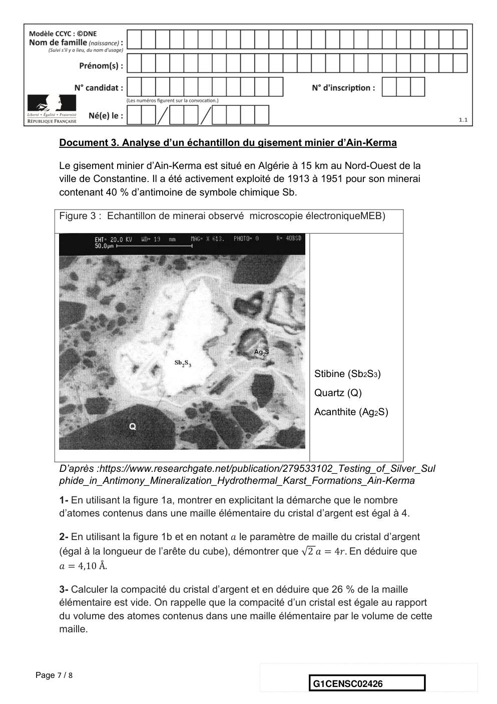

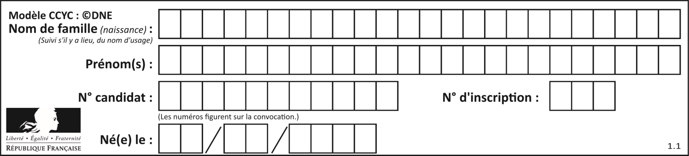

---

## Page 8

4- La masse volumique de l’argent sous forme cristalline vaut approximativement
      10,5×103 kg∙m-3. Calculer la masse d’un atome d’argent après avoir déterminé le
      volume d’une maille du cristal.

      5- La chlorargyrite et l’acanthite sont des cristaux. Préciser le sens du mot cristal et
      donner un exemple d’un autre mode d’organisation de la matière solide à l’échelle
      microscopique.

      6- Expliquer pourquoi le minerai d’Ain-Kerma peut être qualifié de roche et pourquoi
      cette roche peut être qualifiée d’argentifère.

Page 8 / 8
                                                                 G1CENSC02426

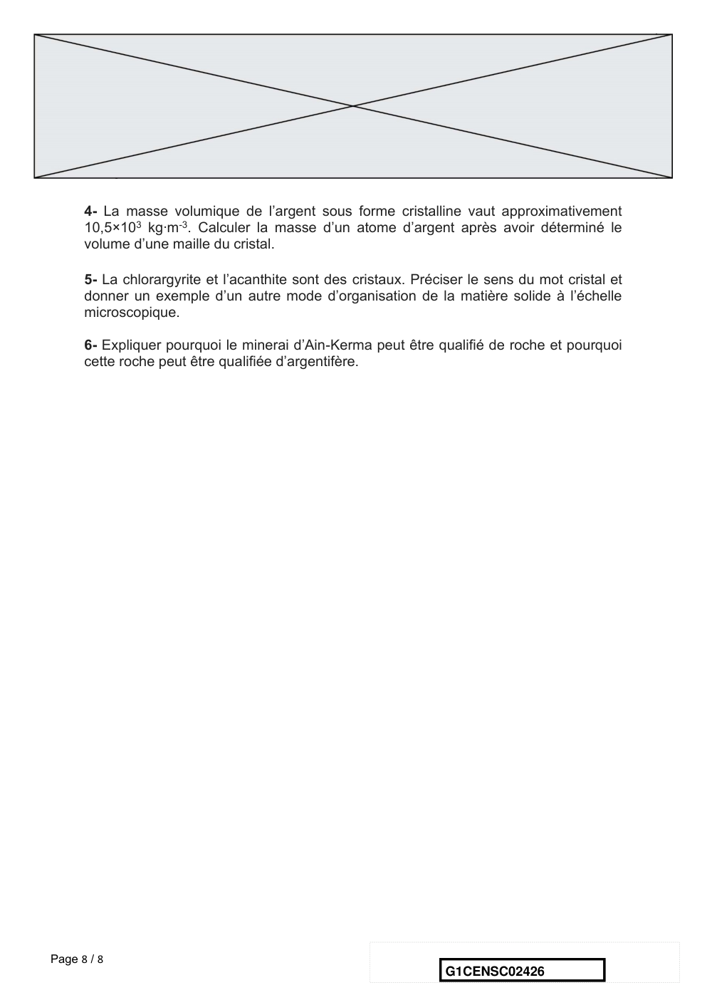

