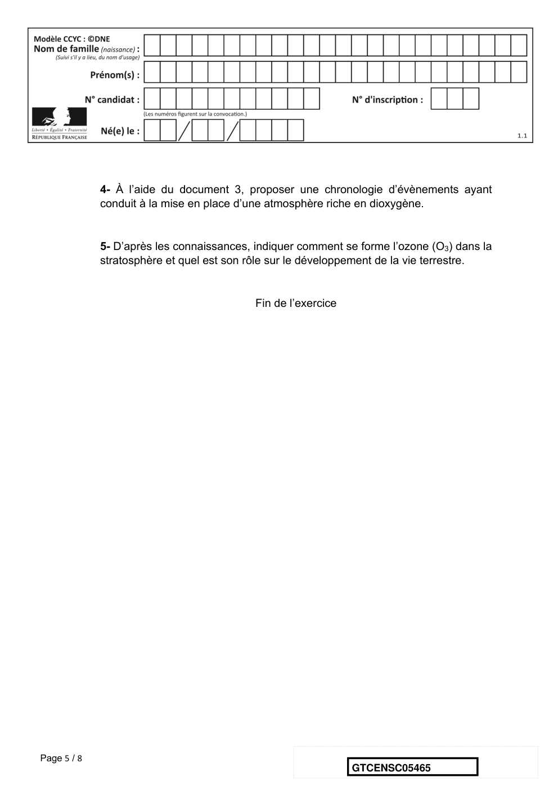

# e3c-enseignement-scientifique-terminale-05465-sujet-officiel

> Source : `../../../../pdf_version/02_es_ponctuelle/e3c/2021/e3c-enseignement-scientifique-terminale-05465-sujet-officiel.pdf` — conversion Markdown (texte + visuels utiles).
> Stratégie : [STRATEGIE_MARKDOWN.md](../../../../STRATEGIE_MARKDOWN.md)

---

## Page 1

ÉVALUATIONS COMMUNES

      CLASSE :

      EC : ☐ EC1 ☐ EC2 ☒ EC3

      VOIE : ☒ Générale ☐ Technologique ☐ Toutes voies (LV)
      ENSEIGNEMENT : Enseignement scientifique
      DURÉE DE L’ÉPREUVE : --2h--
      Niveaux visés (LV) : LVA               LVB
      CALCULATRICE AUTORISÉE : ☒Oui ☐ Non

      DICTIONNAIRE AUTORISÉ :           ☐Oui ☒ Non

      ☐ Ce sujet contient des parties à rendre par le candidat avec sa copie. De ce fait, il ne peut être
      dupliqué et doit être imprimé pour chaque candidat afin d’assurer ensuite sa bonne numérisation.
      ☐ Ce sujet intègre des éléments en couleur. S’il est choisi par l’équipe pédagogique, il est
      nécessaire que chaque élève dispose d’une impression en couleur.

      ☐ Ce sujet contient des pièces jointes de type audio ou vidéo qu’il faudra télécharger et jouer le jour
      de l’épreuve.
      Nombre total de pages : 8

Page 1 / 8
                                                                            GTCENSC05465

---

## Page 2

Exercice 1- L’histoire du dioxygène terrestre
             Sur 10 points
             L’atmosphère primitive de la Terre, issue du dégazage au cours du
             refroidissement de la Terre, était très différente de l’atmosphère actuelle. La
             transformation de l’atmosphère au cours du temps est marquée en particulier
             par un fort enrichissement en dioxygène, ce qui lui a conféré un caractère
             oxydant.
             L’objectif de cet exercice est de rechercher des arguments expliquant
             l’enrichissement de l’atmosphère en dioxygène, il y a 2,4 milliards d’années.

             Document 1 : métabolisme des cyanobactéries actuelles
             Une culture de cyanobactéries est placée dans une enceinte hermétique. Les
             teneurs en dioxygène et en dioxyde de carbone sont relevées sous différentes
             conditions d’éclairement. Les résultats sont présentés sur le graphique ci-
             dessous.
             Évolution des teneurs en dioxygène et dioxyde de carbone de la culture de
             cyanobactéries

Page 2 / 8
                                                               GTCENSC05465

---

## Page 3

1- À l’aide du document 1, donner, en le justifiant, le nom du métabolisme
             utilisé par les cyanobactéries, dans l’expérience, entre 0 et 5 minutes puis
             entre 5 et 10 minutes.
             Données : Il existe différents types de métabolismes, notamment :
             • La respiration : 𝑠𝑢𝑐𝑟𝑒 + 𝑂! → 𝐶𝑂! + 𝐻! 𝑂
             • La photosynthèse : 𝐶𝑂! + 𝐻! 𝑂 𝑒𝑛 𝑝𝑟é𝑠𝑒𝑛𝑐𝑒 𝑑𝑒 𝑙𝑢𝑚𝑖è𝑟𝑒 → 𝑠𝑢𝑐𝑟𝑒 + 𝑂!
             • La fermentation alcoolique : 𝑠𝑢𝑐𝑟𝑒 → 𝐶𝑂! + é𝑡ℎ𝑎𝑛𝑜𝑙
             Les réactions ne sont pas ajustées, elles indiquent seulement la nature des réactifs et des
             produits.

             2- Les stromatolithes sont des constructions carbonatées d’origine biologique
             formées par des micro-organismes, dont les cyanobactéries. Les plus anciens
             ont été datés à environ 3,5 milliards d’années. À partir du document 1 et des
             connaissances, justifier l’origine de la production de dioxygène à partir de 3,5
             milliards d’années.
             Document 2 : les formations sédimentaires d’oxydes de fer
             La grande majorité des minerais de fer du monde est constituée de ce qu'on
             appelle des fers rubanés (Banded Iron Formation ou BIF, en anglais). Ces BIF
             existent sous plusieurs formes, plus ou moins ferrugineuses, et contiennent un
             oxyde de fer composé de deux atomes de fer et de trois atomes d’oxygène.

                    Le tableau ci-dessous présente différents oxydes de fer :

                                                                         Équation chimique de
                  Oxyde de         Formule
                                                     Description          formation de l’oxyde
                     fer            brute
                                                                           de fer, non ajustée
                   Wustite           𝐹𝑒𝑂            Poudre grise            𝐹𝑒 + 𝑂! → 𝐹𝑒𝑂
                                                      Minéral de
                  Hématite          𝐹𝑒! 𝑂"                                 𝐹𝑒 + 𝑂! → 𝐹𝑒! 𝑂"
                                                    couleur rouille
                                                     Minéral de
                  Magnétite         𝐹𝑒" 𝑂#                                 𝐹𝑒 + 𝑂! → 𝐹𝑒" 𝑂#
                                                    couleur noire

Page 3 / 8
                                                                       GTCENSC05465

---

## Page 4

3- Justifier que l’oxyde de fer majoritaire présent dans les BIF correspond à
             l’hématite et ajuster l’équation chimique de sa formation après l’avoir recopiée
             sur la copie.

               Document 3 : évolution de la formation des paléosols rouges et des
               fers rubanés au cours du temps

                                                                D’après C. Klein, Nature, 1997
             L’axe des abscisses correspond à l’âge des roches en milliard d’années
             avant le présent. L’axe des ordonnées correspond à la quantité relative des
             roches formées.

             Les paléosols, ou sols fossiles, se sont formés par altération de roches
             continentales au contact de l’atmosphère. La couleur rouge de certains de
             ces sols provient de la forte teneur en hématite. Les fers rubanés sont
             toujours des formations sédimentaires marines.
             Le volcanisme continental et marin relâchent une quantité importante de fer
             sous forme d’ions Fe2+ oxydés en Fe3+ par le dioxygène entraînant la
             formation de l’hématite.

Page 4 / 8
                                                                GTCENSC05465

---

## Page 5

4- À l’aide du document 3, proposer une chronologie d’évènements ayant
             conduit à la mise en place d’une atmosphère riche en dioxygène.

             5- D’après les connaissances, indiquer comment se forme l’ozone (O3) dans la
             stratosphère et quel est son rôle sur le développement de la vie terrestre.

                                           Fin de l’exercice

Page 5 / 8
                                                               GTCENSC05465

---

## Page 6

Exercice 2- Un service de streaming musical
      Sur 10 points

      Le 10 Juillet 2020, une application de streaming musical a été perturbée par un
      problème de bug logiciel.

      1- Après avoir rappelé ce qu’est un bug, indiquer ses conséquences sur un
      programme informatique.
      Au moment de se connecter au service de streaming musical, on proposait à
      l’utilisateur de se connecter soit avec le réseau social R, soit avec un compte de
      messagerie M, soit en s’inscrivant à l’aide d’un autre compte.
      Le résultat du choix de l’utilisateur est stocké dans la variable « resultatclic », puis
      est passé en paramètre de la fonction prête-à-l ’emploi « connexionavec( ) ».

      Voici un extrait de l’algorithme qui devait permettre de gérer cette opération.
      Cependant l’algorithme ne pouvait pas fonctionner car cet extrait contient un ou des
      bugs.
                            L1
                            L2
                            L3
                            L4
                            L5
                            L6
      2- Pointer le(s) bug(s) en citant la (ou les) ligne(s) suspecte(s) et en la (ou les)
      réécrivant.

      Chaque fois qu’un utilisateur se connecte à cette application de streaming musical en
      utilisant un compte R, un fichier texte est enregistré sur les serveurs de ce dernier. Il
      indique le jour et l’heure de sa connexion, son identifiant, le lieu où il se trouve et le
      système d’exploitation qu’il utilise.

      Voici un exemple de fichier enregistré, il contient 30 caractères :     08/12/2020
                                                                              8 pm
                                                                              Élise
                                                                              Paris
                                                                              Système

      En moyenne, pour chaque utilisateur, le fichier texte enregistré a la taille du fichier
      texte donné en exemple.

Page 6 / 8
                                                                       GTCENSC05465

---

## Page 7

Le réseau R compte 2,7 milliards d’utilisateurs. Dans la même journée 3% d’entre
      eux se connectent à cette application de streaming musical en utilisant leur
      compte R.
      3- Calculer la taille moyenne de l’ensemble des fichiers textes enregistrés sur le
      serveur durant cette journée, liés à la connexion à cette application.

      Cette application possède une intelligence artificielle, notée IA, que l’on souhaite
      entraîner afin qu’elle identifie les goûts musicaux des utilisateurs. Par exemple, on
      décide de l’entraîner pour identifier un utilisateur qui écoute ou qui n’écoute pas du
      rap.

      4- Choisir en le justifiant, parmi les deux jeux de données proposés, celui qui
      permettra à l’intelligence artificielle de distinguer un utilisateur écoutant du rap, d’un
      autre utilisateur.

                 1er jeu de données                             2ème jeu de données
                    Rap conscient                                   Rap poétique
                        Reggae                                          Jazz
                         Rock                                      Rap conscient
                      Rap égotrip                                       Blues
                     Rap poétique
                     Rap hardcore
                         Jazz
                   Rap commercial
                         Blues

      Après avoir fourni un grand nombre de profils d’utilisateurs d’entraînement à
      l’intelligence artificielle, ses résultats sont les suivants :
           - Sur 100 utilisateurs écoutant du rap, l’IA a reconnu le profil utilisateur de 98
               d’entre eux.
           - Sur 150 utilisateurs n’écoutant pas de rap, l’IA n’a pas reconnu le profil
               utilisateur de 5 d’entre eux.

      5- Recopier et compléter le tableau de contingence associé à cette expérience à
      cette étape de l’entraînement.
                                                       Réponse de l’IA
                                                     Rap        Autres styles           Total
              Réponse de           Rap
              l’utilisateur    Autres styles
                                   Total

Page 7 / 8
                                                                   GTCENSC05465

---

## Page 8

Un nouvel utilisateur est présenté à l’IA. L’IA qualifie ce nouvel utilisateur d’amateur
      de Rap.

      6- Calculer la probabilité, arrondie au centième, que ce résultat de l’IA soit correct.

                                          Fin de l’exercice

Page 8 / 8
                                                                  GTCENSC05465

