# e3c-enseignement-scientifique-terminale-05466-sujet-officiel

> Source : `../../../../pdf_version/02_es_ponctuelle/e3c/2021/e3c-enseignement-scientifique-terminale-05466-sujet-officiel.pdf` — conversion Markdown (texte + visuels).
> Stratégie : [STRATEGIE_MARKDOWN.md](../../../../STRATEGIE_MARKDOWN.md)

---

## Page 1

ÉVALUATIONS COMMUNES

      CLASSE :

      EC : ☐ EC1 ☐ EC2 ☒ EC3

      VOIE : ☒ Générale ☐ Technologique ☐ Toutes voies (LV)
      ENSEIGNEMENT : Enseignement scientifique
      DURÉE DE L’ÉPREUVE : --2h--
      Niveaux visés (LV) : LVA               LVB
      CALCULATRICE AUTORISÉE : ☒Oui ☐ Non

      DICTIONNAIRE AUTORISÉ :           ☐Oui ☒ Non

      ☐ Ce sujet contient des parties à rendre par le candidat avec sa copie. De ce fait, il ne peut être
      dupliqué et doit être imprimé pour chaque candidat afin d’assurer ensuite sa bonne numérisation.
      ☐ Ce sujet intègre des éléments en couleur. S’il est choisi par l’équipe pédagogique, il est
      nécessaire que chaque élève dispose d’une impression en couleur.

      ☐ Ce sujet contient des pièces jointes de type audio ou vidéo qu’il faudra télécharger et jouer le jour
      de l’épreuve.
      Nombre total de pages : 8

Page 1 / 8
                                                                            GTCENSC05466

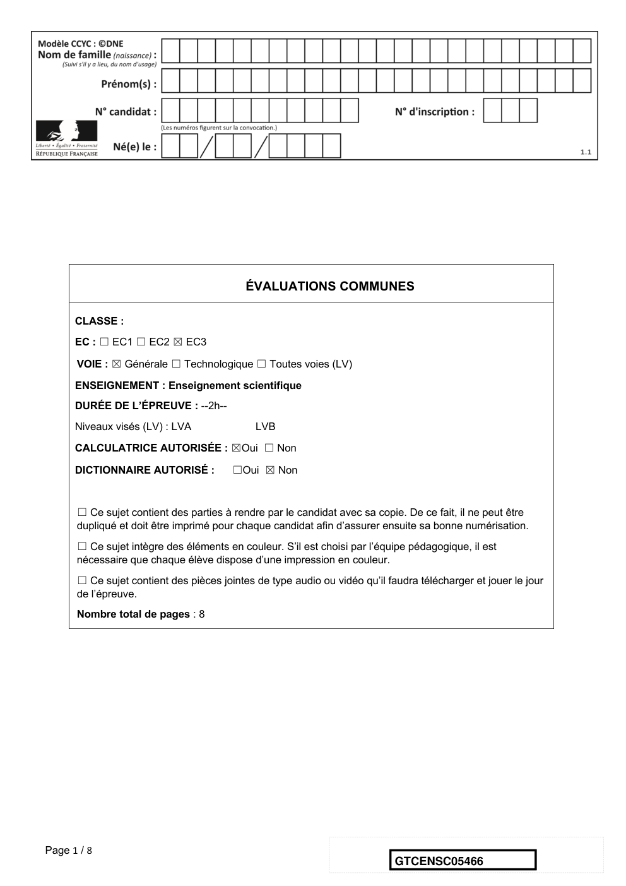

---

## Page 2

Exercice 1 - L'émission de gaz à effet de serre en
             France
             Sur 10 points

             Lancé en 2016, l’observatoire climat-énergie dresse le bilan des efforts
             réalisés par la France pour organiser la transition énergétique.
             L’objectif de cet exercice est d’étudier les émissions des gaz à effet de serre
             en France, plus particulièrement dans le domaine des transports.

             Document 1 : émissions de gaz à effet de serre en France

             Les émissions nationales de gaz à effet de serre (représentées ici par la
             masse équivalente de CO2 en millions de tonnes émise chaque année) ont
             baissé de 4,2 % entre 2017 et 2018 après trois années de hausse
             consécutives. Cette réduction est en partie liée à un hiver plus doux qui a
             nécessité une utilisation moins importante de chauffage.

             * Mt CO2 e : masse équivalente de dioxyde de carbone émise par les activités
             humaines en millions de tonnes
             D’après https://www.observatoire-climat-energie.fr/

Page 2 / 8
                                                                   GTCENSC05466

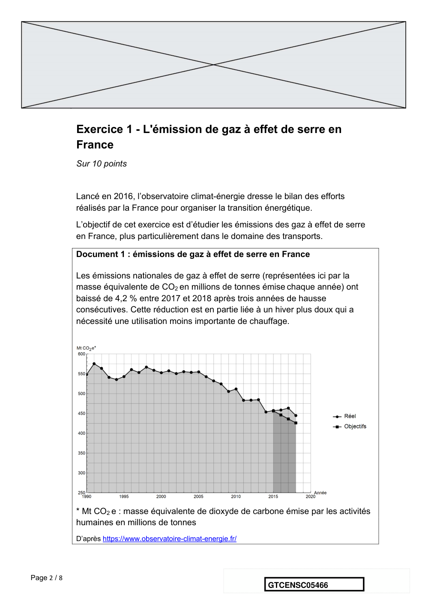

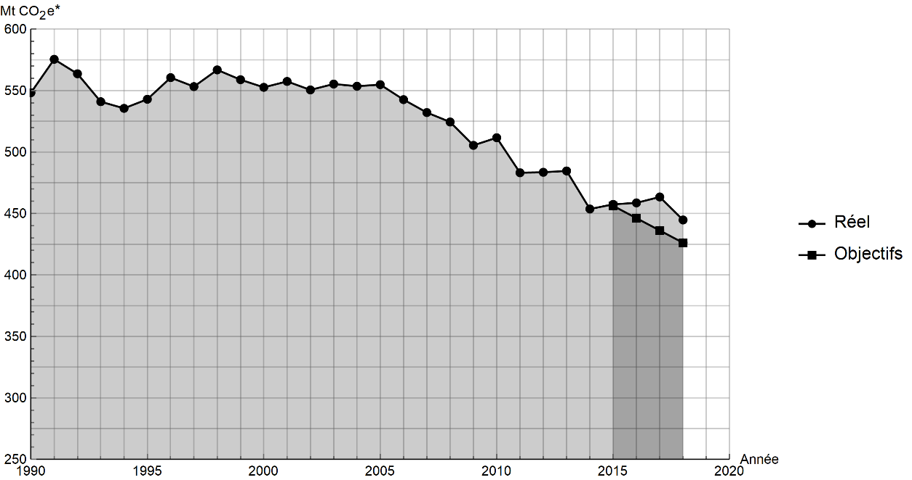

---

## Page 3

1- En s’appuyant sur le document 1, indiquer si les objectifs sur les émissions
                de gaz à effet de serre ont été atteints par la France depuis 2015. Justifier la
                réponse.

                2- Expliquer pourquoi l’émission de dioxyde carbone est l’une des causes du
                réchauffement climatique.

              On souhaite déterminer à présent à la masse de dioxyde de carbone produite
              lors de la combustion du cétane (voir le document 2).
             Document 2 : mission de gaz à effet de serre dans les transports :
             combustion au sein d’un moteur Diesel
             Dans les transports, les émissions de gaz à effet de serre dépassent de
             12,6 % la part annuelle du budget carbone qui leur est affectée.
             Ce document prend exemple d’un moteur Diesel présent dans une voiture.
             Les moteurs Diesel fonctionnent par combustion dans un moteur thermique :
             une réaction chimique a lieu entre le carburant (appelé combustible) et le
             dioxygène de l’air (appelé comburant). Cette réaction est exothermique.

             Pour les moteurs Diesel, le composé principal est le cétane, de formule brute
             C16H34. L’équation de la combustion complète s’écrit :
                                         !"
                              C16H34(l) + # O2(g) ➜ 16 CO2 (g)+ 17 H2O(l)

             L’unité de quantité de matière utilisée par le chimiste est la mole.
             Dans l’équation de la combustion du cétane pour 1 mole de cétane
             consommée, 16 moles de dioxyde de carbone, CO2, sont libérées sous forme
             gazeuse.
             La masse m (en kg) est reliée à la quantité de matière n (en mol) :
             - Une masse m cétane = 0,226 kg de cétane correspond à une quantité de
             matière n = 1 mol de cétane ;
             - Une masse m CO2 = 0,044 kg de dioxyde de carbone correspond à une
             quantité de matière n= 1 mol de dioxyde de carbone.
             L’énergie massique dégagée par la combustion de cétane est 42,3 MJ/kg : ce
             qui signifie que pour 1 kg de cétane brûlé, une énergie de 42,3 MJ est
             dégagée.

Page 3 / 8
                                                                     GTCENSC05466

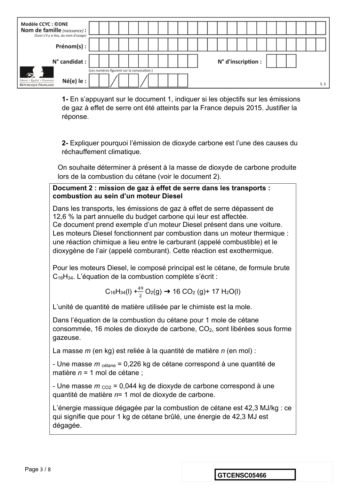

---

## Page 4

3- Vérifier que la masse de cétane consommée pour la production d’une
             énergie E = 1 MJ est égale à m cétane = 0,024 kg.

             4- En déduire la quantité de matière de cétane ( en moles) consommée lors
             d’une combustion qui dégage 1 MJ.

             5- En utilisant la valeur n cétane= 0,11 mol, calculer la masse m CO2 de dioxyde de
             carbone formée.

             6- Décrire une des solutions actuellement envisagées pour réduire la masse de
             dioxyde de carbone émise par les véhicules automobiles et indiquer les limites
             de cette solution.

                                              Fin de l’exercice

Page 4 / 8
                                                                   GTCENSC05466

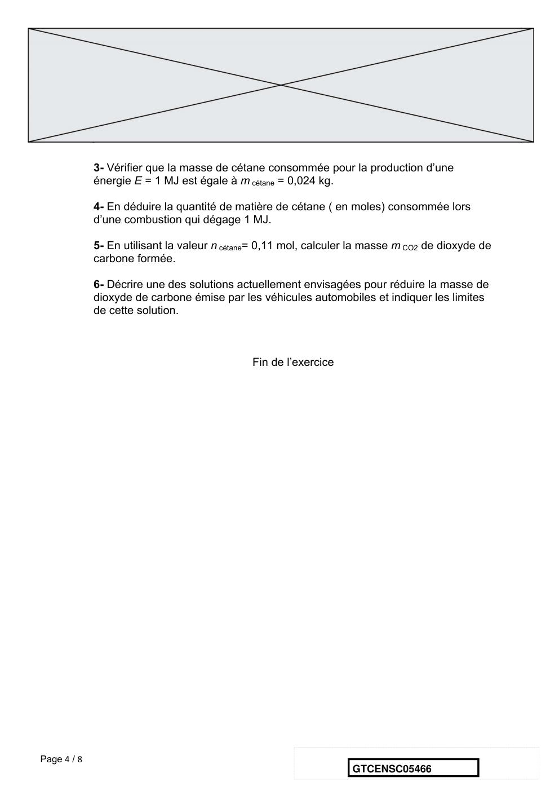

---

## Page 5

Exercice 2 - Les conséquences de la géographie
             naturelle de l’île de Bornéo et de la déforestation sur
             les populations d’orangs-outans
             Sur 10 points

             Située en Asie du Sud-Est, à la jonction entre l’océan Indien et l’océan
             Pacifique, l’île de Bornéo représente 1 % des terres émergées. Elle détient
             6 % de la biodiversité en lien avec sa richesse en écosystèmes (forêts
             tropicales, mangroves…). Une des espèces emblématiques de ces
             écosystèmes est l'orang-outan de Bornéo (Pongo pygmaeus). Cette espèce
             est en danger critique d’extinction (selon l’UICN). L'espèce est menacée par la
             perte de son habitat naturel et fait l’objet de projets de sauvegarde.
                       Orang-outan                     Île de Bornéo (Asie du Sud-Est)

                                            Source : wikipedia

             On s’intéresse aux conséquences possibles de la géographie de l’habitat et
             des activités humaines sur la diversité génétique des populations d'orangs-
             outans (Pongo pygmaeus).

Page 5 / 8
                                                                 GTCENSC05466

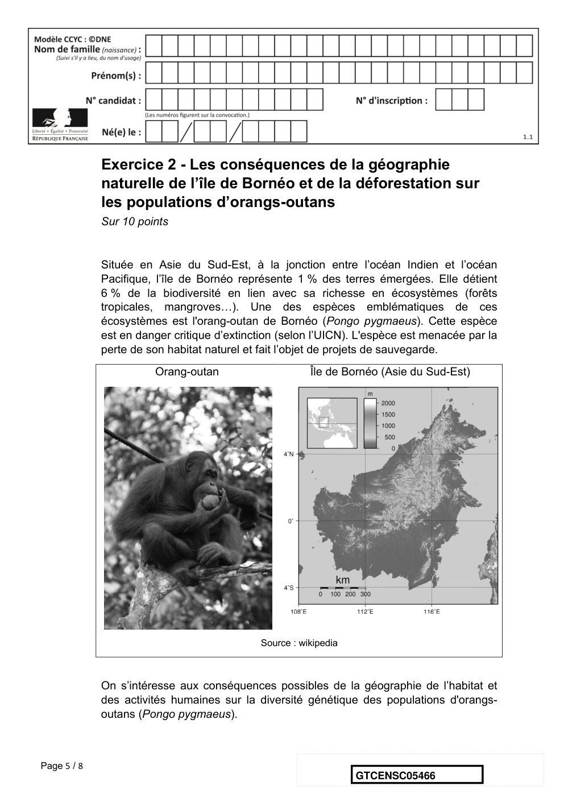

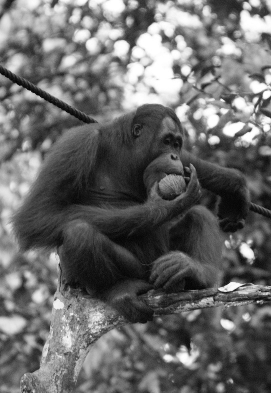

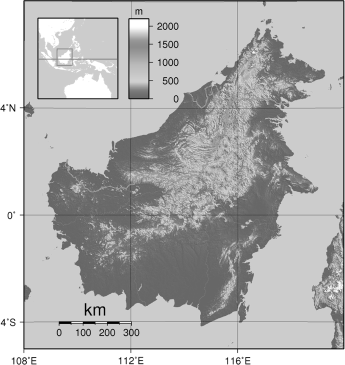

---

## Page 6

Document 1 : carte de l’île de Bornéo et localisation de quelques populations
        d'orangs-outans

                                                         Massif montagneux du Banjaran Crocker
                                                         dont l’altitude dépasse 500 m

                                                         Cours d’eau

                                                     Localisation des différentes
                                                     populations d’orangs-outans

        Les quatre populations de l’île de Bornéo :
        SAR : population du centre de réhabilitation de la vie sauvage de Semenggoh
        NK : population du parc national de Danau Sentarum
        SK : population du parc national de Gunung Palung
        SAB : population du centre de réhabilitation pour orangs-outans de Sepilok.
        Les larges fleuves sont infranchissables par cette espèce qui ne sait pas nager, ils
        constituent donc une barrière naturelle.

        Document 2 : tableau présentant les pourcentages de divergence entre
        certaines séquences génétiques chez les populations d’orangs-outans. La
        population de l’île de Sumatra, nommée SU, est indiquée comme référence.

                                SK             NK               SAR             SAB            SU
               SK               2,6            6,3               5,3                5,1        19,2
               NK                -             3,4               2.6                5,9        17,5
              SAR                -              -                1,5                4.6        16.5
              SAB                -              -                 -                 2,6        19.9
               SU                -              -                 -                  -         7.8

Page 6 / 8
                                                                        GTCENSC05466

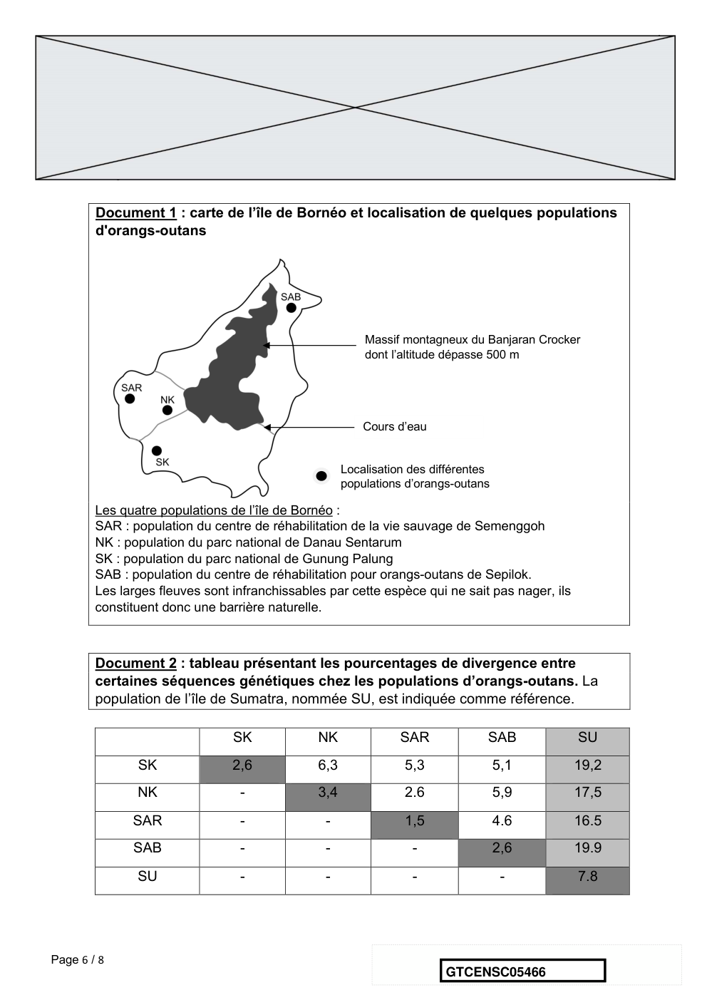

---

## Page 7

Les cases grisées, constituant la diagonale, du tableau indiquent les pourcentages
        de divergence des séquences génétiques au sein d’une même population d’orangs
        outans. Les autres cases comparent la divergence des séquences génétiques
        entre les populations prises deux à deux.
        Plus le pourcentage de divergence des séquences génétiques entre deux
        populations est important, plus la distance génétique entre ces populations est
        grande.
        D'après Speciation and Intrasubspecific Variation of Bornean Orangutans, Pongo pygmaeus
        pymaeus, Warren et al. Molecular Biology and Evolution (2001)

      1- À partir de l'analyse des documents 1 et 2, montrer que la fragmentation des
      habitats par des obstacles naturels pourrait être à l'origine de l'accumulation de
      différences génétiques entre populations.

      Certaines zones de l’île sont actuellement défrichées par l’être humain pour faire
      place à des exploitations agricoles comme les palmeraies. Les conséquences
      possibles sur la diversité génétique des Orangs-outans de Bornéo sont alors
      étudiées.
       Document 3 : représentation simplifiée de l'évolution de la forêt tropicale
       dans une zone de la région de Kalimantan du sud entre 1970 et 2020.

                                          Zone étudiée                    Zone étudiée
                                          (Kalimantan du sud) en          (Kalimantan du sud) en
                                          1970                            2020
      Chaque carré a une aire de 100 km²
      Les carrés sombres correspondent à des zones recouvertes par de la forêt et les
      carrés blancs à des zones défrichées.

Page 7 / 8
                                                                      GTCENSC05466

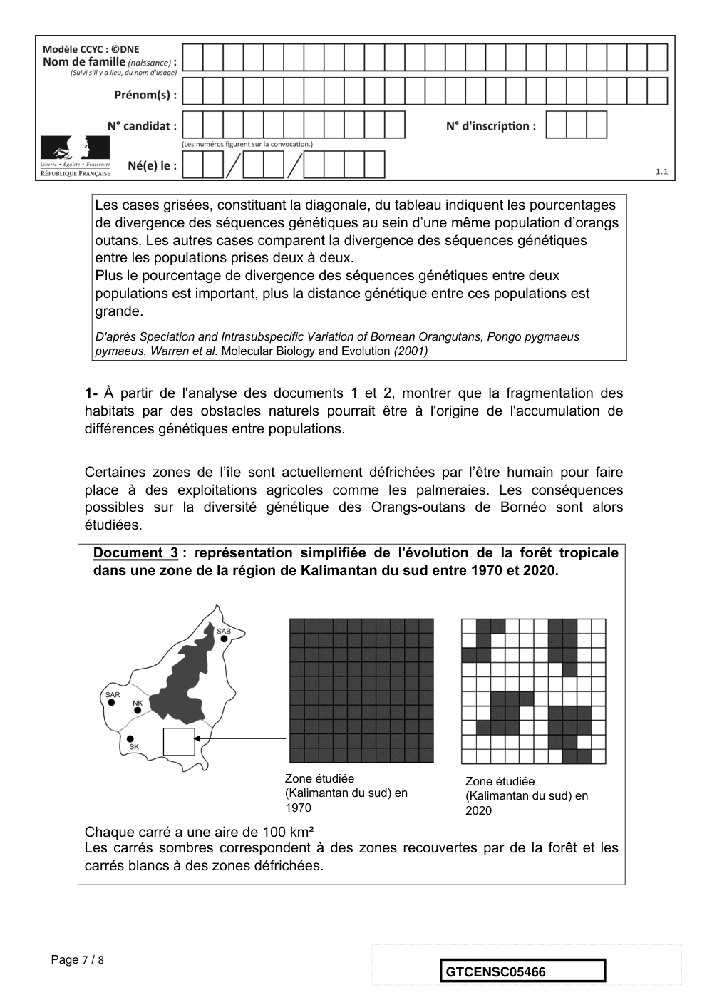

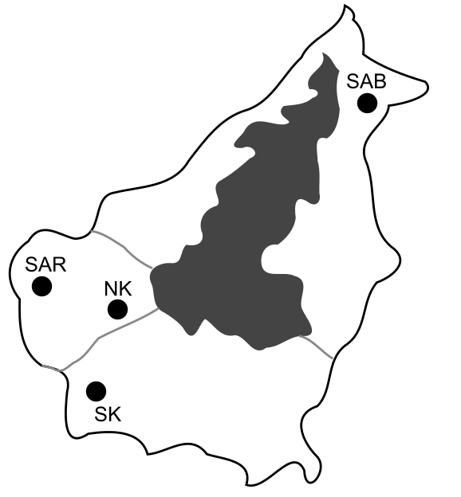

---

## Page 8

2- À l’aide du quadrillage fourni sur le document 3, déterminer l'impact de l'activité
      humaine sur la surface disponible pour les orangs-outans. Pour cela, calculer :
             - l’aire 𝒜$"%& de la surface de forêt disponible en 1970 dans la région de
             Kalimantan étudiée ;
             - l’aire 𝒜#&#& de la surface de forêt disponible en 2020 dans la région de
             Kalimantan étudiée ;
             - le pourcentage de diminution de l’aire de la surface disponible entre 1970 et
             2020.

      3- À l’aide des documents de vos connaissances, rédiger un paragraphe argumenté
      présentant le rôle conjoint de la géographie et de l’action humaine de déforestation
      sur le risque d’appauvrissement génétique des populations d’orangs-outans de l’île
      de Bornéo. Proposer des mesures qui permettraient prioritairement de protéger les
      populations d’orangs-outans et également de conserver leur diversité génétique.

                                            Fin de l’exercice

Page 8 / 8
                                                                GTCENSC05466

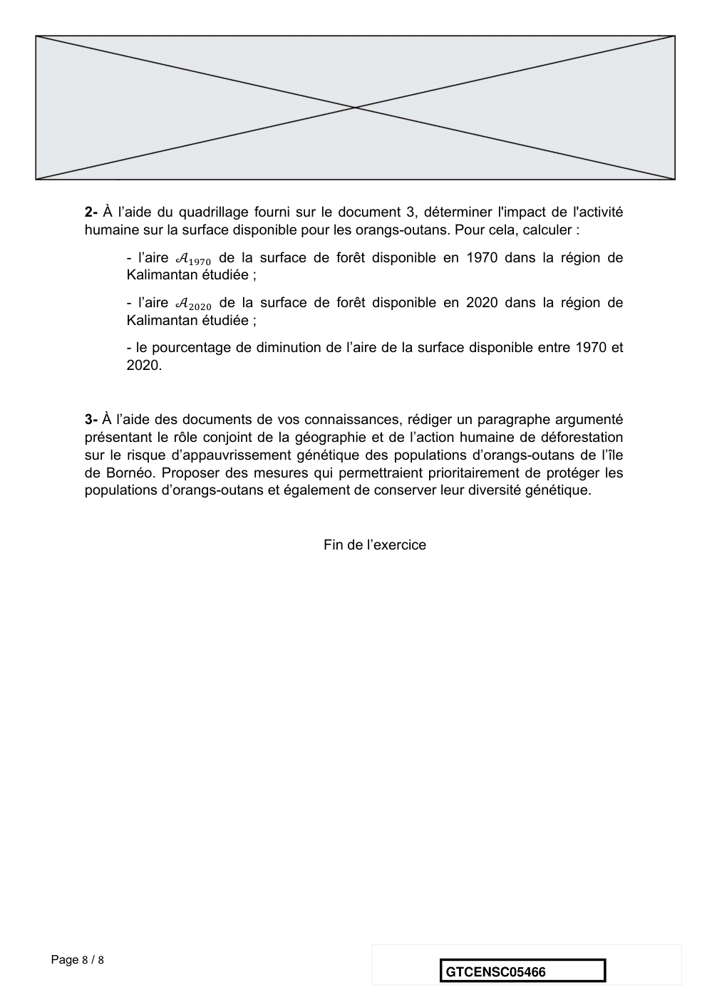

