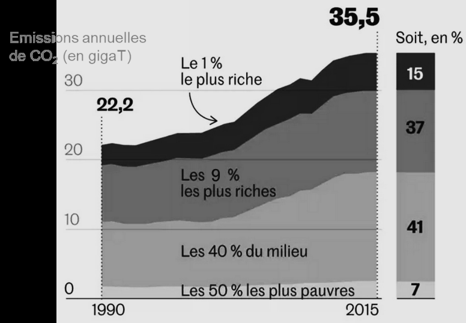

# e3c-enseignement-scientifique-terminale-05468-sujet-officiel

> Source : `../../../../pdf_version/02_es_ponctuelle/e3c/2021/e3c-enseignement-scientifique-terminale-05468-sujet-officiel.pdf` — conversion Markdown (texte + visuels utiles).
> Stratégie : [STRATEGIE_MARKDOWN.md](../../../../STRATEGIE_MARKDOWN.md)

---

## Page 1

ÉVALUATIONS COMMUNES

      CLASSE :

      EC : ☐ EC1 ☐ EC2 ☒ EC3

      VOIE : ☒ Générale ☐ Technologique ☐ Toutes voies (LV)
      ENSEIGNEMENT : Enseignement scientifique
      DURÉE DE L’ÉPREUVE : --2h--
      Niveaux visés (LV) : LVA               LVB
      CALCULATRICE AUTORISÉE : ☒Oui ☐ Non

      DICTIONNAIRE AUTORISÉ :           ☐Oui ☒ Non

      ☐ Ce sujet contient des parties à rendre par le candidat avec sa copie. De ce fait, il ne peut être
      dupliqué et doit être imprimé pour chaque candidat afin d’assurer ensuite sa bonne numérisation.
      ☐ Ce sujet intègre des éléments en couleur. S’il est choisi par l’équipe pédagogique, il est
      nécessaire que chaque élève dispose d’une impression en couleur.

      ☐ Ce sujet contient des pièces jointes de type audio ou vidéo qu’il faudra télécharger et jouer le jour
      de l’épreuve.
      Nombre total de pages : 7

Page 1 / 7
                                                                            GTCENSC05468

---

## Page 2

Exercice 1 - Inégalités des émissions de CO2 au
      niveau mondial et vulnérabilité au changement
      climatique
      Sur 10 points

      On s’intéresse aux inégalités d’émissions de dioxyde de carbone (CO2) au niveau
      mondial et à leurs conséquences climatiques.

     Document 1 : consommation énergétique dans le monde : données utiles
     D’après l’Agence internationale de l’énergie (IAE), en 2015, la consommation mondiale
     d’énergie a atteint la valeur de 392,2 x 1018 J et pourrait augmenter d’un tiers à
     l’horizon 2040. Le tableau ci-dessous détaille la consommation énergétique pour
     quelques pays ainsi que leur produit intérieur brut (PIB) par habitant, indicateur du
     niveau d’activité économique.

                                             États-
                                 Chine                 Indonésie    France        Nigeria
                                             Unis

             Consommation
                                                                              À compléter
             énergétique du        1 995     1 520       174         154      (question 1)
             pays (Mtep)

             Population (en
             million               1 386     326         264         67            181
             d’habitants)

             PIB par habitant
                                   9 596     59 478      12 280      42 925        2732
             (en dollars)

             Consommation
             par habitant          1,44      4,66        0,66        2,3           0,7
             (Mtep)

             Données : 1 Mtep (ou mégatonne équivalent pétrole) = 4,18 x 1016 J

Page 2 / 7
                                                                GTCENSC05468

---

## Page 3

1- Montrer par un calcul que la consommation énergétique du Nigeria est de :
      127 Mtep.

      2- Après avoir converti la consommation énergétique du Nigeria en joules (J), la
      comparer à la consommation énergétique mondiale.

      3- À partir du tableau du document 1, expliquer en quoi la consommation
      énergétique est inégalement répartie à l’échelle mondiale.

       Document 2 : émissions annuelles
       de CO2, en gigatonnes en fonction
       du temps.
       Les émissions de CO2 par catégorie
       de revenu ont été mesurées dans le
       monde entre 1990 et 2015.
       Par exemple : 1 % des populations
       les plus riches émet 15 % des
       émissions mondiales de CO2.

       Source : Garric, A. (2020, 21 septembre). Les « inégalités extrêmes » des émissions de CO2 nous
       mènent vers une catastrophe climatique. Le Monde. Document modifié.

      4- À l’aide du document 2, montrer que les émissions de CO2 sont inégales au
      niveau mondial.

Page 3 / 7
                                                                       GTCENSC05468

---

## Page 4

Document 3 : vulnérabilité au changement climatique.

      Les dix pays légendés sur la carte ont tous une vulnérabilité extrême. Le tableau les
      range par vulnérabilité décroissante (de 1 à 9).
      La vulnérabilité au réchauffement climatique correspond à la prédisposition à être
      affecté par les changements climatiques (susceptibilité d’être atteint, manque de
      capacité à réagir et à s’adapter).

      Source : Garric, A. (2013, 30 octobre). Quels sont les pays les plus vulnérables au changement
      climatique ? Le Monde. Document modifié.

      5- À partir des documents 1 à 3 et de vos connaissances, rédiger un paragraphe
      argumenté justifiant l’affirmation suivante : « les populations les plus pauvres et les
      plus vulnérables, qui contribuent le moins à la crise climatique, sont pourtant les plus
      affectées par les dérèglements climatiques ».

                                              Fin de l’exercice

Page 4 / 7
                                                                         GTCENSC05468

---

## Page 5

Exercice 2 – Invasion de sangliers à Fontainebleau
             Sur 10 points

             Le 14 mars 2016, nous pouvions lire dans un article du journal Le Figaro :
             « Tous les soirs à Fontainebleau (Seine-et-Marne), des sangliers se baladent
             dans les rues du centre-ville, à la recherche de nourriture. Une situation en
             passe de devenir incontrôlable, puisque très nombreux, les sangliers
             saccagent tout sur leur passage. ».
             Le but de cet exercice est de caractériser et d’expliquer l’évolution
             démographique de la population de sangliers à Fontainebleau.

             Document 1 : résultats de deux campagnes de capture-marquage-
             recapture pour étudier la population de sangliers dans la forêt de
             Fontainebleau.
                             Nombre d'individus          Nombre          Nombre
                             capturés et                 d'individus     d'individus
                             marqués en début            capturés à      marqués
                             de protocole                la fin du       recapturés
                                                         protocole
                   1980                 75                    67                       16
                   2020                142                    130                      13

             1- Expliquer le principe de la méthode Capture-Marquage-Recapture.

             2- En calculant les effectifs en 1980 et 2020, montrer que l’abondance de la
             population de sangliers a été multipliée par environ 4,5.

Page 5 / 7
                                                                   GTCENSC05468

---

## Page 6

Document 2 : effet de la température hivernale sur la densité de
             sangliers
             Document 2a :
             le cycle de
             reproduction
             d'une laie adulte
             La laie est la femelle
             du sanglier. Le rut
             correspond à la
             période de chaleur,
             la gestation au fait
             de porter le petit et
             la mise bas à
             l'accouchement. Un
             hiver rigoureux peut
             être à l'origine d'une           D'après les populations de sangliers en Europe,
             mortalité plus                   publication du Dr. Jurgen Tack (2018).
             importante des
             individus.

             Document 2b : densité de sangliers en fonction de la température
             du mois de janvier

             La densité de sangliers (nombre de sangliers/km2) dépend de l'efficacité de
             leur reproduction.
             D'après biogeographical variation in the population density of wild boar in western
             Eurasia, Melis et al (2006).

Page 6 / 7
                                                                  GTCENSC05468

---

## Page 7

Document 3 : évolution de la température moyenne du mois de janvier à
             Paris (à proximité de Fontainebleau) entre 1980 et 2008
             En pointillé : la droite de tendance qui approche au mieux un nuage de points.

                                                8

                                                7

                                                6
               Température moyenne en janvier

                                                5

                                                4

                                                3
                                                                                                                               T (°C)
                                                2

                                                1

                                                 0
                                                  1980 1982 1984 1986 1988 1990 1992 1994 1996 1998 2000 2002 2004 2006 2008
                                                -1

                                                -2
                                                                                   Année

             D’après Rousseau, D. (2009). La Météorologie, 8(67).

             3- À l'aide des documents 2 et 3, rédiger un paragraphe argumenté expliquant
             l'une des causes de l’augmentation de la population de sangliers.

                                                                           Fin de l’exercice

Page 7 / 7
                                                                                                GTCENSC05468
