# e3c-enseignement-scientifique-terminale-05469-sujet-officiel

> Source : `../../../../pdf_version/02_es_ponctuelle/e3c/2021/e3c-enseignement-scientifique-terminale-05469-sujet-officiel.pdf` — conversion Markdown (texte + visuels).
> Stratégie : [STRATEGIE_MARKDOWN.md](../../../../STRATEGIE_MARKDOWN.md)

---

## Page 1

ÉVALUATIONS COMMUNES

      CLASSE :

      EC : ☐ EC1 ☐ EC2 ☒ EC3

      VOIE : ☒ Générale ☐ Technologique ☐ Toutes voies (LV)
      ENSEIGNEMENT : Enseignement scientifique
      DURÉE DE L’ÉPREUVE : --2h--
      Niveaux visés (LV) : LVA               LVB
      CALCULATRICE AUTORISÉE : ☒Oui ☐ Non

      DICTIONNAIRE AUTORISÉ :           ☐Oui ☒ Non

      ☐ Ce sujet contient des parties à rendre par le candidat avec sa copie. De ce fait, il ne peut être
      dupliqué et doit être imprimé pour chaque candidat afin d’assurer ensuite sa bonne numérisation.
      ☐ Ce sujet intègre des éléments en couleur. S’il est choisi par l’équipe pédagogique, il est
      nécessaire que chaque élève dispose d’une impression en couleur.

      ☐ Ce sujet contient des pièces jointes de type audio ou vidéo qu’il faudra télécharger et jouer le jour
      de l’épreuve.
      Nombre total de pages : 6

Page 1 / 6
                                                                            GTCENSC05469

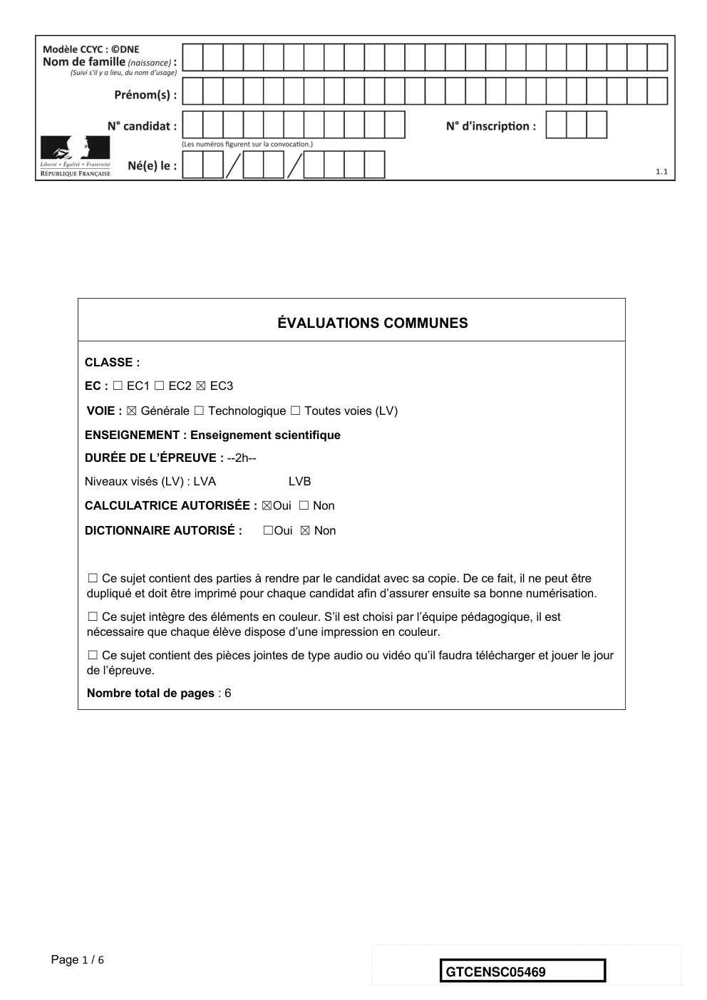

---

## Page 2

Exercice 1 - L’empreinte carbone des appareils
      électroménagers
      Sur 10 points

      Pour établir l’empreinte carbone de ces appareils, les scientifiques ont utilisé des
      données concernant à la fois la production des matières premières servant à leur
      fabrication mais aussi leur collecte et leur recyclage, lors de leur fin de vie.
             Document 1 : empreinte carbone de quelques appareils domestiques
             électroménagers.

             Source : J. Lhotellier, E. Less, E. Bossanne, S. Pesnel. (2018). Modélisation et évaluation
             ACV de produits de consommation et biens d’équipement. Rapport de l’ADEME. Document
             modifié.

      1- Donner la définition de l’empreinte carbone d'une activité.

      2- À partir du document 1, citer les deux plus importantes contributions au
      réchauffement climatique d’un appareil électroménager au cours de son cycle de vie.

Page 2 / 6
                                                                         GTCENSC05469

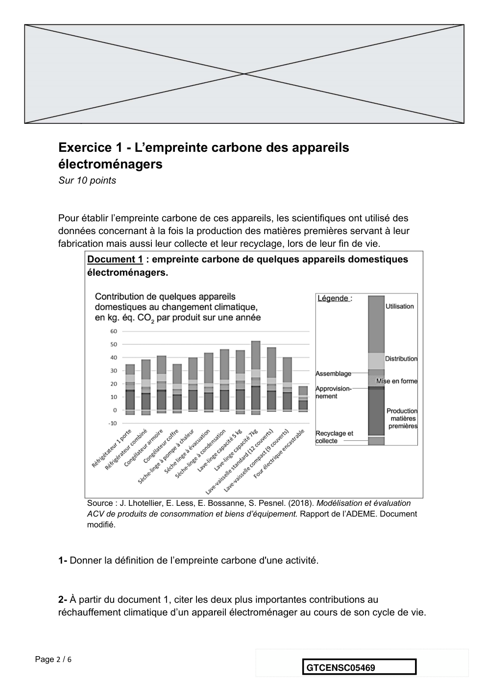

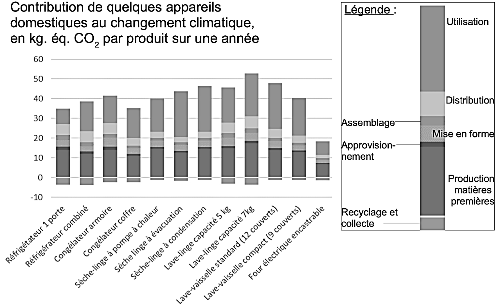

---

## Page 3

3- À partir du document 1, citer la contribution du cycle de vie d’un appareil
      électroménager qui diminue son empreinte carbone. Justifier la réponse.

             Document 2 : projection de l’évolution des ventes de produits de gros
             électroménagers et de l’évolution du nombre de leurs réparations dans
             les prochaines années en France.

             Source : Benoît TINETTI, Anton BERWALD, Victoire SENLIS. (2018). État des lieux de
             l’activité de réparation des appareils électroménagers dans sa relation au produit et à la filière.
             Rapport final, phase 2. GIFAM, ADEME.

      4. À partir du document 2, montrer que le taux de variation des ventes de produits de
      gros électroménagers est de + 1,32 % entre 2016 et 2025, et que celui du nombre de
      réparations est de – 21,4 %.

      Document 3 : extrait d’un rapport d’enquête sur les enjeux et solutions en
      matière de durabilité́ d’un lave-linge.
      « Sachant qu’un lave-linge pèse en moyenne 70 kg, comment expliquer qu’il faille 2
      tonnes de matières mobilisées ? Un lave-linge contient en moyenne 1,4 kg de cuivre
      par exemple. C’est une ressource rare et difficile à extraire. Il faut compter 8 tonnes
      de roches déplacées pour obtenir un seul kilo de cuivre. Cette ressource pèse donc
      en fait lourd sur son bilan écologique. Plus la vie d’un lave-linge sera longue, plus
      son impact écologique sera réduit car cela évite tout simplement la production d’un
      appareil neuf. »
      Source : Association HOP. (septembre 2019). Rapport d’enquête sur les enjeux et solutions en
      matière de durabilité des lave-linge.

      5. À partir de l’ensemble des documents et des taux de variation précédents,
      expliquer si l’évolution du nombre de réparations permet d’envisager un abaissement
      de l’empreinte carbone liée aux appareils de gros électroménagers.
      6. À partir de vos connaissances et des documents 1 et 3, proposer des
      comportements permettant de minimiser l’empreinte carbone d’un lave-linge.
                                                Fin de l’exercice

Page 3 / 6
                                                                            GTCENSC05469

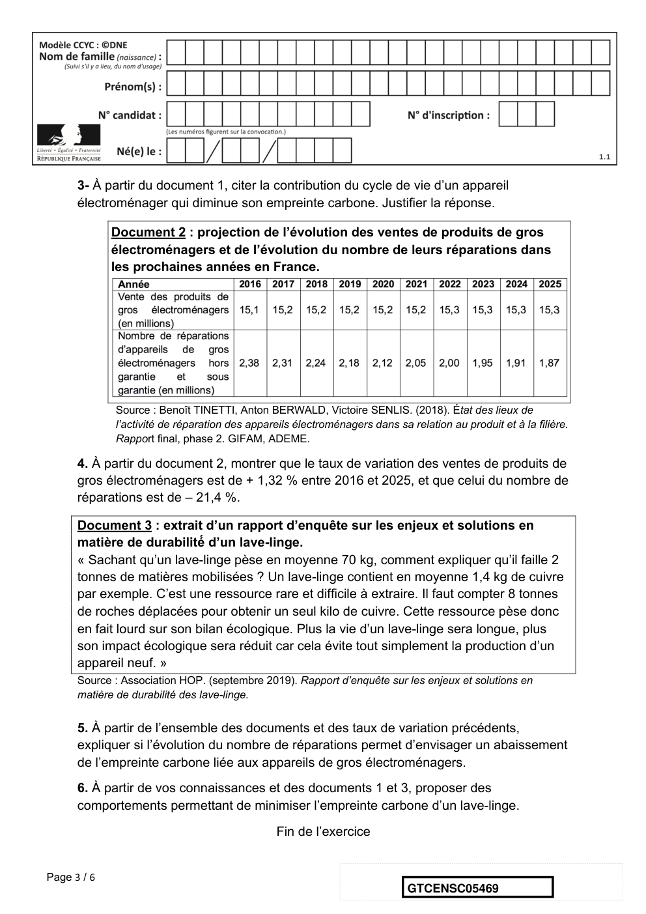

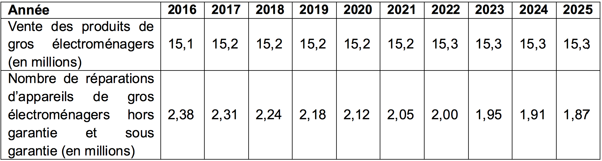

---

## Page 4

Exercice 2 – Éolienne, un choix d’avenir ?
      Sur 10 points

      Le choix de la France pour produire son énergie électrique s’est tourné vers le
      nucléaire mais les impacts négatifs liés notamment au traitement des déchets
      radioactifs nous amènent à nous interroger sur nos futurs choix énergétiques, en
      particulier sur l’utilisation des énergies renouvelables comme l’éolien.

      Partie A - La production d’énergie électrique française
      En 2019, l’éolien a compté pour 6,3 % de la production d’énergie électrique en
      France métropolitaine selon RTE (Réseau de Transport de l’Electricité), consolidant
      ainsi sa place de principale filière renouvelable après l’hydroélectricité. En 2019, la
      puissance du parc éolien raccordé en France métropolitaine a augmenté de 9 % par
      rapport à fin 2018.

      Tableau 1 : répartition des sources d’énergie dans le cadre de la production
      nette d’énergie électrique en France en 2019

             Nucléaire Hydraulique Éolien Solaire Bioénergie          Gaz   Fioul Charbon

      Part
       en      70,6         11,2        6,3      2,2        1,8       7,2    0,4      0,3
       %
                                                                                Source RTE

      1- Définir les énergies fossiles et citer celles qui sont présentes dans le tableau 1.
      Calculer le pourcentage total qu’elles représentent dans la production électrique
      française.
      2- Sachant que la production nette d’énergie électrique en France métropolitaine en
      2019 était de 537 700 GWh, calculer la production d’énergie électrique issue du
      nucléaire puis celle issue de l’éolien en GWh.

Page 4 / 6
                                                                  GTCENSC05469

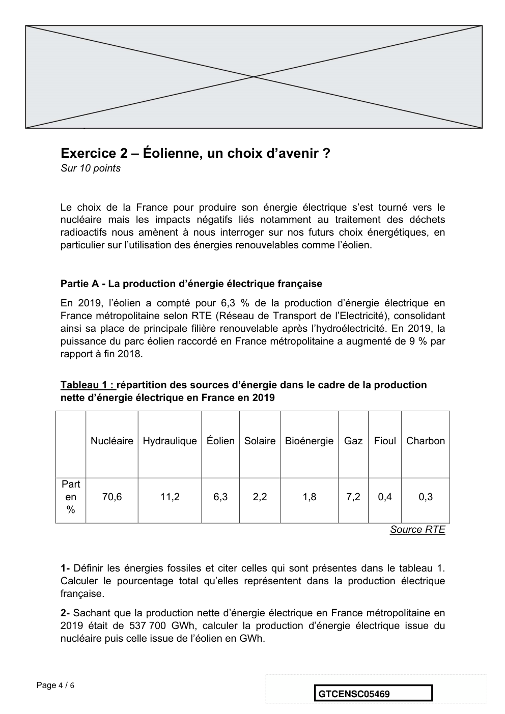

---

## Page 5

Partie B - Comparaison des énergies éolienne et nucléaire

      Document 2 : énergies éolienne et nucléaire en France
      La Normandie se situe à la 7ème position des
      régions métropolitaines en terme d’éolien
      terrestre. La puissance moyenne d’une éolienne
      terrestre en France est de :
      𝑃!"#$%&&% = 3,0 MW. L’électricité produite à partir
      d’une éolienne est intermittente. La disponibilité
      annuelle est de 2000 h. Les éoliennes sont
      souvent décriées pour leur impact sur le
      paysage et sur la faune.
      Il suffit d’un peu moins de deux ans pour
      construire et raccorder une éolienne. Le coût                    Éolienne
      d’une éolienne ayant une puissance de 3,0 MW
      est de 3 millions d’euros.
                                             Premier réacteur EPR (European Pressurized
                                             water Reaction ) français de génération 3,
                                             Flamanville 3, situé en Normandie, s’inscrit
                                             dans le programme de renouvellement du
                                             parc nucléaire français en prévention du
                                             démantèlement progressif des premières
                                             installations.
                                             Il délivrera une puissance électrique :
                                             𝑃!'( = 1,6 GW avec une disponibilité annuelle
                                             de 6 500 h.
                 Réacteur EPR                La réalisation de l’EPR a commencé en 2007
                                             et devrait s’achever en 2021. Le coût est de
                                             l’ordre de 19,1 milliards d’euros contre les 3,3
                                             milliards annoncés en 2 006.
      L’énergie électrique obtenue en watt heure (Wh) pendant une certaine durée se
      calcule par la formule : 𝐸 = 𝑃 × ∆𝑡

      où 𝑃 est la puissance en watt (W) et ∆𝑡 la durée en heure (h).

Page 5 / 6
                                                                GTCENSC05469

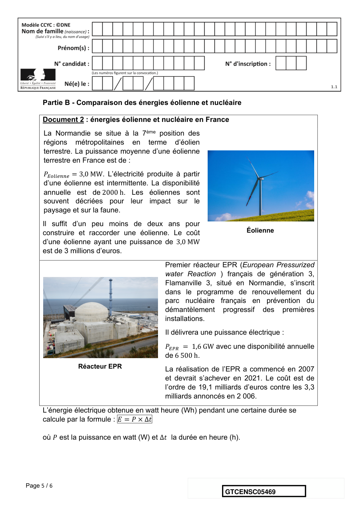

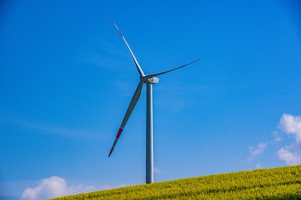

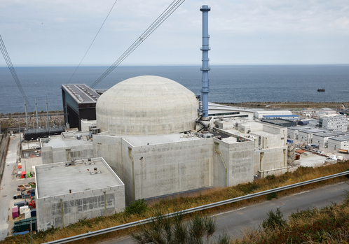

---

## Page 6

3- En vous aidant des documents ci-dessus, calculer le nombre d’éoliennes
      nécessaires pour obtenir une quantité d’énergie électrique équivalente à celle du
      réacteur EPR.

      Le document 3 met en évidence les principales causes de mortalité des oiseaux aux
      États-Unis. Elle est transposable à la France.

      Document 3 : causes de mortalité des oiseaux

      Source : consoglob

      4- À l’aide de l’ensemble des documents et de vos connaissances, comparer les
      modes de production d’énergie électrique de source éolienne et nucléaire. Un
      paragraphe argumenté de quinze à vingt lignes environ est demandé.

                                       Fin de l’exercice

Page 6 / 6
                                                             GTCENSC05469

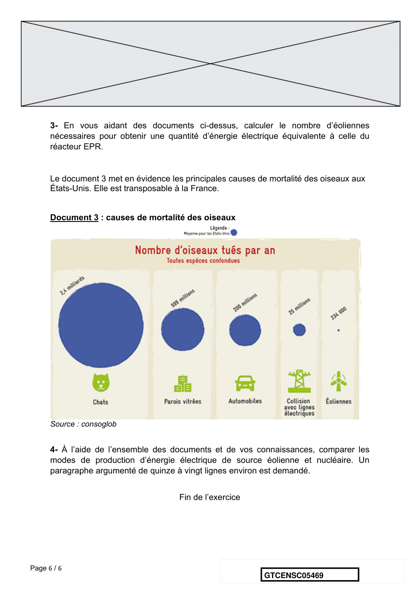

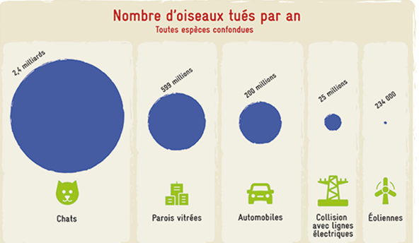
