# e3c-enseignement-scientifique-terminale-05470-sujet-officiel

> Source : `../../../../pdf_version/02_es_ponctuelle/e3c/2021/e3c-enseignement-scientifique-terminale-05470-sujet-officiel.pdf` — conversion Markdown (texte + visuels).
> Stratégie : [STRATEGIE_MARKDOWN.md](../../../../STRATEGIE_MARKDOWN.md)

---

## Page 1

ÉVALUATIONS COMMUNES

      CLASSE :

      EC : ☐ EC1 ☐ EC2 ☒ EC3

      VOIE : ☒ Générale ☐ Technologique ☐ Toutes voies (LV)
      ENSEIGNEMENT : Enseignement scientifique
      DURÉE DE L’ÉPREUVE : --2h--
      Niveaux visés (LV) : LVA               LVB
      CALCULATRICE AUTORISÉE : ☒Oui ☐ Non

      DICTIONNAIRE AUTORISÉ :           ☐Oui ☒ Non

      ☒ Ce sujet contient des parties à rendre par le candidat avec sa copie. De ce fait, il ne peut être
      dupliqué et doit être imprimé pour chaque candidat afin d’assurer ensuite sa bonne numérisation.
      ☐ Ce sujet intègre des éléments en couleur. S’il est choisi par l’équipe pédagogique, il est
      nécessaire que chaque élève dispose d’une impression en couleur.

      ☐ Ce sujet contient des pièces jointes de type audio ou vidéo qu’il faudra télécharger et jouer le jour
      de l’épreuve.
      Nombre total de pages : 8

Page 1 / 8
                                                                            GTCENSC05470

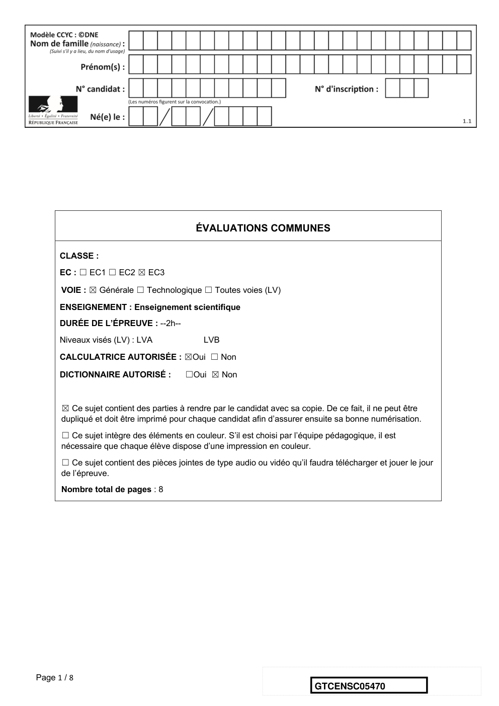

---

## Page 2

Exercice 1 - Capteur photovoltaïque
      Sur 10 points

      Les capteurs
      photovoltaïques à base de
      semi-conducteurs équipent
      de plus en plus de
      logements en France, ce qui
      témoigne d’une prise de
      conscience par la population
      des problématiques
      environnementales.

      1- Donner le nom d’un semi-conducteur fréquemment utilisé dans les capteurs
      photovoltaïques.
    Document 1 : spectre solaire et spectres d’absorption de trois semi-conducteurs
                                                     Coefficientd’absorption
                                                    Coefficient   d’absorption
                                                     (unitéarbitraire,
                                                    (unité  arbitraire,identique
                                                                        identiquepour
                                                                                  pourles
                                                                                       les33semi
                                                                                             semi
                                                     -conducteursétudiés)
                                                    -conducteurs     étudiés)

Page 2 / 8
                                                                 GTCENSC05470

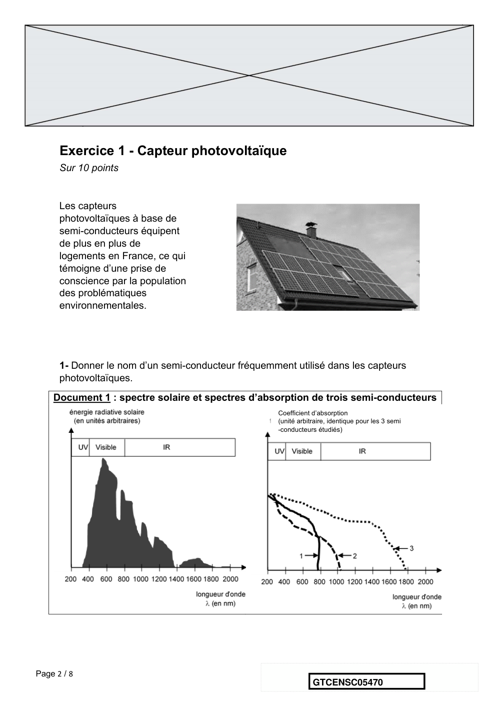

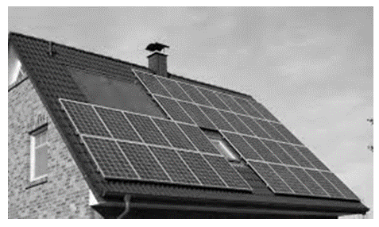

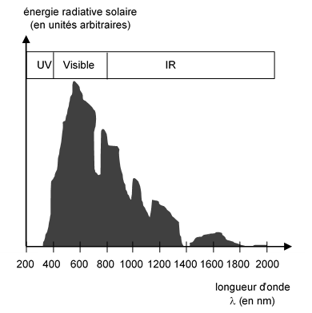

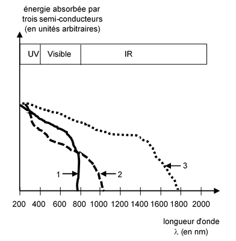

---

## Page 3

2- À l’aide du document 1 et en justifiant la réponse, indiquer le numéro du semi-
      conducteur (1,2 ou 3) le plus adapté pour équiper un capteur photovoltaïque.
      3- Compléter sur le document réponse de l’annexe, le diagramme des
      transformations énergétique réalisées par un capteur photovoltaïque.

      Le circuit électrique schématisé dans le document 2 est réalisé afin de mesurer la
      tension aux bornes d’un capteur photovoltaïque et l’intensité du courant qu’il délivre
      en fonction de la résistance variable présente dans ce circuit, lorsque le capteur est
      soumis a un éclairement constant.
      Document 2 : schéma du circuit électrique utilisé dans l’expérience

      4- Compléter sur le document de l’annexe, le tableau représentant les résultats des
      mesures en calculant la puissance pour chaque couple de valeurs (u ; i) puis
      déterminer la valeur de la résistance permettant de maximiser la puissance délivrée
      par le capteur photovoltaïque.
      Données :    P=uxi
                   P : puissance (en W)
                   u : tension (en V)
                   i : intensité du courant (en A)

Page 3 / 8
                                                                 GTCENSC05470

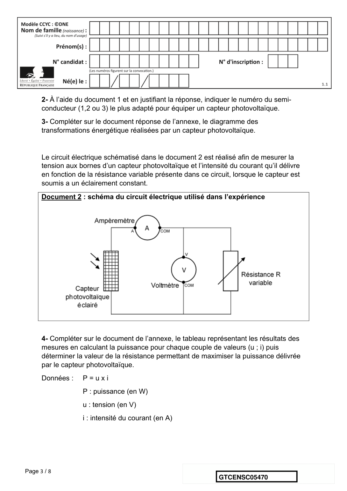

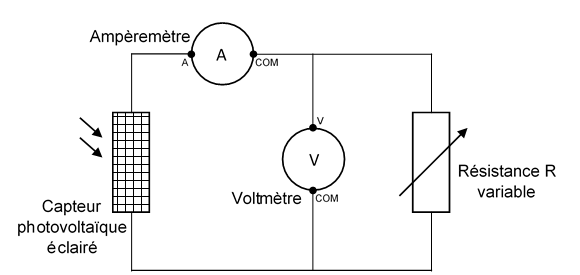

---

## Page 4

Document 3 : caractéristiques i=f(u)
                                 cas de la résistance
                                 cas du capteur photovoltaïque

      5- À l’aide des caractéristiques i=f(u) de la résistance et du capteur photovoltaïque
      données dans le document 3, déterminer les coordonnées (u ; i) du point de
      fonctionnement du circuit puis calculer la valeur de la résistance permettant de
      maximiser la puissance délivrée par le capteur photovoltaïque. Le résultat est-il
      cohérent avec celui trouvé à la question 4 ?
      Données :    Loi d’ohm u = R x i
                   u : tension (en V)
                   R : résistance (en Ω)
                   i : intensité du courant (en A)

      6- L’empreinte carbone liée à l’utilisation d’un capteur photovoltaïque n’est pas nulle
      alors que cette utilisation ne produit pas de dioxyde de carbone. Proposer une
      explication.

Page 4 / 8
                                                                 GTCENSC05470

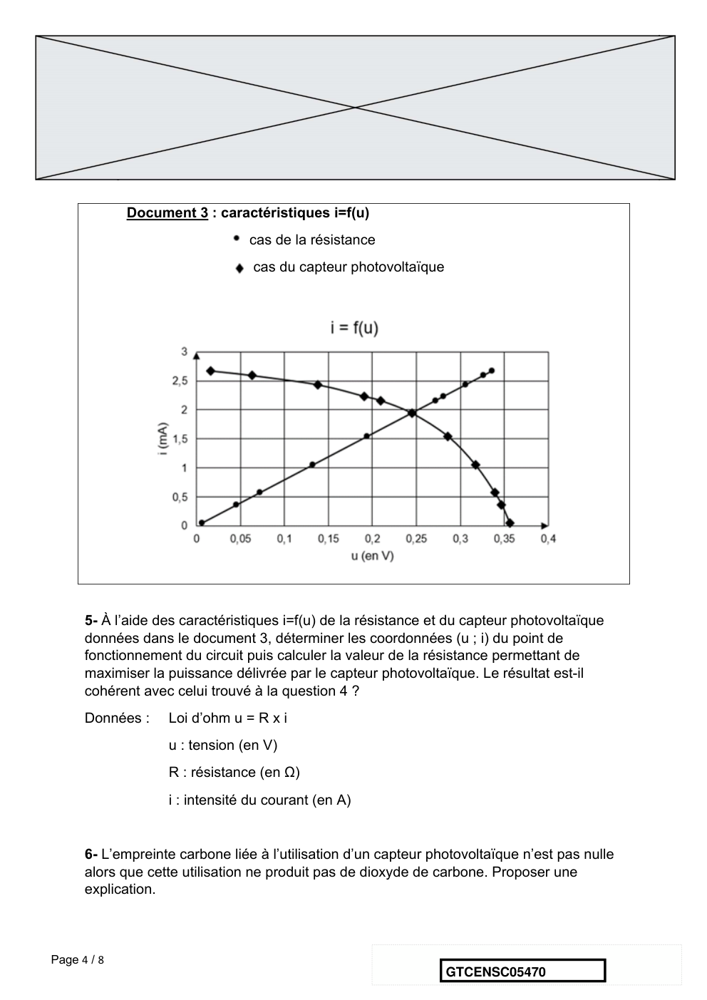

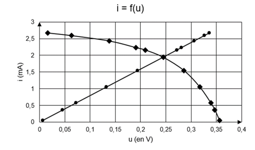

---

## Page 5

Annexe
                         Document réponse à rendre avec la copie
                                Exercice 1 - Capteur photovoltaïque

                Réponse à la question 3-
    Diagramme énergétique d’un capteur photovoltaïque

                Réponse à la question 4-
     R
                  0      20       50      80     100     120     180     300     600     1000    10000
   (en Ω)
     u
                0,016   0,063    0,128   0,191   0,209   0,245   0,286   0,317   0,339   0,347   0,356
   (en V)
      i
                 2,67   2,59     2,43    2,23    2,16    1,94    1,54    1,05    0,57    0,36    0,05
  (en mA)
      P         0,043                    0,43                                            0,12    0,018
                         …       0,31             …       …       …       …       …
  ( en .....)

                                                    Fin de l’exercice

Page 5 / 8
                                                                      GTCENSC05470

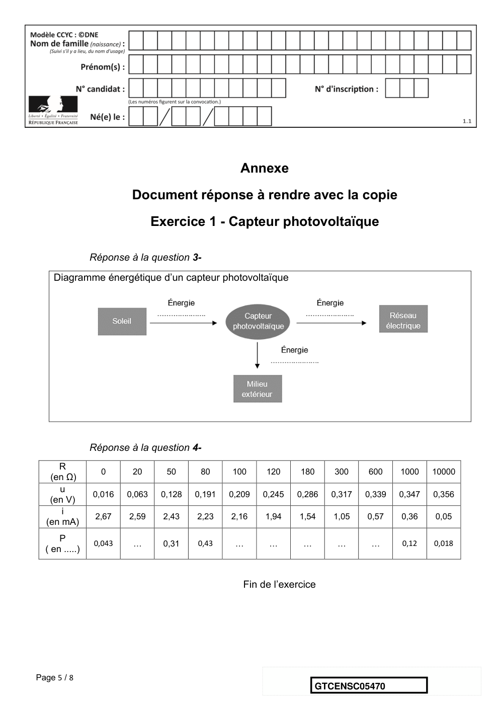

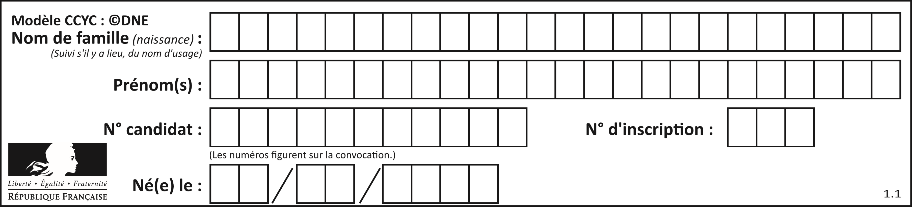

---

## Page 6

Exercice 2 - Invasion de sangliers à Fontainebleau
             Sur 10 points

             Le 14 mars 2016, nous pouvions lire dans un article du journal Le Figaro :
             « Tous les soirs à Fontainebleau (Seine-et-Marne), des sangliers se baladent
             dans les rues du centre-ville, à la recherche de nourriture. Une situation en
             passe de devenir incontrôlable, puisque très nombreux, les sangliers
             saccagent tout sur leur passage. ».
             Le but de cet exercice est de caractériser et d’expliquer l’évolution
             démographique de la population de sangliers à Fontainebleau.

             Document 1 : résultats de deux campagnes de capture-marquage-
             recapture pour étudier la population de sangliers dans la forêt de
             Fontainebleau.
                             Nombre d'individus      Nombre                 Nombre d'individus
                             capturés et marqués     d'individus            marqués recapturés
                             en début de protocole   capturés à la fin du
                                                     protocole

                   1980                  75                     67                     16
                   2020                  142                    130                    13

             1- Expliquer le principe de la méthode Capture-Marquage-Recapture.

             2- En calculant les effectifs en 1980 et 2020, montrer que l’abondance de la
             population de sangliers a été multipliée par environ 4,5.

Page 6 / 8
                                                                     GTCENSC05470

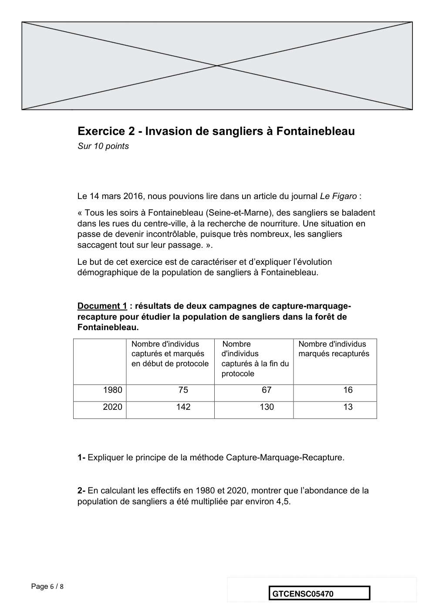

---

## Page 7

Document 2 : effet de la température hivernale sur la densité de
             sangliers
             Document 2a :
             le cycle de
             reproduction
             d'une laie adulte
             La laie est la femelle
             du sanglier. Le rut
             correspond à la
             période de chaleur,
             la gestation au fait
             de porter le petit et
             la mise bas à
             l'accouchement. Un
             hiver rigoureux peut
             être à l'origine d'une           D'après les populations de sangliers en Europe,
             mortalité plus                   publication du Dr. Jurgen Tack (2018).
             importante des
             individus.

             Document 2b : densité de sangliers en fonction de la température
             du mois de janvier

             La densité de sangliers (nombre de sangliers/km2) dépend de l'efficacité de
             leur reproduction.
             D'après biogeographical variation in the population density of wild boar in western
             Eurasia, Melis et al (2006).

Page 7 / 8
                                                                  GTCENSC05470

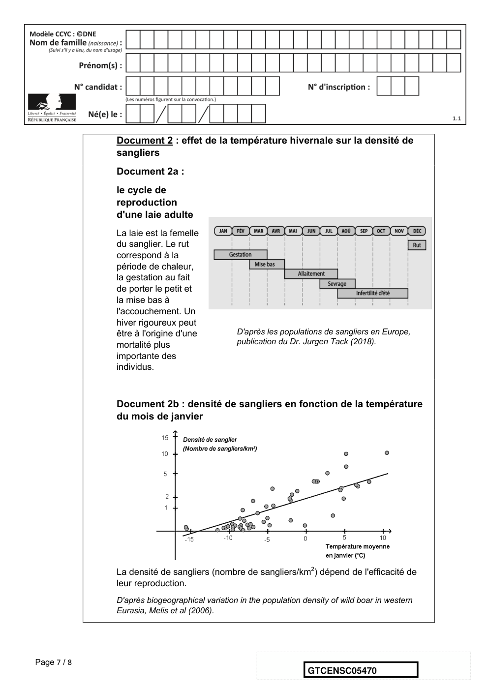

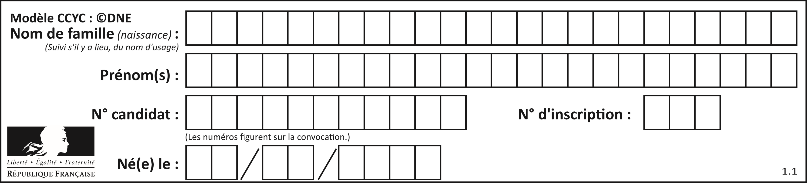

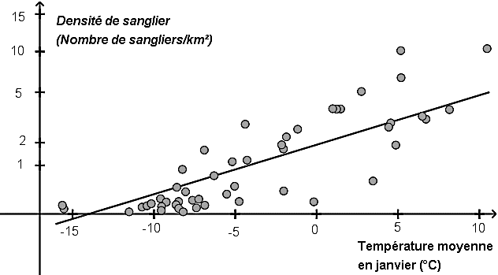

---

## Page 8

Document 3 : évolution de la température moyenne du mois de janvier à
             Paris (à proximité de Fontainebleau) entre 1980 et 2008
             En pointillé : la droite de tendance qui approche au mieux le nuage de points.

                                                8

                                                7

                                                6
               Température moyenne en janvier

                                                5

                                                4

                                                3
                                                                                                                               T (°C)
                                                2

                                                1

                                                 0
                                                  1980 1982 1984 1986 1988 1990 1992 1994 1996 1998 2000 2002 2004 2006 2008
                                                -1

                                                -2
                                                                                   Année

             D’après Rousseau, D. (2009). La Météorologie, 8(67).

             3- À l'aide des documents 2 et 3, rédiger un paragraphe argumenté expliquant
             l'une des causes de l’augmentation de la population de sangliers.

                                                                           Fin de l’exercice

Page 8 / 8
                                                                                                GTCENSC05470

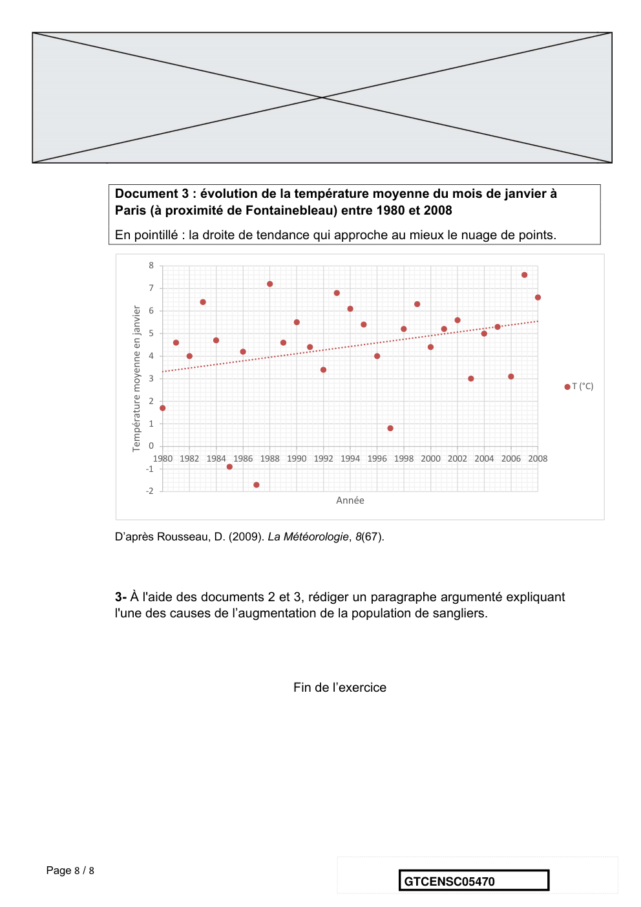

