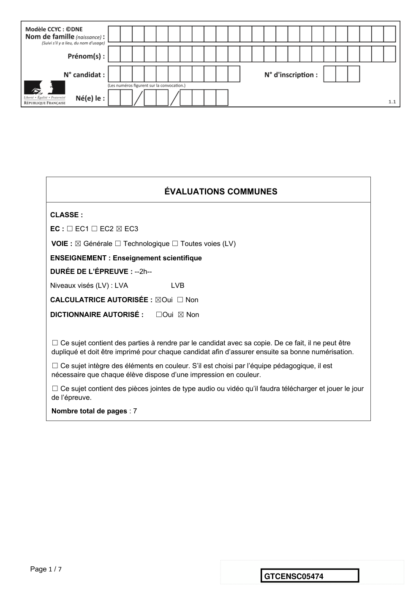
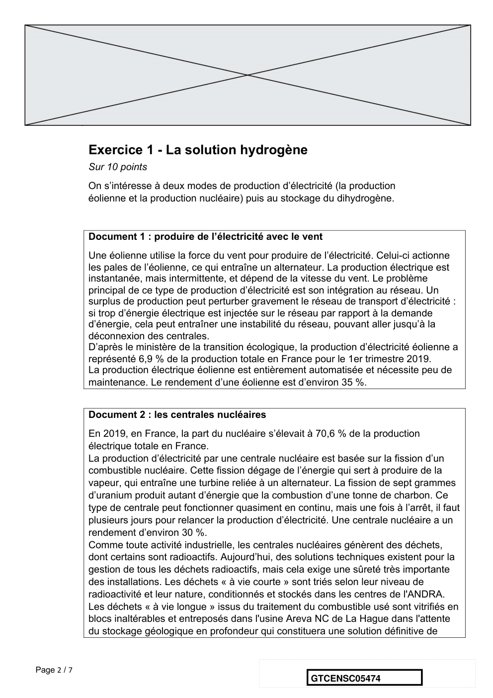
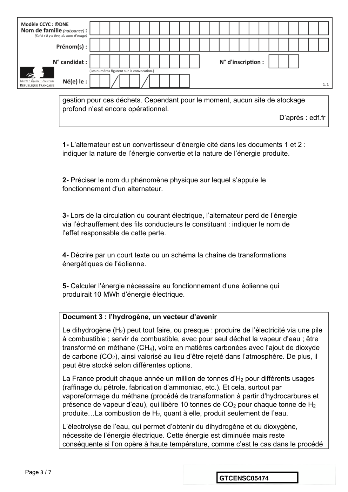
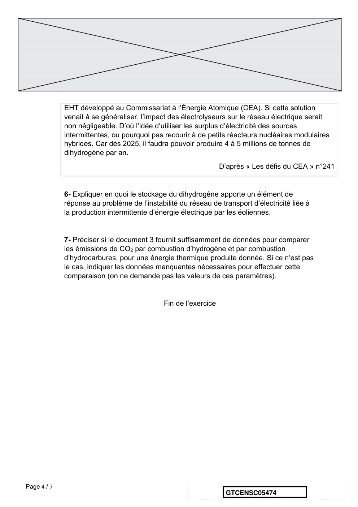
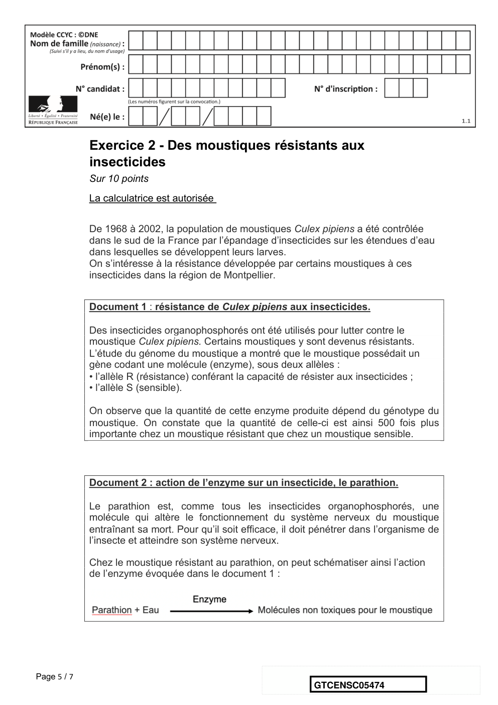
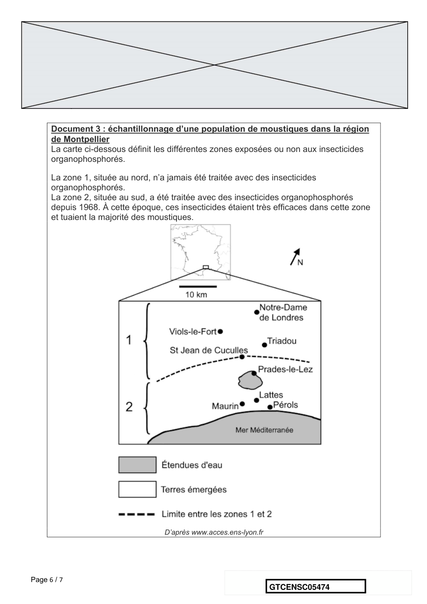
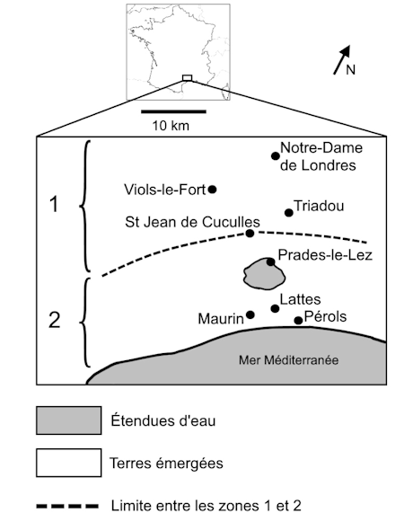
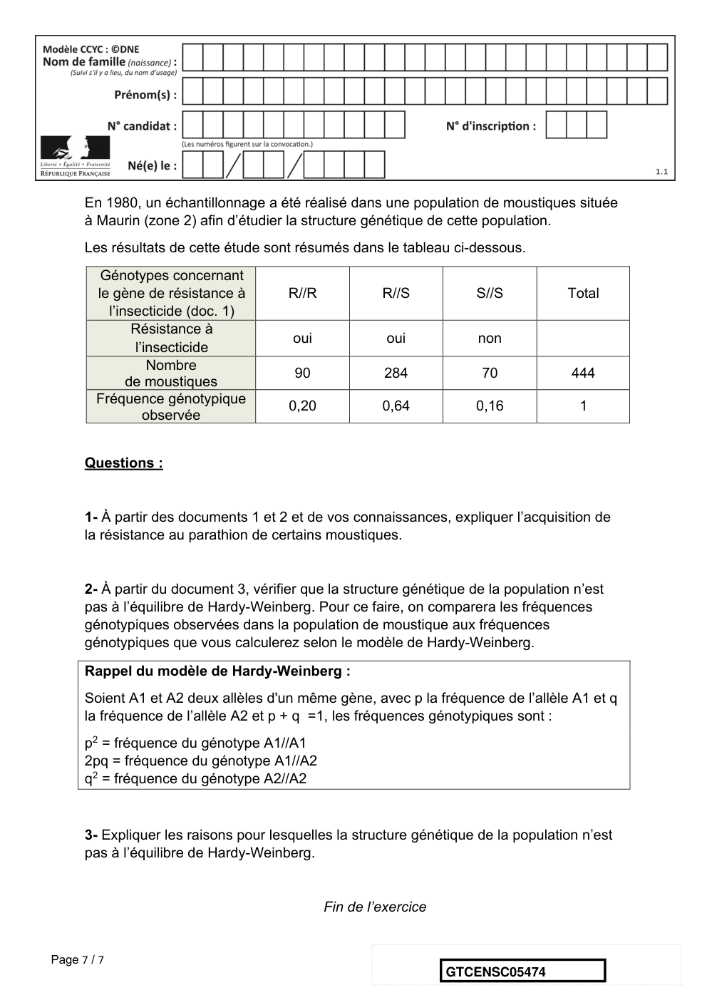

# e3c-enseignement-scientifique-terminale-05474-sujet-officiel

> Source : `../../../../pdf_version/02_es_ponctuelle/e3c/2021/e3c-enseignement-scientifique-terminale-05474-sujet-officiel.pdf` — conversion Markdown (texte + visuels).
> Stratégie : [STRATEGIE_MARKDOWN.md](../../../../STRATEGIE_MARKDOWN.md)

---

## Page 1

ÉVALUATIONS COMMUNES

      CLASSE :

      EC : ☐ EC1 ☐ EC2 ☒ EC3

      VOIE : ☒ Générale ☐ Technologique ☐ Toutes voies (LV)
      ENSEIGNEMENT : Enseignement scientifique
      DURÉE DE L’ÉPREUVE : --2h--
      Niveaux visés (LV) : LVA               LVB
      CALCULATRICE AUTORISÉE : ☒Oui ☐ Non

      DICTIONNAIRE AUTORISÉ :           ☐Oui ☒ Non

      ☐ Ce sujet contient des parties à rendre par le candidat avec sa copie. De ce fait, il ne peut être
      dupliqué et doit être imprimé pour chaque candidat afin d’assurer ensuite sa bonne numérisation.
      ☐ Ce sujet intègre des éléments en couleur. S’il est choisi par l’équipe pédagogique, il est
      nécessaire que chaque élève dispose d’une impression en couleur.

      ☐ Ce sujet contient des pièces jointes de type audio ou vidéo qu’il faudra télécharger et jouer le jour
      de l’épreuve.
      Nombre total de pages : 7

Page 1 / 7
                                                                            GTCENSC05474

---

## Page 2

Exercice 1 - La solution hydrogène
             Sur 10 points
             On s’intéresse à deux modes de production d’électricité (la production
             éolienne et la production nucléaire) puis au stockage du dihydrogène.

             Document 1 : produire de l’électricité avec le vent
             Une éolienne utilise la force du vent pour produire de l’électricité. Celui-ci actionne
             les pales de l’éolienne, ce qui entraîne un alternateur. La production électrique est
             instantanée, mais intermittente, et dépend de la vitesse du vent. Le problème
             principal de ce type de production d’électricité est son intégration au réseau. Un
             surplus de production peut perturber gravement le réseau de transport d’électricité :
             si trop d’énergie électrique est injectée sur le réseau par rapport à la demande
             d’énergie, cela peut entraîner une instabilité du réseau, pouvant aller jusqu’à la
             déconnexion des centrales.
             D’après le ministère de la transition écologique, la production d’électricité éolienne a
             représenté 6,9 % de la production totale en France pour le 1er trimestre 2019.
             La production électrique éolienne est entièrement automatisée et nécessite peu de
             maintenance. Le rendement d’une éolienne est d’environ 35 %.

             Document 2 : les centrales nucléaires
             En 2019, en France, la part du nucléaire s’élevait à 70,6 % de la production
             électrique totale en France.
             La production d’électricité par une centrale nucléaire est basée sur la fission d’un
             combustible nucléaire. Cette fission dégage de l’énergie qui sert à produire de la
             vapeur, qui entraîne une turbine reliée à un alternateur. La fission de sept grammes
             d’uranium produit autant d’énergie que la combustion d’une tonne de charbon. Ce
             type de centrale peut fonctionner quasiment en continu, mais une fois à l’arrêt, il faut
             plusieurs jours pour relancer la production d’électricité. Une centrale nucléaire a un
             rendement d’environ 30 %.
             Comme toute activité industrielle, les centrales nucléaires génèrent des déchets,
             dont certains sont radioactifs. Aujourd’hui, des solutions techniques existent pour la
             gestion de tous les déchets radioactifs, mais cela exige une sûreté très importante
             des installations. Les déchets « à vie courte » sont triés selon leur niveau de
             radioactivité et leur nature, conditionnés et stockés dans les centres de l'ANDRA.
             Les déchets « à vie longue » issus du traitement du combustible usé sont vitrifiés en
             blocs inaltérables et entreposés dans l'usine Areva NC de La Hague dans l'attente
             du stockage géologique en profondeur qui constituera une solution définitive de

Page 2 / 7
                                                                 GTCENSC05474

---

## Page 3

gestion pour ces déchets. Cependant pour le moment, aucun site de stockage
             profond n’est encore opérationnel.
                                                                                D’après : edf.fr

             1- L’alternateur est un convertisseur d’énergie cité dans les documents 1 et 2 :
             indiquer la nature de l’énergie convertie et la nature de l’énergie produite.

             2- Préciser le nom du phénomène physique sur lequel s’appuie le
             fonctionnement d’un alternateur.

             3- Lors de la circulation du courant électrique, l’alternateur perd de l’énergie
             via l’échauffement des fils conducteurs le constituant : indiquer le nom de
             l’effet responsable de cette perte.

             4- Décrire par un court texte ou un schéma la chaîne de transformations
             énergétiques de l’éolienne.

             5- Calculer l’énergie nécessaire au fonctionnement d’une éolienne qui
             produirait 10 MWh d’énergie électrique.

             Document 3 : l’hydrogène, un vecteur d’avenir
             Le dihydrogène (H2) peut tout faire, ou presque : produire de l’électricité via une pile
             à combustible ; servir de combustible, avec pour seul déchet la vapeur d’eau ; être
             transformé en méthane (CH4), voire en matières carbonées avec l’ajout de dioxyde
             de carbone (CO2), ainsi valorisé au lieu d’être rejeté dans l’atmosphère. De plus, il
             peut être stocké selon différentes options.
             La France produit chaque année un million de tonnes d’H2 pour différents usages
             (raffinage du pétrole, fabrication d’ammoniac, etc.). Et cela, surtout par
             vaporeformage du méthane (procédé de transformation à partir d’hydrocarbures et
             présence de vapeur d’eau), qui libère 10 tonnes de CO2 pour chaque tonne de H2
             produite…La combustion de H2, quant à elle, produit seulement de l’eau.
             L’électrolyse de l’eau, qui permet d’obtenir du dihydrogène et du dioxygène,
             nécessite de l’énergie électrique. Cette énergie est diminuée mais reste
             conséquente si l’on opère à haute température, comme c’est le cas dans le procédé

Page 3 / 7
                                                                  GTCENSC05474

---

## Page 4

EHT développé au Commissariat à l’Énergie Atomique (CEA). Si cette solution
             venait à se généraliser, l’impact des électrolyseurs sur le réseau électrique serait
             non négligeable. D’où l’idée d’utiliser les surplus d’électricité des sources
             intermittentes, ou pourquoi pas recourir à de petits réacteurs nucléaires modulaires
             hybrides. Car dès 2025, il faudra pouvoir produire 4 à 5 millions de tonnes de
             dihydrogène par an.
                                                                 D’après « Les défis du CEA » n°241

             6- Expliquer en quoi le stockage du dihydrogène apporte un élément de
             réponse au problème de l’instabilité du réseau de transport d’électricité liée à
             la production intermittente d’énergie électrique par les éoliennes.

             7- Préciser si le document 3 fournit suffisamment de données pour comparer
             les émissions de CO2 par combustion d’hydrogène et par combustion
             d’hydrocarbures, pour une énergie thermique produite donnée. Si ce n’est pas
             le cas, indiquer les données manquantes nécessaires pour effectuer cette
             comparaison (on ne demande pas les valeurs de ces paramètres).

                                             Fin de l’exercice

Page 4 / 7
                                                                  GTCENSC05474

---

## Page 5

Exercice 2 - Des moustiques résistants aux
             insecticides
             Sur 10 points
             La calculatrice est autorisée

             De 1968 à 2002, la population de moustiques Culex pipiens a été contrôlée
             dans le sud de la France par l’épandage d’insecticides sur les étendues d’eau
             dans lesquelles se développent leurs larves.
             On s’intéresse à la résistance développée par certains moustiques à ces
             insecticides dans la région de Montpellier.

             Document 1 : résistance de Culex pipiens aux insecticides.

             Des insecticides organophosphorés ont été utilisés pour lutter contre le
             moustique Culex pipiens. Certains moustiques y sont devenus résistants.
             L’étude du génome du moustique a montré que le moustique possédait un
             gène codant une molécule (enzyme), sous deux allèles :
             • l’allèle R (résistance) conférant la capacité de résister aux insecticides ;
             • l’allèle S (sensible).

             On observe que la quantité de cette enzyme produite dépend du génotype du
             moustique. On constate que la quantité de celle-ci est ainsi 500 fois plus
             importante chez un moustique résistant que chez un moustique sensible.

             Document 2 : action de l’enzyme sur un insecticide, le parathion.

             Le parathion est, comme tous les insecticides organophosphorés, une
             molécule qui altère le fonctionnement du système nerveux du moustique
             entraînant sa mort. Pour qu’il soit efficace, il doit pénétrer dans l’organisme de
             l’insecte et atteindre son système nerveux.

             Chez le moustique résistant au parathion, on peut schématiser ainsi l’action
             de l’enzyme évoquée dans le document 1 :

Page 5 / 7
                                                                  GTCENSC05474

---

## Page 6

Document 3 : échantillonnage d’une population de moustiques dans la région
      de Montpellier
      La carte ci-dessous définit les différentes zones exposées ou non aux insecticides
      organophosphorés.

      La zone 1, située au nord, n’a jamais été traitée avec des insecticides
      organophosphorés.
      La zone 2, située au sud, a été traitée avec des insecticides organophosphorés
      depuis 1968. À cette époque, ces insecticides étaient très efficaces dans cette zone
      et tuaient la majorité des moustiques.

                                   D’après www.acces.ens-lyon.fr

Page 6 / 7
                                                                   GTCENSC05474

---

## Page 7

En 1980, un échantillonnage a été réalisé dans une population de moustiques située
      à Maurin (zone 2) afin d’étudier la structure génétique de cette population.
      Les résultats de cette étude sont résumés dans le tableau ci-dessous.
         Génotypes concernant
        le gène de résistance à        R//R            R//S           S//S           Total
          l’insecticide (doc. 1)
               Résistance à
                                        oui             oui           non
               l’insecticide
                  Nombre
                                        90              284            70            444
              de moustiques
        Fréquence génotypique
                                       0,20            0,64           0,16             1
                 observée

      Questions :

      1- À partir des documents 1 et 2 et de vos connaissances, expliquer l’acquisition de
      la résistance au parathion de certains moustiques.

      2- À partir du document 3, vérifier que la structure génétique de la population n’est
      pas à l’équilibre de Hardy-Weinberg. Pour ce faire, on comparera les fréquences
      génotypiques observées dans la population de moustique aux fréquences
      génotypiques que vous calculerez selon le modèle de Hardy-Weinberg.

      Rappel du modèle de Hardy-Weinberg :
      Soient A1 et A2 deux allèles d'un même gène, avec p la fréquence de l’allèle A1 et q
      la fréquence de l’allèle A2 et p + q =1, les fréquences génotypiques sont :
      p2 = fréquence du génotype A1//A1
      2pq = fréquence du génotype A1//A2
      q2 = fréquence du génotype A2//A2

      3- Expliquer les raisons pour lesquelles la structure génétique de la population n’est
      pas à l’équilibre de Hardy-Weinberg.

                                              Fin de l’exercice

Page 7 / 7
                                                                  GTCENSC05474

