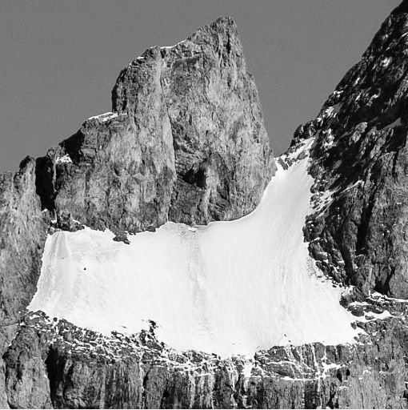
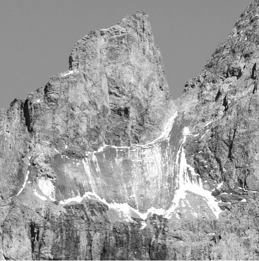
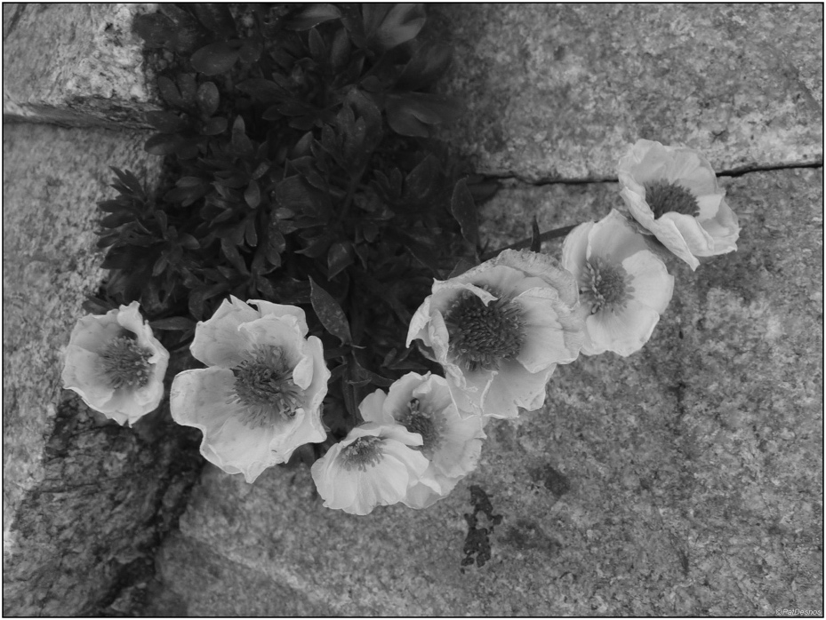
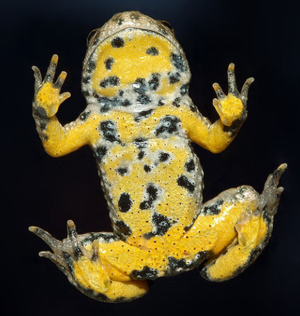

# e3c-enseignement-scientifique-terminale-05478-sujet-officiel

> Source : `../../../../pdf_version/02_es_ponctuelle/e3c/2021/e3c-enseignement-scientifique-terminale-05478-sujet-officiel.pdf` — conversion Markdown (texte + visuels utiles).
> Stratégie : [STRATEGIE_MARKDOWN.md](../../../../STRATEGIE_MARKDOWN.md)

---

## Page 1

ÉVALUATIONS COMMUNES

      CLASSE :

      EC : ☐ EC1 ☐ EC2 ☒ EC3

      VOIE : ☒ Générale ☐ Technologique ☐ Toutes voies (LV)
      ENSEIGNEMENT : Enseignement scientifique
      DURÉE DE L’ÉPREUVE : --2h--
      Niveaux visés (LV) : LVA               LVB
      CALCULATRICE AUTORISÉE : ☒Oui ☐ Non

      DICTIONNAIRE AUTORISÉ :           ☐Oui ☒ Non

      ☐ Ce sujet contient des parties à rendre par le candidat avec sa copie. De ce fait, il ne peut être
      dupliqué et doit être imprimé pour chaque candidat afin d’assurer ensuite sa bonne numérisation.
      ☐ Ce sujet intègre des éléments en couleur. S’il est choisi par l’équipe pédagogique, il est
      nécessaire que chaque élève dispose d’une impression en couleur.

      ☐ Ce sujet contient des pièces jointes de type audio ou vidéo qu’il faudra télécharger et jouer le jour
      de l’épreuve.
      Nombre total de pages : 9

Page 1 / 9
                                                                            GTCENSC05478

---

## Page 2

Exercice 1 - Effondrement des montagnes, biodiversité
             et climat
             Sur 10 points, calculatrice non autorisée
             Les montagnes semblent ne pas changer au cours du temps à l’échelle de la
             vie humaine. Pourtant le réchauffement climatique en cours, avec une
             augmentation des températures deux fois supérieures dans les Alpes à celle
             du reste de l’Europe, entraîne la fonte de glaciers et la dégradation du
             permafrost. Quand ce sol gelé se réchauffe, les roches se désolidarisent et se
             déstabilisent.

             Photographies du glacier Carré situé sur la Meije, sommet emblématique
             des Alpes. En 2008 (à gauche) et en 2018 (à droite)

             Le glacier Carré se réduit à ses marges, libérant durant tout l’été un
             ruissèlement propice à la végétation

             http://www.ecrins-parcnational.fr/sites/ecrins-parcnational.com/files/article/18476/body/084265-
             meijecomparatifsoctobre2008-2018.jpg

Page 2 / 9
                                                                                 GTCENSC05478

---

## Page 3

Document 1 : la renoncule des glaciers de la Meije
             (D’après Espèces Revue d’histoire naturelle n°37, 2020)

             1877 : le sommet de la Meije, culminant à 3893 m, est atteint par les
             alpinistes. Ils découvrent un « jardin suspendu » situé au « bivouac du glacier
             carré » où trois espèces végétales sont présentes à cette haute altitude.
             2012 : deux des trois espèces végétales perdurent. On observe aussi le net
             recul du glacier Carré libérant un espace rocailleux colonisé par une nouvelle
             population de renoncules des glaciers (Ranunculus glacialis). La renoncule
             des glaciers est la renoncule d’altitude par excellence. Elle pousse par petits
             groupes dans les pierriers et sols instables.

              Photographie de renoncules des glaciers enracinées entre des pierres
                             https://www.tela-botanica.org/bdtfx-nn-55036-illustrations

             Document 2 : la limite de la végétation en haute altitude
             La limite de la présence de végétation en altitude se situe à 4 504 m dans les
             Alpes. À cette altitude, la pression partielle du dioxyde de carbone a une
             valeur de 480 mbar. Ce gaz fondamental pour les plantes, se réduit
             drastiquement en haute altitude : la photosynthèse est de ce fait rendue
             difficile. Ainsi, en plus de la température et de la disponibilité en eau liquide, la
             pression partielle en CO2 parait être un des facteurs clés pour comprendre la
             capacité des plantes à se développer en situation extrême.
             D’après Espèces Revue d’histoire naturelle n°37 (septembre à novembre 2020)

Page 3 / 9
                                                                       GTCENSC05478

---

## Page 4

Document 3 : températures du Glacier Carré du 15 juillet 2015 au 1er
             janvier 2019.
             Des capteurs de température ont été disposés au ras du sol, à hauteur de vie
             des renoncules des glaciers. L’éboulement de 2018 - malgré son côté
             destructeur – est une remarquable opportunité pour cette plante : de
             nombreuses particules et sables se sont déposés sur place, créant un sol
             meuble, les éléments minéraux sont plus facilement mis en solution et donc
             absorbables par les plantes.

             D’après la réalisation de R. Moine – Espèces (revue d’histoire naturelle) n°37 (2020)

             1- Indiquer si les données du document 3 peuvent être qualifiées de
             climatiques ou météorologiques. Justifier la réponse.

             2- À partir de l’exploitation des informations fournies dans l’introduction et le
             document 3, expliquer l’origine de l’éboulement du glacier Carré de 2018.

             3- Rédiger un paragraphe argumenté (de dix à vingt lignes) décrivant l’effet du
             changement climatique sur les renoncules des glaciers, en exploitant les
             documents et vos connaissances.

Page 4 / 9
                                                                          GTCENSC05478

---

## Page 5

4- L’augmentation de la quantité de dioxyde de carbone dans l’atmosphère a
             de nombreuses conséquences concrètes à la surface de la Terre. Reporter
             sur la copie les lettres correspondants aux affirmations exactes ci-dessous.
                a) Le CO2 présent dans l’atmosphère réfléchit une partie du rayonnement
                   infra-rouge émis par la Terre. Il en résulte une élévation de la
                   température au sol.
                b) Le CO2 présent dans l’atmosphère absorbe une partie du rayonnement
                   infra-rouge émis par la Terre. Il en résulte une élévation de la
                   température au sol.
                c) La présence de CO2 dans l’atmosphère entraîne un surplus d’énergie
                   radiative reçue par le sol et, indirectement, la montée du niveau des
                   océans.
                d) La présence de CO2 dans l’atmosphère entraîne une augmentation de
                   la température moyenne des océans.
                e) La pression partielle de CO2 est plus élevée en altitude, ce qui explique
                   que la photosynthèse soit plus difficile à réaliser
                f) La pression partielle de CO2 est plus faible en altitude, ce qui explique
                   en partie la limite altitudinale des plantes vasculaires.

                                            Fin de l’exercice

Page 5 / 9
                                                                GTCENSC05478

---

## Page 6

Exercice 2 - Le crapaud sonneur à ventre jaune
      Sur 10 points

      L'objectif de cet exercice est de s’intéresser aux actions humaines entreprises pour
      la sauvegarde d’une espèce d'Amphibien.

        Document 1 : le crapaud sonneur à ventre jaune, une espèce en danger.

               Photo de l’aspect général
                                                         Photo de la face ventrale

        Le crapaud sonneur à ventre jaune, Bombina variegata, est une espèce
        d'Amphibien qui fait partie des espèces vulnérables et menacées. Elle fait l’objet
        d’une protection en France.
        Ce crapaud de 3,5 à 5,5 cm de long tient son nom de sa face ventrale jaune
        tachetée de noir, qui contraste avec sa face dorsale marron-grisâtre.
        Les mares et les flaques d’eau en forêt constituent l’habitat naturel de cette
        espèce. Ces lieux sont menacés par l'industrialisation mais aussi par l'agriculture.
        La maturité sexuelle du crapaud sonneur à ventre jaune est atteinte au bout de 3
        ou 4 ans. Ce crapaud utilise plusieurs mares pour se reproduire accrochant
        quelques œufs de façon regroupée ou isolée aux plantes aquatiques. Après
        éclosion des œufs, les têtards se métamorphosent en 34 à 130 jours.
                                                       D’après Wikipédia (consulté le 04/11/2020)

Page 6 / 9
                                                                 GTCENSC05478

---

## Page 7

Document 2 : le crapaud sonneur à ventre jaune, une espèce suivie.
      Le marquage peut être un marquage de groupe (un point de couleur par exemple
      pour chaque individu capturé lors d’une session donnée), mais on utilise de
      préférence le marquage individuel, car il permet d’obtenir beaucoup plus
      d’informations. Chez le crapaud sonneur, on identifie facilement les individus grâce à
      leur motif ventral unique. Ce motif de coloration est en effet propre à chaque individu
      et stable dans le temps (hormis pour les stades les plus jeunes).
              Photos de motifs ventraux du même individu à des stades différents.
             De gauche à droite : juvénile, subadulte, adulte (apte à la reproduction)

                        D’après Synthèse de la méthode de suivi de population par C.M.R.
                                 appliquée au Sonneur à ventre jaune, ONF-MEDDE, 2016.
      Des biologistes veulent estimer l'abondance d'une population isolée de sonneurs à
      ventre jaune dans la forêt domaniale de Darney en Lorraine. Pour cela, ils utilisent la
      méthode CMR (capture, marquage, recapture) qui permet d'estimer l'abondance
      d'une population. Ils ont ainsi capturé, marqué puis relâché 548 sonneurs à ventre
      jaune. Une deuxième capture de sonneurs à ventre jaune a été effectuée quelques
      mois plus tard : 554 ont été capturés dont 133 qui avaient été marqués lors de la
      première capture.

Page 7 / 9
                                                                GTCENSC05478

---

## Page 8

1- Présenter les principes de la méthode CMR (capture, marquage, recapture).

      2- Donner la fréquence 𝑓 de la population marquée rapportée à l’échantillon des 𝑛 =
      554 individus recapturés. En déduire une première estimation de l'abondance de la
      population de sonneurs à ventre jaune dans la zone d'étude.

      3- Pour tenir compte de la fluctuation d’échantillonnage, on considère, avec un indice
      de confiance de 95 %, que la proportion de la population marquée rapportée à la
      population totale de sonneurs à ventre jaune se situe dans l’intervalle :
                                                !           !
                                         &𝑓 −        ;𝑓 +        *,
                                                √#          √#

      Déterminer dans ces conditions un encadrement de l’abondance de la population de
      sonneurs à ventre jaune.

      4- À partir de vos connaissances et des documents, formuler des hypothèses sur les
      causes possibles de la baisse d’abondance de ce crapaud.

      5- On cherche à élaborer un plan national d'action pour la protection du crapaud
      sonneur à ventre jaune. Proposer différentes mesures permettant d'éviter l'extinction
      de cette espèce, en se basant sur les documents 1, 2 et 3 et vos connaissances.

      Document 3 : le crapaud sonneur à ventre jaune, mesures relatives à sa
      conservation.
      Afin de travailler à la conservation du sonneur à ventre jaune (Bombina
      variegata) dont le statut est critique en Normandie, l’Union régionale des Centres
      permanents d’initiatives pour l’environnement de Normandie propose la mise en
      place d’un élevage conservatoire de cinq années (2018-2023) permettant, d’une part,
      de protéger un groupe d’individus d’éventuelles menaces pouvant affecter le site de
      prélèvement et, d’autre part, d’optimiser la reproduction des géniteurs afin de tenter
      la réintroduction dans deux sites restaurés dans le département de l’Eure.

Page 8 / 9
                                                                      GTCENSC05478

---

## Page 9

L’élevage conservatoire s’articule en 3 étapes :
      1/ prélèvement d’un groupe de 20 adultes du site de l’Eure ; élevage et reproduction
      en conditions contrôlées. Le nombre de spécimens prélevés permet de garantir la
      diversité génétique de la population d’origine ;
      2/ libération de 10 % des individus issus de la reproduction de ce groupe dans la
      population d’origine ;
      3/ réintroduction de l’espèce (minimum 2000 et 2500 juvéniles) sur 2 sites favorables
      identifiés afin de tenter de restaurer une population stable.
             D’après http://www.normandie.developpement-durable.gouv.fr/ur-cpie-sonneur-a-ventre-jaune-27-derogation-a2589.html

                                                           Fin de l’exercice

Page 9 / 9
                                                                                       GTCENSC05478
