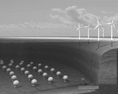
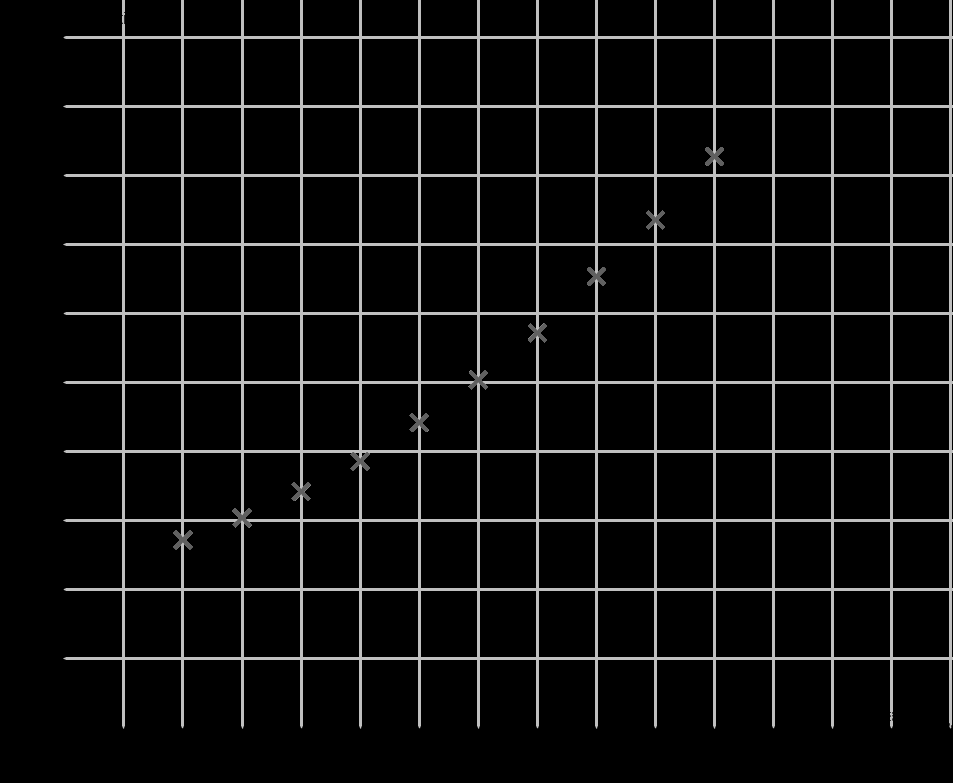

# e3c-enseignement-scientifique-terminale-05479-sujet-officiel

> Source : `../../../../pdf_version/02_es_ponctuelle/e3c/2021/e3c-enseignement-scientifique-terminale-05479-sujet-officiel.pdf` — conversion Markdown (texte + visuels utiles).
> Stratégie : [STRATEGIE_MARKDOWN.md](../../../../STRATEGIE_MARKDOWN.md)

---

## Page 1

ÉVALUATIONS COMMUNES

      CLASSE :

      EC : ☐ EC1 ☐ EC2 ☒ EC3

      VOIE : ☒ Générale ☐ Technologique ☐ Toutes voies (LV)
      ENSEIGNEMENT : Enseignement scientifique
      DURÉE DE L’ÉPREUVE : --2h--
      Niveaux visés (LV) : LVA               LVB
      CALCULATRICE AUTORISÉE : ☒Oui ☐ Non

      DICTIONNAIRE AUTORISÉ :           ☐Oui ☒ Non

      ☒ Ce sujet contient des parties à rendre par le candidat avec sa copie. De ce fait, il ne peut être
      dupliqué et doit être imprimé pour chaque candidat afin d’assurer ensuite sa bonne numérisation.
      ☐ Ce sujet intègre des éléments en couleur. S’il est choisi par l’équipe pédagogique, il est
      nécessaire que chaque élève dispose d’une impression en couleur.

      ☐ Ce sujet contient des pièces jointes de type audio ou vidéo qu’il faudra télécharger et jouer le jour
      de l’épreuve.
      Nombre total de pages : 9

Page 1 / 9
                                                                            GTCENSC05479

---

## Page 2

Exercice 1 - Des sphères géantes immergées sous
             l’eau
             Sur 10 points

             Le projet de recherche scientifique baptisé StEnSEA (pour « Stored Energy in
             the Sea ») développé par l’institut allemand Fraunhofer IWES propose un
             nouveau dispositif de stockage de l’électricité constitué de sphères géantes
             immergées en mer.
             On cherche à comprendre en quoi ce type de dispositif pourrait être
             intéressant pour stocker l’énergie et en pallier l’intermittence.

                   Installation d’une sphère géante et schéma de leur position en mer
                                          (https://lenergeek.com)

             PARTIE 1 – fonctionnement des sphères

             Document 1 : fonctionnement général et paramètres des sphères
             Chacune de ces sphères est connectée à un système de production
             d'électricité (ferme éolienne, ferme solaire…).
             Lors des périodes de forte production d'énergie, l'énergie électrique
             excédentaire qui ne peut être injectée dans le réseau est utilisée pour faire
             fonctionner des pompes qui expulsent l’eau présente à l’intérieur des sphères.
             À l’inverse, en période de faible production, on laisse l’eau s’engouffrer dans
             les sphères à travers un jeu de turbines qui génèrent de l’énergie électrique.
             L'objectif de ce projet est que chacune sphères soit en mesure de stocker
             20 MWh.

Page 2 / 9
                                                                    GTCENSC05479

---

## Page 3

Paramètre                             Valeur
                       Profondeur de d’installation                      750 m
                     Diamètre intérieur de la sphère                    28,6 m
                             Energie stockée                            20 MWh
                            Energie restituée                          18,3 MWh

             Document 2 : schéma simplifié du couple turbine- alternateur

                                                       Alternateur
                        Turbine

                                                                             Bobine

                                                                             Aimant

             1- À partir du schéma simplifié du couple turbine-alternateur (document 2),
             indiquer quel élément (aimant ou bobine) constitue la source de champ
             magnétique et aux bornes de quel élément (aimant ou bobine) se crée une
             tension électrique.
             2- Recopier et compléter le schéma représentant la chaine de transformation
             énergétique du couple turbine-alternateur lors du remplissage d’une sphère.

                                                Couple turbine-
                                                  alternateur

Page 3 / 9
                                                                  GTCENSC05479

---

## Page 4

3- Calculer le rendement de l’opération de stockage d’énergie réalisée par
             l’une des sphères.

             PARTIE 2 - Alimentation des sphères par une ferme photovoltaïque
             Les sphères immergées sont reliées à une ferme solaire. On se propose
             d’étudier le fonctionnement d’une cellule photovoltaïque, élément de base de
             chaque panneau photovoltaïque de la ferme solaire.
             Grâce aux mesures réalisées aux bornes de la cellule, on trace la
             caractéristique tension - intensité (en trait plein) et la caractéristique tension -
              puissance (en pointillé).

             Document 3 : caractéristiques de la cellule photovoltaïque
                                  10                                                           3
                                  9
                                                                                               2.5
                                  8

                                                                                                     Puissance (en mW)
                                  7
              Intensité (en mA)

                                                                                               2
                                  6
                                  5                                                            1.5
                                  4
                                                                                               1
                                  3
                                  2
                                                                                               0.5
                                  1
                                  0                                                            0
                                       0   0.1   0.2        0.3             0.4          0.5
                                                 Tension (en V)

Page 4 / 9
                                                                    GTCENSC05479

---

## Page 5

4- Déterminer graphiquement la valeur de la puissance maximale Pmax.
             5- En déduire la valeur de l’intensité maximale Imax et celle de la tension
             maximale Umax.
             6- En déduire que la valeur de la résistance du récepteur à utiliser avec le
             panneau pour fonctionnement optimal est environ égale à 50 W.

             PARTIE 3 - Conclusion
             7- Rédiger un paragraphe argumenté d’une dizaine de lignes environ
             expliquant en quoi cette association sphères immergées -panneaux solaires
             permet de « pallier l’intermittence des énergies » mais n’est pas sans impact
             sur l’environnement et la biodiversité.

                                             Fin de l’exercice

Page 5 / 9
                                                                  GTCENSC05479

---

## Page 6

Exercice 2 - Étude démographique de la population en
      Afrique du Sud
      Noté sur 10 points

      Cet exercice a pour objet l’étude démographique d’une population.

             Document 1 : effectifs de la population en Afrique du Sud depuis 1950

                                            45                                                                    41,4
                                            40                                                             36,8

                                            35                                                      32,7
                                                                                             28,6
                population ( en millions)

                                            30
                                                                                      25,2
                                            25                                 22,1
                                                                        19,3
                                            20                   17,1
                                                          15,2
                                                   13,6
                                            15

                                            10

                                            5

                                            0
                                            1940   1950          1960          1970          1980          1990          2000   2010
                                                                                  année

                                                                                 D’après World population prospects

Page 6 / 9
                                                                                                     GTCENSC05479

---

## Page 7

Document 2 : données démographiques d’Afrique du Sud

                                  Taux de   Taux de         Taux
                                  natalité  mortalité d'accroissement
                            Année
                                   (pour     (pour     annuel moyen
                                   mille)    mille)      (pour cent)
                            1950       43,3      20,3       2,3
                            1960       41,6      16,7       2,5
                            1970       37,1      13,1       2,4
                            1980       33,9      10,2       2,4
                            1990       28,3      8,1        2
                            2000       22,6      16,9       0,6
                                   D’après World population prospects

       Document 3 : la démographie dans différents pays d’Afrique sub-saharienne

       Depuis 1990, l’Afrique sub-saharienne, globalement, est entrée dans une phase de
       ralentissement démographique, passant de 2,9 % de croissance par an vers 1985 à
       2,3 % en 2000.
       Mais ce ralentissement se fait à des rythmes variables, et même divergents entre
       les pays.
       À un extrême, on trouve une petite vingtaine de pays, de différentes sous-régions,
       dont les croissances n’ont pas changé ou même ont légèrement augmenté depuis
       1985 (le Niger, le Mali, le Mozambique, la Somalie, etc.) ; à l’autre extrême, les cinq
       pays d’Afrique australe, le Zimbabwe et la Zambie dont les taux de croissance
       s’effondrent littéralement à partir de 1995 avec la surmortalité due au SIDA[…]:
       l’Afrique du Sud et le Botswana par exemple passent respectivement d’une
       croissance de 2,0 % et 2,8 % en 1990-1994 à 0,6 % et 0,9 % dix ans plus tard.
       C’est un exemple unique dans l’histoire

                        D’après « la démographie de l’Afrique au sud du Sahara des années 1950 aux années 2000 »
                        Population, 2004      Tabutin –Schoumaker

                                                         www.cairn-int.info/revue-population-2004-3-page-521.htm

Page 7 / 9
                                                                           GTCENSC05479

---

## Page 8

En 1950, l’Afrique du Sud est peuplée de 13,6 millions d’habitants.
      Entre 1950 et 1990, on a constaté que la population sud-africaine a augmenté en
      moyenne, d’une année sur l’autre, de 2,5%.
      On modélise la population sud-africaine à l’aide d’une suite u.
      On note u(0) le nombre d’habitants en Afrique du Sud en 1950 et u(n) la population
      d’Afrique du Sud n années après 1950.
      Ainsi u(1) est le nombre d’habitants en 1951.

      1- Justifier que l’on a la relation : u(n+1) = 1,025×u(n) pour n entier naturel.

      2- Vérifier qu’à l’aide de ce modèle, la population sud-africaine en 1951 est estimée à
      environ 13,9 millions d’habitants.

      3- À l’aide de ce modèle, estimer le nombre d’habitants en 1995 et comparer avec la
      valeur donnée sur le document 1.
      Indiquer si la modélisation de la variation de la population sud-africaine semble
      satisfaisante et justifier la réponse.

      4- Selon ce modèle, indiquer à partir de quelle année la population d’Afrique du sud
      dépassera 50 millions d’habitants.

      5- La population d’Afrique du Sud comptait respectivement 44 millions d’habitants en
      2000 et 45,3 millions en 2005.
      Compléter avec ces données le graphique fourni en annexe (à rendre avec la
      copie).
      Indiquer si ces données sont conformes au modèle proposé. Justifier la réponse.

      6- En utilisant le document 2, justifier que le taux d’accroissement annuel moyen en
      1970 est de 2,4 %.

      7- Au regard du document 2, on émet l’hypothèse qu’à partir de 1950, le taux de
      mortalité de la population diminue de 3 points sur mille tous les 10 ans. Calculer les
      taux de mortalité attendus en 1990 et 2000. Les comparer aux valeurs réelles.

      8- À partir de 1995, la population sud-africaine n’a plus suivi la variation prévue par
      ce dernier modèle. À l’aide des documents 2 et 3, donner des arguments permettant
      d’expliquer ce phénomène.

Page 8 / 9
                                                                   GTCENSC05479

---

## Page 9

Annexe
                      Document réponse à rendre avec la copie

             Exercice 2 - Étude démographique de la population en
             Afrique du Sud
             Réponse à la question 5

Page 9 / 9
                                                GTCENSC05479

