# e3c-enseignement-scientifique-terminale-05480-sujet-officiel

> Source : `../../../../pdf_version/02_es_ponctuelle/e3c/2021/e3c-enseignement-scientifique-terminale-05480-sujet-officiel.pdf` — conversion Markdown (texte + visuels).
> Stratégie : [STRATEGIE_MARKDOWN.md](../../../../STRATEGIE_MARKDOWN.md)

---

## Page 1

ÉVALUATIONS COMMUNES

      CLASSE :

      EC : ☐ EC1 ☐ EC2 ☒ EC3

      VOIE : ☒ Générale ☐ Technologique ☐ Toutes voies (LV)
      ENSEIGNEMENT : Enseignement scientifique
      DURÉE DE L’ÉPREUVE : --2h--
      Niveaux visés (LV) : LVA               LVB
      CALCULATRICE AUTORISÉE : ☒Oui ☐ Non

      DICTIONNAIRE AUTORISÉ :           ☐Oui ☒ Non

      ☐ Ce sujet contient des parties à rendre par le candidat avec sa copie. De ce fait, il ne peut être
      dupliqué et doit être imprimé pour chaque candidat afin d’assurer ensuite sa bonne numérisation.
      ☐ Ce sujet intègre des éléments en couleur. S’il est choisi par l’équipe pédagogique, il est
      nécessaire que chaque élève dispose d’une impression en couleur.

      ☐ Ce sujet contient des pièces jointes de type audio ou vidéo qu’il faudra télécharger et jouer le jour
      de l’épreuve.
      Nombre total de pages : 9

Page 1 / 9
                                                                            GTCENSC05480

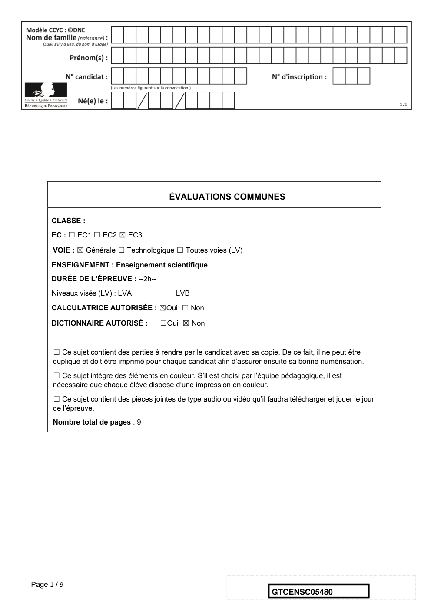

---

## Page 2

Exercice 1 - L’évolution humaine
               Sur 10 points

               Première partie :
               L’espèce humaine actuelle fait partie du groupe des Primates, on cherche à
               préciser ses liens de parenté avec deux espèces de grands singes, le gorille
               et le chimpanzé.

               Document 1 : pourcentage des ressemblances dans la séquence du
               gène de la NADH déshydrogénase chez ces trois espèces.

                                    Espèce            Chimpanzé              Gorille
                                    humaine

             Espèce                    100                  89                     86,5
             humaine

             Chimpanzé                                      100                    87,8

             Gorille                                                               100

                                                                         D’après le logiciel Anagène

               1- Indiquer sur votre copie la lettre correspond à la proposition exacte :
               Un pourcentage élevé de similitudes génétiques entre deux espèces est un
               argument pour penser que …
                   A. l’ancêtre commun aux deux espèces est ancien.

                   B. l’ancêtre commun aux deux espèces est récent.

                   C. l’une des deux espèces est l’ancêtre de l’autre.

                   D. les deux espèces n’ont pas d’ancêtre commun.

Page 2 / 9
                                                                   GTCENSC05480

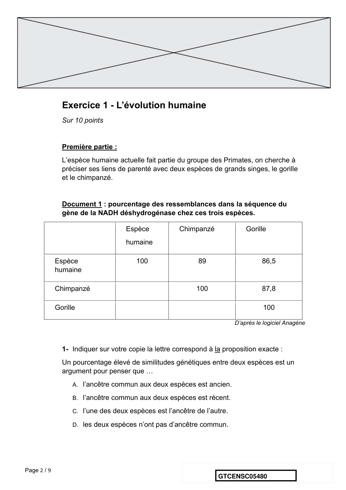

---

## Page 3

2- Parmi les deux arbres ci-dessous, sélectionner, en justifiant le choix, celui
                qui représente les liens de parenté entre l’espèce humaine (notée
                « Homme » dans cette figure), le gorille et le chimpanzé en accord avec
                les données du document 1.

             Deuxième partie :
             Aujourd’hui il n’existe plus qu’une espèce humaine, Homo sapiens, on
             cherche à préciser la parenté d’Homo sapiens avec d’autres espèces du
             genre Homo.

             Document 2 : l’Homme de Neandertal, notre « cousin » disparu
             L’Homme de Neandertal a vécu en Europe aux côtés des Hommes modernes
             (Homo sapiens) durant plus de 10 000 ans mais sa disparition, il y a environ
             30 000 ans, reste encore inexpliquée.
             L’étude des gènes des néanderthaliens suggère que, tout en étant très
             proches des Hommes modernes (Homo sapiens), ils sont suffisamment
             distants pour que l’on puisse considérer qu’il s’agit bien d’une espèce
             différente de Homo sapiens. D’après les études des fossiles et la comparaison
             de l’ADN des deux espèces, leur dernier ancêtre commun aurait vécu il y a
             environ 400 000 ans.
                                                                 D’après Le Monde du 8 mai 2010

Page 3 / 9
                                                                 GTCENSC05480

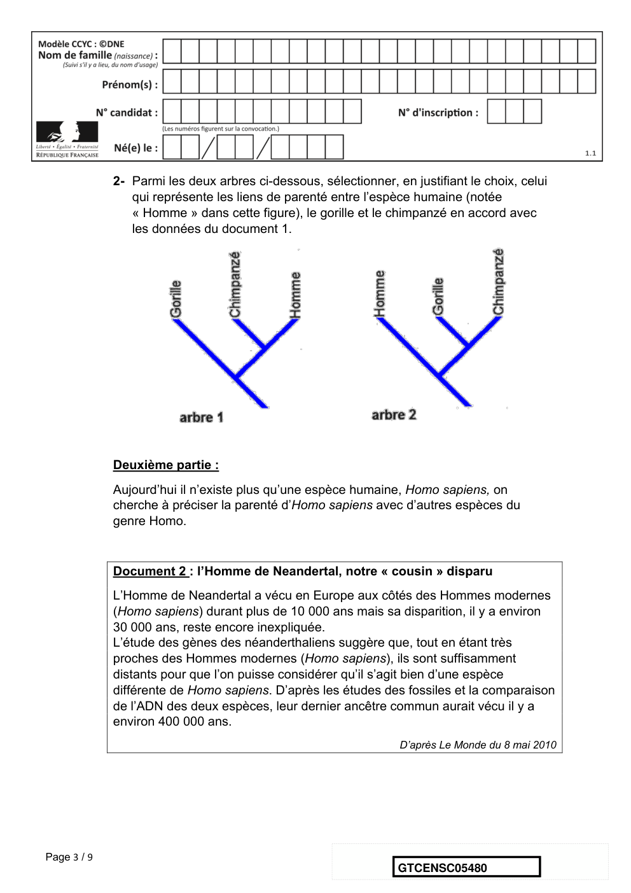

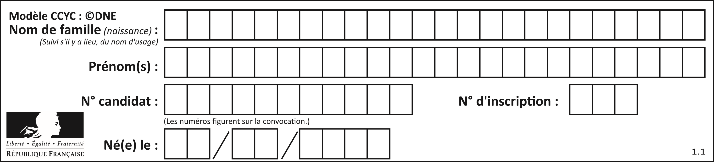

---

## Page 4

Document 3 : un nouveau venu dans la famille humaine : l’Homme de
             Denisova
             Pour la première fois, en 2010, une nouvelle espèce humaine a été décrite
             non pas grâce à des données anatomiques, mais d’après des analyses
             génétiques.
             L’ADN d’un os trouvé dans une grotte de Sibérie, daté d’un peu moins de
             40 000 ans, appartient à un individu du genre Homo mais ce n’est ni un
             sapiens, ni un néandertalien. Ceci signifie qu’à une époque où les deux
             espèces du genre Homo (sapiens et neandertal) cohabitaient, un proche
             « cousin » subsistait lui aussi en Eurasie : l’Homme de Denisova (Homo
             denisovensis).

             En comparant son ADN à celui des Hommes modernes (H. sapiens) et des
             néandertaliens, les chercheurs ont constaté que les différences étaient deux
             fois plus nombreuses entre le nouvel homininé et nous que celles qui nous
             séparent de Neandertal. Ceci signifie qu’il faut remonter à plus d’un million
             d’années pour retrouver l’ancêtre commun à l’Homme de Denisova, à
             Neandertal et à l’Homme moderne (H. sapiens).
                                                             D’après Pour La Science n°386

             3- À l’aide des informations extraites des documents 2 et 3, identifier les
                espèces A et B en justifiant le choix

             4- On dit que l’évolution n’est pas linéaire (au sens où :
                   Espèce 1 => Espèce 2 => Espèce 3 => …) mais « buissonnante ».
                Justifier cette affirmation, en exploitant le document 3.
                                             Fin de l’exercice

Page 4 / 9
                                                                 GTCENSC05480

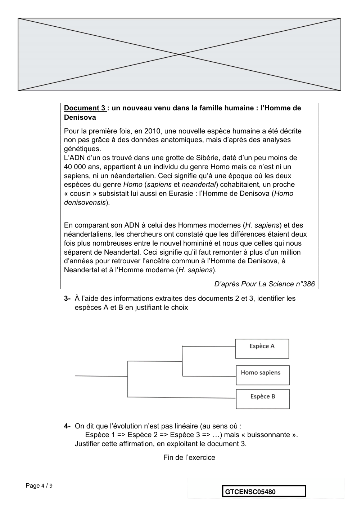

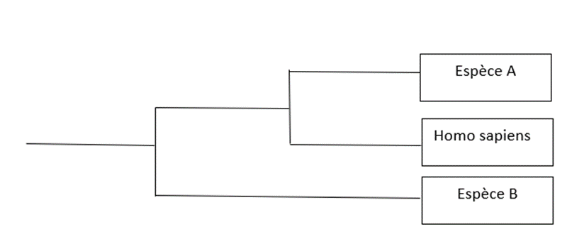

---

## Page 5

Exercice 2 - Les éoliennes et les chauves-souris
             Sur 10 points.

             Les chauves-souris sont des espèces
             protégées qui peuvent souffrir de la
             présence d’éoliennes sur leur route de
             migration. Une directive européenne oblige
             donc les constructeurs de parcs éoliens à
             réaliser des études préalables pour éviter,
             réduire ou compenser l’impact de telles
             installations sur le cycle de vie de ces       Une chauve-souris, la
             Mammifères.                                    noctule de Leister
                                                            https://auvergne-rhone-alpes.lpo.fr

             Partie 1 : Le fonctionnement d’une éolienne

             Document 1 : évolution de la puissance reçue par une éolienne
             1a- Courbe théorique donnant l’évolution de la puissance reçue par une
             éolienne en fonction de la vitesse du vent (pour une longueur de pale
             donnée)

Page 5 / 9
                                                           GTCENSC05480

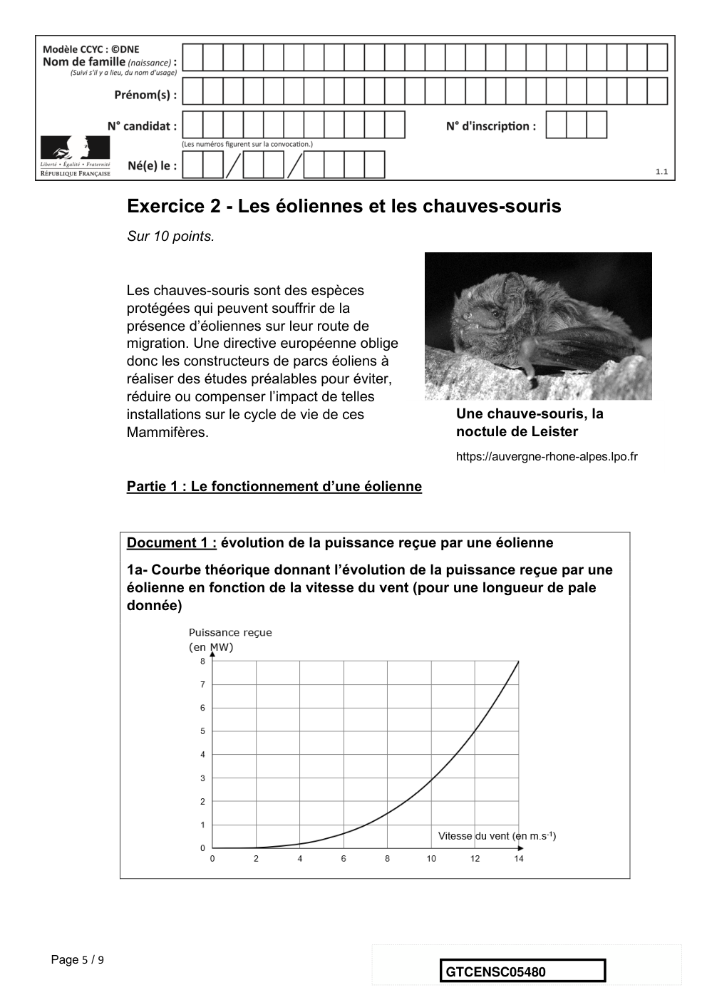

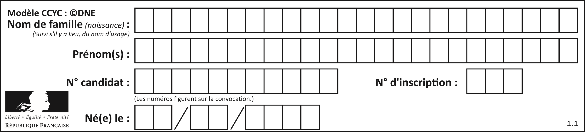

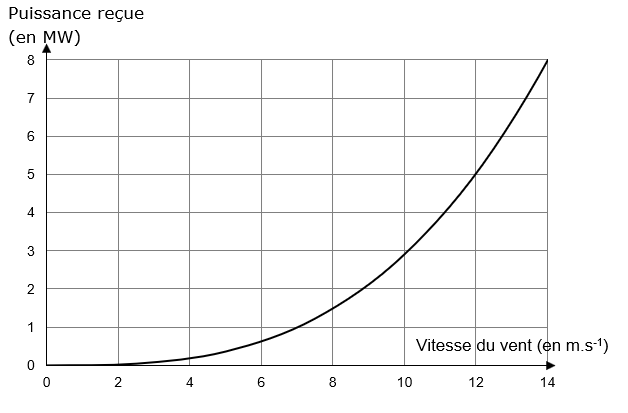

---

## Page 6

1b- Courbe théorique donnant l’évolution de la puissance reçue par une
             éolienne en fonction de la longueur des pales (pour une vitesse de vent
             donnée)

             Document 2 : Profil vertical de la vitesse du vent relevé

             Hauteur : distance de l’axe de rotation des pales par rapport au sol

Page 6 / 9
                                                                GTCENSC05480

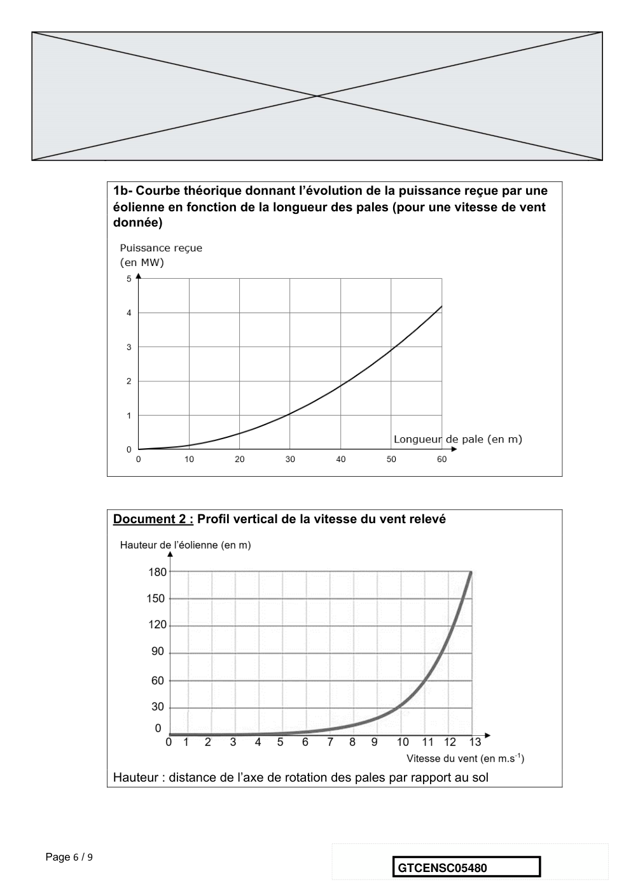

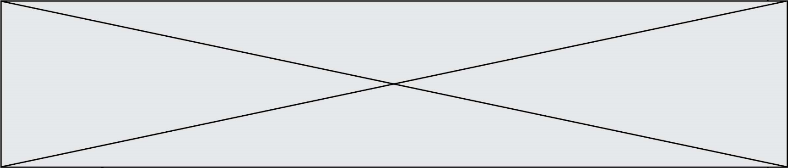

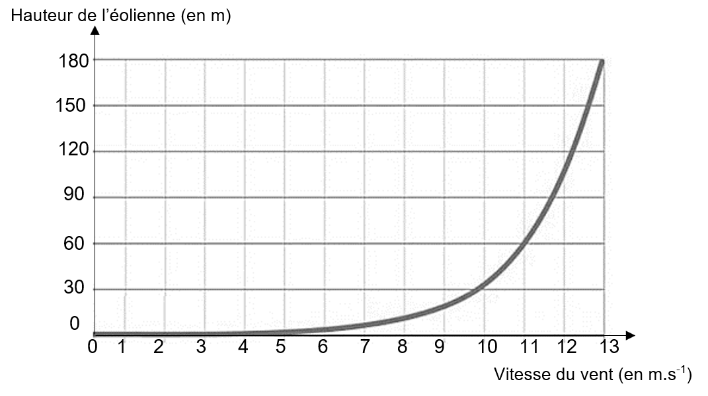

---

## Page 7

1. Recopier et compléter le schéma représentant la chaine de transformation
             énergétique d’une éolienne.

                                              Éolienne

             2. Un constructeur cherche la technologie la plus performante possible pour
             construire ses éoliennes.
             Parmi les propositions suivantes, indiquer en justifiant celle qui lui permettra
             de recevoir le plus de puissance.
             a. Une éolienne de 50 m de hauteur avec des pales de 25 m de longueur
             b. Une éolienne de 50 m de hauteur avec des pales de 60 m de longueur
             c. Une éolienne de 120 m de hauteur avec des pales de 25 m de longueur
             d. Une éolienne de 120 m de hauteur avec des pales de 60 m de longueur

             3. À une vitesse de vent donnée, l’éolienne correspondant à la technologie la
             plus performante reçoit une puissance égale à 2,8 MW et a un rendement de
             27 %. Calculer la puissance électrique que cette éolienne peut délivrer.

             4. Le graphique suivant représente l’évolution de la valeur de la tension
             électrique à la sortie de l’éolienne en fonction du temps. Déterminer la valeur
             de la fréquence de cette tension en détaillant les étapes de la démarche.

Page 7 / 9
                                                                  GTCENSC05480

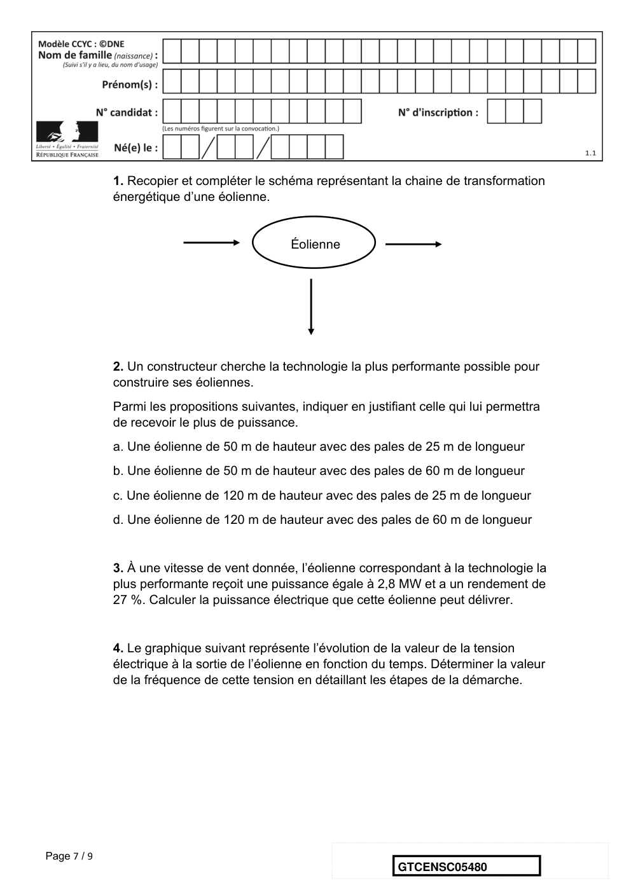

---

## Page 8

Partie 2 : démographie d’une population de chauves – souris

             Document 3 : modélisation d’une population d’une colonie de chauve-
             souris
             Les colonies de chauves-souris ne sont constituées que de femelles et des
             petits nouveaux nés. Les mâles vivent ailleurs.
             En l’absence d’éoliennes, le nombre de femelles chauves-souris de la colonie
             considérée augmente chaque année de 27 %. On note 𝑈! le nombre de
             femelles chauves-souris de cette colonie en mai 2020 et 𝑈" le nombre de
             femelles chauves-souris de cette colonie 𝑛 années plus tard, c’est-à-dire en
             mai de l’année 2020 + 𝑛.
             En présence d’éoliennes, le nombre de femelles chauves-souris de cette
             colonie diminue chaque année de 19 %. On note 𝑉! le nombre de femelles
             chauves-souris de cette colonie en mai 2020 et 𝑉" le nombre de femelles
             chauves-souris de cette colonie 𝑛 années plus tard, c’est-à-dire en mai de
             l’année 2020 + 𝑛.

Page 8 / 9
                                                             GTCENSC05480

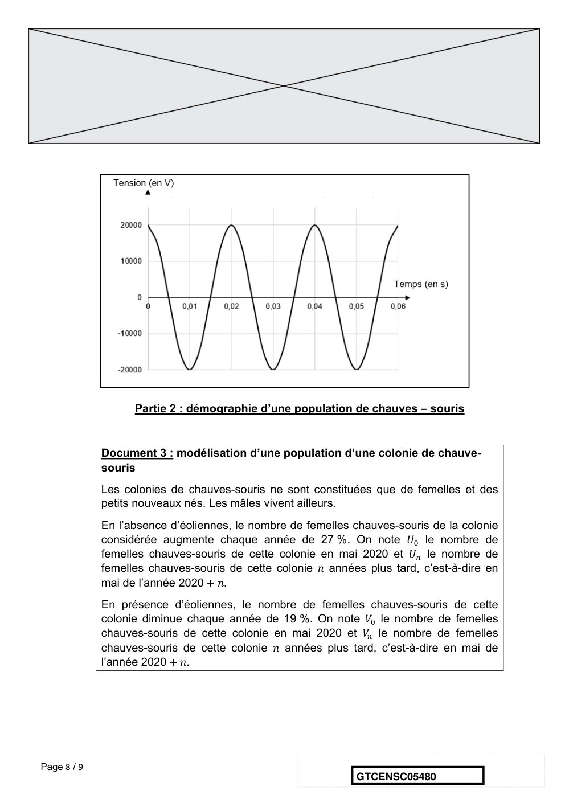

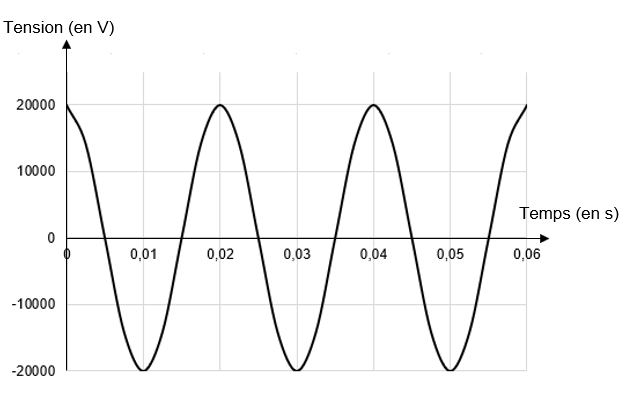

---

## Page 9

En supposant que le nombre de femelles de la colonie considérée était égal à
             200 individus en mai 2020, répondre aux questions suivantes :

             5. Pour les deux suites considérées, calculer 𝑈# , 𝑈$ , 𝑉# et 𝑉$ .

             6. Montrer que, pour tout entier 𝑛 positif, 𝑉" = 200 × 0,81 " et en déduire la
             nature de la suite (𝑉" ).

             7. Montrer que, en présence d’éoliennes, le nombre de femelles de la colonie
             est divisé par 8 en environ 10 ans.

             8. Indiquer l’intérêt de faire des études préalables avant l’installation de parcs
             éoliens.

                                               Fin de l’exercice

Page 9 / 9
                                                                    GTCENSC05480

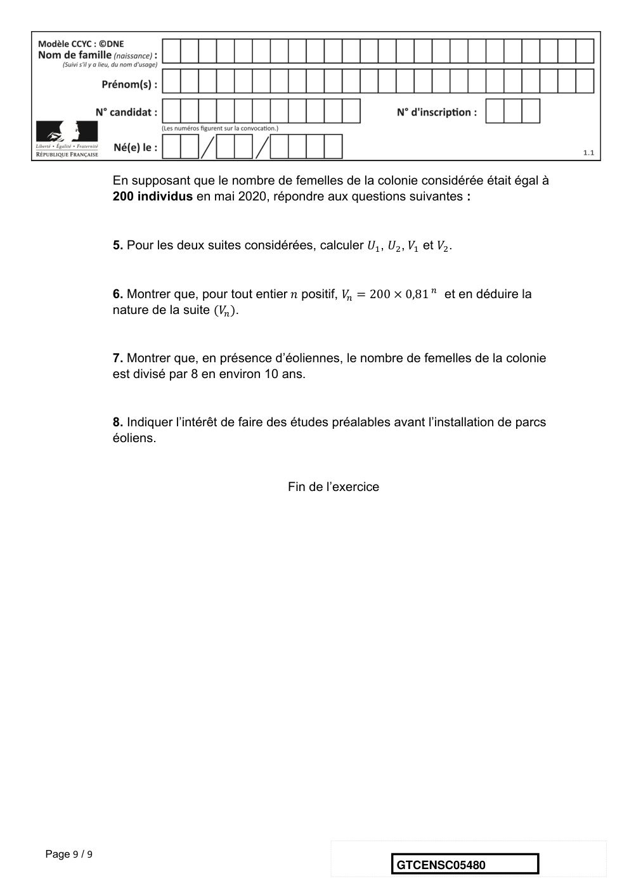

