# e3c-enseignement-scientifique-terminale-05481-sujet-officiel

> Source : `../../../../pdf_version/02_es_ponctuelle/e3c/2021/e3c-enseignement-scientifique-terminale-05481-sujet-officiel.pdf` — conversion Markdown (texte + visuels).
> Stratégie : [STRATEGIE_MARKDOWN.md](../../../../STRATEGIE_MARKDOWN.md)

---

## Page 1

ÉVALUATIONS COMMUNES

      CLASSE :

      EC : ☐ EC1 ☐ EC2 ☒ EC3

      VOIE : ☒ Générale ☐ Technologique ☐ Toutes voies (LV)
      ENSEIGNEMENT : Enseignement scientifique
      DURÉE DE L’ÉPREUVE : --2h--
      Niveaux visés (LV) : LVA               LVB
      CALCULATRICE AUTORISÉE : ☒Oui ☐ Non

      DICTIONNAIRE AUTORISÉ :           ☐Oui ☒ Non

      ☐ Ce sujet contient des parties à rendre par le candidat avec sa copie. De ce fait, il ne peut être
      dupliqué et doit être imprimé pour chaque candidat afin d’assurer ensuite sa bonne numérisation.
      ☐ Ce sujet intègre des éléments en couleur. S’il est choisi par l’équipe pédagogique, il est
      nécessaire que chaque élève dispose d’une impression en couleur.

      ☐ Ce sujet contient des pièces jointes de type audio ou vidéo qu’il faudra télécharger et jouer le jour
      de l’épreuve.
      Nombre total de pages : 8

Page 1 / 8
                                                                            GTCENSC05481

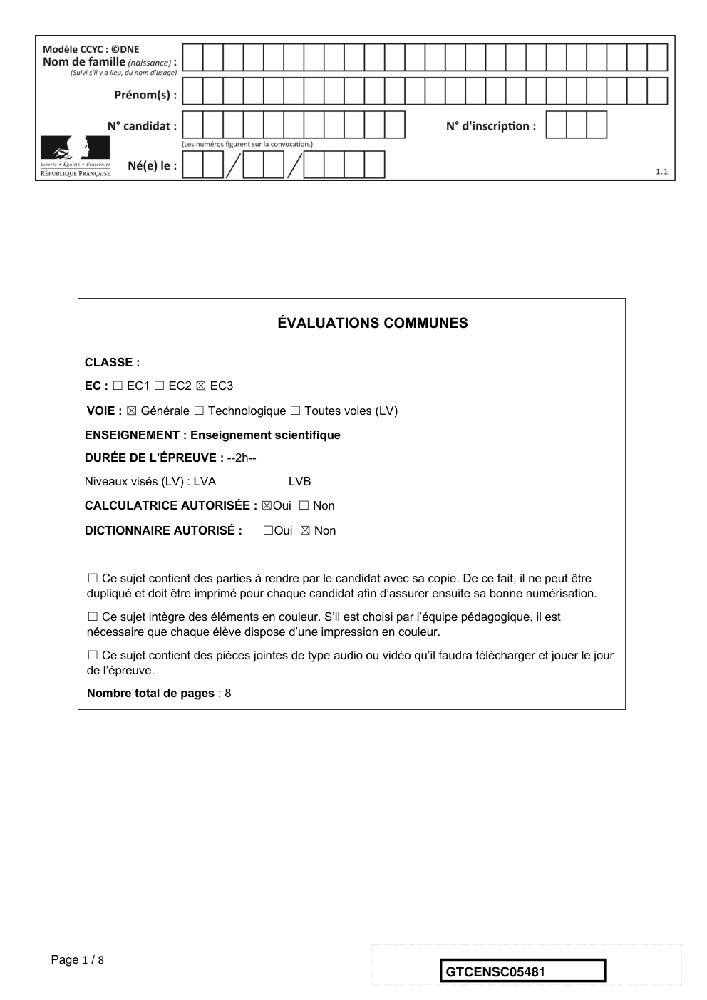

---

## Page 2

Exercice 1 - Le crapaud sonneur à ventre jaune
      Sur 10 points

      L'objectif de cet exercice est de s’intéresser aux actions humaines entreprises pour
      la sauvegarde d’une espèce d'Amphibien.

        Document 1 : le crapaud sonneur à ventre jaune, une espèce en danger.

               Photo de l’aspect général
                                                         Photo de la face ventrale

        Le crapaud sonneur à ventre jaune, Bombina variegata, est une espèce
        d'Amphibien qui fait partie des espèces vulnérables et menacées. Elle fait l’objet
        d’une protection en France.
        Ce crapaud de 3,5 à 5,5 cm de long tient son nom de sa face ventrale jaune
        tachetée de noir, qui contraste avec sa face dorsale marron-grisâtre.
        Les mares et les flaques d’eau en forêt constituent l’habitat naturel de cette
        espèce. Ces lieux sont menacés par l'industrialisation mais aussi par l'agriculture.
        La maturité sexuelle du crapaud sonneur à ventre jaune est atteinte au bout de 3
        ou 4 ans. Ce crapaud utilise plusieurs mares pour se reproduire accrochant
        quelques œufs de façon regroupée ou isolée aux plantes aquatiques. Après
        éclosion des œufs, les têtards se métamorphosent en 34 à 130 jours.
                                                       D’après Wikipédia (consulté le 04/11/2020)

Page 2 / 8
                                                                 GTCENSC05481

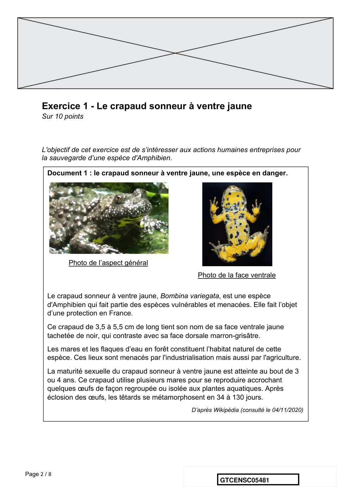

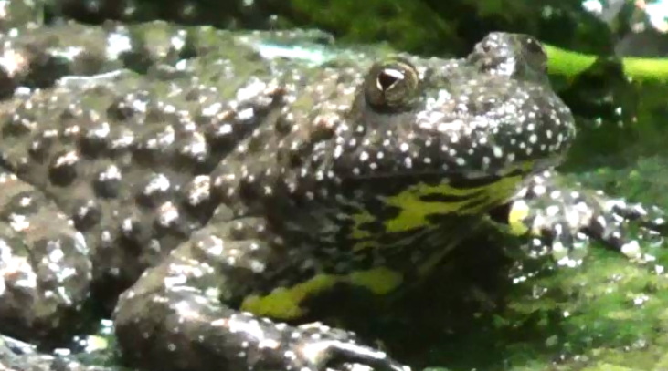

---

## Page 3

Document 2 : le crapaud sonneur à ventre jaune, une espèce suivie.
      Le marquage peut être un marquage de groupe (un point de couleur par exemple
      pour chaque individu capturé lors d’une session donnée), mais on utilise de
      préférence le marquage individuel, car il permet d’obtenir beaucoup plus
      d’informations. Chez le crapaud sonneur, on identifie facilement les individus grâce à
      leur motif ventral unique. Ce motif de coloration est en effet propre à chaque individu
      et stable dans le temps (hormis pour les stades les plus jeunes).
              Photos de motifs ventraux du même individu à des stades différents.
             De gauche à droite : juvénile, subadulte, adulte (apte à la reproduction)

                        D’après Synthèse de la méthode de suivi de population par C.M.R.
                                 appliquée au Sonneur à ventre jaune, ONF-MEDDE, 2016.
      Des biologistes veulent estimer l'abondance d'une population isolée de sonneurs à
      ventre jaune dans la forêt domaniale de Darney en Lorraine. Pour cela, ils utilisent la
      méthode CMR (capture, marquage, recapture) qui permet d'estimer l'abondance
      d'une population. Ils ont ainsi capturé, marqué puis relâché 548 sonneurs à ventre
      jaune. Une deuxième capture de sonneurs à ventre jaune a été effectuée quelques
      mois plus tard : 554 ont été capturés dont 133 qui avaient été marqués lors de la
      première capture.

Page 3 / 8
                                                                GTCENSC05481

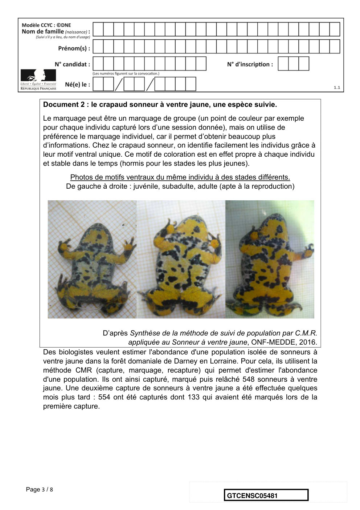

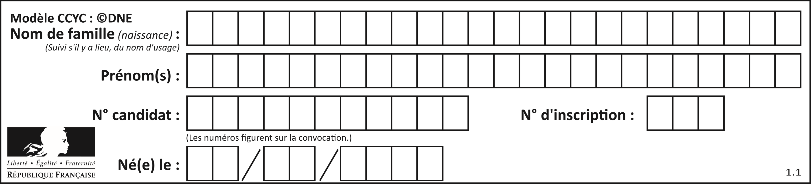

---

## Page 4

1- Présenter les principes de la méthode CMR (capture, marquage, recapture).

      2- Donner la fréquence 𝑓 de la population marquée rapportée à l’échantillon des 𝑛 =
      554 individus recapturés. En déduire une première estimation de l'abondance de la
      population de sonneurs à ventre jaune dans la zone d'étude.

      3- Pour tenir compte de la fluctuation d’échantillonnage, on considère, avec un indice
      de confiance de 95 %, que la proportion de la population marquée rapportée à la
      population totale de sonneurs à ventre jaune se situe dans l’intervalle :
                                                !           !
                                         &𝑓 −        ;𝑓 +        *,
                                                √#          √#

      Déterminer dans ces conditions un encadrement de l’abondance de la population de
      sonneurs à ventre jaune.

      4- À partir de vos connaissances et des documents, formuler des hypothèses sur les
      causes possibles de la baisse d’abondance de ce crapaud.

      5- On cherche à élaborer un plan national d'action pour la protection du crapaud
      sonneur à ventre jaune. Proposer différentes mesures permettant d'éviter l'extinction
      de cette espèce, en se basant sur les documents 1, 2 et 3 et vos connaissances.

      Document 3 : le crapaud sonneur à ventre jaune, mesures relatives à sa
      conservation.
      Afin de travailler à la conservation du sonneur à ventre jaune (Bombina
      variegata) dont le statut est critique en Normandie, l’Union régionale des Centres
      permanents d’initiatives pour l’environnement de Normandie propose la mise en
      place d’un élevage conservatoire de cinq années (2018-2023) permettant, d’une part,
      de protéger un groupe d’individus d’éventuelles menaces pouvant affecter le site de
      prélèvement et, d’autre part, d’optimiser la reproduction des géniteurs afin de tenter
      la réintroduction dans deux sites restaurés dans le département de l’Eure.

Page 4 / 8
                                                                      GTCENSC05481

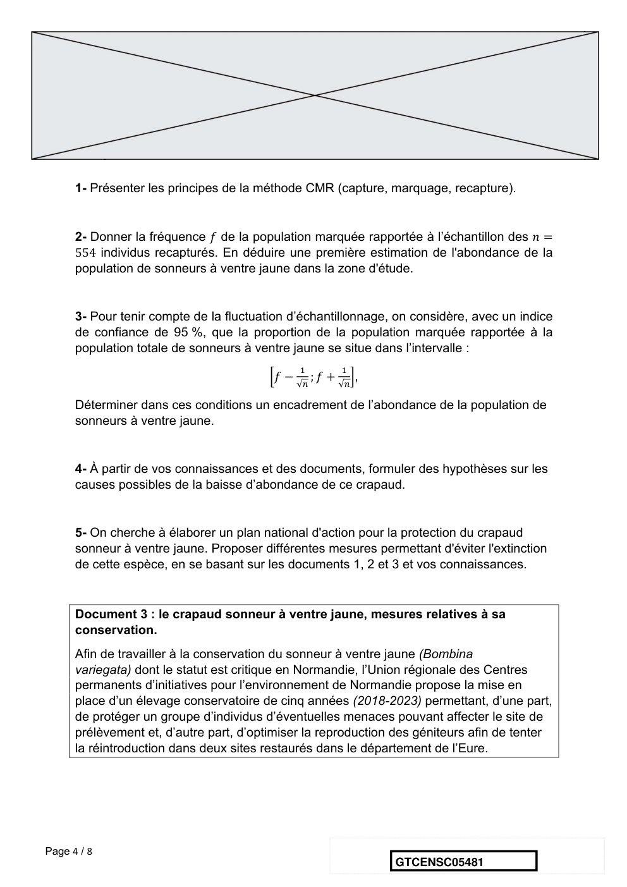

---

## Page 5

L’élevage conservatoire s’articule en 3 étapes :
      1/ prélèvement d’un groupe de 20 adultes du site de l’Eure ; élevage et reproduction
      en conditions contrôlées. Le nombre de spécimens prélevés permet de garantir la
      diversité génétique de la population d’origine ;
      2/ libération de 10 % des individus issus de la reproduction de ce groupe dans la
      population d’origine ;
      3/ réintroduction de l’espèce (minimum 2000 et 2500 juvéniles) sur 2 sites favorables
      identifiés afin de tenter de restaurer une population stable.
             D’après http://www.normandie.developpement-durable.gouv.fr/ur-cpie-sonneur-a-ventre-jaune-27-derogation-a2589.html

                                                           Fin de l’exercice

Page 5 / 8
                                                                                       GTCENSC05481

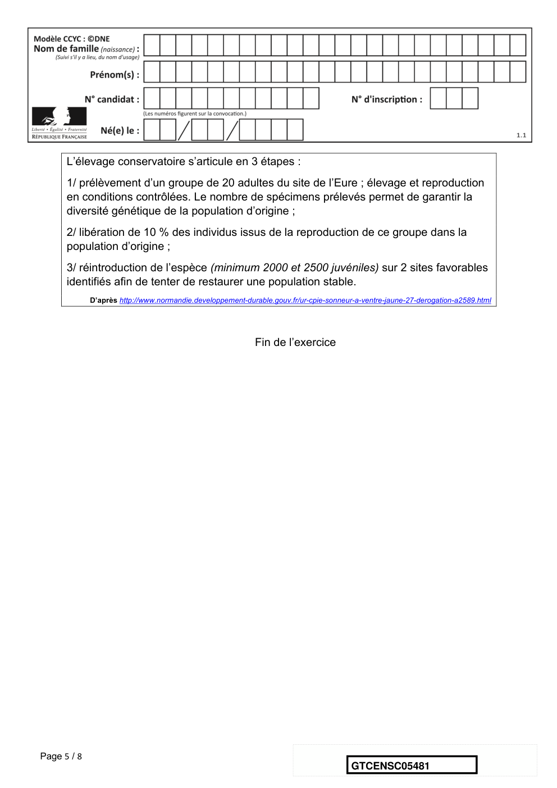

---

## Page 6

Exercice 2 - L’atmosphère terrestre et la vie
      Sur 10 points

      L’étude des formations sédimentaires, et en particulier les minerais et les fossiles qui leur
      sont associés, permet d’appréhender certaines étapes de l’évolution de l’atmosphère
      terrestre.

             Document 1. L’uraninite, un minéral riche en uranium.
                                      L’Afrique du Sud possède d’exceptionnels gisements
                                      d’uranium d’origine sédimentaire âgés de - 3,4 Ga. Ils
                                      contiennent de l’uraninite (image ci-contre), minéral dont
                                      la forme en boule indique un transport par les eaux
                                      courantes (torrent, rivière…) et une sédimentation à l’état
                                      de particules (non dissoutes) lors de sa formation.
                                      L’uraninite est un oxyde d’uranium qui possède la
                                      propriété d’être soluble dans les eaux riches en
                                      dioxygène : elle ne cristallise qu’en milieu dépourvu de
                                      dioxygène. Aucune formation sédimentaire plus récente
                                      que - 2,2 Ga ne contient de cristaux d’uraninite.

      1- Expliquer quelle information apporte l’existence de gisements anciens d’uraninite
      sur la composition de l’atmosphère à l’époque de leur formation (entre - 3,4 Ga et -
       2,2 Ga).

Page 6 / 8
                                                                 GTCENSC05481

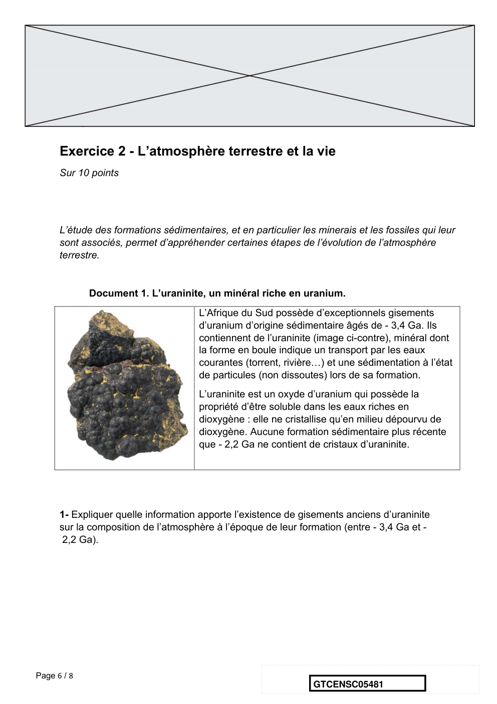

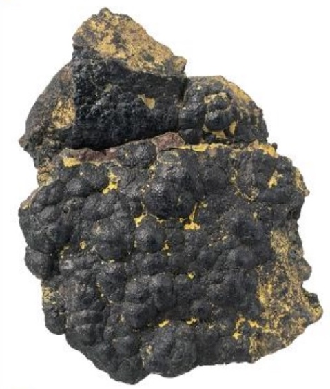

---

## Page 7

Document 2. Variations du rapport isotopique δ13C dans diverses molécules carbonées
et carbonatées actuelles comparé à celui des roches sédimentaires d’Isua.
Isua est une localité du Groënland où ont été identifiées les plus vieilles roches sédimentaires
sur Terre datées de 3,8 Ga.
Il existe deux isotopes stables du carbone : 12C et 13C. Les êtres vivants n’utilisent pas de
manière équivalente ces isotopes lors de la photosynthèse : le 12C est préférentiellement
intégré dans les molécules organiques par rapport au 13C.
Afin d’étudier la proportion de ces deux isotopes dans un échantillon, les scientifiques utilisent
le δ13C qui rend compte du rapport isotopique 13C/12C dans l’échantillon en le comparant à un
rapport 13C/12C de référence. Un δ13C négatif indique que l’échantillon est appauvri en 13C, un
δ13C positif indique que l’échantillon est enrichi en 13C, toujours par rapport au standard de
référence.

  Carbone inorganique                      Carbone organique :
P : Plantes à fleurs       A : Algues eucaryotes          B1, B2, B3, B4 : différents groupes
bactériens
                P, A, B1, B2, B3 et B4 sont des organismes photosynthétiques.

Page 7 / 8
                                                                 GTCENSC05481

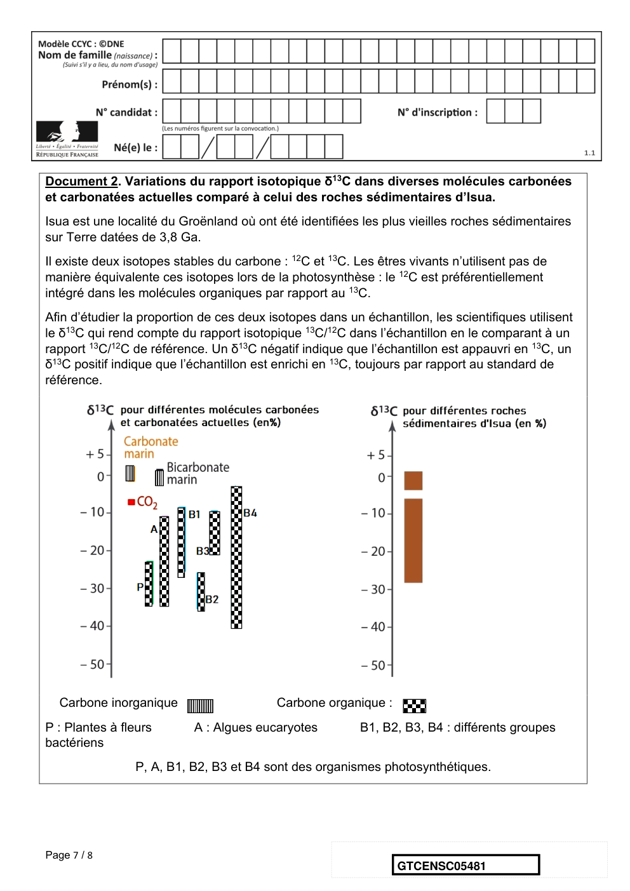

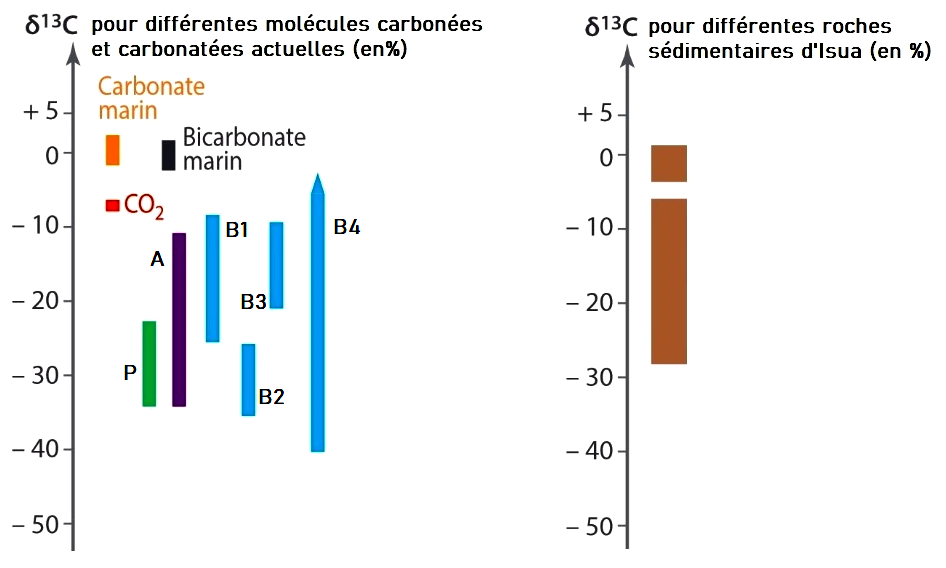

---

## Page 8

2- Repérer la réponse correcte pour chaque série d’affirmations et l’écrire dans votre
      copie.

      a. Les différents rapports isotopiques δ13C indiquent :
            • qu’il y avait des êtres vivants eucaryotes (possédant un noyau) il y a 3,8 Ga
            • que les cyanobactéries sont à l’origine du dioxygène atmosphérique
            • qu’il y avait probablement des êtres vivants il y a 3,8 Ga
            • que les plus anciens êtres vivants sont des cyanobactéries.

      b. La confrontation du rapport isotopique δ13C déterminé dans les roches
         sédimentaires d’Isua à des δ13C actuels indique que :
            • le δ13C augmente quand l’activité biologique augmente
            • l’activité photosynthétique était plus importante il y a 3,8 Ga qu’aujourd’hui
            • l’activité photosynthétique des cyanobactéries est supérieure à celle des
               algues eucaryotes
            • certaines molécules des roches sédimentaires d’Isua sont issues d’une
               photosynthèse.

      3- Formuler une hypothèse sur la date du début de l’apparition du dioxygène dans les
      océans. Présenter le raisonnement vous conduisant à proposer cette hypothèse.

      4- L’étude de l’uraninite (document 1) et des roches sédimentaires d’Isua
      (document 2) indique l’existence d’un important décalage dans le temps entre
      l’apparition du dioxygène dans les océans et son accumulation dans l’atmosphère :

      Donner une estimation de ce décalage dans le temps, puis, en vous appuyant sur vos
      connaissances, proposer une explication sur l’origine de ce décalage temporel.
      Cette explication s’appuiera sur un autre exemple de roche ou de formation
      sédimentaire.

                                            Fin de l’exercice

Page 8 / 8
                                                                GTCENSC05481

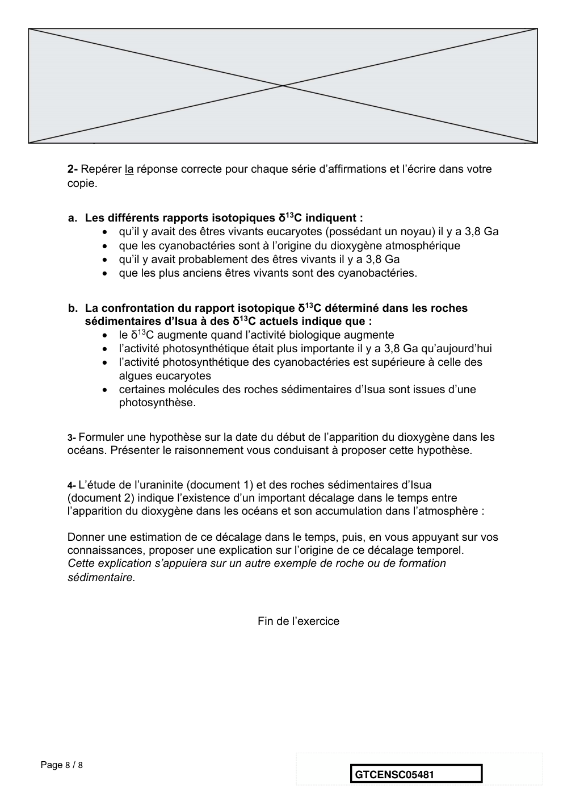

